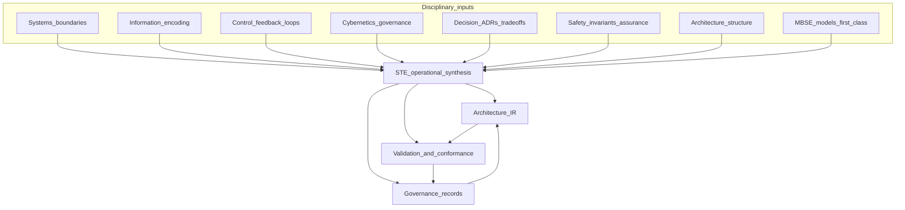

# Synthesis: Why STE Exists

## The STE Claim

STE exists because software-intensive systems under continuous change require a machine-readable **intent** layer, a canonical architecture model (**Architecture IR**), **evidence**-linked **validation**, and **governance** over change.

No single existing discipline provides all of these together as one operational system for software delivery speed.

STE is the synthesis discipline that connects them.

## The Failure Mode

Part 1 is not eight ways to say “quality matters.” It is eight partial views of the same delivery reality. **Intent**, **embodiment**, teams, tools, and **constraints** all move. Without a canonical representation of **intent**, **decisions**, **constraints**, and **evidence**, organizations lose the ability to know whether the system they have is the system they believe they have.

Each lens chapter is explicit about its own partial scope. Together they cover: stable **system** definition, durable **encoding** of **intent**, accountable comparison (**validation**), institutional **regulation** (**governance**), recorded **commitments**, mandatory properties (**invariants** / **constraints**), software-shaped description, and model-first lifecycle discipline. No single lens ships all of that as one software-native loop; that is why the chapters are separate. For the per-field “what it does not replace” detail, read the lens you care about rather than relisting eight intros here.

If you stop after any one lens, you can still improve practice locally. You can also still fail globally: coherent local language with no shared object for **governance**, **traceability**, and **validation** at software speed.

The question Part 1 answers is not “which field wins?” It is “what job requires a synthesis, and what does STE add that the parts do not?”

## The Field Concept

STE is a **synthesis discipline** for software-intensive systems under continuous change. It treats engineering work as **decisions** under **constraints**, separates **intent** from **embodiment**, and insists that **conformance** claims be **evidence**-linked and revisitable under **governance**.

STE exists to make **intent**, **decisions**, **constraints**, and **evidence** structurally connected, governable, and testable over time. It connects:

- **Intent** (declared **system** shape, **invariants**, policies)
- **Decisions** (recorded **commitments**, especially **ADRs**)
- **Constraints** and **invariants** (limits on the **design space** and must-hold properties)
- **Architecture IR** (canonical compiled model)
- **Evidence** (measurements of **embodiment**)
- **Validation** (accountable comparison)
- **Governance** (authorized change to **intent**, **embodiment**, and **rules**)

Part 1’s lenses are not competitors. They are **inputs** to that single operational story. The tabular map from each lens to STE objects lives in [Part 1 overview](01-00-theory-overview.md); here the point is how those inputs meet, not another copy of the grid.

The diagram below is a sketch, not a normative architecture. If narrative and diagram disagree during drafting, fix the diagram or qualify it.

Read the center box as: STE connects lenses into **artifacts** (**intent**, **ADRs**), a canonical **Architecture IR**, **evidence** pipelines, **Kernel**-shaped assessment where honest, and **governance** that versions and supersedes **commitments**. The arrows are “informs” and “closes loop,” not formal dataflow guarantees.

## The Gap STE Addresses

The gap is between **local engineering practices** (good teams, good tools, good habits) and a **coherent, inspectable, governable system model over time**. Organizations often have strong isolated loops: solid CI, solid on-call, solid security reviews, solid architecture slides. They still lack one object that ties **decisions**, **constraints**, **invariants**, compiled **structure**, and **evidence** into the same accountable story when **embodiment** never stops moving.

STE fills that gap by naming an operational stack centered on **Architecture IR**, **intent** artifacts, **validation**, and **governance**, instead of treating each discipline as a separate essay about “quality.”

Individual fields often stop at professional boundaries: the organizational process is “somebody else’s methodology,” the canonical model is “a diagram tool issue,” runtime **evidence** is “operations telemetry,” and **governance** is “HR and policy.” STE refuses those splits for the specific job of keeping **intent** honest against **embodiment** over time in software-intensive delivery.

## What Happens Without STE

Without a connected operational stack, strong local practice still leaves a broken reference story. Typical symptoms pile up:

- Diagrams and wikis go stale while pipelines stay green; nobody can tell whether the pictured **system** matches shipped **embodiment**.
- **ADRs** exist, but they do not thread to tests, telemetry, or **Architecture IR** elements, so **decisions** float free of **evidence**.
- Tests pass while **intent** drifts: checks cover easy surfaces, not the **invariants** and **constraints** that actually matter.
- **Governance** rituals continue, but waivers and emergencies accumulate without closing loops; regulators contradict each other while **drift** hides in tool defaults.
- Fast CI/CD ships change faster than any canonical model updates, amplifying silent mismatch between declared and actual **architecture**.
- Security and assurance work run as point-in-time reviews, not as ongoing **validation** tied to evolving **intent**.
- Operators respond to incidents without visible links to original **constraints** and **decisions**, so fixes repeat old mistakes.
- New teams cannot reconstruct why the **design space** was narrowed; they reinvent or violate **commitments** they never saw.

STE does not invent engineering from scratch. It **connects** practices that already exist (**intent**, **Architecture IR**, **validation**, **governance**) into one governable system so the reference survives continuous change.

## What STE Takes From These Fields

STE **imports** vocabulary and mental moves from each lens, as the preceding chapters detailed. It **does not import** authority: borrowed language clarifies mechanisms and failure modes; it does not transfer theorems, certifications, or maturity labels by analogy. For the compact field-to-STE mapping table, use [Part 1 overview](01-00-theory-overview.md). This section is the additive claim: what the **set** buys you that the rows do not buy alone.

Across Part 1, the recurring imports are exactly what the eight lens chapters name: boundaries, encoding, comparison, institutional loops, **commitments**, mandatory properties, architectural description, and model-first **traceability**. Use [Part 1 overview](01-00-theory-overview.md) if you need the field-by-field reminder; this synthesis stays at the level of how they combine.

STE’s own core objects, named throughout the handbook, are where those imports land: **intent**, **embodiment**, **Architecture IR**, **ADRs**, **invariants**, **constraints**, **evidence**, **validation**, **conformance**, **drift**, **design space**, and **governance**.

Concretely, STE adds:

- A **compiled canonical model** (**Architecture IR**) as a shared engineering object, not a one-off drawing
- **Traceability** designed into the path from **decisions** to **embodiment** to **evidence**, not reconstructed after the fact for audits only
- **Validation** loops that name **references**, **measurements**, allowed **actuators**, and **governance** outcomes, without pretending the org is a thermostat
- Explicit handling of **machine-readable intent** as a prerequisite for safe automation at scale (**information** discipline)
- **Governance** treated as part of the engineered system (**cybernetics**), including waivers, escalation, and second-order consistency of **rules** and tools
- **Conformance** language that scales with severity (**safety** alignment) while staying honest about judgment-shaped domains

STE is not a replacement for domain safety engineering, academic control theory, or enterprise **MBSE** programs. It is a **synthesis stance** for the gap named above.

## Where This Appears in STE

Part 2 gives the STE-shaped map at book scale: start with [Part 2: STE overview](../02-overview/02-00-overview.md), then [What is STE?](../02-overview/02-01-what-is-ste.md) and [Terminology](../02-overview/02-02-terminology.md).

The technical spine that operationalizes this synthesis:

- **Intent** (Part 3), including **ADRs**, **invariants**, and **constraints**
- **Architecture IR** (Part 4), including compilation and **traceability**
- **Kernel** (Part 5), including **validation**, **evidence**, and **conformance**
- **Control loop** (Part 6), the end-to-end **validation** narrative
- **Projections** (Part 7), including architecture **views** derived from the same **Architecture IR**
- **Lifecycle and governance** (Part 9), **drift**, change, and **governance** practice

Normative contracts and semantics belong in **ste-spec** and published technical contracts. The handbook orients; it does not replace those authorities.

When you read later parts, use Part 1 as a routing layer. If an argument feels like **boundary** confusion, return to **systems**. If it feels like ambiguous records, return to **information**. If it feels like loops without measurements, return to **control**. If it feels like rituals without steering, return to **cybernetics**. If it feels like implicit **commitments**, return to **decision** theory. If it feels like severity without assurance shape, return to **safety** and **constraints**. If it feels like projection or **view** sprawl, return to **software architecture**. If it feels like model theater, return to **MBSE** discipline.

## If You Ignore This Chapter

If you skip the synthesis, Part 1 reads like a survey: each lens sounds plausible alone, yet nothing states why they must ship as one operational system. In practice you still inherit the same failure chain: continuous change → **Intent** drifts → **embodiment** diverges → **conformance** becomes unknown → **governance** loses control → risk accumulates. **This chapter protects:** the combined story: why no single lens closes the loop at software delivery speed, and what STE adds by connecting them.

## Role in the STE Argument

This chapter states why combination beats any single lens. Part 1 walked from bounded **system** to durable encoding, accountable comparison, institutional **regulation**, recorded **commitments**, mandatory properties, canonical **Architecture IR**, and lifecycle **traceability**; skipping any step leaves **drift** a shortcut away. STE’s response is minimal *connected* structure so **intent**, **decisions**, **constraints**, and **evidence** stay one inspectable story. The diagram compresses how inputs feed that stance; later parts instantiate it in **Architecture IR**, **Kernel** **validation**, the **control loop**, and lifecycle **governance**.

## Axioms

- STE is a **synthesis** of multiple disciplines, not a rename of one of them.
- **Systems**, **information**, **control**, **cybernetics**, **decision**, **safety**, **software architecture**, and **MBSE** each supply partial vocabulary; STE combines them around **intent**, **Architecture IR**, **evidence**, **validation**, **conformance**, and **governance**.
- The gap STE addresses is the split between local excellence and a single inspectable story across tools, teams, and time; STE fills it with linked **intent**, **decisions**, **constraints**, **invariants**, **Architecture IR**, **evidence**, **validation**, and **governance**.
- STE exists because software-intensive **embodiment** changes continuously, and **governance** without shared objects becomes **lossy** and **drift**-prone.
- The handbook’s later parts operationalize this synthesis; **ste-spec** carries normative precision where the manuscript must not guess.

**Next:** [Part 2: STE overview](../02-overview/02-00-overview.md). For the handbook’s one-sentence STE definition, see [What STE is and is not](../00-foundations/00-07-what-ste-is-and-is-not.md). For the integrated Part 0 thesis, see [The STE thesis](../00-foundations/00-08-the-ste-thesis.md).
