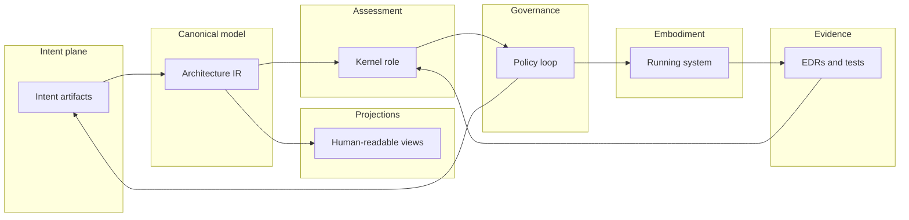

# System Overview

## The Problem

You can know the words and still lack a picture. **Intent**, **Architecture IR**, **Kernel**, **projections**, and **evidence** each sound plausible alone. Without a composed story, readers guess edges: what feeds what, what is canonical, where humans decide, where automation assists, and where **governance** intervenes.

## The Reframe

STE behaves as one system with multiple layers. This chapter names the layers and how they connect. For what STE *is* as a discipline, use [What is STE?](02-01-what-is-ste.md); for word senses, use [Terminology](02-02-terminology.md).

## The Model

Read what follows as one system diagram in prose: subsystems as nodes, artifacts on edges, and flows as paths you could draw on a whiteboard. **Evidence** is observation of **embodiment**: tests, telemetry, analysis outputs, and similar channels, captured as **EDR**-shaped records before assessment consumes it.

### Major conceptual components

These are roles, not a repo checklist:

1. **Intent plane.** Humans and agents author and revise structured **intent** **artifacts** (including **ADRs** and **invariants**). Conversation interfaces and editing workflows live here at the human boundary.
2. **Compilation to Architecture IR.** Structured **intent** compiles into a canonical **Architecture IR**: the shared machine-addressable model used for inspection, diff, graph traversal, and downstream tooling.
3. **Projections.** **Projections** render **Architecture IR** and related material into diagrams, documents, and other human-facing views. Multiple projections should track the same underlying commitments when the system is healthy.
4. **Embodiment sources.** Repositories, builds, infrastructure definitions, and runtime systems realize **embodiment**. This is not a passive archive. It is what actually runs.
5. **Evidence collection.** Tests, telemetry, analysis outputs, and similar observations become **evidence** records (**EDR**s in handbook language) with provenance suitable for assessment.
6. **Assessment and admission.** The **Kernel** role consumes **evidence**, published contracts, and policy inputs to orchestrate deterministic assessment where that is honest and to surface structured outcomes for **governance** where judgment remains.
7. **Governance loop.** People and policy close the loop: approve or reject changes, update **intent**, grant bounded exceptions with owners, and schedule re-evaluation.

### Primary artifacts (what moves between boxes)

- **Intent artifacts:** decisions, invariants, constraints, capability maps, and related structured records.
- **Architecture IR:** canonical compiled architecture model.
- **Projections:** derived views for communication and review.
- **Evidence artifacts:** **EDR**-shaped records tying observations to **scopes** and systems under test.

### Flows you should be able to trace

**Flow A: commit and compile.** Author **intent** → compile → **Architecture IR** updates → **projections** refresh for review and teaching.

**Flow B: assess.** Build or change **embodiment** → produce **evidence** → **Kernel** assesses **conformance** claims under **rules** → outcomes feed **governance**.

**Flow C: govern change.** **Governance** revises **intent** or **embodiment** plans → loop returns to Flow A and Flow B.

### API example (structure only)

Take a backward-compatibility **decision** in **intent** **artifacts**. Compilation ties it to **Architecture IR** elements that interfaces and dependents use. **Embodiment** is running services, gateways, and schemas. **Evidence** enters through CI, telemetry paths, and records that reference **scopes**. **Kernel**-shaped assessment sits where **Architecture IR**, **evidence**, and **rules** meet. **Governance** is the box that receives assessment output and authorizes edits to **intent** or **embodiment** plans. Which choices you make after a mismatch is lifecycle and policy; the structural claim is only that those boxes and edges exist.

### Human, agent, and governance interaction points

- **Where humans are primary:** accountable **decisions**, **governance** judgments, approval or rejection of exceptions, and acceptance when the work is judgment-shaped.
- **Where agents and automation help:** drafting and refactoring structured **intent**, maintaining **Architecture IR**, running checks, gathering **evidence**, and executing mechanical steps when **intent** and **rules** are explicit enough to delegate safely.
- **Where governance must be visible:** any change to normative **intent**, any waiver that alters **constraints** or **invariants**, and any response to sustained non-**conformance** or **drift** that needs an owner.

The boundary is not “human good, machine bad.” The boundary is which steps require explicit **governance** and recorded accountability.

### Diagram companion

A companion Mermaid sketch lives at [`diagrams/system-overview.mmd`](../diagrams/system-overview.mmd). It may evolve independently; this chapter’s prose is the orientation authority if they diverge during drafting.

## The Implications

If you can sketch the loop, later chapters become “zoom into this region.” If you cannot, every new term feels like another attachment. The whiteboard test matters: boxes, labeled edges, and a path that returns to **governance** and revised **intent**.

## Relationship to STE system

Deeper treatment appears in the part overviews for intent, Architecture IR, kernel, control loop, projections, conversation, and lifecycle. Useful next anchors:

- [Artifact layer overview](../03-artifact-layer/03-00-artifact-layer-overview.md)
- [Architecture IR overview](../04-architecture-ir/04-00-architecture-ir-overview.md)
- [Kernel overview](../05-kernel/05-00-kernel-overview.md)
- [Control loop overview](../06-control-loop/06-00-control-loop-overview.md)
- [Projections overview](../07-projections/07-00-projections-overview.md)
- [Conversation engine overview](../08-conversation-engine/08-00-conversation-engine-overview.md)
- [Lifecycle and governance overview](../09-lifecycle-governance/09-00-lifecycle-overview.md)

Normative interfaces and behavior belong to **ste-spec** and the implementing repositories named in the handbook README, not to this sketch.

**Next:** Read [The STE lifecycle](02-04-the-ste-lifecycle.md) next. It uses this same structure as a repeating loop over time: **intent**, **architecture**, **embodiment**, **evidence**, assessment, **conformance**, **change**, and return.

## Summary

- **Intent** **artifacts**, **Architecture IR**, **projections**, **embodiment**, **evidence**, **Kernel**-shaped assessment, and **governance** are the major structural roles; edges are as in Flows A through C.
- Three flows cover compile, assess, and govern; real work cycles among them.
- Humans own **governance** and judgment; automation expands where **intent** and **rules** are explicit.
- Later parts deepen each region; **ste-spec** defines exact contracts.
