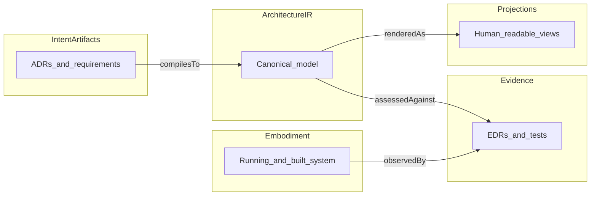

# Part 3: Artifact Layer Overview

## The Problem the artifact layer solves

STE is easy to read as a philosophy: intent, evidence, governance, and careful language. That reading fails in practice unless the system also names **what is stored**, **who may change it**, and **how change stays connected** across time. Without a shared artifact layer, teams improvise documents and tools that do not compose. Decisions live in chat, diagrams disagree with repositories, and nobody can say which object is authoritative when they conflict.

The artifact layer is the machinery that makes STE **concrete**. It is where STE stops being only a stance and becomes an implementable system of records and models.

## What the artifact layer is

The **artifact layer** is the set of structured artifacts and the canonical **Architecture IR** that STE uses to carry **intent**, describe **embodiment** at the architecture level, bind **evidence** to scopes, and support **traceability** and **conformance** claims. It includes human-authored intent records (for example **ADRs**, requirements, **constraints**, **invariants**), the compiled architecture model, **evidence** records (handbook sense: **EDR**-shaped observation with provenance), and explicit links between them.

It is not the runtime kernel, not the full delivery toolchain, and not informal conversation. Those things interact with the layer; they do not replace it.

## How artifacts are used in STE

Artifacts are **authored** under **governance**, **revised** when decisions change, **compiled** where STE defines compilation into **Architecture IR**, **observed** through builds and runtime to produce **evidence**, and **assessed** against rules so **conformance** can be stated or challenged. **Projections** render the same underlying commitments for review and teaching without becoming a second source of truth.

The part chapters that follow each zoom into one artifact family or cross-cutting concern. Together they should let you draw a path from a decision to a model element to a test result without guessing the intermediate steps.

## How the layer connects intent, implementation, and evidence

- **Intent** lives in structured artifacts that state what the organization commits to (decisions, requirements, **constraints**, **invariants**).
- **Implementation** (in STE handbook sense: code-level and operational **embodiment**) is what actually runs and is built. The artifact layer connects to it through IR elements, scopes, and build or runtime identity, not by collapsing intent into code comments alone.
- **Evidence** is observation of **embodiment** (tests, telemetry, analysis outputs) captured as records that reference what was exercised. Assessment and **governance** consume those records; they do not replace the artifacts that define what “good” means.

When those three stay structurally linked, **drift** becomes inspectable instead of rhetorical.

## How the layer participates in lifecycle and governance

Lifecycle in STE is not complete without explicit **governance** over artifact change. Creating or superseding an **ADR**, tightening a **constraint**, or changing an **invariant** should trace to owners, review paths, and re-evaluation of **evidence** where stakes require it. Exceptions need recorded scope and expiry where policy demands.

The artifact layer is where policy meets durable objects. If governance cannot point at a record, it cannot govern the system in a repeatable way.

## Relationship among artifacts in this part

The following chapters are the spine of Part 3. Read them in order the first time; afterward use them as a catalog.

1. [Architecture decision records](03-01-architecture-decision-records.md)
2. [Requirements and constraints](03-02-requirements-and-constraints.md)
3. [Invariants](03-03-invariants.md)
4. [Architecture model and IR](03-04-architecture-model-and-ir.md)
5. [Evidence](03-05-evidence.md)
6. [Traceability](03-06-traceability.md)
7. [Conformance](03-07-conformance.md)
8. [Publication versus projection](03-08-publication-vs-projection.md)

Later parts deepen **Architecture IR** mechanics (Part 4), assessment and the **Kernel** role (Part 5), the control loop (Part 6), **projections** (Part 7), and lifecycle **governance** (Part 9). **ste-spec** remains normative for schemas, interfaces, and exact semantics; this handbook explains how the pieces fit.

### Diagram sketch

**Next:** [Architecture decision records](03-01-architecture-decision-records.md).
