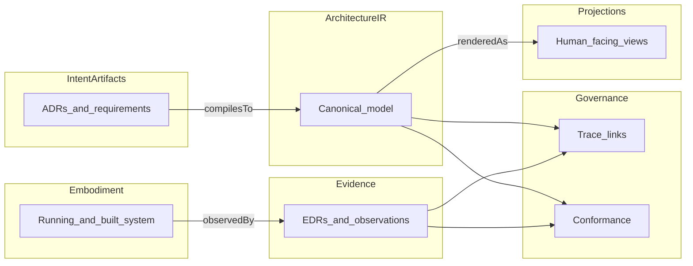

# Part 3: Artifact Layer Overview

## The Problem the artifact layer solves

STE is easy to read as a philosophy: intent, evidence, governance, and careful language. That reading fails in practice unless the system also names **what is stored**, **who may change it**, and **how change stays connected** across time. Without a shared artifact layer, teams improvise untyped files and disconnected tools that do not compose. Decisions live in chat, diagrams disagree with repositories, and nobody can say which object is authoritative when they conflict.

The artifact layer is the machinery that makes STE **concrete**. It is where STE stops being only a stance and becomes an implementable system of structured records and models.

## What the artifact layer is

STE defines **canonical artifact types**: named roles, schemas, and lifecycles (normative detail in **ste-spec**). The layer is not a folder of informal write-ups. It is a **system of types** that connect **intent**, **embodiment** (implementation reality), **evidence**, and **governance** in one graph.

The **artifact layer** carries that system: structured records, the canonical **Architecture IR**, bindings from observation to scopes, and the links that make **traceability** and **conformance** inspectable.

Together, these records form a **computable substrate**: tools—including deterministic checkers and model-based assistants—can traverse the same graph-shaped commitments humans review, **within** explicit **rules** and **governance**, instead of inferring structure only from informal prose.

### Canonical groupings

- **Intent artifacts:** requirements, **constraints**, decisions (**ADRs**), **invariants** (chapters [Architecture decision records](03-01-architecture-decision-records.md) through [Invariants](03-03-invariants.md)).
- **Structural artifacts:** architecture models, decompositions, **Architecture IR** ([Architecture model and IR](03-04-architecture-model-and-ir.md)).
- **Implementation artifacts:** code, infrastructure definitions, configurations. In handbook vocabulary this is **embodiment**. Part 3 explains how the layer **connects** to these; it does not teach implementation craft.
- **Evidence artifacts:** tests, logs, metrics, runtime observations, and **EDR**-shaped evidence records with provenance ([Evidence](03-05-evidence.md)).
- **Governance artifacts:** trace links, conformance results, reviews, approvals, lifecycle state records ([Traceability](03-06-traceability.md), [Conformance](03-07-conformance.md); organizational mechanics also in Part 9).

Together these types form the connected **architecture model and governance system** STE uses to relate intent, implementation, and evidence.

It is not the runtime kernel, not the full delivery toolchain, and not informal conversation. Those things interact with the layer; they do not replace it.

## How artifacts are used in STE

Normative content is **specified** and **governed** by people; STE **materializes and maintains** structured records, **Architecture IR**, **trace** edges, **evidence** records, and **projections** under **ste-spec** and policy. Artifacts **compile**, **revise** on governed change, **observe** **embodiment** to produce **evidence**, and feed **conformance** evaluation. **Projections** render the same underlying commitments for review without becoming a second source of truth.

In mature use, senior engineers and architects spend more effort refining **rules**, **invariants**, **constraints**, patterns, capture structure, and the **metamodel** that **compilation** targets—so the STE system can run **mechanical checks**, preserve **traceability**, and **guide** design with structured questions—rather than re-reviewing every low-level change by hand alone.

The chapters that follow each treat one artifact type or cross-cutting structure. Together they should let you walk from a decision to a model element to a test result without guessing the intermediate links.

## How the layer connects intent, implementation, and evidence

- **Intent** lives in intent artifact types: decisions, requirements, **constraints**, **invariants**.
- **Implementation** (**embodiment**) is what is built and run. **Implementation artifacts** are the durable forms of that reality (repos, infra, config). The layer binds them to IR and scopes, not to prose alone.
- **Evidence** is structured observation of **embodiment**, referencable from intent and IR through **traceability**.

When those three stay linked in the artifact graph, **drift** becomes inspectable instead of rhetorical.

## Human accountability and STE automation

**Humans** remain accountable for: stating goals and **intent**; specifying requirements and **constraints**; making architectural decisions; defining **invariants** and non-negotiable truths; reviewing system-produced records and views; accepting or rejecting judgments and proposed changes under **governance**.

**STE** (automation and governed services that implement STE) is responsible for: materializing **formal records** from governed capture and compilation (including ADR-shaped, requirement, and invariant records where the workflow defines it); maintaining **Architecture IR** and structural consistency; maintaining **trace links** between artifact types; collecting and structuring observations into **evidence** records with provenance; running **conformance** checks and recording outcomes; managing **lifecycle state** where policy assigns that to the system; producing **publications** and **projections** from canonical sources.

**Foundational principle:** humans **specify and govern** intent; STE **formalizes, structures, and maintains** the artifact graph. Formal engineering artifacts in STE are **system-maintained structured representations** grounded in human intent and observed reality, not primarily free-form hand-authored files.

## How the layer participates in lifecycle and governance

Lifecycle in STE is not complete without explicit **governance** over artifact change. Creating or superseding an **ADR**, tightening a **constraint**, or changing an **invariant** should trace to owners, review paths, and re-evaluation of **evidence** where stakes require it. Exceptions need recorded scope and expiry where policy demands.

The artifact layer is where policy meets durable objects. If governance cannot point at a record, it cannot govern the system in a repeatable way.

## Relationship among artifacts in this part

The following chapters are the spine of Part 3. Read them in order the first time; afterward use them as a catalog.

1. [Architecture decision records](03-01-architecture-decision-records.md)
2. [Requirements and constraints](03-02-requirements-and-constraints.md)
3. [Invariants](03-03-invariants.md)
4. [Architecture model and IR](03-04-architecture-model-and-ir.md)
5. [Evidence](03-05-evidence.md)
6. [Traceability](03-06-traceability.md)
7. [Conformance](03-07-conformance.md)
8. [Publication versus projection](03-08-publication-vs-projection.md)

Later parts deepen the **architecture model** (Part 4, including IR and projections), **lifecycle** stages (Part 5), **governance** and the control loop (Part 6), the **Kernel** (Part 7), **runtime** evidence (Part 8), and human and AI interfaces (Parts 9–10). **ste-spec** remains normative for schemas, interfaces, and exact semantics; this handbook explains how the pieces fit.

### Diagram sketch

**See also:** [Canonical example — AI Gateway through STE](../11-examples/00-overview.md) for one system traced from requirements through derived IR, embodiment linkage, and EDR-shaped evidence.

**Next:** [Architecture decision records](03-01-architecture-decision-records.md).
