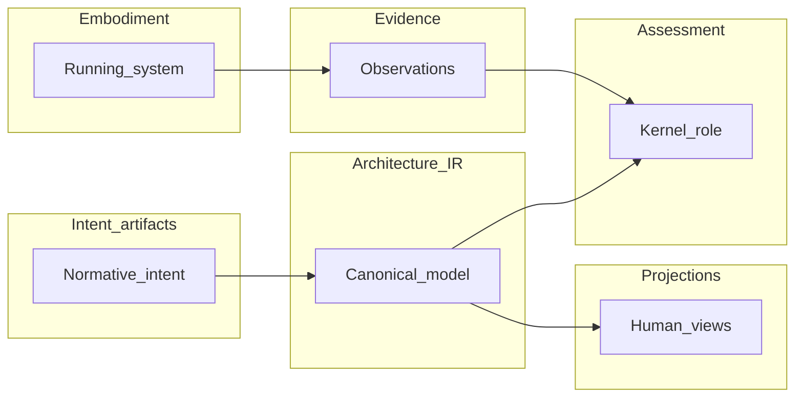

# Architecture model (Architecture IR) overview

## The Problem

Teams routinely say “the architecture” while pointing at different objects: a diagram on a whiteboard, a section in a wiki, a dependency graph extracted from a build, or a mental picture held by a few senior engineers. None of those is wrong as a *view*, but none is sufficient as a **shared referent**. When structure lives only in informal or fragmented forms, **traceability** breaks, **diff** across time is meaningless, and **evidence** cannot attach to stable architectural identities. **Lossy reasoning** is not only a social failure; it is the predictable output of missing a canonical structural object.

STE’s response is not “draw more carefully.” It is to treat the **architecture model** as a first-class, maintained representation: explicit enough for machines to traverse and compare, and reviewable enough for humans to trust—chiefly through **projections** that track the same commitments.

## The Reframe

In handbook language, that canonical architecture model is **Architecture IR**: the compiled, machine-addressable graph of architectural **entities** and **relationships** (and the metadata needed to interpret them), produced from structured **intent** and related inputs under **compilation** rules. “Architecture model” names the *idea*—what the system **is**, structurally and relationally, as committed through the intent pipeline. **Architecture IR** names the *proper object* STE uses for inspection, diff, linking, and downstream tooling.

This part of the book is not a specification of wire formats (that belongs in **ste-spec**). It is the conceptual spine: what the model is for, how it sits between **intent** and **embodiment**, how it differs from diagrams and documents, and how **projections** keep humans aligned with the same graph.

## The Model

### What Architecture IR is

**Architecture IR** is the structured representation of the system **as designed and committed** at the architecture layer relevant to STE: components, boundaries, interfaces, dependencies, capabilities, and similar structural facts, with stable identities and typed edges. It is the **central structural object** STE operates on for reasoning about **structure**—not the only artifact in the system ( **intent** **artifacts**, **evidence**, and **governance** records matter too), but the hub that lets those other artifacts **point at the same things**.

It must be **machine-traversable** so automation can walk the graph, compute impact, and drive checks. It must stay **human-reviewable** because **projections** (diagrams, documents, views) render from it; when the pipeline is healthy, those views disagree only where **governance** allows explicit tolerance—not because reality forked silently.

### What it is not (boundary discipline)

| Often confused with | Role in STE |
|---------------------|-------------|
| **Diagrams** and informal sketches | **Projections** derived from IR; not authoritative over the graph |
| **ADRs** and narrative **intent** | Record **decisions** and rationale; IR carries the **structural projection** of what was committed |
| **Code**, repos, and running systems | **Implementation** and **embodiment**; IR **references** identities and scopes what observation means |
| **Kernel** and **runtime** mechanics | How IR is admitted, validated, and combined with **evidence** (Parts 7–8); not the definition of structure itself |
| General **MBSE** repositories | STE aligns on canonical model discipline at the software-architecture layer; full MBSE scope is broader ([Model-based systems engineering](../01-theory/01-08-model-based-systems-engineering.md)) |

### The flow this part assumes

**Intent** (normative **artifacts**) → **compilation** → **Architecture IR** → **projections** for humans + references into **embodiment** → **evidence** about what exists and behaves → **assessment** / **validation** (Kernel role) under **rules** → **governance**. **Drift** and **conformance** are meaningful when **intent**, IR, and **evidence** can refer to the **same** structural objects—not when each tool rebuilds its own graph from scraps ([Intent versus implementation](../00-problem/00-03-intent-vs-implementation.md), [Architecture as a first-class artifact](../00-problem/00-04-architecture-as-a-first-class-artifact.md)).

### Mental map of the handbook

The book is one loop described at different altitudes:

1. **Part 0 — Foundations:** why **decisions**, **lossy reasoning**, **intent** versus **embodiment**, and **governed reasoning** matter ([Foundations overview](../00-problem/00-00-foundations-overview.md)).
2. **Intent (artifact layer and lifecycle):** what the system **should** be—**ADRs**, **constraints**, **invariants**, and related structured records ([Artifact layer overview](../03-artifacts/03-00-artifact-layer-overview.md), [Intent formation](../05-lifecycle/05-01-intent-formation.md)).
3. **Part 4 — Architecture model (this part):** what the architecture **is** structurally—the **Architecture IR** and how it is compiled, linked, differenced, and viewed.
4. **Kernel and runtime:** how the model is **built, checked, and consumed** with **evidence** ([Kernel overview](../07-kernel/07-00-kernel-overview.md), [Runtime evidence](../08-runtime/08-00-runtime-evidence.md)).
5. **Evidence and assessment:** observations and claims about **conformance** ([Evidence](../03-artifacts/03-05-evidence.md), [Conformance and assessment](../05-lifecycle/05-05-conformance-and-assessment.md)).
6. **Governance and drift:** legitimacy of change and mismatch over time ([Drift](../06-governance/06-03-drift.md), [Governance](../06-governance/06-06-governance.md)).

The diagram below is a **Part 4–centric** slice of the same story told more fully in [System overview](../02-overview/02-03-system-overview.md) and [The STE lifecycle](../02-overview/02-04-the-ste-lifecycle.md).

### How Part 4 is organized

Read [The system model](04-01-the-system-model.md), then [Entities](04-02-entities.md) and [Relationships](04-03-relationships.md) for the building blocks. [Compilation](04-04-compilation.md) explains the bridge from **intent** to IR. [Traceability in Architecture IR](04-05-traceability.md), [Diff and change](04-06-diff-and-change.md), and [IR as a graph](04-07-ir-as-a-graph.md) treat IR as a **reasoning surface**. [Projections overview](04-08-projections-overview.md) through [View consistency](04-14-view-consistency.md) cover **canonical versus derived** views and consistency expectations.

## The Implications

If you accept this reframe, several obligations follow. **Intent** must be structured enough to **compile**; otherwise IR becomes a manual duplicate and will **drift** from what **governance** believes. **Projections** must be treated as **accountable views** of the same commitments, not private illustrations. Tooling that invents parallel graphs undermines the whole story: the win is **one** structural spine that **evidence** and **assessment** can target.

You do not need every detail in IR on day one. You do need honesty about what is **canonical**, what is **derived**, and what happens when they diverge.

## Relationship to STE system

- **Terminology and naming:** [Terminology](../02-overview/02-02-terminology.md) defines **Architecture IR** and related words; this part uses that glossary consistently.
- **Artifact role summary:** [Architecture model and IR](../03-artifacts/03-04-architecture-model-and-ir.md) positions IR among other **artifacts**.
- **Publication versus projection:** [Publication versus projection](../03-artifacts/03-08-publication-vs-projection.md) states what may be treated as published truth versus derived communication.
- **Foundations:** [The problem of lossy reasoning](../00-problem/00-02-the-problem-of-lossy-reasoning.md), [Governed reasoning](../00-problem/00-05-governed-reasoning.md).
- **Theory bridge:** [Model-based systems engineering](../01-theory/01-08-model-based-systems-engineering.md).
- **Downstream:** [Kernel overview](../07-kernel/07-00-kernel-overview.md), [Runtime evidence](../08-runtime/08-00-runtime-evidence.md), [Conformance](../03-artifacts/03-07-conformance.md).

Exact schemas, admission behavior, and wire formats remain in **ste-spec** where applicable.

## Summary

- The **architecture model** is the structured, relational picture of what the system **is** at the architecture layer; **Architecture IR** is STE’s canonical, machine-addressable form of that model.
- IR sits between **intent** and **embodiment**: it expresses structural commitments in a form tools and **trace** edges can use; it is not a substitute for **ADRs**, diagrams, or code.
- **Compilation** produces IR from structured **intent**; **projections** make IR reviewable for humans.
- **Evidence** and **assessment** gain traction when observations attach to the **same** identities IR maintains.
- Part 4 explains concepts; **ste-spec** and implementation work nail precision.

**Next:** [The system model](04-01-the-system-model.md).
