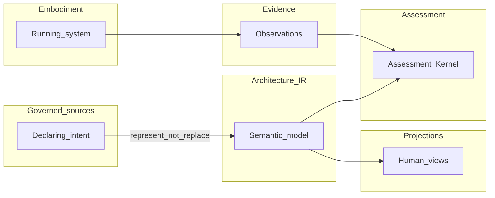

# Architecture model (Architecture IR) overview

## The Problem

Teams routinely say “the architecture” while pointing at different objects: a whiteboard diagram, a wiki section, a dependency graph from a build, or a mental picture held by a few senior engineers. None of those is wrong as a *view*, but none is sufficient as a **shared referent**. When architecture lives only in informal or fragmented forms, **traceability** breaks, **diff** across time is meaningless, and **evidence** cannot attach to stable architectural identities. **Lossy reasoning** is the predictable output of missing a canonical machine-oriented architecture model.

That failure is not only about missing boxes and lines. Governed meaning—**decisions**, **invariants**, and ADR-local **Normative Propositions**—also needs addressable form. If normative intent stays only in prose while “the architecture model” means topology alone, tools and reviewers reconstruct obligations from scraps, and representation and authority blur.

## The Reframe

**Architecture IR** is the canonical **machine-oriented semantic architecture model** for a declared **scope**: the shared object through which STE makes governed architecture **addressable**, **traversable**, **comparable**, and **projectable**.

It carries and relates admitted architecture semantics—not only structural entities and relationships, but also decision semantics, invariant semantics, Normative Proposition semantics, provenance and qualification, and other contract-admitted meanings. Exact inventories and wire formats belong in **ste-spec**; this part states the conceptual spine.

**Architecture IR does not replace the declaring source.** ADRs, contracts, and other documentation-state artifacts remain the authorities that declare decisions and Normative Propositions. IR represents governed meaning so machines and humans can reason over it. Representation does not transfer authority into the graph.

This part is not a specification of schemas or product APIs. It is the doctrinal placement of the model between governed sources and projections, embodiment linkage, and later assessment.

## The Model

### What Architecture IR is

**Architecture IR** is the central **canonical system model** at the architecture layer: machine-traversable for automation and human-reviewable through **projections**. Within a declared **scope**, it is the shared referent for inspection, **diff**, linking, mechanical analysis, and downstream tooling.

It is a **semantic** model. Structural entities (systems, components, interfaces, boundaries, and the like) remain first-class. So do other admitted semantic entity types—among them **Decision**, **Invariant**, and **NormativeProposition**—as governed by accepted STE semantic authority. **NormativeProposition** and **Invariant** are peer semantic types; neither subtypes the other. A Normative Proposition remains owned by its declaring ADR; stable identity makes it addressable without granting independent lifecycle or policy authority. The corresponding ste-spec mechanical / corpus integration remains deferred.

For the model as one coherent whole, see [The system model](04-01-the-system-model.md).

### Representation does not transfer authority

Load-bearing distinction:

```text
declaring ADR
     ↓ authority / lifecycle
Normative Proposition (and other declared semantics)
     ↓ represented / normalized / linked
Architecture IR / machine-facing semantic surfaces
     ↓ traversal / projection / candidate context
consumer
```

At no point does inclusion in IR, a normalized registry, or a projection invent independent authority, effectivity, applicability, or conformance. Representation, persistence, normalization, projection, inference, implementation, and graph structure **must not** manufacture architectural authority.

For an NP specifically:

- the declaring ADR remains authority for the proposition and its lifecycle;
- normalized or IR representation may preserve declaring-ADR qualification and provenance;
- graph presence or reachability does not make the proposition applicable to a task;
- retrieval or display does not prove conformance.

### What it is not (boundary discipline)

| Often confused with | Role in STE |
|---------------------|-------------|
| **Diagrams** and informal sketches | **Projections** derived from the model; not authoritative over it |
| Wiki pages and prose **documents** | Communication and sometimes **sources**; not the canonical machine model unless admitted under **governance** |
| **ADRs** and other declaring **intent** | Source authority for decisions and ADR-local Normative Propositions; IR represents those commitments without replacing the ADR |
| Product **normalized** authoring/registry surfaces | Embodiment evidence that semantics can be represented and addressed; **not** automatically identical to Architecture IR unless accepted STE semantic authority establishes that mapping |
| **Code**, repos, and running systems | **Implementation** and **embodiment**; IR references identities and scopes what observation means |
| **Kernel** and **runtime** mechanics | How models are admitted, validated, and combined with **evidence** (Parts 7–8); not the definition of architecture semantics themselves |
| General **MBSE** repositories | Related discipline; full MBSE scope is broader ([Model-based systems engineering](../01-theory/01-08-model-based-systems-engineering.md)) |

### The flow this part assumes

Conceptual responsibilities (not one mandatory implementation pipeline):

```text
governed authoring intent
        ↓
candidate construction
        ↓
qualification / exact semantic basis
        ↓
interpretation / validation
        ↓
normalized semantic representation
        ↓
governed mapping / integration where applicable
        ↓
Architecture IR / downstream semantic consumers
        ↓
query / traversal / projections
        ↓
embodiment linkage / evidence / assessment
```

Collapse stages only where contracts define them as one operation. **Construction** is not persistence, repository admission, governance promotion, Runtime admission, Snapshot mutation, or conformance. **Semantic normalization** is not Runtime graph admission. **Materialization** does not create authority. Exact qualification of contracts and versions is not “ambient latest.”

At handbook altitude, STE still sits between normative **intent** and what gets built and run ([The STE lifecycle](../02-overview/02-04-the-ste-lifecycle.md)). **Evidence** observes **embodiment**; **assessment** weighs claims about **conformance** against intent, the architecture model, and evidence for a declared **scope**. Task-relative **applicability** and context assembly belong later (conceptually toward Part 8); Part 4 establishes model properties those stages need, not their algorithms.

### Mental map of the handbook

1. **Part 0 — Foundations:** why **decisions**, **lossy reasoning**, **intent** versus **embodiment**, and **governed reasoning** matter ([Foundations overview](../00-problem/00-00-foundations-overview.md)).
2. **Intent (artifact layer and lifecycle):** what the system **should** be—**ADRs**, **constraints**, **invariants**, and related structured records ([Artifact layer overview](../03-artifacts/03-00-artifact-layer-overview.md), [Intent formation](../05-lifecycle/05-01-intent-formation.md)).
3. **Part 4 — Architecture model (this part):** the machine-oriented semantic architecture model—**Architecture IR**—and how it is constructed, materialized, linked, differenced, and viewed without transferring declaring authority.
4. **Kernel and runtime:** how the model is **built, checked, and consumed** with **evidence** ([Kernel overview](../07-kernel/07-00-overview.md), [Part 8: Runtime Overview](../08-runtime/08-00-runtime-overview.md)).
5. **Evidence and assessment:** observations and claims about **conformance** ([Evidence](../03-artifacts/03-05-evidence.md), [Conformance and assessment](../05-lifecycle/05-05-conformance-and-assessment.md)).
6. **Governance and drift:** legitimacy of change and mismatch over time ([The governance model](../06-governance/06-02-the-governance-model.md)).


```mermaid
flowchart LR
  subgraph sources [Governed_sources]
    I[Declaring_intent]
  end
  subgraph machine [Architecture_IR]
    M[Semantic_model]
  end
  subgraph views [Projections]
    P[Human_views]
  end
  subgraph built [Embodiment]
    E[Running_system]
  end
  subgraph proof [Evidence]
    V[Observations]
  end
  subgraph assess [Assessment]
    K[Assessment_Kernel]
  end
  I -->|"represent_not_replace"| M
  M --> P
  M --> K
  E --> V
  V --> K
```

**Reading the diagram:** declaring sources remain authority; Architecture IR is the machine-facing semantic hub; **projections** are derived; **assessment** weighs evidence against commitments. **Kernel** names a common orchestration locus—not the whole of human judgment in assessment.

### How Part 4 is organized

**Default path (matches chapter order):** [The system model](04-01-the-system-model.md), then [Entities](04-02-entities.md) and [Relationships](04-03-relationships.md). [Compilation and semantic materialization](04-04-compilation.md) explains construction, qualification, normalization, and mapping toward IR. [Traceability in Architecture IR](04-05-traceability.md), [Diff and change](04-06-diff-and-change.md), and [IR as a semantic graph](04-07-ir-as-a-graph.md) treat the model as a reasoning surface. [Projections overview](04-08-projections-overview.md) through [View consistency](04-14-view-consistency.md) cover canonical versus derived views. [Illustrative walkthrough](04-15-illustrative-walkthrough.md) shows the semantic model without schema authority.

## The Implications

If you accept this reframe, several obligations follow. Governed sources must be structured enough to construct and validate candidate semantics visibly. **Projections** must remain accountable views of the same commitments, not private illustrations. Tooling that invents parallel graphs, or that treats registry inclusion as applicability, undermines the model.

You do not need every semantic type realized on day one. You do need honesty about what is **canonical machine representation**, what is **declaring authority**, what is **derived**, and what remains deferred in mechanical realization (including the deferred canonical-entity / identity realization (CE-01) and compiled IR mapping where accepted STE semantic authority defers them).

## Relationship to STE system

- **Terminology and naming:** [Terminology](../02-overview/02-02-terminology.md).
- **Artifact role summary:** [Architecture model and IR](../03-artifacts/03-04-architecture-model-and-ir.md).
- **Publication versus projection:** [Publication versus projection](../03-artifacts/03-08-publication-vs-projection.md).
- **Foundations:** [The problem of lossy reasoning](../00-problem/00-02-the-problem-of-lossy-reasoning.md), [Governed reasoning](../00-problem/00-05-governed-reasoning.md).
- **Theory bridge:** [Model-based systems engineering](../01-theory/01-08-model-based-systems-engineering.md).
- **Downstream:** [Kernel overview](../07-kernel/07-00-overview.md), [Part 8: Runtime Overview](../08-runtime/08-00-runtime-overview.md), [Context assembly and MVC](../08-runtime/08-05-context-assembly-and-mvc.md), [Conformance](../03-artifacts/03-07-conformance.md).
- **Worked example chain:** [Illustrative walkthrough](04-15-illustrative-walkthrough.md).
- **Explanatory consequences:** [Can architecture change what a model is likely to do?](../13-architectural-essays/13-05-can-architecture-change-what-a-model-is-likely-to-do.md) (explanatory essay; not the normative definition of Normative Propositions).

Exact schemas, admission behavior, and Architecture IR ontology remain STE-wide concerns under **ste-spec** where published. Concrete ADR-Kit authoring, normalized-model, interpretation, and semantic-contract shapes live in ADR-Kit’s released contract resources; they demonstrate embodiment and do not redefine STE Architecture IR ontology by themselves.

## Summary

- **Architecture IR** is STE’s canonical machine-oriented **semantic** architecture model for an agreed **scope**—addressable, traversable, comparable, and projectable.
- The model includes structural semantics and governed semantic types such as **Decision**, **Invariant**, and **NormativeProposition**; NormativeProposition and Invariant remain peers.
- Declaring sources retain authority; representation does not manufacture authority, effectivity, applicability, or conformance.
- Construction, normalization, mapping, Runtime admission, and governance promotion are distinct responsibilities.
- Part 4 stays conceptual; **ste-spec** owns STE-wide Architecture IR authority where integrated, and ADR-Kit released contracts nail embodiment shapes without collapsing embodiment into ontology.

**Next:** [The system model](04-01-the-system-model.md).
