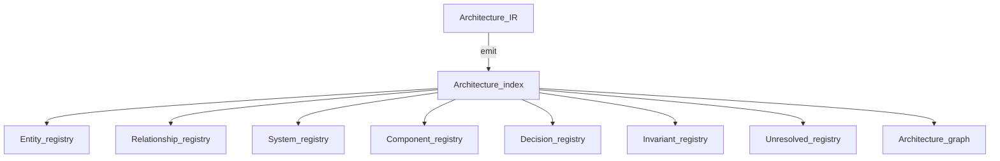

# IR as a graph

## The Problem

Treating **Architecture IR** as an unstructured document store throws away STE’s leverage. Graph structure is what enables **traversal**, **pattern** queries, **diff**, and **scope** selection for **evidence**. If teams cannot think of IR as a **graph**, they default to ad hoc extracts—each tool’s private graph returns.

## The Reframe

**Architecture IR** is usefully understood as a **typed, attributed graph**: **entities** as nodes, **relationships** as edges, with schemas constraining valid neighborhoods. This is a **mental model**, not a mandate for a specific database technology. Storage may be relational, document, or graph-native; **reasoning** still follows graph semantics.

## The Model

### Nodes, edges, attributes

Nodes carry type and identity; edges carry type, direction, and endpoints; both may carry attributes used by **rules** and **projections**. The metamodel defines valid compositions—what may link to what.

In mature toolchains, several **machine-facing** files together form the **projection bundle** over **Architecture IR**: an **architecture index** names the bundle and points at **entity**, **relationship**, **system**, **component**, **decision**, **invariant**, and **unresolved** registries (and often a graph or graph-shaped export). That bundle is the **reasoning substrate** assistants and checkers traverse—not a single pretty diagram.

**How to read this diagram:** treat the index and registries as **compiled, queryable views** of the same commitments **Architecture IR** holds; they should **regenerate** when canonical inputs change.

A companion sketch lives at [`diagrams/projection-bundle.mmd`](../diagrams/projection-bundle.mmd).

### Paths and neighborhoods

Many engineering questions are **path** questions: dependencies of dependencies, blast radius within **N** hops, interfaces on a boundary. **Graph** framing makes those questions **specifiable** and **automatable**.

### Subgraphs as scopes

**Scopes** for **validation**, **certification**, or **evidence** collection are often **subgraphs**: “this service and its transitive runtime dependencies.” IR lets **scopes** be **named** and **reused** instead of reinvented per checklist.

### Algorithms and performance

Centrality, cycle detection, reachability, and constraint propagation are examples of analyses STE enables once IR is real. This handbook does not prescribe specific algorithms or performance targets; it states that IR is shaped **so that** such analyses are legitimate engineering work, not one-off scripts scraping README files.

## The Implications

Invest in **queries** and **views** as first-class capabilities over IR. **Projections** are human-facing **renderings** of subgraphs; analytical tools consume the same underlying graph ([Projections](04-09-projections.md)).

## Relationship to STE system

- **Building blocks:** [Entities](04-02-entities.md), [Relationships](04-03-relationships.md).
- **Traces and impact:** [Traceability in Architecture IR](04-05-traceability.md), [Diff and change](04-06-diff-and-change.md).
- **Theory:** [Software architecture theory](../01-theory/01-07-software-architecture-theory.md), [Model-based systems engineering](../01-theory/01-08-model-based-systems-engineering.md).
- **System overview:** [System overview](../02-overview/02-03-system-overview.md).

## Summary

- **Architecture IR** is a **typed graph** for reasoning: paths, **scopes**, and structural queries are first-class.
- **Projections** and analytics should read the **same** graph, not parallel inventions.
- Graph thinking is how IR earns its place between **intent** and **evidence**.

**Next:** [Projections overview](04-08-projections-overview.md).
