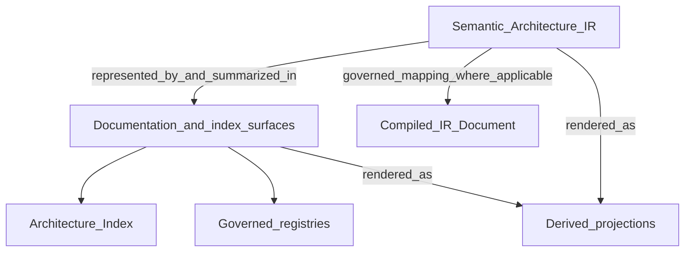

# IR as a semantic graph

## The Problem

Treating **Architecture IR** as an unstructured document store throws away STE’s leverage. Graph structure is what enables **traversal**, **pattern** queries, **diff**, and **scope** selection for **evidence**. If teams cannot think of the architecture model as a **semantic graph**, they default to ad hoc extracts—each tool’s private graph returns.

An older mental model that lists only structural registries (and perhaps decision and invariant subsets) is incomplete once **NormativeProposition** is a first-class machine-facing semantic type at the conceptual level. Treating every discoverable node as applicable policy is worse: the graph becomes a false governance oracle. Collapsing Architecture Index, registries, compiled integration-state, and human projections into one “derived view” class is also wrong: those surfaces have different governed roles.

## The Reframe

**Architecture IR** is usefully understood as a **typed, attributed semantic graph**: **entities** as nodes, **relationships** as edges, with schemas constraining valid neighborhoods. Nodes include structural semantics **and** governed semantic entities such as decisions, invariants, and Normative Propositions where admitted. This is a **mental model**, not a mandate for a specific database technology. Storage may be relational, document, or graph-native; **reasoning** still follows graph semantics.

Distinguish the **conceptual semantic graph** from **current compiled IR realization**. Accepted ste-spec admits NormativeProposition as a semantic type while deferring CE-01 and a dedicated compiled IR `kind`. Semantic Architecture IR may be wider than current mechanical `kind` and relationship enums. Embodiment toolchains may expose Normative Propositions on normalized registries without those surfaces being Architecture IR themselves.

## The Model

### Nodes, edges, attributes

Nodes carry type and identity; edges carry type, direction, and endpoints; both may carry attributes used by **rules** and **projections**. The metamodel defines valid compositions—what may link to what.

### Distinct machine surfaces (roles, not one pipeline)

STE distinguishes several machine-facing surfaces. They **MAY** overlap in content; they **MUST NOT** be conflated as identical authorities or as one mandatory storage pipeline:

| Surface | Role |
|---------|------|
| **Semantic Architecture IR** | Canonical machine-oriented semantic architecture model / ontology |
| **Architecture Index** | Canonical snapshot of architecture system state at a point or revision—documentation-state / product-facing summary |
| **Entity / relationship / related registries** | Governed machine or documentation-state surfaces under their contracts |
| **`Compiled_IR_Document`** | Merged, validated **integration-state** under the pinned mechanical contract |
| **Projections** | Derived human- or task-facing renderings (diagrams, documents, stakeholder/task views) |

**Architecture Index is not a disposable projection.** Registries are not automatically projections. Normalized ADR-Kit entities are not automatically compiled IR entities. Do **not** encode `IR → Index → every registry` as the mandatory physical or authority pipeline.

Normative Propositions, where present on embodiment surfaces, typically appear as typed entities in a general entity registry rather than inventing a separate “normative proposition registry” name. That appearance is embodiment evidence, not Architecture IR ontology by itself, and not a compiled IR `kind`.

**How to read this diagram:** roles and relationships of surfaces, not a storage recipe. Edges name conceptual relations such as representation, summary, governed mapping, and rendering.


```mermaid
flowchart TB
  IR[Semantic_Architecture_IR]
  DOC[Documentation_and_index_surfaces]
  IDX[Architecture_Index]
  REG[Governed_registries]
  COMP[Compiled_IR_Document]
  PROJ[Derived_projections]
  IR -->|"represented_by_and_summarized_in"| DOC
  DOC --> IDX
  DOC --> REG
  IR -->|"governed_mapping_where_applicable"| COMP
  IR -->|"rendered_as"| PROJ
  DOC -->|"rendered_as"| PROJ
```

A companion sketch lives at [`diagrams/projection-bundle.mmd`](../diagrams/projection-bundle.mmd).

### Presence, reachability, and applicability

Establish and keep separate:

```text
represented ≠ authoritative
authoritative ≠ effective
in scope ≠ applicable
reachable ≠ applicable
applicable ≠ conformant
```

Graph traversal may identify **candidate** relevant semantics—for example decisions that introduced a component, Normative Propositions declared by an ADR connected to a change surface, invariants and NPs that are candidates for review of a scope, or embodiment/evidence relationships that exist. Traversal cannot by itself manufacture task-relative applicability.

**The graph is a reasoning substrate, not a governance oracle.**

### Paths and neighborhoods

Many engineering questions are **path** questions: dependencies of dependencies, blast radius within **N** hops, interfaces on a boundary, candidate normative neighborhoods around a change. **Graph** framing makes those questions **specifiable** and **automatable**. Always qualify **candidate/reachable** versus **applicable**.

### Subgraphs as scopes

**Scopes** for **validation**, **certification**, or **evidence** collection are often **subgraphs**: “this service and its transitive runtime dependencies,” or “this ADR’s declared propositions and related components.” The model lets **scopes** be **named** and **reused** instead of reinvented per checklist. Named scope is still not automatic applicability to a task.

### Algorithms and performance

Centrality, cycle detection, reachability, and constraint propagation are examples of analyses STE enables once the graph is real. This handbook does not prescribe specific algorithms or performance targets; it states that the model is shaped **so that** such analyses are legitimate engineering work, not one-off scripts scraping README files—and that analysis output remains candidate or observational unless governance elevates it.

## The Implications

Invest in **queries** and **views** as first-class capabilities over the semantic graph, while keeping surface roles honest. **Projections** are human-facing **renderings**; Architecture Index and registries remain independently governed surfaces ([Projections](04-09-projections.md)). Do not let discoverability of Normative Propositions become a silent claim that they govern every retrieved context.

Task-relative applicability and MVC assembly remain later work ([Context assembly and MVC](../08-runtime/08-05-context-assembly-and-mvc.md)).

## Relationship to STE system

- **Building blocks:** [Entities](04-02-entities.md), [Relationships](04-03-relationships.md).
- **Traces and impact:** [Traceability in Architecture IR](04-05-traceability.md), [Diff and change](04-06-diff-and-change.md).
- **Theory:** [Software architecture theory](../01-theory/01-07-software-architecture-theory.md), [Model-based systems engineering](../01-theory/01-08-model-based-systems-engineering.md).
- **System overview:** [System overview](../02-overview/02-03-system-overview.md).

## Summary

- **Architecture IR** is a **typed semantic graph** for reasoning: paths, **scopes**, and structural and normative queries are first-class at the conceptual level.
- Conceptual graph semantics are distinct from current compiled IR realization; CE-01 and NP compiled kinds remain deferred where ste-spec defers them.
- Architecture Index, registries, `Compiled_IR_Document`, and projections have distinct governed roles; Index is not merely a projection.
- Presence and reachability do not imply applicability; the graph is a reasoning substrate, not a governance oracle.

**Next:** [Projections overview](04-08-projections-overview.md).
