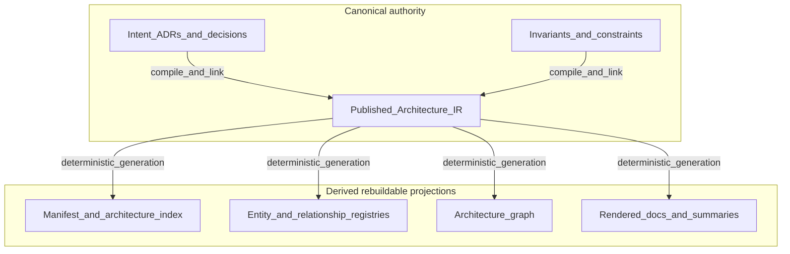

# Projections overview

## The Problem

Humans cannot read **Architecture IR** raw at scale. **Projections**—diagrams, documents, tables, API explorers—are how architecture is **reviewed** and **taught**. The failure mode is treating any projection as **canonical**: three diagrams disagree, each claims truth, and **governance** argues about ink instead of structure. STE requires a clear rule: **IR** is **canonical** for structural commitments; **projections** are **derived** and must **track** IR when the pipeline is healthy.

## The Reframe

STE’s rule at this layer is strict: **Architecture IR** is **canonical** for structural commitments in a declared **scope**; anything rendered for humans from that graph is **derived** and must **track** IR when the pipeline is healthy. Multiple projections coexist because stakeholders need different slices and notations; **consistency** means they **do not contradict** the same IR snapshot without a documented exception ([Publication versus projection](../03-artifacts/03-08-publication-vs-projection.md)). How selection, notation, and provenance work in practice is the subject of [Projections](04-09-projections.md).

## The Model

### Canonical versus derived

- **Canonical (architecture model layer):** **Architecture IR** as published structural truth for a declared **scope**.
- **Derived:** every **projection**—even a “source” diagram in a design tool—once wired into STE’s pipeline—is accountable to IR, not freestanding.

Normative **intent** records (**ADRs**, **invariants**, requirements, **constraints**, recorded **decisions**) sit on the **authority** side of the pipeline: they are what **governance** commits and revises. **Compilation** and linking produce **Architecture IR**; **manifests**, **indices**, **registries**, **graphs**, rendered docs, and many review or gap summaries are **regenerated** from that substrate. They speed reading and automation; they do not compete with **intent** or published IR as alternate “truths.”

**How to read this diagram:** **derived** artifacts are **disposable and reproducible**; fix authority in **intent** or IR, then **regenerate**—do not “patch” derived files by hand as if they were canonical.

### Why many projections exist

Legitimate reasons include: audience (executive summary versus engineer detail), notation (C4, deployment, data flow), and task (onboarding versus **compliance** review). Illegitimate reasons include private diagrams that bypass **compilation** and **governance**.

### Pipeline expectations

Healthy flow: **intent** → **compilation** → IR update → **projection** regeneration → human review. Skipping steps forks reality; **drift** between projection and IR is a **defect** or an **explicit waiver**, not an informal norm.

### Relationship to views literature

Classic **architecture views** map cleanly onto **projections** in STE vocabulary: views are **not** separate truths; they are **renderings** of commitments anchored in IR ([Architecture views](04-12-architecture-views.md)).

## The Implications

Invest in **projection** tooling as seriously as **compilation**. Stale diagrams erode trust faster than missing diagrams. **View consistency** checks ([View consistency](04-14-view-consistency.md)) belong in the same **governed reasoning** story as code checks.

## Relationship to STE system

- **Part 4 entry to projections:** followed by [Projections](04-09-projections.md), [Diagrams](04-10-diagrams.md), [Projection documents](04-11-projection-documents.md), [Architecture views](04-12-architecture-views.md), [Stakeholder views](04-13-stakeholder-views.md), [View consistency](04-14-view-consistency.md).
- **Foundations:** [Architecture as a first-class artifact](../00-problem/00-04-architecture-as-a-first-class-artifact.md).
- **Artifact layer:** [Publication versus projection](../03-artifacts/03-08-publication-vs-projection.md).
- **Overview:** [Architecture model (Architecture IR) overview](04-00-architecture-ir-overview.md).

## Summary

- **Projections** are **derived**; **Architecture IR** is **canonical** for structure.
- Multiple projections are normal; **contradiction** without policy is not.
- **Projection** health is part of **governed reasoning**, not “documentation polish.”

**Next:** [Projections](04-09-projections.md).
