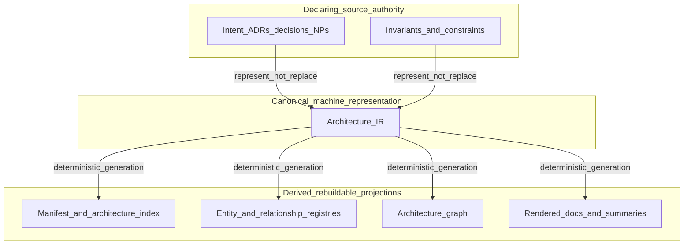

# Projections overview

## The Problem

Humans cannot read **Architecture IR** raw at scale. **Projections**—diagrams, documents, tables, API explorers—are how architecture is **reviewed** and **taught**. The failure mode is treating any projection as **canonical**—or as declaring authority for Normative Propositions merely because they appear in a view. Three diagrams disagree, each claims truth, and **governance** argues about ink instead of architecture. STE requires a clear rule: declaring sources retain normative authority; **Architecture IR** is **canonical machine representation** for a declared **scope**; **projections** are **derived** and must **track** that representation when the pipeline is healthy.

## The Reframe

STE’s rule at this layer is strict but layered. **Governed source artifacts** (ADRs, invariants, constraints, and related intent) remain declaring authority. **Architecture IR** is **canonical machine representation** of admitted architecture semantics for a declared **scope**. Anything rendered for humans from that model is **derived** and must **track** IR when the pipeline is healthy. Multiple projections coexist because stakeholders need different slices and notations; **consistency** means they **do not contradict** the same IR snapshot for the claims they make without a documented exception ([Publication versus projection](../03-artifacts/03-08-publication-vs-projection.md)). How selection, notation, and provenance work in practice is the subject of [Projections](04-09-projections.md).

A projection of a Normative Proposition does not become the NP’s authority, does not become applicable merely by being displayed, and must preserve identity, declaring authority, force, scope, and provenance sufficiently to avoid misleading the reviewer.

## The Model

### Canonical representation versus declaring authority versus derived views

```text
governed source authority
        ↓
semantic representation / Architecture IR
        ↓
derived projections
```

Do **not** put all three inside one “canonical authority” box as if they were equivalent.

- **Declaring authority:** **ADRs** and related intent records—what **governance** commits and revises, including ADR-local Normative Propositions.
- **Canonical machine representation:** **Architecture IR** (and governed mapping into it) for a declared **scope**—addressable structural and semantic commitments.
- **Derived:** every **projection**—manifests, indices, registries, graphs, rendered docs, review summaries—accountable to the model, not freestanding, and not a second declaring authority.

**Compilation** and related materialization produce machine-facing representation; **projections** regenerate from that substrate. They speed reading and automation; they do not compete with **intent** as alternate normative truths, and they do not invent applicability by selection.

**How to read this diagram:** **derived** artifacts are **disposable and reproducible**; fix authority in declaring sources (and regenerate the model), then **regenerate** projections—do not “patch” derived files by hand as if they were canonical or authoritative.


```mermaid
flowchart TB
  subgraph declare ["Declaring_source_authority"]
    ADR[Intent_ADRs_decisions_NPs]
    INV[Invariants_and_constraints]
  end
  subgraph machine ["Canonical_machine_representation"]
    IR[Architecture_IR]
  end
  subgraph deriv ["Derived_rebuildable_projections"]
    MAN[Manifest_and_architecture_index]
    REG[Entity_and_relationship_registries]
    GRA[Architecture_graph]
    REN[Rendered_docs_and_summaries]
  end
  ADR -->|"represent_not_replace"| IR
  INV -->|"represent_not_replace"| IR
  IR -->|"deterministic_generation"| MAN
  IR -->|"deterministic_generation"| REG
  IR -->|"deterministic_generation"| GRA
  IR -->|"deterministic_generation"| REN
```

### Why many projections exist

Legitimate reasons include: audience (executive summary versus engineer detail), notation (C4, deployment, data flow), and task (onboarding versus **compliance** review). Illegitimate reasons include private diagrams that bypass construction/materialization and **governance**, or views that strip normative qualification until obligations look freestanding.

### Pipeline expectations

Healthy flow: governed **intent** → construction/materialization → IR update (where mapped) → **projection** regeneration → human review. Skipping steps forks reality; **drift** between projection and IR is a **defect** or an **explicit waiver**, not an informal norm. Including a Normative Proposition in a regenerated view does not prove it applies to the reviewer’s task.

### Relationship to views literature

Classic **architecture views** map cleanly onto **projections** in STE vocabulary: views are **not** separate truths; they are **renderings** of commitments anchored in the architecture model ([Architecture views](04-12-architecture-views.md)).

## The Implications

Invest in **projection** tooling as seriously as construction and materialization. Stale diagrams erode trust faster than missing diagrams. **View consistency** checks ([View consistency](04-14-view-consistency.md)) belong in the same **governed reasoning** story as code checks—and must cover normative-semantic distortion, not only missing boxes.

## Relationship to STE system

- **Part 4 entry to projections:** followed by [Projections](04-09-projections.md), [Diagrams](04-10-diagrams.md), [Projection documents](04-11-projection-documents.md), [Architecture views](04-12-architecture-views.md), [Stakeholder views](04-13-stakeholder-views.md), [View consistency](04-14-view-consistency.md).
- **Foundations:** [Architecture as a first-class artifact](../00-problem/00-04-architecture-as-a-first-class-artifact.md).
- **Artifact layer:** [Publication versus projection](../03-artifacts/03-08-publication-vs-projection.md).
- **Overview:** [Architecture model (Architecture IR) overview](04-00-architecture-ir-overview.md).

## Summary

- **Projections** are **derived**; **Architecture IR** is **canonical machine representation**; declaring sources retain normative authority.
- Multiple projections are normal; **contradiction** or silent stripping of normative qualification without policy is not.
- Selection and display do not imply applicability; **projection** health is part of **governed reasoning**, not “documentation polish.”

**Next:** [Projections](04-09-projections.md).
