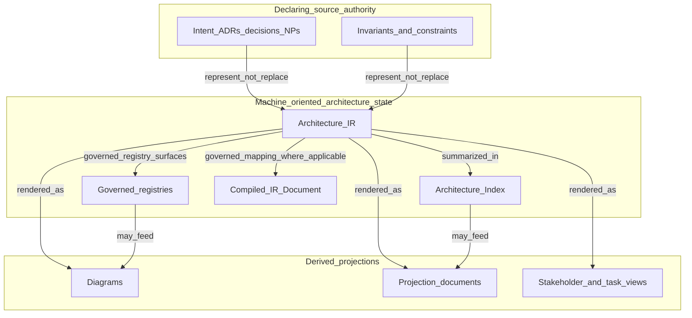

# Projections overview

## The Problem

Humans cannot read **Architecture IR** raw at scale. **Projections**—diagrams, documents, stakeholder and task views—are how architecture is **reviewed** and **taught**. The failure mode is treating any projection as **canonical**—or as declaring authority for Normative Propositions merely because they appear in a view. A related failure is over-collapsing Architecture Index, governed registries, and compiled integration-state into “just projections,” which erases their distinct roles. STE requires a clear rule: declaring sources retain normative authority; **Architecture IR** is the **canonical machine-oriented semantic model** for a declared **scope**; **projections** are **derived renderings** and must not invent authority or applicability.

## The Reframe

STE’s rule at this layer is strict but layered. **Governed source artifacts** (ADRs, invariants, constraints, and related intent) remain declaring authority. **Architecture IR** is **canonical machine representation** of admitted architecture semantics for a declared **scope**. A **projection** is a **derived human- or task-facing view/rendering** of governed architecture state. Multiple projections coexist because stakeholders need different slices and notations; **consistency** means they **do not contradict** the same IR snapshot for the claims they make without a documented exception ([Publication versus projection](../03-artifacts/03-08-publication-vs-projection.md)). How selection, notation, and provenance work in practice is the subject of [Projections](04-09-projections.md).

A projection of a Normative Proposition does not become the NP’s authority, does not become applicable merely by being displayed, and must preserve identity, declaring authority, force, scope, and provenance sufficiently to avoid misleading the reviewer.

## The Model

### What a projection is (narrow)

**Projection** means a derived human- or task-facing rendering. Typical examples:

- diagrams;
- projection documents;
- stakeholder views;
- review summaries;
- other task-oriented rendered views.

### What is not automatically a projection

Do **not** automatically classify these as projections—they have independently governed roles ([IR as a semantic graph](04-07-ir-as-a-graph.md)):

- Architecture Index (documentation-state / product-facing system-state snapshot);
- Entity Registry and Relationship Registry (and related governed registries);
- normalized semantic registry surfaces;
- `Compiled_IR_Document` (integration-state under the pinned mechanical contract).

Those surfaces may feed projections. They are not projections by default, and they are not interchangeable with each other.

### Declaring authority, machine model, and derived renderings

```text
governed source authority
        ↓
semantic representation / Architecture IR
        ↓
derived projections (human/task renderings)
```

Do **not** put declaring sources, Architecture IR, Architecture Index, registries, and projections inside one “canonical authority” box as if they were equivalent.

- **Declaring authority:** **ADRs** and related intent records—what **governance** commits and revises, including ADR-local Normative Propositions.
- **Canonical machine-oriented semantic model:** **Architecture IR** for a declared **scope**.
- **Other governed machine/documentation surfaces:** Architecture Index, registries, and compiled integration-state under their contracts.
- **Derived projections:** human- and task-facing renderings accountable to governed state—not freestanding declaring authority.

**How to read this diagram:** projections are **rebuildable renderings**; fix authority in declaring sources and regenerate machine state under its contracts, then regenerate projections—do not “patch” derived views by hand as if they were canonical or authoritative. Do not treat Index or registries as mere projection outputs.


```mermaid
flowchart TB
  subgraph declare ["Declaring_source_authority"]
    ADR[Intent_ADRs_decisions_NPs]
    INV[Invariants_and_constraints]
  end
  subgraph machine ["Machine_oriented_architecture_state"]
    IR[Architecture_IR]
    IDX[Architecture_Index]
    REG[Governed_registries]
    COMP[Compiled_IR_Document]
  end
  subgraph deriv ["Derived_projections"]
    DIA[Diagrams]
    DOC[Projection_documents]
    STK[Stakeholder_and_task_views]
  end
  ADR -->|"represent_not_replace"| IR
  INV -->|"represent_not_replace"| IR
  IR -->|"summarized_in"| IDX
  IR -->|"governed_registry_surfaces"| REG
  IR -->|"governed_mapping_where_applicable"| COMP
  IR -->|"rendered_as"| DIA
  IR -->|"rendered_as"| DOC
  IR -->|"rendered_as"| STK
  IDX -->|"may_feed"| DOC
  REG -->|"may_feed"| DIA
```

### Why many projections exist

Legitimate reasons include: audience (executive summary versus engineer detail), notation (C4, deployment, data flow), and task (onboarding versus **compliance** review). Illegitimate reasons include private diagrams that bypass construction/materialization and **governance**, or views that strip normative qualification until obligations look freestanding.

### Pipeline expectations

Healthy flow: governed **intent** → construction/materialization → machine-facing architecture state (IR, and Index/registries/compiled IR where applicable) → **projection** regeneration → human review. Skipping steps forks reality; **drift** between a projection and the governed state it claims to render is a **defect** or an **explicit waiver**, not an informal norm. Including a Normative Proposition in a regenerated view does not prove it applies to the reviewer’s task.

### Relationship to views literature

Classic **architecture views** map cleanly onto **projections** in STE vocabulary: views are **not** separate truths; they are **renderings** of commitments anchored in the architecture model ([Architecture views](04-12-architecture-views.md)).

## The Implications

Invest in **projection** tooling as seriously as construction and materialization, without demoting Architecture Index or registries to “just docs.” Stale diagrams erode trust faster than missing diagrams. **View consistency** checks ([View consistency](04-14-view-consistency.md)) belong in the same **governed reasoning** story as code checks—and must cover normative-semantic distortion, not only missing boxes.

## Relationship to STE system

- **Part 4 entry to projections:** followed by [Projections](04-09-projections.md), [Diagrams](04-10-diagrams.md), [Projection documents](04-11-projection-documents.md), [Architecture views](04-12-architecture-views.md), [Stakeholder views](04-13-stakeholder-views.md), [View consistency](04-14-view-consistency.md).
- **Foundations:** [Architecture as a first-class artifact](../00-problem/00-04-architecture-as-a-first-class-artifact.md).
- **Artifact layer:** [Publication versus projection](../03-artifacts/03-08-publication-vs-projection.md).
- **Overview:** [Architecture model (Architecture IR) overview](04-00-architecture-ir-overview.md).
- **Surface roles:** [IR as a semantic graph](04-07-ir-as-a-graph.md).

## Summary

- **Projections** are derived human- or task-facing renderings; Architecture Index, registries, and `Compiled_IR_Document` are not automatically projections.
- **Architecture IR** is the canonical machine-oriented semantic model; declaring sources retain normative authority.
- Multiple projections are normal; **contradiction** or silent stripping of normative qualification without policy is not.
- Selection and display do not imply applicability; **projection** health is part of **governed reasoning**, not “documentation polish.”

**Next:** [Projections](04-09-projections.md).
