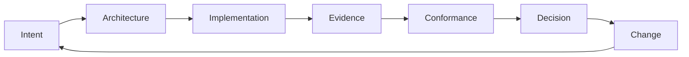

# Part 5: Lifecycle Overview

STE is a **lifecycle governance** system. It is not only a way to produce a first design. The same commitments and records must stay legible while **intent**, **architecture**, **embodiment**, and **evidence** move. This part walks the stages of that movement in order. It complements Part 6, where the control loop mechanics and policy-oriented governance chapters live.

## Purpose of this stage

This overview orients readers to how STE operates **over time**: how artifact types from Part 3 are created, used, assessed, and revised under governance. It frames the repeating **control loop** that ties intent to reality and back again.

## Artifacts involved

All Part 3 groupings appear across the lifecycle, in different proportions by stage: **intent** artifacts (ADRs, requirements, constraints, invariants), **structural** artifacts (**Architecture IR** and projections), **implementation** artifacts (code, configuration, infrastructure as durable records), **evidence** artifacts (tests, telemetry, **EDR**-shaped records), and **governance** artifacts (trace links, conformance results, lifecycle state, approvals). See [Artifact layer overview](../03-artifacts/03-00-artifact-layer-overview.md).

## Human responsibility

People remain accountable for stating goals and **intent**, making architectural commitments, reviewing system-maintained records and projections, accepting or rejecting assessments, authorizing change and exceptions, and owning policy choices. The stage chapters below spell out human roles per phase.

## STE system responsibility

STE (automation and governed services) materializes structured records, maintains **Architecture IR** and traceability, collects observations into **evidence**, runs **conformance** checks where defined, manages **lifecycle state** where policy assigns that to the system, and renders **projections** without becoming a second source of truth.

## Transitions to the next stage

This chapter does not gate the book. **Next:** [Intent formation](05-01-intent-formation.md) begins the staged walkthrough. In practice, teams revisit earlier stages whenever **intent** or **embodiment** shifts; the loop is not a one-way line.

## Relationship to intent, implementation, and evidence

- **Intent** is declared and revised through governed **intent** artifacts.
- **Implementation** in STE’s vocabulary is code-level realization; the running and configured whole is **embodiment**. Both connect to **implementation** artifacts and operational behavior.
- **Evidence** is observation of **embodiment**, linked back to **intent** and **Architecture IR** for **validation** and **conformance**.

### Control loop (handbook-level)

STE repeats a closed loop: **intent** leads to **architecture**, **implementation** (building and running **embodiment**), **evidence**, **conformance** assessment, **governance** **decision**, **change**, then back toward updated **intent** and structure.

## Relationship to other chapters

- Orientation: [The STE lifecycle](../02-overview/02-04-the-ste-lifecycle.md).
- Artifact types: [Artifact layer overview](../03-artifacts/03-00-artifact-layer-overview.md).
- Canonical model: [Architecture IR overview](../04-architecture-model/04-00-architecture-ir-overview.md).
- Loop mechanics: [Control loop overview](../06-governance/06-07-control-loop-overview.md).
- Policy and operations: [Governance overview](../06-governance/06-00-lifecycle-overview.md).
- Normative contracts: **ste-spec**.

**Next:** [Intent formation](05-01-intent-formation.md).
