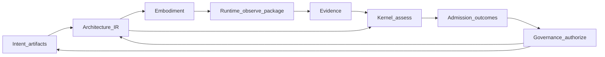

# The governance model

## Why this matters

If governance is read as a document set, teams optimize for approvals. If it is read as a **control structure**, teams optimize for **correct coupling** between **intent**, **Architecture IR**, **embodiment**, **evidence**, and **decisions**. STE takes the second view.

## The problem

“Governance” often names meetings, templates, or compliance gates disconnected from daily engineering. In STE, that disconnect is the failure mode: **lossy reasoning** and **ungoverned execution** persist because nothing in the loop **binds** claims to objects that tools and auditors can revisit.

## The reframe

**Governance** is the **operational control structure** that constrains both **reasoning** (what counts as a supported claim) and **action** (what may proceed). It applies:

- **Before execution:** eligibility of context and plans (is declared architecture sufficient, current, and in scope for the proposed work?).
- **During execution:** obligations for evidence collection, projection freshness, and rule activation where policy requires them ([Rule activation](../10-ai-interface/10-02-rule-activation.md)).
- **After execution:** assessment, admission outcomes, authorized change, exceptions, and revision of **intent** or **embodiment** plans.

This timing is compatible with the closed-loop story in [System overview](../02-overview/02-03-system-overview.md) and the Runtime ordering in [Runtime overview](../08-runtime/08-00-runtime-overview.md): **Embodiment** → **Runtime** → **Evidence** → **Kernel** → **Decision** → **Governance** → back to **Intent** / **Architecture IR** / delivery.

## The model

### What governance evaluates

At handbook altitude, governance evaluates **declared intent versus observed reality (embodiment) under active policy**—using **Architecture IR** as the compiled structural **setpoint**, **evidence** as the observation side, and **rules** plus organizational **policy** as the bars attached to gates.

A compact statement of the same idea:

**Decision = f(Intent, Evidence, Policy)** — where **Intent** includes normative intent artifacts and the **Architecture IR** they compile to under agreed rules, **Evidence** is the packaged observation of **embodiment** (and related inputs) for the scope under decision, and **Policy** is the active constraints and **obligations** the organization attaches to the transition. Mechanical shape for **Admission** and related outcomes lives in Part 7 where **ste-spec** defines contracts ([Kernel overview](../07-kernel/07-00-overview.md), [Kernel reasoning surface](../07-kernel/07-05-kernel-reasoning-surface.md)).

### What governance does not do

- **Governance does not write ADRs** or other intent artifacts; authors and teams do. Governance decides whether declared records support **proceed** for a gated act ([Architecture decision records](../03-artifacts/03-01-architecture-decision-records.md)).
- **Governance does not implement** systems; **embodiment** does. Governance decides whether **implementation** momentum is allowed to continue against declared architecture and evidence ([Artifact layer overview](../03-artifacts/03-00-artifact-layer-overview.md)).
- **Governance decides whether the system may proceed** for policy-gated operations, using **Kernel** outcomes, human judgment reserved by **ste-spec** and policy, and the artifact chain above. The core question is stated in [Section overview](06-00-section-overview.md).

**Canonical** versus **derived** at each layer is summarized in the [section overview](06-00-section-overview.md) and detailed in [Authority and decision rights](06-03-authority-and-decision-rights.md).

### Governance as a system, not a binder

Governance **components** in STE include:

- **Normative records** (**intent**, **Architecture IR** under compilation rules).
- **Observation and packaging** (**Runtime** producing **evidence** and **governance signals**, not policy verdicts on organizational acceptance).
- **Assessment** (**Kernel** role: deterministic outcomes under **ste-spec** where defined).
- **Human accountability** for policy, exceptions, and tradeoffs that contracts deliberately leave to judgment ([Human-in-the-loop](../09-human-interface/09-07-human-in-the-loop.md)).

None of these alone is “the governance system.” Together they form the **control structure**.

### Loop sketch (control view)

Governance **closes** the loop: decisions change what may be built, what is declared, or both. **Drift** (mismatch between declaration and reality) and **convergence** (bringing them back in line) are meaningful only because this structure names **setpoint**, **observation**, and **actuation** with shared identities. Lifecycle staging for those ideas lives in Part 5 ([Conformance and assessment](../05-lifecycle/05-05-conformance-and-assessment.md), [Change and evolution](../05-lifecycle/05-07-change-and-evolution.md)).

### Where enforcement depth is still emerging

The **diagram** is **normative at handbook altitude**; **instantiation** in every toolchain and lifecycle transition is **not** claimed as complete. [Kernel and governance](../07-kernel/07-07-kernel-and-governance.md) summarizes current versus planned mechanical depth honestly.

## Relationship to other chapters

- [Why governance exists](06-01-why-governance-exists.md)
- [Authority and decision rights](06-03-authority-and-decision-rights.md)
- [Admission, eligibility, and enforcement](06-04-admission-eligibility-and-enforcement.md)
- [The STE lifecycle](../02-overview/02-04-the-ste-lifecycle.md)

**Next:** [Authority and decision rights](06-03-authority-and-decision-rights.md).
