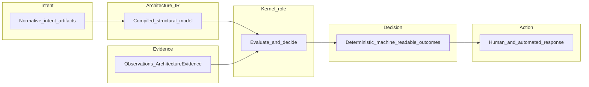
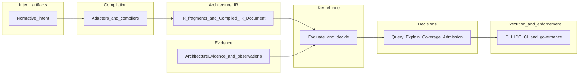

# Kernel overview

## The Problem

STE needs a single place where **Architecture IR** and **Evidence** meet **governance** expectations and produce **deterministic decisions**—not opinions, not narrative summaries, and not hidden judgment embedded in tools. Without that locus, teams confuse “what we said” with “what we observed,” and automation cannot safely enforce boundaries. The **Kernel** names that locus as a **system role**: the **decision engine** of STE.

## The Reframe

At handbook altitude, the **Kernel role** consumes **Architecture IR** (the compiled structural model of **intent** at the architecture layer), **Evidence** (observations, including **ArchitectureEvidence**-shaped payloads from the **Runtime** role), and policy context such as **governance rules** and **lifecycle state**. It emits **machine-readable** outcomes—queries, explanations, coverage findings, and **Admission** assessments including **KernelAdmissionAssessment**-shaped results where **ste-spec** defines the handoff.

The Kernel role **does not** own canonical **intent** storage, **does not** author **ADRs**, **does not** treat repository scanning or informal extraction as architectural authority, and **does not** use probabilistic or large-language-model reasoning as its **decision core**. Those boundaries keep the role stable while implementations evolve.

### The Kernel as a System Role vs ste-kernel as an Implementation

- The **Kernel** is a **role** in the STE architecture: the behavior and contracts other parts of the system rely on when they need a **deterministic decision**.
- **ste-kernel** is **one implementation** of that role.
- This handbook describes the **role** and **expected behavior** at the STE model level.
- The implementing component lives in repositories and contracts; normative shapes belong in **ste-spec**.
- This chapter should remain valid if the implementation is replaced or reorganized.

This distinction keeps Part 7 from becoming product documentation.

### Layer boundary (orientation)

| Layer | Responsibility |
|--------|----------------|
| Artifacts | Define **intent** (normative records such as **ADRs**, **invariants**, and related structured inputs). |
| **Architecture IR** | Unified model of **intent** at the architecture layer—the compiled, machine-traversable structural object STE reasons over. |
| **Runtime** | Produce **Evidence** (for example **ArchitectureEvidence**-shaped observations about embodiment and tooling health). |
| **Kernel** | **Evaluate** inputs under rules and **decide** (queries, explanations, coverage, **Admission**). |
| CLI / IDE / CI | **Execute** workflows and **enforce** or surface Kernel outcomes in engineering practice. |
| Conversation Engine | **Elicit** and refine **intent** and requirements at the human boundary (see [Human interface overview](../09-human-interface/09-00-conversation-engine-overview.md)). |
| Handbook | **Explain** the system; **ste-spec** remains normative for contracts. |

## The Model

### Reasoning surface (four operations)

The Kernel role exposes four cooperating operations:

1. **Query** — what exists in **Architecture IR** (components, decisions, capabilities, **invariants**).
2. **Explain** — why it exists (traceability from structure back to **intent**, rules, and supporting **Evidence**).
3. **Coverage** — what is missing or weakly governed (gaps, orphans, missing **Evidence**, unconstrained elements).
4. **Admission** — whether a proposed change is allowed under declared constraints, emitting **Admission** outcomes (including **KernelAdmissionAssessment** where applicable).

Together, these operations form the **minimum viable architecture reasoning system** in STE; see [Kernel reasoning surface](07-05-kernel-reasoning-surface.md).

### Determinism and fail-closed posture

Kernel outcomes aim to be **deterministic decisions**: the same inputs yield the same outputs. Where required information is missing or ambiguous under policy, the role is **fail-closed**—deny or block rather than guess. Details are developed in [Determinism and fail-closed](07-06-determinism-and-fail-closed.md).

### Control-plane direction

Over time, the Kernel role becomes the **control plane** for STE: the predictable place where **Architecture IR**, **Evidence**, and policy meet before the organization acts. That direction is exploratory today; see [Kernel as control plane](07-11-kernel-as-control-plane.md).

### Diagram — conceptual chain (primary)

**Intent → Architecture IR → Evidence → Kernel → Decision → Action.** The Kernel sits between declared architecture and real-world response.

### Diagram — artifacts, IR, decisions, execution (secondary)

How compiled structure and **Evidence** feed decisions consumed by tooling and **governance** (role names; **ste-kernel** implements the Kernel role).

**Reading the diagrams:** **Evidence** is **non-decision-bearing** at the handoff until the Kernel role evaluates it. **IR validation** (mechanical checks on **Architecture IR** and the **Compiled IR Document**) is distinct from **Admission** evaluation; both may precede a **KernelAdmissionAssessment**, but they answer different questions. Precise contracts live in **ste-spec**.

## The Implications

- Treat Kernel outputs as **decisions** to be wired into **governance** and automation, not as draft prose.
- Keep **intent** authoritative in **artifacts**; keep **Architecture IR** authoritative at the compiled architecture layer; keep observation authoritative as **Evidence**, not as undeclared structure.
- Prefer **fail-closed** behavior when integrating partial pipelines.

## Relationship to STE system

- **Architecture IR** as canonical model: [Architecture model (Architecture IR) overview](../04-architecture-model/04-00-architecture-ir-overview.md).
- **Evidence** and **Runtime**: [Part 8: Runtime Overview](../08-runtime/08-00-runtime-overview.md), [Runtime–Kernel contract](../08-runtime/08-06-runtime-kernel-contract.md), [Evidence](../03-artifacts/03-05-evidence.md).
- **Governance** loop: [Section overview (Part 6)](../06-governance/06-00-section-overview.md), [The governance model](../06-governance/06-02-the-governance-model.md).
- **What the Kernel is** (role definition): [What is the Kernel?](07-01-what-is-the-kernel.md).

## Summary

- The **Kernel** is a **system role**: the **decision engine** over **Architecture IR** and **Evidence**, not a documentation store or LLM.
- **ste-kernel** implements that role; this chapter describes behavior that should survive implementation changes.
- The reasoning surface is **Query**, **Explain**, **Coverage**, and **Admission**; outcomes should be **deterministic** and **fail-closed** where policy requires.
- **ArchitectureEvidence** is **non-decision-bearing** until evaluated; **KernelAdmissionAssessment** is decision-bearing where **ste-spec** defines it.
