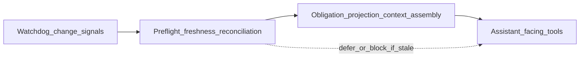

# Runtime Evidence

## The Problem

**Conformance** claims need observations, but observations are not self-organizing. Without a disciplined story for how runtime and near-runtime signals become **evidence**, teams either over-trust informal screenshots or under-use the structured channels that could support **assessment**. The same gap appears when assistants and operators reason over **stale** structural state: the failure is not “bad AI,” it is missing **freshness** and **gating** discipline on the **projected** graph the tools consume.

## The Reframe

**Evidence** is how **embodiment** becomes comparable to **intent** and **Architecture IR** under **rules**: observations with provenance, tied to **scopes** that IR identities anchor. Model-based and human analysis both depend on that grounding when **stochastic** behavior is in play. At the **runtime consumption** boundary, STE-shaped systems often add an explicit **reasoning gate**: change detection, **preflight** checks on graph **freshness** and reconciliation, then obligation-aware **context assembly** before assistant-facing tools answer—so answers target **current** semantic state instead of silent guesses.

## The Model

### Evidence categories (handbook level)

Tests, telemetry, audits, synthetic checks, and similar channels produce **EDR**-shaped records (handbook sense) once packaged with provenance. **Binding** those records to IR elements and **trace** edges is what makes **assessment** legible across tools and time. Exact envelopes belong in **ste-spec**; the handbook claim is only that **evidence** must be **addressable** relative to the same identities **Architecture IR** maintains.

### Runtime reasoning gate (conceptual)

Many deployments pair **watch** or invalidation-style signals with a **preflight** step that evaluates whether **projected** architecture state is **fresh** enough and whether **reconciliation** is required before expensive or high-impact work proceeds. **Obligation** and **context** assembly then selects a **minimally sufficient** slice of graph-shaped state for the task. Only after that gate do assistant-facing tool surfaces answer or act—reducing the odds that automation **argues from stale structure**.

**How to read this diagram:** the gate is **policy-shaped**; the names are roles, not a single vendor stack. The invariant is **fresh semantic state before high-stakes reasoning**, not a particular executable layout.

### Provenance and freshness

**Freshness** is an **evidence** and **projection** concern: when derived registries and graphs lag **intent** or **embodiment**, **assessment** and assistants both misread the system. Surfacing **stale** or **unknown** state explicitly is preferable to silent reuse of old projections.

## The Implications

Invest in **provenance** and **regeneration** paths for machine-facing projections alongside classic test and telemetry **evidence**. Where assistants participate, treat **preflight** and **obligation** semantics as part of **governed reasoning**, not optional UX polish.

## Relationship to STE system

- **Kernel:** [Kernel overview](../07-kernel/07-00-overview.md), [Kernel reasoning surface](../07-kernel/07-05-kernel-reasoning-surface.md) for orchestration of **assessment** over IR and **evidence**.
- **Human boundary:** [Conversation engine overview](../09-human-interface/09-00-conversation-engine-overview.md) for capture and review before **intent** hardens.
- **Architecture IR:** [IR as a graph](../04-architecture-model/04-07-ir-as-a-graph.md) for the projection bundle assistants traverse.
- **Lifecycle:** [Conformance and assessment](../05-lifecycle/05-05-conformance-and-assessment.md) when wired.
- **Implementation to evidence:** [Implementation to evidence](../06-governance/06-10-implementation-to-evidence.md).

Normative interfaces and runtime contracts remain in **ste-spec** and implementing repositories.

## Summary

- **Evidence** ties **embodiment** to **Architecture IR** and **intent** under **rules**; without it, **conformance** is hollow.
- A **runtime reasoning gate**—watch signals, **preflight** **freshness** / reconciliation, obligation-aware **context assembly**, then assistant-facing tools—reduces stale-graph failure modes.
- **Freshness** and **provenance** are first-class engineering concerns, not documentation details.

**Next:** [What is the Kernel?](../07-kernel/07-01-what-is-the-kernel.md) for role depth, or return to [System overview](../02-overview/02-03-system-overview.md) for the full closed loop.
