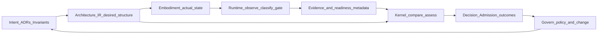
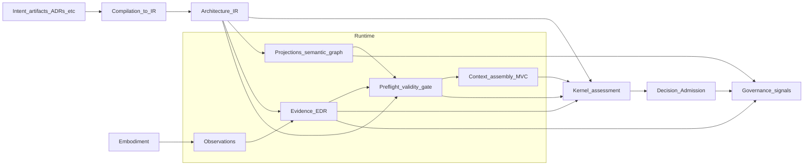

# Runtime Overview

## Why this matters

STE is built as a feedback control system. Intent and **Architecture IR** describe the desired architecture; embodiment is what is actually built and running. If you cannot observe embodiment reliably, package those observations as evidence, and show that projections and context are fresh and valid, then neither people nor models can compare desired state to reality with integrity.

**Runtime** exists to make observation and consumption legible: it sits between embodiment and deterministic assessment in the **Kernel**, under governance policy. This part explains that system role—not a particular toolchain or vendor.

The canonical assessment chain for Part 8 (use this ordering in diagrams and cross-references): Embodiment → **Runtime** → Evidence → **Kernel** → Decision → Governance.

## The problem Runtime addresses

Without a named **Runtime** layer, teams routinely:

- Treat **derived** graphs and registries as if they were **canonical** intent.
- Conflate “we ran tests” with evidence that is scoped, provenanced, and bound to **Architecture IR**.
- Let assistants and operators reason over projections that lag ADR or code changes.
- Allow informal pipelines to emit verdict-like outcomes without **Kernel**-shaped **Admission**.

The cost is reasoning unsafety: plausible narratives anchored in the wrong structural state, and governance that cannot point at durable objects when things go wrong.

## Runtime in the STE control loop

At handbook altitude, STE repeats a closed loop that connects desired state, actual state, observation, assessment, and action:

- Desired state (setpoint): intent artifacts and the compiled **Architecture IR** that models them.
- Actual state (plant output): embodiment—code, configuration, running systems.
- Observe: **Runtime** collects observations and promotes them to evidence where policy requires (Embodiment → **Runtime** → Evidence).
- Compare / decide: **Kernel** evaluates **Architecture IR**, evidence, and policy; emits deterministic outcomes including **Admission** where defined—not **Runtime** (→ **Kernel** → Decision → Governance).
- Act: governance authorizes change, exceptions, and lifecycle moves; humans and delivery machinery carry change out.

**Runtime** enables the compare step to be honest by supplying addressable inputs; it does not replace **Kernel** decision or governance authority.

## Canonical, derived, and observed

Three families of objects must stay distinct:

| Family | Meaning | Examples (handbook level) |
|--------|---------|---------------------------|
| Canonical | Human-governed intent and formal records that define what should hold | ADRs, requirements, invariants, constraints |
| Compiled model | **Architecture IR**—the canonical machine-traversable model of architecture intent at the structure layer | Graph, entities, relationships |
| Observed | Evidence about embodiment—what was measured, run, or sensed under declared scope | EDR-shaped records (handbook sense), test results, telemetry with provenance |
| Derived | Projections and machine-facing views generated from **Architecture IR** and/or evidence pipelines | Registries, diagram views, graph exports for tooling |

Evidence is not intent; projections are not **Architecture IR**; **Architecture IR** is not embodiment. **Runtime** keeps **observed** and **derived** material honest relative to **canonical** and compiled sources. How freshness, validity, and evidence states are defined is in [Freshness and Validity](08-03-freshness-and-validity.md); how the readiness gate works is in [Preflight and the Reasoning Gate](08-04-preflight-and-reasoning-gate.md).

## Where this part sits

- Part 3 artifacts name types and roles: intent records, **Architecture IR**, evidence, trace. See [Architecture model (Architecture IR) overview](../04-architecture-model/04-00-architecture-ir-overview.md) for the compiled model.
- **Runtime** produces and curates evidence-shaped outputs and readiness metadata; it does not redefine intent or **Architecture IR**. The catalog of **Runtime** outputs lives in [The Runtime Model](08-01-the-runtime-model.md); the **Runtime**–**Kernel** handoff is in [Runtime–Kernel Contract](08-06-runtime-kernel-contract.md).

## STE authority boundaries

Part 8 assumes this division of authority (normative contracts live in ste-spec):

| Authority | Owns |
|-----------|------|
| ADRs (intent artifacts) | Intent—what should hold |
| ste-spec | Contracts, schemas, normative technical shapes |
| **Architecture IR** | Canonical compiled structural model (from intent via compilation—not produced by **Runtime**) |
| **Runtime** | Evidence packaging, classification, change and drift signals (observation-side), preflight and readiness, **MVC** assembly, projection and semantic graph updates, health and observation coverage metadata—outputs only; not policy or **Admission** |
| **Kernel** | Assessment, **Admission** (where defined), Query, Explain, Coverage—under policy |
| Governance | Policy, exceptions, authorized change, interpretation of control-loop signals |
| People | Intent artifacts, accountability for judgment where automation stops |

**Runtime** does not: author ADRs; own compilation of **Architecture IR**; emit **Admission**; or enforce governance policy.

## Purpose of this part

The chapters that follow walk the pipeline from observation through context to the **Kernel** boundary and operations. [The Runtime Model](08-01-the-runtime-model.md) defines responsibilities and data products; [Runtime Architecture Components and Flow](08-09-runtime-architecture-components-and-flow.md) gives an implementer-oriented map.

Normative shapes remain in ste-spec; this handbook states concepts and boundaries.

## Reading order

1. [The Runtime Model](08-01-the-runtime-model.md)
2. [Evidence and Observation](08-02-evidence-and-observation.md)
3. [Freshness and Validity](08-03-freshness-and-validity.md)
4. [Preflight and the Reasoning Gate](08-04-preflight-and-reasoning-gate.md)
5. [Context Assembly and Minimally Viable Context](08-05-context-assembly-and-mvc.md)
6. [Runtime–Kernel Contract](08-06-runtime-kernel-contract.md)
7. [Governance Signals and Semantic Graph Lifecycle](08-07-governance-signals-and-semantic-graph-lifecycle.md)
8. [Runtime Lifecycle, Failure Modes, and Degradation](08-08-runtime-lifecycle-failure-modes-and-degradation.md)
9. [Runtime Architecture Components and Flow](08-09-runtime-architecture-components-and-flow.md)

## Relationship to the wider STE story

- [Architecture decision records](../03-artifacts/03-01-architecture-decision-records.md)
- [Architecture model (Architecture IR) overview](../04-architecture-model/04-00-architecture-ir-overview.md)
- [Kernel overview](../07-kernel/07-00-overview.md), [Kernel and runtime](../07-kernel/07-08-kernel-and-runtime.md)
- [Control loop overview](../06-governance/06-07-control-loop-overview.md)
- [Evidence and observation](../05-lifecycle/05-04-evidence-and-observation.md) (lifecycle stage)

### Part-level data flow

**Runtime** spans observation through preflight and **MVC** assembly in the diagram below (subgraph).

The next chapter names **Runtime** as a system role and lists its data products—the reference model for the rest of Part 8.

**Next:** [The Runtime Model](08-01-the-runtime-model.md).
