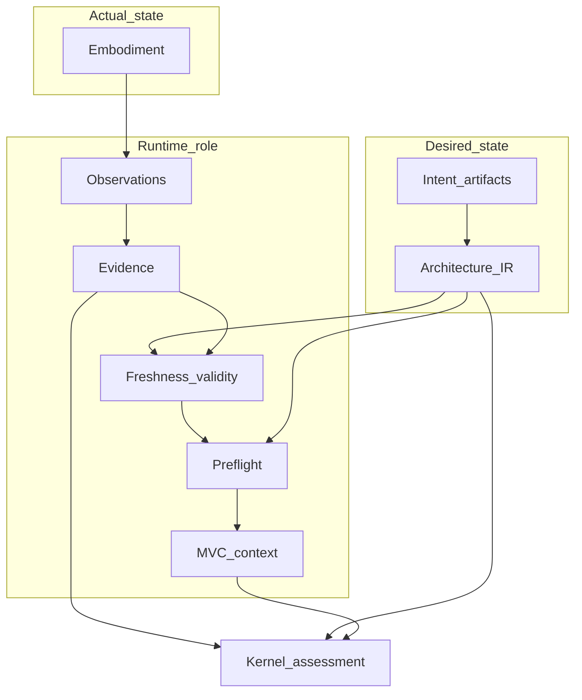

# The Runtime Model

## The Problem

Architecture discussions mix four different authorities—ADRs, **Architecture IR**, evidence, and projections—into one mental bucket labeled “the model.” When that happens, observation is mistaken for decision, **derived** files for **canonical** intent, and tooling for governance. No layer is left responsible for legible inputs to assessment, so the control loop degrades into informal opinion.

## The Reframe

**Runtime** is a named system role in STE. It sits between embodiment (actual systems) and **Kernel** (deterministic assessment and **Admission**), alongside compilation (intent → **Architecture IR**). Its mandate is observation, **ArchitectureEvidence**, surfacing freshness and validity, preflight, and context assembly—so compare and decide operate on legible state.

## Why this matters

If **Runtime** is unnamed, teams reinvent partial solutions: ad hoc logs, unscoped tests, stale graph caches, and prompts that assume current structure. Naming the model lets you review pipelines the same way you review ADRs and invariants: as parts of one control system.

## The Model

### Runtime in the feedback loop (observe → compare → decide → act)

| Loop phase | STE assignment (handbook level) |
|------------|----------------------------------|
| Observe | **Runtime** collects observations and packages evidence; tracks projection freshness and validity prerequisites. |
| Compare | **Kernel** evaluates **Architecture IR** against evidence and rules—not informal narrative. |
| Decide | **Kernel** emits machine-readable outcomes (**Admission** where defined); governance records policy decisions and exceptions. |
| Act | Delivery changes embodiment; intent and **Architecture IR** change through governed artifact workflows. |

**Runtime** makes the observe phase accountable; it does not substitute for compare or decide.

### Canonical vs derived vs observed (Runtime’s lens)

- **Canonical** intent (ADRs, invariants, requirements): **Runtime** does not author or supersede.
- **Architecture IR**: compiled from intent; **Runtime** binds **ArchitectureEvidence** to identities and traverses **Architecture IR** for context; **Runtime** does not replace compilation.
- **Observed** (evidence): what embodiment did under scope; **Runtime** structures and provenances it.
- **Derived** (projections, graph exports): **Runtime** enforces freshness and invalidation discipline so they are not mistaken for **canonical** records.

### Responsibilities (Runtime)

| Responsibility | Outcome |
|----------------|---------|
| Observation | Structured facts about embodiment and pipelines ([Evidence and Observation](08-02-evidence-and-observation.md)). |
| Evidence | EDR-shaped **ArchitectureEvidence**, addressable to **Architecture IR** and trace where policy requires. |
| Freshness and validity | Classification and bundle validity ([Freshness and Validity](08-03-freshness-and-validity.md)). |
| Preflight | Readiness gate before high-stakes reasoning ([Preflight and the Reasoning Gate](08-04-preflight-and-reasoning-gate.md)). |
| Context assembly | **MVC** bundles ([Context Assembly and Minimally Viable Context](08-05-context-assembly-and-mvc.md)). |
| Source-aware retrieval | References from derived context back to source artifacts, without copying canonical artifacts into runtime-owned graph state. |
| Graph discovery and compression | Derived workspace graph traversal and resolution-aware compression for bounded reasoning. |
| Context validation | Checks that bounded context remains faithful to the evidence, graph, provenance, and freshness baseline it was derived from. |

### Runtime data products (outputs)

**Runtime** emits typed outputs consumed by **Kernel**, governance tooling, humans, and AI tools. Exact envelopes and promotion boundaries live in **ste-spec** as contracts mature; the handbook names roles and authority discipline, not schema reference.

| Data product | Handbook role | Typical consumers |
|--------------|-----------------|---------------------|
| **ArchitectureEvidence** | Observed facts about embodiment, **Architecture IR**-addressable; non-decision-bearing | **Kernel**, governance audit, humans, AI tools |
| Freshness and validity classification | Whether evidence and bundles are usable together for an operation | **Kernel**, preflight, **MVC** path, humans, AI tools |
| Change and drift signals | Observation-side invalidation and reconciliation hints—not policy decisions | **Kernel**, governance, humans, AI tools |
| Preflight and readiness results | Outcome of the reasoning safety gate | **MVC** path, humans, AI tools; **Kernel** via handoff |
| Source references / locators | Runtime-owned references from graph entities and context entries back to source artifacts | Context assembly, traceability review, humans, AI tools |
| Correctness-first context baseline | Evidence, provenance, graph traversal, freshness, and negative-space material assembled before minimization | **MVC** derivation and validation |
| **MVC** bundles | Minimal **Architecture IR** slice, projection and evidence pointers, readiness metadata | **Kernel**, humans, AI tools |
| Projection and semantic graph updates | **Derived** views with lineage—not **canonical** **Architecture IR** | Humans, AI tools, **Kernel** as inputs, governance process |
| Runtime health and observation coverage | Pipeline health and whether scopes are observed | Preflight, **MVC** path, humans, governance, **Kernel** when bundled |
| Workspace graph slices and merged graph | Runtime-owned **derived** graph material assembled from per-repository observation and extraction | Humans, AI tools, projection builders; not a canonical IR substitute |
| Implementation attribution evidence | Extracted claims that embodiment declares ADR or invariant linkage | ADR-Kit validation, traceability review, EDR-style assessment |

### Workspace graph posture

When **Runtime** runs across multiple repositories, it may emit per-repo graph
slices, cross-repo edges, merged workspace graph material, and runtime
projection views—all **derived**, not substitutes for **Architecture IR**,
ADRs, or **Kernel** admission. Postures, merge semantics, compression
obligations, and a worked example are in [Semantic Graphs](../13-advanced-topics/13-01-semantic-graphs.md).

### Implementation attribution evidence

Implementation attribution evidence is the runtime-facing trace from
embodiment back to declared intent. A function, class, module, infrastructure
template, or adjacent artifact may declare that it implements an ADR or
enforces an invariant. **Runtime** extracts that claim and provenance; it does
not thereby prove the claim correct. ADR-Kit validates claims against
canonical ADR state; governance owns policy and human accountability.

### Source-aware context assembly

Source-aware retrieval lets **Runtime** carry references from derived graph
and context material back to the artifacts that own meaning: ADRs, invariants,
contracts, source files, and evidence records. The reference is a route, not a
copy of authority. It lets a context consumer inspect the source of a claim
without treating the runtime graph, a compressed projection, or an **MVC** bundle
as a new canonical store.

The current context model is therefore staged. **Runtime** first assembles a
correctness-first baseline from evidence, graph traversal, provenance,
freshness state, source references, and known negative space. It may then derive
a bounded **MVC** for the operation. Context validation checks whether the
bounded result still represents that baseline faithfully enough for the
declared scope. **Kernel** and governance still own assessment and decisions.

Components and internal flow from embodiment to emission: [Runtime Architecture Components and Flow](08-09-runtime-architecture-components-and-flow.md). Authority summary: [Runtime Overview](08-00-runtime-overview.md).

### What Runtime does not do

- Emit **Kernel** verdicts or **Admission** assessments ([Runtime–Kernel Contract](08-06-runtime-kernel-contract.md)).
- Act as compiler of record for **Architecture IR** ([Compilation](../04-architecture-model/04-04-compilation.md)).
- Replace governance policy or human accountability for intent.

### Consumers: humans and AI

Deterministic services and stochastic assistants consume **Runtime** outputs. Neither should be fed structural state that is stale or invalid under policy; **Runtime** supplies metadata and gates so violations are fail-visible where policy demands.

## The Implications

- Draw **Runtime** on architecture diagrams as a first-class block.
- Tie review criteria to evidence channels, freshness policy, and preflight—not only ADRs.
- Treat blur between **Runtime** and **Kernel** as an architecture smell.

## Relationship to STE system

- [Kernel overview](../07-kernel/07-00-overview.md), [Kernel and runtime](../07-kernel/07-08-kernel-and-runtime.md)
- [Architecture model (Architecture IR) overview](../04-architecture-model/04-00-architecture-ir-overview.md)
- [Artifact layer overview](../03-artifacts/03-00-artifact-layer-overview.md)
- [Runtime Architecture Components and Flow](08-09-runtime-architecture-components-and-flow.md)

## Summary

- **Runtime** is the observation-and-readiness layer: **ArchitectureEvidence**, classification, preflight, **MVC**, and the data products above.
- Source-aware retrieval gives runtime context a trace back to owning artifacts without making derived context canonical.
- Workspace graph slices and merged graphs are **derived** navigation surfaces across repositories; they do not replace canonical intent.
- Implementation attribution evidence records extracted intent claims from embodiment; ADR-Kit validation and governance own correctness, not **Runtime**.
- It enables **Kernel** determinism with typed, scoped inputs; it does not decide **Admission** or enforce governance policy.
- **Canonical**, compiled, **observed**, and **derived** stay distinct; **Runtime** guards the last two against silent drift.

The next chapter narrows to observation channels and how they become **ArchitectureEvidence**—before classification and gates.

**Next:** [Evidence and Observation](08-02-evidence-and-observation.md).
