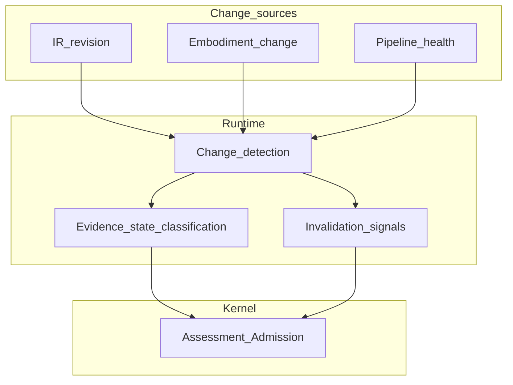

# Freshness and Validity

## The Problem

Teams routinely mix **ArchitectureEvidence**, projections, and **Architecture IR** without asking whether those inputs belong together for the operation at hand. A test run from last week, a graph export from yesterday’s build, and today’s **Architecture IR** can all be true in isolation yet unusable as a bundle for assessment or high-stakes reasoning. When that mismatch is silent, humans and models confabulate a coherent story from incompatible parts.

## The Reframe

Freshness names how current **observed** and **derived** material is relative to intent, **Architecture IR**, and the embodiment slice the operation claims. Validity names whether a set of inputs is permitted to be used together under policy: **Architecture IR** revision, evidence scope, projection build, toolchain health, and preflight prerequisites (preflight ordering and gate behavior are [Preflight and the Reasoning Gate](08-04-preflight-and-reasoning-gate.md)).

**Runtime** classifies evidence (and related readiness inputs) into the evidence state model below and emits change and invalidation signals. **Kernel** decides what those states mean for **Admission**, warnings, blocks, and other assessment outcomes under governance policy. **Runtime** does not make **Admission** decisions.

## Why this matters

Without a shared classification vocabulary, “stale” becomes a blame word instead of a typed property. Governance cannot attach exceptions to durable objects, and deterministic **Kernel** behavior cannot be specified when inputs are not described in comparable terms.

## The Model

### Evidence state classification (handbook level)

**Runtime** assigns each relevant evidence record or bundle (as policy defines granularity) a classification from this family. Exact encoding belongs to ste-spec; the handbook fixes meaning and authority.

| State | Meaning (handbook level) |
|-------|---------------------------|
| Fresh | Evidence is within policy freshness bounds for the declared scope and is consistent with the **Architecture IR** and projection identities the operation uses. |
| Stale-Unknown | Freshness cannot be established: missing timestamps, ambiguous scope, broken linkage, or pipeline gaps. |
| Stale-Confirmed | Evidence is known to be out of date relative to policy thresholds or to a confirmed change in **Architecture IR**, embodiment, or projection lineage. |
| Invalid | Evidence fails integrity or shape rules, conflicts with required **Architecture IR** bindings, or is not permitted in the bundle (for example, wrong scope or revoked provenance). |
| Missing / Not Observed | Required observation for the scope does not exist yet, or the channel did not run. Distinct from Stale-Unknown: absence is the primary fact. |

These states are **Runtime** judgments about inputs, not architectural verdicts. **Kernel** consumes classifications (and underlying **ArchitectureEvidence**) to apply policy.

### Runtime versus Kernel at this boundary

| Role | Responsibility |
|------|----------------|
| **Runtime** | Measure and label evidence and bundle readiness; emit change and invalidation signals tied to **Architecture IR** and embodiment events. |
| **Kernel** | Decide implications of those labels for assessment and **Admission** (where defined), under governance rules. |

Blurring this boundary produces verdict-like messages from observation pipelines or silent relabeling inside assessment code that hides observability debt.

### Validity as composition

Validity applies to combinations: **Architecture IR** revision R, evidence set E, projection build P, and operation scope S are valid together only when policy says they may be jointly used. A single Fresh record can sit in an invalid bundle if paired with the wrong **Architecture IR** or an out-of-date semantic graph export.

### Change detection and invalidation

Change detection (**Runtime**) notices events that require re-observation, rebuild of projections, or reclassification of evidence. Illustrative sources: intent or **Architecture IR** revision, embodiment change (deploy, config, dependency), observation channel failure or recovery, and scheduled staleness thresholds.

Invalidation is the signal that a previously published **derived** artifact or readiness conclusion should not be treated as current without recomputation. **Runtime** emits signals; it does not rewrite **canonical** **Architecture IR** or ADRs.

### Stale evidence and drift (roles)

When evidence is Stale-Confirmed or Stale-Unknown, **Runtime** must make that visible to preflight and context assembly ([Preflight and the Reasoning Gate](08-04-preflight-and-reasoning-gate.md)). Drift between intent / **Architecture IR** and embodiment is ultimately a governance and assessment story; **Runtime** supplies observation-side signals and classified evidence so **Kernel** and humans do not argue from hidden lag.

## The Implications

- Define policy for thresholds, required channels, and which operations require which states.
- Treat Stale-Unknown as first-class: forcing a binary fresh/stale hides observability gaps.
- Ensure invalidation propagates to projections and **MVC** consumers so **derived** views do not pose as current **Architecture IR**.

## Relationship to STE system

- [Evidence and Observation](08-02-evidence-and-observation.md)
- [Preflight and the Reasoning Gate](08-04-preflight-and-reasoning-gate.md)
- [Runtime–Kernel Contract](08-06-runtime-kernel-contract.md)
- [Governance Signals and Semantic Graph Lifecycle](08-07-governance-signals-and-semantic-graph-lifecycle.md)
- [Architecture model (Architecture IR) overview](../04-architecture-model/04-00-architecture-ir-overview.md)
- [Kernel and runtime](../07-kernel/07-08-kernel-and-runtime.md)

## Summary

- **Runtime** classifies evidence into Fresh, Stale-Unknown, Stale-Confirmed, Invalid, and Missing / Not Observed; **Kernel** decides what to do with those states under policy.
- Validity is a property of bundles of **Architecture IR**, evidence, and projections for a scoped operation.
- Change detection and invalidation are **Runtime** signals; they are not **Admission** or governance decisions.

The next chapter defines the preflight gate that consumes these classifications before **MVC** assembly.

**Next:** [Preflight and the Reasoning Gate](08-04-preflight-and-reasoning-gate.md).
