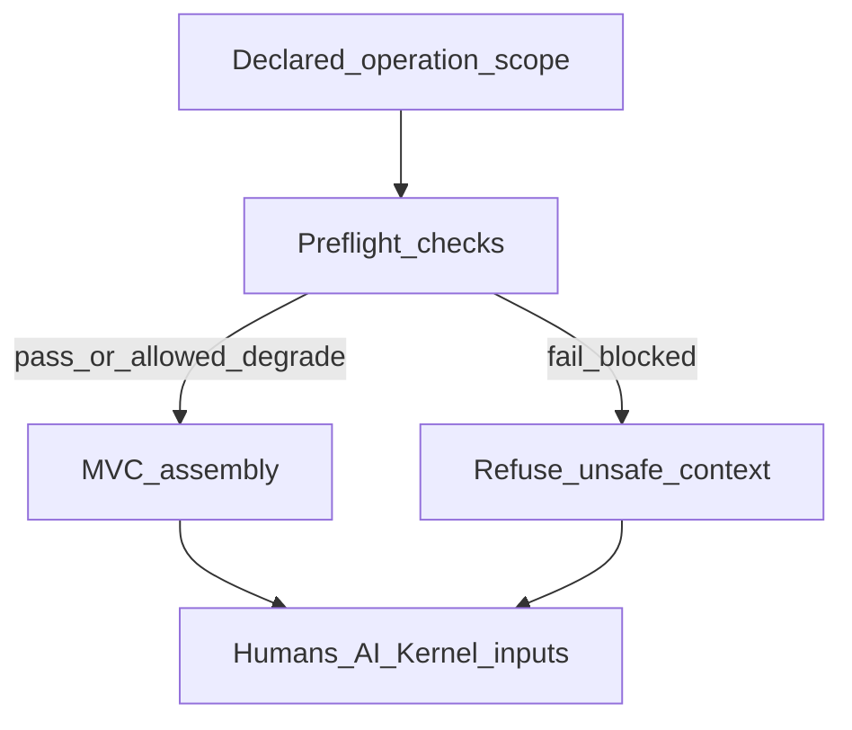

# Preflight and the Reasoning Gate

## The Problem

Expensive work—large-scale refactors, security reviews, automated reasoning over architecture, and high-stakes commits—often starts without a hard check that inputs are safe to think with. Tooling may assemble context from cached graphs, partial test results, and unscoped telemetry. The failure mode is not only wrong answers but credible wrong answers: reasoning that fits the prompt while contradicting governed **Architecture IR** and **ArchitectureEvidence**.

## The Reframe

Preflight is a reasoning safety gate, not a convenience shortcut. It is an ordered set of checks that must succeed (or explicitly degrade within policy) before **Runtime** assembles minimally viable context (**MVC**) for humans, services, or AI tools. Its purpose is to refuse bundles that would privilege stale, invalid, or incomplete structural state as if it were authoritative.

Evidence states (Fresh, Stale-Unknown, Stale-Confirmed, Invalid, Missing / Not Observed) are defined in [Freshness and Validity](08-03-freshness-and-validity.md); preflight consumes those classifications—it does not redefine them.

## Why this matters

Reasoning safety is a system property. Without preflight, assistants and operators become the accidental integrity layer, re-deriving freshness and validity by hand under time pressure. Governance cannot rely on replayable assessment when the context that entered reasoning was never eligible to be combined.

## The Model

### What preflight must answer

For a declared operation and scope, preflight asks at least:

1. Is **Architecture IR** available and valid for this scope (correct revision, compilation health, required linkage present)?
2. Is **ArchitectureEvidence** fresh enough for this operation under policy, and are evidence states known ([Freshness and Validity](08-03-freshness-and-validity.md))?
3. Are projections and semantic graph views up to date relative to **Architecture IR** and invalidation signals that apply?
4. Is **Runtime** healthy and is observation coverage sufficient for the obligations this operation touches?
5. Are there known invalid or missing evidence areas that must be surfaced rather than papered over?

Answers are **Runtime** readiness outcomes—inputs to **MVC** and to **Kernel** via typed handoff—not **Admission** decisions.

### Failure behavior: fail-visible, refuse unsafe MVC

When preflight fails or degrades beyond what policy allows:

- **Runtime** must not assemble **MVC** that implies a complete or current picture when inputs do not support that implication.
- Outcomes must be fail-visible: explicit reasons (which check, which state, which scope gap), not silent omission or generic errors.
- Consumers must not treat invalid or stale architectural state as authoritative for reasoning or action merely because a tool returned something.

Policy may allow degraded modes (for example, exploratory read-only context with labeled states) where governance explicitly permits risk; such modes must still label Stale-Unknown, Missing, or Invalid inputs clearly.

### Relationship to AI and human participation

The same gate protects human and machine consumers. AI tools amplify confident error when context is wrong; preflight is a structural counterweight, not a prompt trick.

### Ordering

Checks should follow a stable order defined by policy (for example: **Architecture IR** presence, **Runtime** health, evidence states, projections, coverage). Early failure avoids wasted work and keeps diagnostics attributable.

## The Implications

- Treat preflight as part of reviewable architecture: teams should be able to audit what was eligible to enter reasoning for a change or incident.
- Align CI and local workflows so high-stakes paths invoke the same gate, not a weaker subset.
- Do not relocate **Admission** logic into preflight to fail fast; **Kernel** remains the authority for assessment outcomes.

## Relationship to STE system

- [Freshness and Validity](08-03-freshness-and-validity.md)
- [Context Assembly and Minimally Viable Context](08-05-context-assembly-and-mvc.md)
- [Runtime–Kernel Contract](08-06-runtime-kernel-contract.md)
- [Runtime Architecture Components and Flow](08-09-runtime-architecture-components-and-flow.md)
- [Runtime Overview](08-00-runtime-overview.md)

## Summary

- Preflight is a reasoning safety gate that answers readiness questions about **Architecture IR**, **ArchitectureEvidence**, projections, **Runtime** health, and known gaps.
- On failure, **Runtime** refuses to assemble misleading **MVC** and reports fail-visible outcomes.
- Preflight protects human and AI reasoning; it does not replace **Kernel** **Admission** or governance policy.

The next chapter defines what **MVC** contains once the gate allows assembly.

**Next:** [Context Assembly and Minimally Viable Context](08-05-context-assembly-and-mvc.md).
