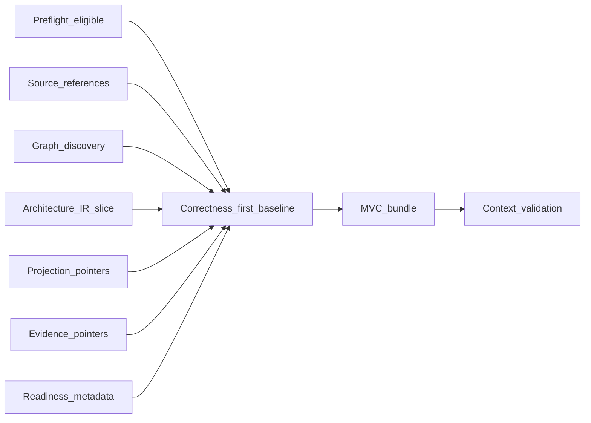

# Context Assembly and Minimally Viable Context

## The Problem

Context for architecture work is unbounded: entire repositories, historical diagrams, and years of chat. Feeding everything into assessment or assistant sessions is slow and unsafe; feeding an ad hoc slice is fast and often wrong. Without a disciplined assembly rule, teams cannot tell whether a conclusion was derived from a governed minimal set or from convenient scraps.

## The Reframe

Minimally viable context (**MVC**) is the bounded context derived from a
correctness-first runtime assembly: evidence, source references, graph
traversal, provenance, freshness state, and known negative space for a declared
operation and scope. **Runtime** assembles that baseline after preflight
eligibility ([Preflight and the Reasoning Gate](08-04-preflight-and-reasoning-gate.md)),
then derives the smallest context bundle policy says is sufficient. **MVC** is
an input product to **Kernel**, humans, and tools; it is not a verdict.

The catalog of **Runtime** outputs (including **MVC**) is in [The Runtime Model](08-01-the-runtime-model.md); this chapter defines assembly only.

## Why this matters

Deterministic **Kernel** behavior and replayable governance require assessment
inputs to be bounded and described. The context path therefore has two
responsibilities: assemble enough material to be correct, then derive only
enough context to reason safely. **MVC** names the bounded result, not the whole
evidence baseline.

## The Model

### Assembly stages

At handbook level, context assembly has a stable shape:

1. Establish preflight eligibility for the operation and scope.
2. Discover relevant graph neighborhoods and source references.
3. Assemble a correctness-first baseline of evidence, provenance, freshness,
   traceability, graph context, and known gaps.
4. Compress or project derived graph material only where it preserves
   traceability and scope labels.
5. Derive bounded **MVC** from the baseline.
6. Validate that the bounded context remains faithful to the baseline and does
   not hide freshness, provenance, or negative-space concerns.

These are conceptual stages, not a wire-format contract. Exact envelopes belong
in **ste-spec** only when a runtime surface is deliberately promoted.

### What MVC contains (handbook level)

An **MVC** bundle typically includes:

- A scoped slice of **Architecture IR** (entities, relationships, and metadata needed to interpret them for the task).
- Source references or locators that route context entries back to canonical artifacts and source files without duplicating those artifacts into runtime context.
- Pointers to projections or semantic graph views built from declared lineage—not embedded **canonical** **Architecture IR** duplicates masquerading as sources.
- Pointers to **ArchitectureEvidence** (or equivalent records) relevant to the scope, with classification states visible ([Freshness and Validity](08-03-freshness-and-validity.md)).
- Provenance and traceability metadata showing how selected context relates to the evidence and graph baseline.
- Readiness metadata: preflight outcomes, **Runtime** health and observation coverage notes, freshness state, and explicit labels for missing, invalid, partial, or negative-space areas.

Exact envelopes are **ste-spec**; the handbook requires minimalism, addressability, and honest labeling.

### Assembly rules

- **MVC** assembly runs only when preflight permits the operation (or a declared degraded mode).
- Assembly algorithms should be policy-driven (obligations, scope, risk tier) so automation does not silently widen context.
- **MVC** may be assembled for a single concern or for a composite operation that legitimately surfaces multiple personas, domains, or risk lenses. Minimality is measured against the declared operation, scope, policy obligations, and reasoning safety requirements. It is not limited to the context needs of one persona. When multiple concern lenses are active, **Runtime** must preserve inclusion rationale, deduplicate overlapping context, and keep omitted or negative-space material visible where it affects safe reasoning.
- Source-aware retrieval should prefer references over copies when the source artifact remains the authority.
- Semantic compression must preserve enough provenance for consumers to explain what was selected, omitted, or collapsed.
- Negative-space and partial-state signals must remain visible when they affect whether the context is safe to reason from.
- **MVC** must not embed **Admission** results or governance decisions; those belong to **Kernel** and governance records.

### Consumers

| Consumer | Use of MVC |
|----------|------------|
| **Kernel** | Typed input to Query, Explain, Coverage, **Admission** workloads |
| Humans | Review, design, incident response with bounded material |
| AI tools | Reasoning and editing assistance under the same bounds as humans |

### Anti-patterns

- Smuggling verdicts into **MVC** as if they were facts (for example, informal “approved” tags without **Kernel** provenance).
- Omitting Stale-Unknown or Missing states to make context look clean.
- Treating a projection file as **ArchitectureEvidence** without packaging it under observation rules ([Evidence and Observation](08-02-evidence-and-observation.md)).
- Copying canonical artifacts into runtime-owned context bundles when a source reference would preserve authority more cleanly.
- Treating graph traversal or compression as proof that omitted material is irrelevant.

## The Implications

- Publish **MVC** policies alongside evidence channel requirements so teams know what “enough” means for each operation class.
- Test assembly the same way you test pipelines: fixed scopes, expected pointers, forbidden leakage across boundaries.
- Prefer pointers over copies where freshness and lineage must stay tied to authoritative stores.
- Treat context validation as a guard against misleading minimization, not as a substitute for **Kernel** assessment.

## Relationship to STE system

- [Preflight and the Reasoning Gate](08-04-preflight-and-reasoning-gate.md)
- [Runtime–Kernel Contract](08-06-runtime-kernel-contract.md)
- [The Runtime Model](08-01-the-runtime-model.md)
- [Semantic Graphs](../13-advanced-topics/13-01-semantic-graphs.md)
- [Projections](../04-architecture-model/04-09-projections.md)
- [Evidence](../03-artifacts/03-05-evidence.md)

## Summary

- **MVC** is derived from a correctness-first runtime baseline, then bounded for a scoped operation.
- Source-aware context uses references to authoritative artifacts rather than turning runtime bundles into canonical stores.
- Provenance, traceability, freshness, and negative-space signals must survive minimization.
- **MVC** feeds **Kernel**, humans, and AI tools; it does not replace **Kernel** **Admission** or governance.
- Good assembly is policy-bound, fail-visible on gaps, and free of smuggled verdicts.

The next chapter pins the **Runtime**–**Kernel** handoff and boundary so assessment inputs stay non-decision-bearing on the **Runtime** side.

**Next:** [Runtime–Kernel Contract](08-06-runtime-kernel-contract.md).
