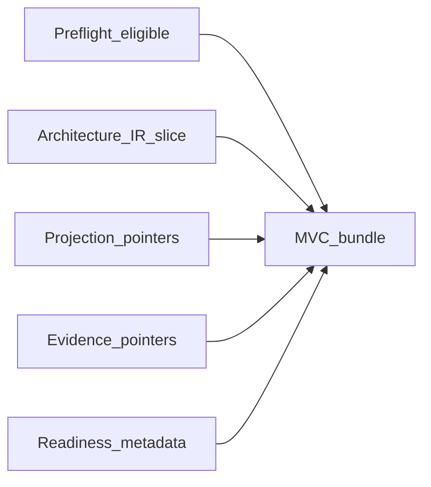

# Context Assembly and Minimally Viable Context

## The Problem

Context for architecture work is unbounded: entire repositories, historical diagrams, and years of chat. Feeding everything into assessment or assistant sessions is slow and unsafe; feeding an ad hoc slice is fast and often wrong. Without a disciplined assembly rule, teams cannot tell whether a conclusion was derived from a governed minimal set or from convenient scraps.

## The Reframe

Minimally viable context (**MVC**) is the smallest bundle of **Architecture IR**, projection pointers, and **ArchitectureEvidence** pointers—plus readiness metadata—that policy says is sufficient for a declared operation and scope. **Runtime** assembles **MVC** after preflight eligibility ([Preflight and the Reasoning Gate](08-04-preflight-and-reasoning-gate.md)). **MVC** is an input product to **Kernel**, humans, and tools; it is not a verdict.

The catalog of **Runtime** outputs (including **MVC**) is in [The Runtime Model](08-01-the-runtime-model.md); this chapter defines assembly only.

## Why this matters

Deterministic **Kernel** behavior and replayable governance require assessment inputs to be bounded and described. **MVC** is how STE names that bundle so the same operation can be re-run with the same typed footprint.

## The Model

### What MVC contains (handbook level)

An **MVC** bundle typically includes:

- A scoped slice of **Architecture IR** (entities, relationships, and metadata needed to interpret them for the task).
- Pointers to projections or semantic graph views built from that **Architecture IR** lineage—not embedded **canonical** **Architecture IR** duplicates masquerading as sources.
- Pointers to **ArchitectureEvidence** (or equivalent records) relevant to the scope, with classification states visible ([Freshness and Validity](08-03-freshness-and-validity.md)).
- Readiness metadata: preflight outcomes, **Runtime** health and observation coverage notes, and explicit labels for missing or invalid areas.

Exact envelopes are ste-spec; the handbook requires minimalism, addressability, and honest labeling.

### Assembly rules

- **MVC** assembly runs only when preflight permits the operation (or a declared degraded mode).
- Assembly algorithms should be policy-driven (obligations, scope, risk tier) so automation does not silently widen context.
- **MVC** must not embed **Admission** results or governance decisions; those belong to **Kernel** and governance records.

### Consumers

| Consumer | Use of MVC |
|----------|------------|
| **Kernel** | Typed input to Query, Explain, Coverage, **Admission** workloads |
| Humans | Review, design, incident response with bounded material |
| AI tools | Reasoning and editing assistance under the same bounds as humans |

### Anti-patterns

- Smuggling verdicts into **MVC** as if they were facts (for example, informal “approved” tags without **Kernel** provenance).
- Omitting Stale-Unknown or Missing states to make context look clean.
- Treating a projection file as **ArchitectureEvidence** without packaging it under observation rules ([Evidence and Observation](08-02-evidence-and-observation.md)).

## The Implications

- Publish **MVC** policies alongside evidence channel requirements so teams know what “enough” means for each operation class.
- Test assembly the same way you test pipelines: fixed scopes, expected pointers, forbidden leakage across boundaries.
- Prefer pointers over copies where freshness and lineage must stay tied to authoritative stores.

## Relationship to STE system

- [Preflight and the Reasoning Gate](08-04-preflight-and-reasoning-gate.md)
- [Runtime–Kernel Contract](08-06-runtime-kernel-contract.md)
- [The Runtime Model](08-01-the-runtime-model.md)
- [Evidence](../03-artifacts/03-05-evidence.md)

## Summary

- **MVC** is **Runtime**-assembled, post-preflight, minimal context for a scoped operation: **Architecture IR** slice, projection and **ArchitectureEvidence** pointers, readiness metadata.
- **MVC** feeds **Kernel**, humans, and AI tools; it does not replace **Kernel** **Admission** or governance.
- Good assembly is policy-bound, fail-visible on gaps, and free of smuggled verdicts.

The next chapter pins the **Runtime**–**Kernel** handoff and boundary so assessment inputs stay non-decision-bearing on the **Runtime** side.

**Next:** [Runtime–Kernel Contract](08-06-runtime-kernel-contract.md).
