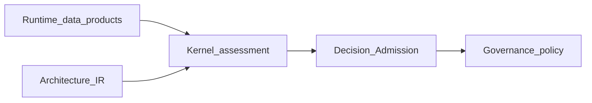

# Runtime–Kernel Contract

## The Problem

Without a sharp contract between **Runtime** and **Kernel**, systems smuggle verdicts through evidence pipelines or push assessment logic into observation layers. The failure modes are double authority (two places deciding) and missing authority (no place deterministically closing the loop). Neither governance nor automation can replay arguments when the boundary is porous.

## The Reframe

**Runtime** emits the data products defined in [The Runtime Model](08-01-the-runtime-model.md). **Kernel** consumes **Architecture IR** plus those **Runtime** outputs (and policy inputs as scoped) to perform deterministic Query, Explain, Coverage, and **Admission** where defined. Component-level emission is described in [Runtime Architecture Components and Flow](08-09-runtime-architecture-components-and-flow.md).

**ArchitectureEvidence** and readiness metadata are non-decision-bearing at the handoff: they state what was observed and classified, not whether the system may proceed under governance.

## Why this matters

Implementations interoperate at contracts. If handoff fields mix facts and decisions, consumers cannot know which parts must agree for replay and which parts require human or policy interpretation.

## The Model

### Handoff bundle (conceptual)

For a scoped operation, the **Kernel** side expects at least:

- **Architecture IR** at a declared revision or identity consistent with compilation governance.
- **ArchitectureEvidence** bound to **Architecture IR** identities and trace as policy requires, with **Runtime**-assigned evidence states ([Freshness and Validity](08-03-freshness-and-validity.md)).
- Preflight and readiness outcomes and **MVC** when the workload uses assembled context ([Preflight and the Reasoning Gate](08-04-preflight-and-reasoning-gate.md), [Context Assembly and Minimally Viable Context](08-05-context-assembly-and-mvc.md)).
- Pointers or artifacts for projections and semantic graph views when assessment depends on **derived** material, including lineage metadata sufficient to detect staleness.

ste-spec names exact schemas and optional fields; the handbook fixes separation of roles.

### Authority at the boundary

Full STE authority table (ADRs, ste-spec, **Architecture IR**, **Runtime**, **Kernel**, governance, people): [Runtime Overview](08-00-runtime-overview.md).

At this boundary specifically: **Kernel** decides what evidence states imply for **Admission** and warnings; **Runtime** does not.

### Failure attribution

| Failure kind | Typical locus | Handbook response |
|--------------|---------------|-------------------|
| Broken observation, misclassification, bad **MVC** assembly | **Runtime** | Repair pipelines and readiness; do not fake validity in **Kernel** |
| Policy or rule evaluation, **Admission** outcomes | **Kernel** | Adjust rules, scopes, or inputs; separate from observation debt |
| Authorization to change intent or exceptions | Governance | Explicit records and lifecycle moves |

## The Implications

- Lint APIs and payloads for forbidden verdict fields on the **Runtime** side of the boundary.
- Version handoff contracts with ste-spec revisions; do not informally extend envelopes per tool.
- Document which **Kernel** operations require **MVC** versus raw **Architecture IR** plus evidence for determinism experiments.

## Relationship to STE system

- [Kernel overview](../07-kernel/07-00-overview.md), [Kernel and runtime](../07-kernel/07-08-kernel-and-runtime.md), [Kernel inputs and outputs](../07-kernel/07-04-kernel-inputs-and-outputs.md)
- [Evidence](../03-artifacts/03-05-evidence.md)
- [Governance Signals and Semantic Graph Lifecycle](08-07-governance-signals-and-semantic-graph-lifecycle.md)
- [Runtime Overview](08-00-runtime-overview.md)

## Summary

- **Runtime** hands off typed observation products and readiness metadata; **Kernel** performs assessment and **Admission** where defined.
- Evidence at the boundary is non-decision-bearing; verdicts belong to **Kernel** under governance policy.
- Failures are attributed to **Runtime**, **Kernel**, or governance distinctly so remediation matches authority.

The next chapter covers **derived** projections and semantic graph lifecycle—and governance-facing signals—without collapsing them into **Architecture IR**.

**Next:** [Governance Signals and Semantic Graph Lifecycle](08-07-governance-signals-and-semantic-graph-lifecycle.md).
