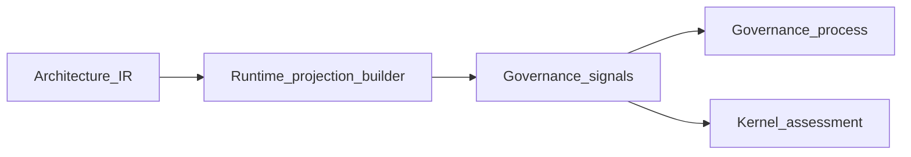

# Governance Signals and Semantic Graph Lifecycle

## The Problem

Projections—including semantic graph exports and registry views—are easy to treat as the architecture. They are not **Architecture IR**; they are **derived** artifacts subject to staleness, partial coverage, and tool bias. When governance cannot see signals about projection health and invalidation, reviews debate pictures disconnected from compiled intent and observed embodiment.

## The Reframe

**Runtime** updates projections and semantic graph material under invalidation rules and emits governance signals that governance and **Kernel** consumers use for risk and process decisions. **Runtime** does not enforce governance policy or authorize change; enforcement is policy plus **Kernel** outcomes plus human accountability in the control loop.

## Why this matters

Honest **derived** views are necessary for human alignment with **Architecture IR**; dishonest views corrupt downstream conversation. Semantic graph lifecycle—build, version, expose, retire—must be as reviewable as evidence channels.

## The Model

This chapter moves in four steps: what **derived** views are (and are not), how they live over time, what signals **Runtime** emits to governance, and where enforcement authority sits.

### Derived views versus Architecture IR

| Object | Role |
|--------|------|
| **Architecture IR** | Canonical compiled structural model for the architecture layer—not produced by **Runtime**. |
| Projections / semantic graph views | **Derived** representations for tools and humans; trace lineage to substrate and, where applicable, to **Architecture IR** identities. |

**Runtime** orchestrates rebuild and publication of **derived** material when change detection fires ([Freshness and Validity](08-03-freshness-and-validity.md)); compilation of **Architecture IR** from intent remains outside **Runtime** authority.

### Projection and semantic graph lifecycle

STE treats derived views as lifecycle-managed artifacts. [Projections](../04-architecture-model/04-09-projections.md) names two projection lineages that share discipline but differ in substrate; this chapter covers how **Runtime** participates in their lifecycle.

Shared stages for both lineages:

- Stamp with identity and lineage metadata sufficient for staleness checks.
- Serve read-only consumers through APIs or artifacts without implying **canonical** supremacy over **Architecture IR**.
- Retire or supersede when policy marks them obsolete.

Build and invalidation inputs differ by path:

| Path | Substrate | Typical invalidation triggers |
| --- | --- | --- |
| **IR-anchored projections** | Compiled **Architecture IR** snapshot (plus projection configuration) | **Architecture IR** revision, compilation or linking events, policy-defined export pipeline failures |
| **Runtime workspace projections** | Per-repository graph slices, cross-repo edges, merged workspace graph material, multi-resolution projection files | Embodiment and extraction events, RECON or observation failures, slice validation failures, partial merge state |

**Runtime** orchestrates the workspace path directly and may participate in IR-anchored rebuild triggers when change detection ties invalidation to **Architecture IR** identities ([Freshness and Validity](08-03-freshness-and-validity.md)). Compilation of **Architecture IR** from intent remains outside **Runtime** authority in either path.

On the workspace path, intermediate products help humans and tools navigate embodiment across repository boundaries. Their governance value comes from lineage and freshness, not from authority. A stale or partial merged graph is a signal to surface, not a fact to silently reason from.

### Governance-facing signals

**Runtime** emits observation-side governance signals such as:

- Projection staleness or failed rebuild.
- Partial workspace graph construction or failed slice validation.
- Gaps in observation coverage for obligations in scope.
- Invalid or missing evidence clusters affecting certification narratives.
- Change or drift hints tied to **Architecture IR** identities (not verdicts on whether drift is acceptable).

Governance interprets signals into process requirements, exceptions, or lifecycle holds. **Kernel** may consume the same signals as inputs to assessment when policy scopes them there.

### Enforcement boundary

- **Runtime** does not block merges, waive rules, or grant exceptions.
- Enforcement paths run through governance policy machinery and **Kernel** assessment outcomes where automated gates exist.

## The Implications

- Name owners for projection pipelines with the same seriousness as test suites.
- Require lineage on every semantic graph artifact used in review or **MVC**.
- Separate “signal raised” from “decision made” in runbooks and UI copy.

## Relationship to STE system

- [Projections](../04-architecture-model/04-09-projections.md) (IR-anchored versus runtime workspace lineages)
- [Architecture model (Architecture IR) overview](../04-architecture-model/04-00-architecture-ir-overview.md)
- [Runtime–Kernel Contract](08-06-runtime-kernel-contract.md)
- [Preflight and the Reasoning Gate](08-04-preflight-and-reasoning-gate.md), [Context Assembly and Minimally Viable Context](08-05-context-assembly-and-mvc.md)
- [The governance model](../06-governance/06-02-the-governance-model.md)

## Summary

- Semantic graph and projections are **derived**; **Runtime** manages lifecycle signals and updates under invalidation rules for both IR-anchored and runtime workspace lineages.
- Governance consumes **Runtime** governance signals for process and risk; **Runtime** does not enforce policy.
- Enforcement combines governance rules, **Kernel** assessment, and human judgment—not observation alone.

The next chapter shifts to operations: when **Runtime** runs, how failures appear, and how degradation stays visible.

**Next:** [Runtime Lifecycle, Failure Modes, and Degradation](08-08-runtime-lifecycle-failure-modes-and-degradation.md).
