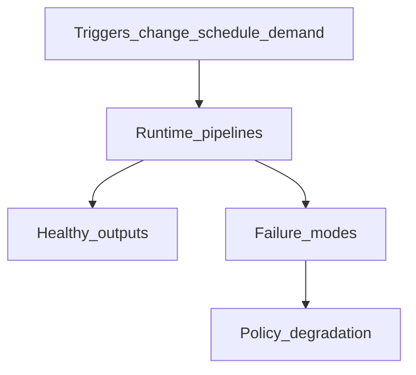

# Runtime Lifecycle, Failure Modes, and Degradation

## The Problem

**Runtime** work is often invisible until something burns: missing evidence, silent staleness, or tools that keep working while returning misleading context. Without explicit lifecycle triggers and named failure modes, teams cannot tell whether the observation layer ran, whether its outputs are trustworthy, or how to degrade safely under pressure.

## The Reframe

**Runtime** runs on triggers tied to embodiment and intent change, schedules, and on-demand requests. Failure modes must map to visible states—not silent success. Degradation is policy-defined: which operations may continue with labeled gaps, and which must stop at preflight ([Preflight and the Reasoning Gate](08-04-preflight-and-reasoning-gate.md)). Evidence states and bundle validity are defined in [Freshness and Validity](08-03-freshness-and-validity.md).

## Why this matters

Reasoning safety depends on knowing when you do not know. Lifecycle clarity turns **Runtime** from magic into an inspectable subsystem with NFRs teams can test.

## The Model

### When Runtime runs (illustrative triggers)

| Trigger class | Examples (generic) |
|---------------|-------------------|
| Embodiment change | Deploy, config push, dependency update, infra mutation |
| Intent or **Architecture IR** change | ADR merge, compilation to new **Architecture IR** revision |
| Scheduled cadence | Nightly reconciliation, periodic graph rebuild |
| On-demand | Developer request, pre-merge check, incident runbook step |
| Downstream consumer | **Kernel** assessment job, **MVC** assembly for a scoped operation |

Policy chooses which triggers apply to which scopes; ste-spec may standardize hooks.

### Canonical flow reminder

Embodiment → **Runtime** → Evidence → **Kernel** → Decision → Governance is the ordering for assessment readiness: **Runtime** must produce evidence and readiness metadata before **Kernel** decisions consume them for the same scope where preflight applies.

### Failure modes (handbook catalog)

| Mode | Description | Desired visibility |
|------|-------------|-------------------|
| Observation gap | Channel did not run or cannot see scope | Missing / Not Observed states; observation coverage metadata |
| Ambiguous evidence | Conflicting inputs or unstable provenance | Invalid or Stale-Unknown with reason codes |
| Pipeline break | Builder, store, or transport fault | **Runtime** health signals; fail preflight when required |
| Partial scope | Only subset of obligations observed | Explicit partiality in **MVC** metadata |
| Gate failure | Preflight check does not pass | Refuse unsafe **MVC**; fail-visible diagnostics |
| Silent success (anti-pattern) | Tool returns data without freshness truth | Forbidden by design; prefer explicit unknowns |

### Degradation principles

- Labeled degradation only: never imply Fresh when Stale-Unknown is honest.
- Separate human override paths (governance) from automatic “best effort” context for machines.
- Record which degraded mode was used when outcomes feed audit or **Kernel** replay.

### Design principles and NFRs (handbook level)

These are architectural principles, not vendor SLAs:

- Determinism where specified: classification and preflight outcomes should be repeatable for the same inputs and policy version.
- Provenance by default: **ArchitectureEvidence** without traceable source and scope is incomplete, not minimal.
- Least-surprise context: **MVC** assembly should minimize hidden widening of scope.
- Latency as policy: fresh data costs time; policy states tradeoffs per operation tier.
- Observability of **Runtime**: operators can inspect pipeline health, queue depth, last successful observation per scope.
- Security boundaries for evidence: tamper evidence, access controls, and separation from **Kernel** rule stores where policy requires.

## The Implications

- Exercise failure drills that disable channels and verify preflight blocks unsafe **MVC**.
- Publish SLOs for observation freshness as governance choices, then instrument them.
- Avoid merging **Runtime** health into **Kernel** binaries without clear API separation.

## Relationship to STE system

- [Freshness and Validity](08-03-freshness-and-validity.md)
- [Preflight and the Reasoning Gate](08-04-preflight-and-reasoning-gate.md)
- [Runtime Architecture Components and Flow](08-09-runtime-architecture-components-and-flow.md)
- [Evidence and observation](../05-lifecycle/05-04-evidence-and-observation.md)
- [Kernel and runtime](../07-kernel/07-08-kernel-and-runtime.md)

## Summary

- **Runtime** runs on change, schedule, and demand triggers aligned to policy and scope.
- Failure modes must surface as typed states and health signals, not silent success.
- Degradation is explicit and governance-aware; NFRs make **Runtime** testable and inspectable.

The closing chapter maps these responsibilities to logical components and flows for implementers.

**Next:** [Runtime Architecture Components and Flow](08-09-runtime-architecture-components-and-flow.md).
