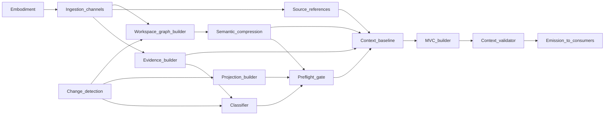

# Runtime Architecture Components and Flow

## The Problem

Teams implement observation piecemeal—one CI job, one graph export, one assistant plugin—without a logical architecture that shows how embodiment becomes **ArchitectureEvidence**, how readiness is classified, and how products reach the **Kernel**. The result is hidden coupling, duplicate classification logic, and handoffs that mix facts with verdicts.

## The Reframe

**Runtime** is an observation and readiness subsystem with named components. This chapter maps ingestion through emission for implementers, aligned with Embodiment → **Runtime** → Evidence → **Kernel** → Decision → Governance. ste-spec defines contracts; the handbook defines responsibilities and flow.

The **Runtime** role, responsibility table, and data product catalog are in [The Runtime Model](08-01-the-runtime-model.md); they are not repeated here.

## Why this matters

Implementability requires stable boundaries between components and consumers. Without that map, preflight, **MVC**, and **Kernel** integration become one-off integrations that drift from policy.

## The Model

### Logical components

| Component | Responsibility |
|-----------|----------------|
| Observation channels / ingestion | Collect structured observations from embodiment and toolchains (tests, telemetry, reconciliation, health probes—illustrative). |
| Evidence builder / normalization | Promote observations to **ArchitectureEvidence** with provenance, scope, and **Architecture IR** bindings ([Evidence and Observation](08-02-evidence-and-observation.md)). |
| Source-aware retrieval | Maintain references from runtime graph and context material back to owning artifacts without turning retrieved material into runtime authority. |
| Freshness and validity classifier | Assign evidence states and evaluate bundle validity ([Freshness and Validity](08-03-freshness-and-validity.md)). |
| Change detection | Detect events that require re-observation, invalidation, or reclassification; emit change and drift signals (observation-side, not policy decisions). |
| Projection / semantic graph builder | Rebuild and publish **derived** views from declared **Architecture IR** lineage ([Governance Signals and Semantic Graph Lifecycle](08-07-governance-signals-and-semantic-graph-lifecycle.md)). |
| Workspace graph builder | Assemble per-repository slices, cross-repo edges, and merged workspace graph material as runtime-owned **derived** state. |
| Semantic compression / projection renderer | Produce deterministic multi-resolution projections while preserving traceability to source graph material. |
| Preflight gate | Run reasoning safety checks before **MVC** assembly ([Preflight and the Reasoning Gate](08-04-preflight-and-reasoning-gate.md)). |
| Context baseline assembler | Gather evidence, source references, graph traversal context, provenance, freshness, and negative-space signals before minimization. |
| Context (**MVC**) builder | Derive minimally viable context when preflight permits ([Context Assembly and Minimally Viable Context](08-05-context-assembly-and-mvc.md)). |
| Context validator | Check that bounded context remains faithful to the baseline and does not hide provenance, freshness, or known gaps. |
| Contract / data product emission | Publish typed outputs to **Kernel**, governance tooling, humans, and AI consumers per **ste-spec** ([Runtime–Kernel Contract](08-06-runtime-kernel-contract.md)). |

**Runtime** is not a decision or policy enforcement node: it emits products and governance signals; **Kernel** and governance own assessment and control.

### Main internal data flow

For a typical scoped operation:

Embodiment → Observation → **ArchitectureEvidence** and source references → derived graph discovery → compression / projection → Classification → Preflight → context baseline → **MVC** derivation → validation → **Kernel** handoff

- Embodiment feeds ingestion and channels.
- The evidence builder produces durable **ArchitectureEvidence**.
- Source-aware retrieval keeps context entries traceable to owning artifacts without copying authority into runtime state.
- The classifier and change detection label readiness and emit signals.
- The projection builder refreshes **derived** views when invalidation requires it.
- The workspace graph builder can merge repository slices and cross-repo edges into a derived graph for workspace-level queries.
- The semantic compression layer can render multiple projection resolutions from the same graph material.
- The preflight gate blocks unsafe assembly.
- The context baseline assembler gathers enough evidence, provenance, source references, graph context, and negative-space information to support faithful minimization.
- The **MVC** builder derives bounded context for consumers.
- The context validator checks that the bounded result remains traceable and honest about freshness, scope, and omissions.
- Emission delivers products to **Kernel** and others without **Admission** verdicts.

The diagram below shows both projection lineages from [Projections](../04-architecture-model/04-09-projections.md)—IR-anchored and runtime workspace—converging at preflight before **MVC** assembly.

### Consumers (downstream)

| Consumer | Typical inputs from **Runtime** |
|----------|--------------------------------|
| **Kernel** | **ArchitectureEvidence**, classifications, **MVC**, projection pointers, readiness metadata, plus **Architecture IR** from compilation |
| Governance | Governance signals (staleness, observation coverage gaps, invalidation), audit-friendly evidence pointers |
| Humans | **MVC**, projections, diagnostics from preflight |
| AI tools | **MVC** and labeled readiness metadata under the same gates as humans |

## The Implications

- Implement each component behind clear APIs so policy can move without rewriting pipelines end to end.
- Centralize classification and preflight ordering per policy version to preserve determinism claims.
- Test emission schemas against ste-spec fixtures before shipping **Kernel** integrations.

## Relationship to STE system

- [The Runtime Model](08-01-the-runtime-model.md), [Runtime Overview](08-00-runtime-overview.md)
- [Semantic Graphs](../13-advanced-topics/13-01-semantic-graphs.md), [Projections](../04-architecture-model/04-09-projections.md)
- [Kernel and runtime](../07-kernel/07-08-kernel-and-runtime.md)
- [Architecture model (Architecture IR) overview](../04-architecture-model/04-00-architecture-ir-overview.md)

## Summary

- **Runtime** decomposes into ingestion, evidence building, source-aware retrieval, classification, change detection, derived-view build, preflight, context baseline assembly, **MVC** derivation, validation, and emission.
- Workspace graph and semantic compression components extend projection build for multi-repository reasoning while remaining derived-state producers.
- Internal flow runs Embodiment → Observation → Evidence and source references → derived-view build → Preflight → baseline assembly → **MVC** derivation → validation → **Kernel** handoff, aligned with Embodiment → **Runtime** → Evidence → **Kernel** → Decision → Governance.
- ste-spec owns wire formats; **Runtime** owns observation and readiness products, not **Admission** or policy enforcement.

For Part 8 reading order return to [Runtime Overview](08-00-runtime-overview.md); for assessment mechanics outside this part, continue to [Kernel overview](../07-kernel/07-00-overview.md).

**Next:** [Runtime Overview](08-00-runtime-overview.md).
