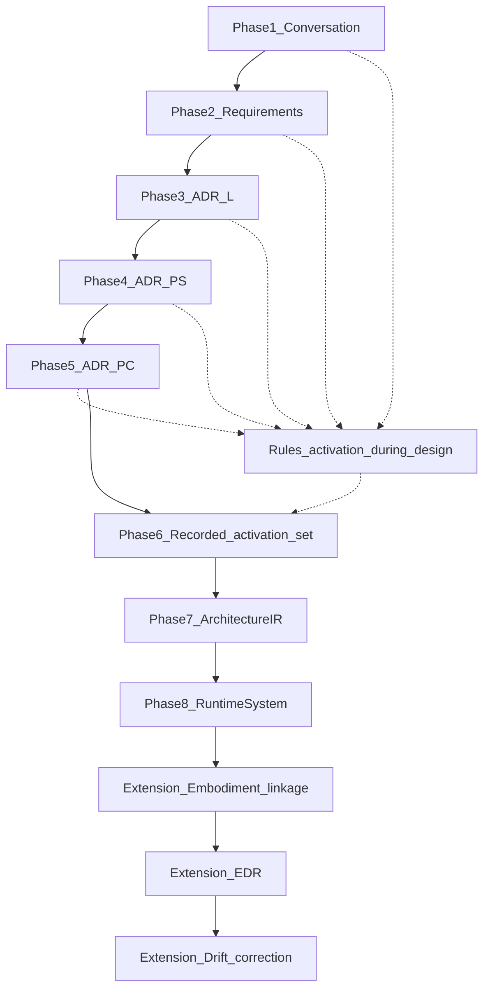

# STE examples: systems through the full lifecycle

## The Problem

STE is easy to describe as layers and loops, yet still feel abstract: readers may understand the vocabulary and still struggle to see **one thread** from bounded expectations to a **governed**, **self-correcting** lifecycle. Without worked systems, **Architecture IR**, **embodiment linkage**, and **EDR**-shaped evidence can sound like parallel buzzwords instead of one operational story.

## The Reframe

Part 11 provides **two** walkthroughs. Start with the **AI Gateway** example—**small**, one logical ADR and one physical-system / physical-component pair—then optionally read the **Instance Scheduler** example for **higher fidelity**: **split** logical and physical ADRs, **requirement and invariant nodes** in Architecture IR, and **path-level** linkage to a **real AWS Solutions** repository layout.

Both walkthroughs open with **Phase 1 — Conversation (problem discovery)**: a **grounded design dialogue** with ambiguity, constraints, tradeoffs, and risks. The **AI Gateway** transcript is **short**. The **Instance Scheduler** teaching path is **longer** and uses **Human** and **AI (Architecture Partner)** in **[canonical STE flow — Parts 1–8](./instance-scheduler-example/00-canonical-ste-flow.md)**: problem statement, dialogue, **extracted** requirements/invariants/governance/NFRs, a **reader-facing ADR**, **ADR steelman**, **gap resolution and deferrals**, a **final architecture view**, and a **traceability** table—then the walkthrough continues with the **formal** requirements snapshot and split ADRs. In full STE, a **conversation engine**, **Steelman** as a separate surfaced role, and **persona-routed** probes (FinOps, Security, cloud landing zone, Operations) may augment that dialogue; **ste-rules-library** projections **activate** rules from **signals** in the emerging design. For readability, cross-cutting concerns are often **folded into one architecture-partner voice** in the handbook.

The YAML-shaped fragments in the steps are **illustrative** and **handbook-grade**. **ste-spec** is normative for **semantic** Architecture IR meaning; **adr-architecture-kit** (workspace sibling) is the reference for **ADR YAML field shapes** and **ID patterns**. **AWS documentation and the upstream GitHub repository** are authoritative for **Instance Scheduler product behavior**—the handbook **does not** vendor upstream code; it **synthesizes** STE-shaped artifacts for pedagogy.

**Requirement row ids** in snapshots use the `RQCAP-*`, `RQCONST-*`, `RQINV-*`, `RQNFR-*` prefixes; you can read them as the handbook’s analogue of a **REQ-XXXX** list—each row is one traceable requirement-class item.

## The Model

### How to read Part 11

Earlier parts of this handbook **define** the STE model—artifact types, lifecycle stages, and governance vocabulary. **Part 11 shows that model operating on complete systems**: the same phases and artifacts, traced through two worked examples. This part teaches **understanding**; **ste-spec** remains normative for schemas and exact semantics.

**Recommended reading order**

1. **This page** for orientation, phase tables, and links into each walkthrough.
2. The **conceptual spine** (one pass, short reads): [What is a system?](./01-what-is-a-system.md) → [Conversation to ADR](./02-conversation-to-adr.md) → [ADR to Architecture IR](./03-adr-to-architecture-ir.md) → [IR to projections](./04-ir-to-projections.md) → [Conformance](./05-conformance.md) → [Drift and correction](./06-drift.md). Together they explain the lifecycle the examples **demonstrate**; they do not replace the step-by-step files under each example folder.
3. **First walkthrough:** [AI Gateway — Phase 1 (conversation)](./ai-gateway-example/00-ste-conversation.md) through [step 9 — drift and correction](./ai-gateway-example/09-drift-and-correction.md), in order, using companion diagrams as you go.
4. **Second walkthrough (optional, higher fidelity):** [Instance Scheduler — canonical STE flow](./instance-scheduler-example/00-canonical-ste-flow.md) and the Instance Scheduler step table below.

**Lifecycle in one line:** conversation and intent discovery → **requirements snapshot** (bounded expectations) → **decision ledger** (bounded design space) → **logical and physical ADRs** (intent and topology) → **rules activation** (governance from design signals) → **Architecture IR** (compiled model) → **projections** (regenerable views from IR) → **runtime embodiment** → **semantic linkage** → **evidence (EDR)** → **drift detection** → **governed correction** feeding back into intent, requirements, ADRs, IR, and runtime.

**Canonical, derived, and runtime (high level)**

| Layer | Role in Part 11 |
|-------|-----------------|
| **Canonical design** | Conversation-grounded capture, **requirements snapshot**, **decision ledger**, **ADR-L / ADR-PS / ADR-PC**—what teams govern and revise under policy. **ADRs are canonical design authority.** |
| **Derived** | **Rules activation**, **Architecture IR** (compiled and linked from ADRs and rules inputs—not a parallel hand-authored design), and **projections** (diagrams, inventories, traceability and governance views). When authority changes, **recompile and regenerate**; do not patch derived artifacts as if they were source of truth. Published IR is the **structural substrate** for a declared scope; downstream projections must **track** it (see [Projections overview](../04-architecture-model/04-08-projections-overview.md)). |
| **Runtime and closure** | What actually runs (**embodiment**), **semantic linkage** to design elements, **EDR**-shaped **evidence**, **conformance** checks, and **drift**—together they **close the loop** from design to reality and back to governed change. |

### What this section is for

- It follows **one or two systems** through STE end to end.
- The **goal** is the **full lifecycle** summarized above: from bounded expectations through compiled model and runtime to evidence, assessment, and corrective feedback.
- The **AI Gateway** example is **intentionally small** but **structurally realistic** (patterns aligned with workspace example shapes, not toy prose).
- After the **conceptual spine** (`01`–`06`), follow the **AI Gateway** steps in order so each artifact has a concrete illustration.

### Authoring contract (canonical eight-phase pipeline)

Every example under Part 11 follows the **same** phase spine so readers can compare systems without learning a new ladder each time.

| Phase | Name | What the reader should see |
|-------|------|----------------------------|
| 1 | Conversation | Realistic dialogue; problem statement, constraints, assumptions |
| 2 | Requirements | Structured snapshot + **trace** to conversation segments |
| 3 | Logical design (ADR-L) | Capabilities, boundaries, decisions + **satisfies-requirement** trace |
| 4 | Physical system (ADR-PS) | Topology, trust zones, integrations |
| 5 | Physical component (ADR-PC) | Interfaces, models, deployment targets, acceptance / test hints |
| 6 | Rules activation (recorded) | **Signal → rule → reason** made explicit for the walkthrough (illustrative; **ste-rules-library** patterns). **Governance signals and candidate rule activation accrue throughout Phases 1–5** as choices and technology land; this step **freezes** the activation set for compilation and teaching—not when rules first start to matter. |
| 7 | Compilation (Architecture IR) | Derived graph + **YAML excerpt** (components, relationships, boundaries, contracts, deployment mappings) |
| 8 | Runtime system | **What actually runs** (services, flows, schedules, APIs, stores) |

**Extension (operation and closure)** after Phase 8 in these walkthroughs: **code semantic linkage** (step 7 filename), **EDR** (step 8), **drift and correction** (step 9)—the bridge from the compiled model and runtime inventory to **kernel / runtime** operation.

### Diagram — STE pipeline (conceptual)

The linear spine below matches the **numbered walkthrough files**. **Rules activation is part of design**, not a late bolt-on: as Phases 1–5 unfold, **signals** in conversation, requirements, and ADRs **continuously inform** which governance rules apply. Phase 6 in the examples is where that story is **surfaced and recorded** (**signal → rule → reason**) for compilation and reader clarity—after physical-component choices have stabilized most technology signals.

Per-example **customized** pipeline figures live under each example’s [`diagrams/intent-to-design.md`](./ai-gateway-example/diagrams/intent-to-design.md) (AI Gateway) and [`instance-scheduler-example/diagrams/intent-to-design.md`](./instance-scheduler-example/diagrams/intent-to-design.md) (Instance Scheduler).

### Diagram A — Intent to design (entry)

See [Intent to design flow](./ai-gateway-example/diagrams/intent-to-design.md) for the AI Gateway figure; [Intent to design (Instance Scheduler)](./instance-scheduler-example/diagrams/intent-to-design.md) for the second walkthrough.

### Phase and step map — AI Gateway (reading order)

| Phase | Step | File | Lifecycle beat |
|-------|------|------|----------------|
| 1 | (conversation) | [STE conversation](./ai-gateway-example/00-ste-conversation.md) | Problem discovery; trace seeds for requirements |
| 2 | 1 | [Requirements snapshot](./ai-gateway-example/01-requirements-snapshot.md) | Bounded expectations + conversation trace table |
| 2 | 2 | [Decision ledger](./ai-gateway-example/02-decision-ledger.md) | Explicit design questions tied to requirements |
| 3 | 3 | [Logical ADR](./ai-gateway-example/03-logical-adr.md) | Logical commitments that resolve the ledger |
| 4 | 4 | [Physical-system ADR](./ai-gateway-example/04-physical-system-adr.md) | Deployable topology, boundaries, trust |
| 5 | 5 | [Physical-component ADR](./ai-gateway-example/05-physical-component-adr.md) | Implementable components and interfaces |
| 6 | 5b | [Rules activation](./ai-gateway-example/05b-rules-activation.md) | Which rules activate from design signals |
| 7 | 6 | [Derived Architecture IR](./ai-gateway-example/06-derived-architecture-ir.md) | Compiled entities and relationships |
| 8 | 7 | [Code linkage + runtime](./ai-gateway-example/07-code-semantic-linkage.md) | What runs; linkage to embodiment |
| Ext | 8 | [EDR example](./ai-gateway-example/08-edr-example.md) | Embodied evidence, scoring, obligations |
| Ext | 9 | [Drift and correction](./ai-gateway-example/09-drift-and-correction.md) | Drift scenario; closing the loop |

#### Artifact lineage — AI Gateway (illustrative)

| Artifact | Derived from | STE phase |
|----------|--------------|-----------|
| RQCAP/RQINV/… rows | [Conversation](./ai-gateway-example/00-ste-conversation.md) | Phase 2 (snapshot) |
| ADR-L-AIGW-001 | Requirements + ledger | Phase 3 |
| ADR-PS-AIGW-001 | ADR-L-AIGW-001 | Phase 4 |
| ADR-PC-AIGW-001 | ADR-PS-AIGW-001 | Phase 5 |
| Rule activation set | ADR-PC + technology signals | Phase 6 |
| Architecture IR | All ADRs (compile) | Phase 7 |
| Runtime inventory + linkage | Architecture IR | Phase 8 (+ extension) |

#### Definition of done — can the reader …?

1. See the **original problem** (Phase 1).
2. See the **conversation** that explored it (Phase 1).
3. See **requirements** derived from it, with **trace** to dialogue (Phase 2).
4. See **logical architecture** (ADR-L) (Phase 3).
5. See **physical system** design (ADR-PS) (Phase 4).
6. See **physical component** design (ADR-PC) (Phase 5).
7. See **which rules activated** and why (Phase 6).
8. See the **compiled architecture model** (IR) (Phase 7).
9. See **what system actually runs** (Phase 8).
10. **Trace every artifact** back to its origin (lineage + tables).

### What Part 11 teaches (concept → where you learn it)

| Concept | Where you learn it |
|---------|-------------------|
| Conversation → intent | Phase 1 |
| Intent vs design | Phases 2–3 |
| Decision governance (ledger bounds logical ADR) | Phase 2–3 |
| Logical vs physical | Phase 3 vs Phases 4–5 |
| Rules from signals | Phase 6 |
| Rules + invariants per component (tabular projection) | [`projection-queries.md`](./ai-gateway-example/projections/projection-queries.md) Query D; [`rules-invariants-system-context.md`](./ai-gateway-example/projections/rules-invariants-system-context.md) |
| Canonical vs derived | [ADR to Architecture IR](./03-adr-to-architecture-ir.md), [IR to projections](./04-ir-to-projections.md); ADRs vs IR (Phase 7) |
| Runtime vs linkage | [Conformance](./05-conformance.md); Phase 8 vs extension (embodiment) |
| Evidence | Extension — EDR step; [Conformance](./05-conformance.md) |
| Drift / self-correction | [Drift and correction](./06-drift.md); Extension — drift step |
| What “system” means in STE | [What is a system?](./01-what-is-a-system.md) |
| Intent → design | [Conversation to ADR](./02-conversation-to-adr.md) |

### Other diagrams

- [Canonical vs derived](./ai-gateway-example/diagrams/canonical-vs-derived.md) (Diagram B)
- [Design to embodiment](./ai-gateway-example/diagrams/design-to-embodiment.md) (Diagram C)
- [Feedback loop](./ai-gateway-example/diagrams/feedback-loop.md) (Diagram D)

### IR snapshot and IR-generated Mermaid

The **AI Gateway** example includes a consolidated [`architecture-ir.json`](./ai-gateway-example/ir/architecture-ir.json) and **regenerable** Mermaid under [`projections/generated/`](./ai-gateway-example/projections/generated/) (see [`projections/README.md`](./ai-gateway-example/projections/README.md)). Illustrative **projection-query** sketches live in [`projection-queries.md`](./ai-gateway-example/projection-queries.md). **Query D** adds a **composite** view—[`rules-invariants-system-context.md`](./ai-gateway-example/projections/rules-invariants-system-context.md)—that joins **IR**, **ADR-PS/ADR-PC** context, **invariants**, and **Phase 6** rule activation so readers can **explore** “what applies” per deployable unit (natural language compiles to **stored predicates** in full STE).

The **Instance Scheduler** example adds [`instance-scheduler-example/ir/architecture-ir.json`](./instance-scheduler-example/ir/architecture-ir.json) with **requirement** and **invariant** entities plus trace edges, and **three** generated views under [`instance-scheduler-example/projections/generated/`](./instance-scheduler-example/projections/generated/) (see [`instance-scheduler-example/projections/README.md`](./instance-scheduler-example/projections/README.md) and [`projection-queries.md`](./instance-scheduler-example/projection-queries.md)). The same **Query D** pattern lives in [`rules-invariants-system-context.md`](./instance-scheduler-example/projections/rules-invariants-system-context.md).

### Second walkthrough — Instance Scheduler on AWS (higher fidelity)

Use this path after the AI Gateway steps when you want a **production-shaped** AWS **hub / spoke** story grounded in the public **[Instance Scheduler on AWS](https://github.com/aws-solutions/instance-scheduler-on-aws)** repository and **[implementation guide](https://docs.aws.amazon.com/solutions/latest/instance-scheduler-on-aws/solution-overview.html)**.

**Diagram:** [Intent to design (Instance Scheduler)](./instance-scheduler-example/diagrams/intent-to-design.md)

| Phase | Step | File | Lifecycle beat |
|-------|------|------|----------------|
| 1 | 0a | [Canonical STE flow — Parts 1–8](./instance-scheduler-example/00-canonical-ste-flow.md) | Human + AI conversation; extracted artifacts; ADR; **ADR steelman**; gaps/deferrals; architecture view; traceability example |
| 1 | 0 | [Phase 1 entry](./instance-scheduler-example/00-ste-conversation.md) | Short pointer into **0a** |
| 2 | 1 | [Requirements snapshot](./instance-scheduler-example/01-requirements-snapshot.md) | Formal ids + YAML; trace to Parts 1–8 |
| 2 | 2 | [Decision ledger](./instance-scheduler-example/02-decision-ledger.md) | Ledger questions |
| 3 | 3a–3b | [Logical ADR — scheduling](./instance-scheduler-example/03a-logical-adr-scheduling.md), [trust](./instance-scheduler-example/03b-logical-adr-trust.md) | Split logical commitments |
| 4 | 4a–4b | [Physical-system — hub](./instance-scheduler-example/04a-physical-system-hub.md), [remote](./instance-scheduler-example/04b-physical-system-remote.md) | Hub vs spoke topology |
| 5 | 5a–5c | [Orchestration](./instance-scheduler-example/05a-physical-component-orchestration.md), [data](./instance-scheduler-example/05b-physical-component-data-layer.md), [CLI](./instance-scheduler-example/05c-physical-component-cli.md) | Implementable units |
| 6 | 5d | [Rules activation](./instance-scheduler-example/05d-rules-activation.md) | Signals → rules |
| 7 | 6 | [Derived Architecture IR](./instance-scheduler-example/06-derived-architecture-ir.md) | IR with requirements, invariants, trace edges |
| 8 | 7 | [Code linkage + runtime](./instance-scheduler-example/07-code-semantic-linkage.md) | Runtime inventory + path linkage |
| Ext | 8–9 | [EDR](./instance-scheduler-example/08-edr-example.md), [Drift](./instance-scheduler-example/09-drift-and-correction.md) | Evidence, correction |

#### Artifact lineage — Instance Scheduler (illustrative)

| Artifact | Derived from | STE phase |
|----------|--------------|-----------|
| RQCAP/RQINV/… rows | [Canonical flow Parts 1–3](./instance-scheduler-example/00-canonical-ste-flow.md) (via [Step 0 entry](./instance-scheduler-example/00-ste-conversation.md)) | Phase 2 |
| ADR-L-INST-001 / 002 | Requirements + ledger | Phase 3 |
| ADR-PS-INST-001 / 002 | ADR-L-INST-* | Phase 4 |
| ADR-PC-INST-001–003 | ADR-PS-INST-* | Phase 5 |
| Rule activation set | ADR-PC + signals | Phase 6 |
| Architecture IR | All ADRs | Phase 7 |
| Runtime inventory + linkage | IR + upstream repo | Phase 8 (+ extension) |

Use the same **definition-of-done checklist** as for the AI Gateway (problem → traceability → IR → runtime → full lineage).

## The Implications

Treat this part as **pedagogy**, not a schema appendix: when a fragment disagrees with **ste-spec**, the specification wins. Use the same discipline in real programs: fix **canonical** intent or ADRs, then **regenerate** derived registries and graphs—do not “patch” derived files as if they were authority.

A **minimal reading path** that still conveys the whole STE shape is: **Part 0 (foundations)**, **Part 3 (intent artifacts)**, **Part 5 (lifecycle) together with runtime/evidence chapters you use as your “05” anchor**, and **this Part 11**. Earlier parts supply vocabulary and boundaries; **Part 11 is what makes the system concrete**: one thread from idea through **deterministic phases** to drift and correction.

## Relationship to STE system

- **Closed loop and layers:** [System overview](../02-overview/02-03-system-overview.md)
- **Artifact types:** [Artifact layer overview](../03-artifacts/03-00-artifact-layer-overview.md)
- **Architecture IR and graph:** [IR as a graph](../04-architecture-model/04-07-ir-as-a-graph.md), [Projections overview](../04-architecture-model/04-08-projections-overview.md)
- **Narrow ladder/registry slice (complementary):** [Illustrative artifact walkthrough](../04-architecture-model/04-15-illustrative-walkthrough.md)
- **Lifecycle staging:** [Lifecycle overview](../05-lifecycle/05-00-lifecycle-overview.md)
- **Runtime evidence and freshness:** [Part 8: Runtime Overview](../08-runtime/08-00-runtime-overview.md), [Freshness and Validity](../08-runtime/08-03-freshness-and-validity.md)

**Conceptual spine (read before or alongside steps):** [01 — What is a system?](./01-what-is-a-system.md) through [06 — Drift and correction](./06-drift.md).

**Begin the first walkthrough:** [AI Gateway — Phase 1 (conversation)](./ai-gateway-example/00-ste-conversation.md). **Second walkthrough:** [Instance Scheduler — canonical STE flow (Parts 1–8)](./instance-scheduler-example/00-canonical-ste-flow.md), then continue from [Phase 1 entry / Step 0](./instance-scheduler-example/00-ste-conversation.md) if you prefer the navigation stub first.

## Summary

- **Phase 1** grounds intent in a **realistic** design conversation; **Phase 2** freezes **REQ-shaped** rows with **trace** back to dialogue.
- A **Decision Ledger** states design questions; **ADR-L** **resolves** those questions—it does not invent a parallel decision list.
- **Physical-system** and **physical-component** ADRs refine logical commitments into topology and implementable responsibility.
- **Rules activation** is **continuous during design** (Phases 1–5); **Phase 6** in the walkthrough **records** **signal → rule → reason** once physical-component signals are clear (handbook illustration; **ste-rules-library** owns real rule packs).
- **Architecture IR** is the **derived**, machine-reasonable architecture model; registries and indices are **projections** of that model.
- **Phase 8** states **what runs**; **semantic linkage** connects the model to **embodiment**; an **EDR** packages observable evidence for **assessment**; **drift** drives **governed** correction back into **intent** and structure.
