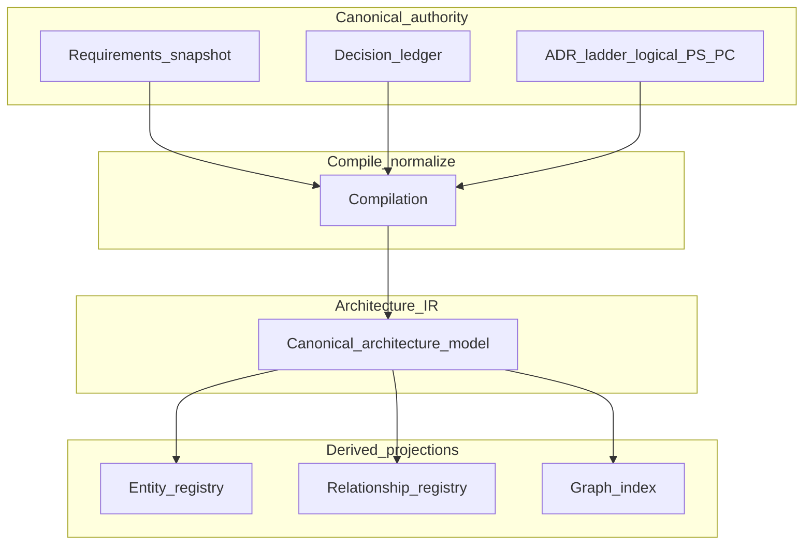

# Diagram B — Canonical artifacts to derived model

**How to read this:** Humans govern canonical intent and ADR records; compilation produces **Architecture IR** (the machine-reasonable architecture model). Registries, indices, and graph exports are **derived projections**—rebuildable views, not alternate sources of truth.

See [Step 6](../06-derived-architecture-ir.md).
