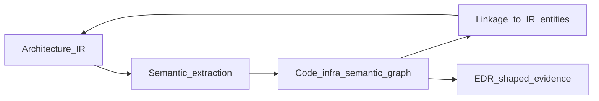

# Diagram C — Design to embodiment

**How to read this:** The derived architecture model is linked to code and infrastructure through semantic extraction and reconciliation; the result is **embodied** structure you can observe and assess, not intent floating alone.

See [Step 7](../07-code-semantic-linkage.md) and [Step 8](../08-edr-example.md).
