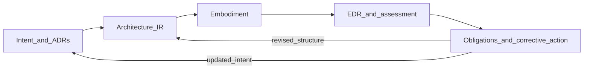

# Diagram D — Self-correcting loop

**How to read this:** Assessment compares embodied reality to governed intent; obligations and revised decisions close the loop so **drift** becomes visible and correctable rather than silent.

See [Step 8](../08-edr-example.md) and [Step 9](../09-drift-and-correction.md).
