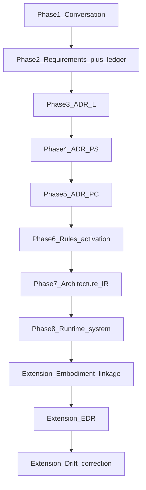
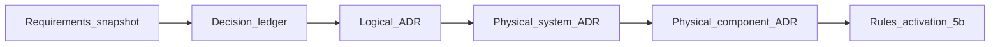

# Diagram — STE pipeline (AI Gateway example)

**How to read this:** Top to bottom is the **canonical eight-phase** spine used across Part 11, then the **extension** (embodiment, EDR, drift). The AI Gateway walkthrough is **small** (one logical ADR, one physical-system / physical-component pair) but follows the **same** phases as the Instance Scheduler example.

**Customization for this system:** edge **REST** AI gateway, **serverless** compute, **multi-provider** routing and failover.

**Refinement ladder (steps 1–5 detail):** bounded expectations and ledger through layered ADRs.

## Files (reading order)

- [Phase 1 — Conversation](../00-ste-conversation.md)
- [Step 1](../01-requirements-snapshot.md) through [Step 5](../05-physical-component-adr.md)
- [Step 5b — Rules activation](../05b-rules-activation.md)
- [Step 6 — Derived Architecture IR](../06-derived-architecture-ir.md)
- [Step 7 — Runtime + linkage](../07-code-semantic-linkage.md)
- [Step 8 — EDR](../08-edr-example.md) · [Step 9 — Drift](../09-drift-and-correction.md)

See [Part 11 overview](../../00-overview.md) for the full **phase map** and **artifact lineage** table.
