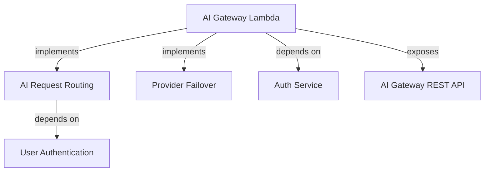

%% GENERATED FILE — do not edit by hand.
%% Source: ../../ir/architecture-ir.json
%% Generator: 11-examples/ai-gateway-example/generate_projections.py

# Capability / component projection (from Architecture IR)

