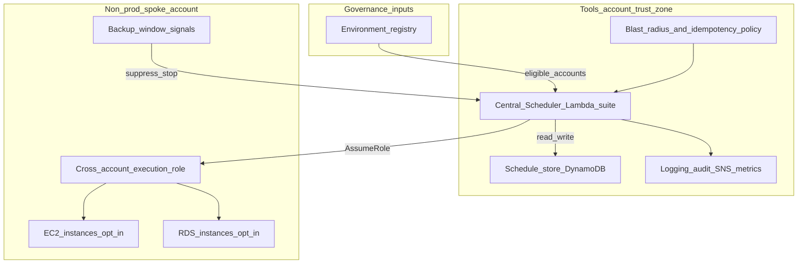

# Instance Scheduler — canonical STE design flow

This page is the **pedagogical spine** for the Instance Scheduler walkthrough: a realistic design conversation, extraction of formal intent, a recorded decision, **ADR steelman** review, gap handling, a finalized architecture view, and a traceability example. It demonstrates how STE moves from dialogue to durable artifacts **without** replacing the later mechanical steps (requirements snapshot, ledger, split logical ADRs, IR, runtime).

**How to read:** Read **Parts 1–8** in order. Then continue with [Step 1 — Requirements snapshot](./01-requirements-snapshot.md), which freezes the extracted intent into stable ids and YAML aligned with this flow.

> **Illustrative only.** Pedagogical fiction; **ste-spec** (sibling repository under the workspace) is normative for Architecture IR semantics; **adr-architecture-kit** for ADR field shapes where steps 3a–3b show excerpts.

**Speakers:** **Human** (decision authority) and **AI (Architecture Partner)** (probes, steelmans, proposes). Lines labeled **`[Trace → …]`** are handbook annotations: they show how an utterance feeds later requirement ids and ADRs—they are not in-product chat UI.

---

## Part 1 — Problem statement

Always-on **EC2** and **RDS** in **non-production** environments create **unnecessary cost**. The organization operates **multiple AWS accounts**. An **environment registry** already classifies accounts (for example **production** versus **non-production**) and is treated as the orienting map for the cloud estate.

The organization needs a **safe**, **governed**, **automated** way to start and stop non-production compute and databases on a schedule. **Safety and governance matter more than squeezing every dollar** of savings: the automation must not become a source of outages, data loss, or unreviewable shadow operations.

This plain-language statement is the **design input** for the conversation that follows.

---

## Part 2 — Design conversation

**STE DESIGN CONVERSATION — EXAMPLE**  
**System:** Non-Production Instance Scheduler  
**Context:** AWS Organization, environment registry present

**Human:** I need to design a solution that can resolve the issue of always-on machines and databases in our lower environments. Use the environment registry for our AWS cloud to orient yourself to the platform we are designing for. This will be our development account for appdev.

**AI (Architecture Partner):** Alright—the core problem looks like **cost and waste** from non-production environments running continuously.

You said this is for the development account. Should we design this **only for dev**, or so it can apply to **all non-production accounts**—dev, test, QA, UAT?

**Human:** Good point. We should design it so it works for **all non-production accounts**, not just dev.

**AI:** That shifts us from a **single-account shortcut** to an **organization-aware** design.

Before we sketch architecture, I want a few **framing checks** so we do not optimize the wrong thing:

- Are there resources that must stay **always on** even in non-prod?
- **Who** should control schedules—central platform team, app teams, or both?
- Are there **windows we must not touch**—backups, patching, maintenance?
- Scope for v1: **EC2 only**, or **EC2 and RDS** (and anything else)?
- Should scheduling be **opt-in** or **opt-out**?

**Human:** Yes—some things must stay always on. **Shared services**, for example. Schedules should be **centrally controlled**, but teams can **request changes**. We **cannot interfere with backup windows**. We need **EC2 and RDS** at minimum. **Opt-in** feels safer than opt-out.

**AI:** Agreed—**opt-in** cuts **blast radius** a lot.

Here is what I think I am hearing as **candidate requirements**:

- The system must **start and stop EC2 and RDS** on policy.
- It must operate across **multiple non-production accounts** using the **environment registry** for classification.
- It must **never** treat **production** accounts as in scope for stop/start automation.
- It must allow resources to be marked **always-on** and **never** stop those.
- It must **respect backup and maintenance windows** when deciding whether to stop.
- It must support **defining and changing schedules** under governance—not ad hoc console-only mystery.
- It must **log actions** sufficiently for operations and audit.
- It should **reduce cost** in non-production, **subject to** safety and governance.

Did I miss anything important?

**Human:** No—that looks right.

**AI:** We could start drawing boxes—but I want to **steelman** the intent first so we do not bake in something naive.

**Human:** Good. Give me the steelman review.

**AI:** **Steelman / failure modes** (intent level):

- What if automation **accidentally targets production**?
- What if it **stops a database during a backup**?
- What if **tags are wrong** on something critical?
- What if execution **fails halfway**—how do we avoid limbo and mystery state?
- What if someone defines a schedule that **stops everything at once**?
- What if **credentials or AssumeRole** fails mid-run?
- What if the job **runs twice** and repeats actions?

If we ignore these, we can “save money” and **create incidents**.

**Human:** Agreed. We should define **safety rules** before we go further.

We have made a lot of assumptions. Before we continue, **list candidate invariants** we have so far so I can decide what to lock.

**AI:** Good—if we skip this, we will try to bolt safety on later.

**Candidate invariants:**

1. **Production** workloads must **never** be stopped by this system.
2. Only accounts classified as **non-production** in the **environment registry** may be targeted.
3. Resources explicitly marked **always-on** must **never** be stopped.
4. Resources in **backup windows** must **not** be stopped during those windows.
5. The scheduler must be **idempotent** (safe under **duplicate runs**).
6. If the scheduler **cannot determine** the correct action, it must **default to doing nothing** (fail closed).
7. The scheduler must **not** stop or start **more than a defined cap** of resources in a **single run** (blast radius control).
8. Only resources **explicitly opted in** to scheduling may be affected.

Some other things we discussed are probably **governance rules** or **nonfunctional requirements**, not invariants.

**Human:** I agree not everything should be an invariant. **Classify** these into invariants, governance rules, and nonfunctional requirements—and explain why.

**AI:** Working definitions:

- **Invariant:** Must **never** be violated in operation we consider **acceptable**; enforced by **architecture and automation behavior**.
- **Governance rule:** **Who** may change **what**, under **which process**—human authority and workflow.
- **Nonfunctional requirement:** **Quality attributes**—logging depth, audit retention targets, alerting, reliability objectives.

**Classification**

**Invariants**

- Production must **never** be stopped by this system.
- Only **non-production** accounts per the **environment registry** may be targeted.
- **Always-on** resources must not be stopped.
- **Backup-window** protection for stop decisions.
- **Idempotent** execution.
- **Fail closed** on ambiguity or critical read failures.
- **Blast radius** capped per execution.
- **Opt-in only** affects resources.

**Governance rules**

- Only **authorized roles** may **create or modify** schedules.
- Material schedule changes go through a **defined approval** path.
- Changes are **scoped** by account, region, and **tag/opt-in** semantics the organization owns.

**Nonfunctional requirements**

- **All actions** are logged in a durable, inspectable way.
- **Schedule and policy changes** are auditable (who/when/what).
- **Failures** surface as **alerts** to operators.
- The control plane should be **reliably available** within the organization’s stated expectations.

**Human:** Which ones do you feel **strongly** must be invariants—and which should **not** be invariants?

**AI:** The **highest-leverage invariants** for preventing harm are:

- **Production never stopped** by this automation.
- **Opt-in only**.
- **Fail closed** on ambiguity.
- **Idempotent** execution.
- **Blast radius** limited per run.
- **Backup-window** protection.

Those are the ones that most directly prevent **outages** and **data-loss class** mistakes.

What I would **not** elevate to invariant—unless your org chooses otherwise:

- **Logging** and **alerting** depth (still mandatory as **NFRs**; implementation can evolve).
- **Exactly who** is allowed to edit schedules (that is **governance**; changing it should not require re-proving safety architecture every time).

If we label everything an “invariant,” we **over-constrain** evolution and blur what is **safety-critical**.

**Human:** Agreed. **Lock those invariants in.**

Given those invariants, let us talk architecture. My first thought is we deploy a **scheduler separately into each non-production account** so each account manages its own schedule locally. That avoids **cross-account roles** and keeps IAM **simple**.

**AI:** That is a **technically valid** design. It can respect the invariants and solve the cost problem.

It is probably **not optimal** for what we said about **governance and visibility**, though. Here is the trade **as I see it**.

**Per-account scheduler**

- **Pros:** Strong account isolation; simpler IAM story; failures tend to **stay local**.
- **Cons:** Schedules **fragment** across accounts; **central audit** and **correlation** get harder; **global blast-radius caps** and **global pause** are harder; you **duplicate** control-plane infrastructure in every account.

Given **central governance**, **auditability**, and **blast-radius** thinking, I would recommend a **centralized control plane** in a **tools/hub account** that **assumes roles** into member accounts, stores schedules **centrally**, and emits **central logs**.

**Central control plane (hub)**

- Scheduler runs in a **central** account.
- **Schedule store** is **central** (with encryption and access control).
- **Cross-account roles** in spokes are **narrow** and **registry-scoped**.
- **Environment registry** drives **which accounts** are even eligible.
- **Logging and audit** are **central** by default.
- **Blast-radius** limits are enforced **centrally**.

Both are **legitimate**; the centralized model matches the **governance and safety posture** you stated more cleanly.

**Human:** That makes sense. I was optimizing for **implementation simplicity**, but you are right—that pushes **governance and visibility debt** into the future. Let us go with the **centralized control plane**.

**AI:** Good—then the direction is:

- **Central scheduler control plane** (hub/tools account).
- **Cross-account execution** with **least-privilege** spoke roles.
- **Opt-in** tagging (or equivalent binding) for resources.
- **Environment registry** for **account classification**.
- **Central logging and audit**.
- **Blast-radius controls** per execution.
- **Backup-window** protection in evaluation.
- **Fail-safe** and **idempotent** execution model.

At this point, that is an **architectural decision**, not just preference.

**Human:** Agreed. **Record this as an ADR.**

**AI:** Yes. From this conversation, a toolchain can now generate **requirements**, **invariants**, **governance rules**, **nonfunctional requirements**, an **ADR**, an **initial architecture diagram**, and **trace links**.

This is the right moment to **formalize** the design.

**Human:** Right—and once the ADR exists, we will run a **formal steelman review on the ADR itself**. Assume the ADR is **wrong or incomplete**: hunt **missing requirements**, **invariant violations**, **unsafe assumptions**, **operational gaps**, **governance gaps**, and **failure modes** we did not design for. Then we **close gaps** or **defer them explicitly** in the ADR.

**AI:** Agreed. The sequence should be:

1. Generate the **ADR** from the conversation and extracted artifacts.
2. **Steelman the ADR** (adversarial, not polite).
3. Produce a **gap list** (requirements, safety, operations, governance, observability).
4. **Resolve** what we can now.
5. **Record deferrals** for what we will not solve yet—**with rationale**.
6. **Update the ADR** to match.
7. When the ADR **survives** that review, it becomes the **authoritative** design input for implementation.

**Human:** Exactly—the goal is a design that survives **adversarial review**, not a document for its own sake.

**AI:** Understood. After that, implementation can start because the design has been **stress-tested** against requirements, invariants, and failure scenarios.

---

## Part 3 — Extracted artifacts from the conversation

The lists below are **derived from Part 2**. They are not a separate brainstorm; they are what STE **extracts** from governed dialogue before freezing ids in [Step 1](./01-requirements-snapshot.md).

### Extracted requirements

- Start and stop **EC2** and **RDS** in **non-production** accounts on **clock-based** schedules.
- Use the **environment registry** so **only non-production** accounts are eligible targets.
- Support **always-on** carve-outs for designated resources (for example shared services).
- **Respect backup and maintenance windows** when evaluating stops.
- Provide a **governed** way to define and change schedules (not ad hoc-only operations).
- **Reduce non-prod cost** subject to safety and governance priorities.

### Extracted invariants

- **Production** must never be stopped by this system.
- Only **non-production** accounts per the **environment registry** may be targeted.
- **Always-on** resources must never be stopped by this automation.
- **Backup/maintenance windows** must be honored for stop decisions.
- **Idempotent** behavior under repeated or overlapping runs.
- **Fail closed** when classification, registry data, or safety checks are ambiguous or unavailable.
- **Blast radius** per run is **capped** (maximum resources affected per execution).
- **Opt-in only**—no implicit enrollment.

### Governance rules

- **Central platform** owns schedule policy; **application teams** request changes through a **defined path**.
- Only **authorized roles** may create or modify schedules and related automation configuration.
- **Approvals** apply where the organization defines material change (for example wide blast radius or new account onboarding).
- **Scope** is expressed in terms of **account**, **region**, and **opt-in** semantics the organization controls.

### Nonfunctional requirements

- **Durable logging** of automation actions and material configuration changes.
- **Auditability** of who changed what and when.
- **Alerting** on failures and sustained unhealthy states.
- **Reliability** of the control plane appropriate to the organization’s non-production tolerance (stated as targets outside this example).

---

## Part 4 — Architectural decision record

In a full STE program, an ADR is usually **published as structured data** (plus reviewable narrative), not as a polished essay. Tooling may **draft** fields from the conversation and extracted artifacts; **humans** with decision authority **validate scope, alternatives, and invariant mapping** before the record is treated as canonical.

The YAML below is **handbook-illustrative** but its **top-level shape** matches **logical ADRs** as authored in the **adr-architecture-kit** repository under `adrs/logical/` (same field families you would see on a kit ADR-L: `schema_version`, `status`, `authors`, `context`, `domains`, `projection_signals`, `tags`, `decisions` with `consequences`, `invariants`, `capabilities`, `related_adrs`, `gaps`, `notes`). Open that repository in your workspace when you want a live reference file beside this example. This **consolidated** id (**ADR-L-INST-000**) is a **pedagogical rollup**—the split records in Steps **3a–3b** remain **ADR-L-INST-001** and **ADR-L-INST-002**.

### ADR record (illustrative excerpt)

```yaml
# Illustrative consolidated logical ADR — shape aligned to adr-architecture-kit adrs/logical/*.yaml
# ste-spec is normative for IR semantics; production repos may add fields.

schema_version: '1.0'
adr_type: logical
id: ADR-L-INST-000
title: Centralized non-production EC2/RDS scheduler (hub control plane, cross-account execution)
status: proposed
created_date: '2026-03-28'
modified_date: '2026-03-28'
authors:
  - ste-handbook-example
  - platform_cloud_governance  # human decision authority; tooling drafts, humans publish

context: |
  Non-production EC2 and RDS run continuously, driving avoidable cost. The estate spans multiple
  AWS accounts; an environment registry classifies production vs non-production. Safety,
  auditability, and governed change outweigh maximum savings.

  Locked intent from Part 2–3 includes opt-in enrollment, registry-scoped non-production targeting,
  backup/maintenance window protection, fail-closed evaluation when inputs are ambiguous, idempotent
  execution, and per-run blast-radius caps.

  Formal requirement ids for compilation appear in Step 1 (RQCAP/RQINV/RQNFR family).

domains:
  - aws
  - cost_operations
  - scheduling
  - multi_account
  - iam

projection_signals:
  - aws
  - hub-spoke
  - non-production

tags:
  - instance-scheduler
  - environment-registry
  - cross-account

decisions:
  - id: DEC-INST-R01
    summary: Hub control plane with central schedule store and cross-account execution
    rationale: |
      Deploy a hub-style scheduler in a central tools account. Persist schedules and operational
      configuration in a central store under strict access control. The hub assumes narrowly scoped
      cross-account roles into eligible non-production spoke accounts and performs bounded start/stop
      actions only against opted-in resources. Reconcile account eligibility to the environment
      registry before mutation. Center logs, metrics, and alarms at the hub; retain spoke-local
      signals where operations require them.
    consequences:
      positive:
        - Central correlation of actions and configuration changes
        - Consistent enforcement of caps and fail-closed rules; single place to pause scheduling in an incident
        - Clearer platform ownership of the control plane
      negative:
        - Hub is a sensitivity surface—hardening, monitoring, and change control are mandatory
        - Cross-account IAM must stay narrow, reviewable, and tested; registry errors are high-impact

  - id: DEC-INST-R02
    summary: Reject per-account duplicate scheduler stacks as the primary model
    rationale: |
      Per-account deployment is technically valid and improves account isolation, but it fragments
      schedules, weakens centralized audit and global blast-radius caps, complicates org-wide pause,
      and duplicates operational burden across non-production accounts.
    consequences:
      positive:
        - Alternative remains documented for isolation-heavy edge cases
      negative:
        - Teams must accept hub as the governed automation path for this program

  - id: DEC-INST-R03
    summary: Defer idle- or utilization-based stop for v1
    rationale: |
      Idle-based automation raises false-positive stop risk for RDS and long-running jobs.
      Clock-based schedules trade some savings for predictability and reviewability.
    consequences:
      positive:
        - Simpler safety story for initial rollout
      negative:
        - Savings ceiling lower than a mature idle-detection design

invariants:
  - id: INV-INST-R01
    statement: |
      Production workloads MUST NOT be stopped by this scheduling automation.
    scope: scheduling_control_plane
    enforcement_level: must
    enforcement_mechanism: policy
    verification_method: audit
    rationale: |
      Satisfies RQINV-5181 / environment-registry alignment; fail-closed when classification unknown.
  - id: INV-INST-R02
    statement: |
      Only opted-in resources in non-production accounts per registry MAY receive automated power actions;
      always-on and backup-window protections MUST be enforced before any stop.
    scope: scheduling_control_plane
    enforcement_level: must
    enforcement_mechanism: policy
    verification_method: audit
    rationale: |
      Consolidates opt-in, always-on, backup windows, idempotency, blast-radius caps, and fail-closed
      evaluation carried in RQINV-5181.
  - id: INV-INST-R03
    statement: |
      Spoke IAM MUST grant only the actions required for the hub scheduler principal (least privilege).
    scope: cross_account_trust
    enforcement_level: must
    enforcement_mechanism: policy
    verification_method: audit
    rationale: |
      Matches RQINV-5182; no org-wide generic power role.

capabilities:
  - id: CAP-INST-R01
    name: Scheduled EC2/RDS power management (non-production)
    description: |
      Clock-based start/stop for opted-in EC2 and RDS in registry-scoped non-production accounts.
    acceptance_criteria:
      - RQCAP-5181 satisfied in Step 1 snapshot
      - Backup and maintenance windows respected in evaluation path
  - id: CAP-INST-R02
    name: Cross-account hub orchestration
    description: |
      Hub assumes documented roles into spokes; registration and trust packaging are explicit.
    acceptance_criteria:
      - RQCAP-5182 satisfied in Step 1 snapshot
      - Spoke stack / parameters align with Instance Scheduler on AWS deployment model

related_adrs:
  - ADR-L-INST-001
  - ADR-L-INST-002

gaps:
  - id: GAP-INST-R01
    question: ADR steelman and gap closure not yet recorded against this rollup
    context: 'Track Part 5–6 in this handbook example; update status when steelman completes.'
    impact: medium
    blocking: true
  - id: GAP-INST-R02
    question: Hard numeric caps for mutations per run and per account not yet bound to SLOs
    context: 'Classification: operational detail; resolve in implementation or defer with recorded rationale.'
    impact: medium
    blocking: false

notes: |
  Governance: platform owns schedule policy; teams request changes through the documented channel.
  Material scope expansion (accounts, regions, patterns) requires explicit review.

  Operations: runbooks for hub outage (no new mutating actions when evaluation cannot run with integrity),
  AssumeRole failure (fail closed per account/role), registry drift, mis-schedules (rollback, global pause),
  and compromised hub credentials (blast radius bounded by least-privilege spokes).

  Provenance: derived from ./00-canonical-ste-flow.md Parts 1–3; tooling may draft this file—human
  architects must validate before treat-as-canonical. After steelman, split compilation uses ADR-L-INST-001/002.
```

### How to read this record

- **`schema_version` / `status` / `authors` / dates** mirror **adr-architecture-kit** logical ADRs so the same **validators and projections** can apply in a real repo.
- **`decisions`** carry **rationale** and **`consequences`** (positive and negative); **rejected** and **deferred** options stay as **first-class decision rows**, not footnotes.
- **`invariants`** use the same **enforcement** and **verification** slots as kit ADRs; requirement linkage is spelled out in **`rationale`** where handbook ids (**RQINV-5181**, **RQINV-5182**) already exist.
- **`gaps`** is where **pre-implementation** unknowns land (**blocking** vs not)—here **GAP-INST-R01** ties directly to **Part 5–6** of this example.

**Mapping to split logical ADRs (toolchain)**

For **compilation** into Architecture IR and alignment with the **[Instance Scheduler on AWS](https://github.com/aws-solutions/instance-scheduler-on-aws)** reference shape, the same decision is **split** across:

- **[ADR-L-INST-001](./03a-logical-adr-scheduling.md)** — scheduling domain (evaluation cadence, schedule binding, persistence choices).
- **[ADR-L-INST-002](./03b-logical-adr-trust.md)** — trust and multi-account packaging (hub principal, spoke roles, registration).

Together they implement **this** ADR without inventing a second decision story.

---

## Part 5 — ADR steelman review

Treat the ADR as **guilty until proven** against failure modes. The questions below are **representative**, not exhaustive.

- **Cross-account role failure:** What if **AssumeRole** fails for one spoke—do we **partially** act elsewhere, and is that **safe** and **visible**?
- **Environment registry wrong:** What if an account is **misclassified**—could **production** be scheduled? What **fail-closed** checks break the blast path?
- **Incorrect tags / opt-in:** What if a **critical** resource is **mistagged** as opted-in?
- **Double execution:** What if the scheduler **runs twice**—are actions **idempotent** and **auditable** as duplicates?
- **Backup window detection fails:** What if maintenance data is **missing or stale**—do we **default to no stop**?
- **Too many resources at once:** What if a schedule matches **more than expected**—is there a **hard cap** and **operator signal**?
- **Central scheduler down:** What is the **safe behavior**—**no stops** vs **no starts**—and how do we avoid **split-brain** narratives?
- **Team schedules incorrectly:** How fast can we **rollback** policy, **disable** schedules, and **communicate** impact?
- **Credential exposure:** What if **hub credentials** are **compromised**—what is the **blast radius** with **least-privilege** spokes?

---

## Part 6 — Gap resolution and deferrals

### Gap list (from Part 5)

| Area | Gap |
|------|-----|
| **Safety** | Prove **fail-closed** behavior when **registry**, **tags**, or **maintenance** data is missing or inconsistent. |
| **Safety** | Define **hard caps** for **mutations per run** and **per account**; wire **alerts** when thresholds approach. |
| **Operational** | **Hub outage** playbook: **freeze** mutations, **communicate**, **recover** without “catch-up” storms. |
| **Operational** | **Partial AssumeRole** success: **deterministic** partial rollout rules and **visibility**. |
| **Governance** | **Approval** criteria for **new account onboarding** and **wide** schedule patterns. |
| **Governance** | **Emergency global pause** ownership and **audit** of who activated it. |
| **Observability** | **Correlation** across hub and spokes for **one** operator view of “why did this resource change state?” |

### Resolved now (in the ADR and invariants)

- **Idempotency** and **fail-closed** defaults are **explicit** architectural commitments.
- **Opt-in**, **registry scoping**, **non-production** targeting, **backup-window** respect, and **blast-radius** caps are **named** as **invariants** carried into formal requirements in Step 1.
- **Centralized audit** posture is **chosen** by the **hub** decision.

### Explicitly deferred (record in ADR / backlog)

| Deferral | Rationale |
|----------|-----------|
| **Idle-based** or **utilization-based** automation | Higher **false-positive** risk for **RDS** and long jobs; revisit only with **strong signals** and **pilot** scope. |
| **Production** scheduling patterns | **Out of scope** for v1; requires **different** invariant set and **executive** risk acceptance. |
| **Fine-grained event bus** as **system of record** | **Logs + metrics + alarms** first; richer **event** contracts once **schemas** and **consumers** exist. |
| **Automated registry reconciliation** as **blocking gate** | May start as **periodic audit** + **manual** fix until **data quality** SLOs are credible. |

---

## Part 7 — Finalized architecture view

The diagram below is **teaching-grade**: it shows **control flow** and **trust boundaries** consistent with the **hub/spoke** steps later in this example ([Step 4a](./04a-physical-system-hub.md), [Step 4b](./04b-physical-system-remote.md)).



**Narrative**

- The **environment registry** answers: *is this account even eligible for non-production scheduling?* Misclassification is treated as a **safety** incident; the **scheduler fails closed** when eligibility cannot be established.
- The **central scheduler** reads **schedules** and **state** from the **schedule store**, evaluates **backup-window** inputs, applies **blast-radius** caps, and only then invokes **cross-account** roles.
- **Spoke roles** are **narrow**: they do **not** grant org-wide power; they trust **only** the hub principal under **documented** conditions.
- **Logging and audit** attach to **configuration changes** and **mutating actions** so operators can answer **why** a resource changed state.

---

## Part 8 — Traceability example

Each row is a **thread** from spoken intent to durable artifacts and deployable structure. **Requirement** and **invariant** ids are the ones frozen in [Step 1](./01-requirements-snapshot.md); **ADR** ids refer to the **split** logical ADRs; **components** match the **hub** physical-system excerpt.

| Conversation statement (Part 2) | Requirement (Step 1) | Invariant (Step 1) | ADR decision | Architecture component |
|--------------------------------|----------------------|---------------------|----------------|-------------------------|
| “All non-production accounts, not just dev” | **RQCAP-5182** | **RQINV-5181**, **RQINV-5182** (scope + least privilege) | **DEC-5183** ([ADR-L-INST-002](./03b-logical-adr-trust.md)) | **Spoke** registration + **AssumeRole** path ([Step 4b](./04b-physical-system-remote.md)) |
| “Use the environment registry” / “never production” | **RQCAP-5181**, **RQCAP-5182** | **RQINV-5181** | **DEC-5183**, hub parameters | **Orchestration Lambdas** reconcile eligible accounts ([ADR-PS-INST-001](./04a-physical-system-hub.md)) |
| “Opt-in… safer than opt-out” | **RQCAP-5181** | **RQINV-5181** | **DEC-5181** ([ADR-L-INST-001](./03a-logical-adr-scheduling.md)) | **Tag discovery / binding** in orchestration + data layer |
| “Cannot interfere with backup windows” | **RQCAP-5181** | **RQINV-5181** | **DEC-5184** (persistence includes maintenance windows) | **DynamoDB data layer** — maintenance window records (**ADR-PC-INST-002**) |
| “Fail closed / idempotent / blast radius” | **RQCAP-5181** | **RQINV-5181** | **DEC-5182** (evaluation model), **DEC-5184** (state) | **Orchestration Lambdas** + **policy** hooks (**ADR-PC-INST-001**) |
| “Centrally controlled schedules… teams request changes” | **RQNFR-5182** | — (governance; Part 3) | Hub/spoke **logical** commitments (**ADR-L-INST-001**, **ADR-L-INST-002**) | **Operator CLI** + hub configuration surfaces (**ADR-PC-INST-003**) |
| “Log actions… audit” | **RQNFR-5182** | — | Capabilities in **ADR-L-INST-001** | **SNS / logs** in hub topology (**ADR-PS-INST-001**) |

---

## Summary

- **Conversation** is the **first** control-loop beat: it **bounds** intent before stable ids exist.
- **Extraction** makes **requirements**, **invariants**, **governance**, and **NFRs** **reviewable** as **derived** artifacts—not a parallel story.
- **ADR** records the **decision**; **split logical ADRs** exist so **compilation** and **tooling** can track **natural seams** (scheduling vs trust).
- **ADR steelman** and **explicit deferrals** are part of **serious** design—they prevent “paper architecture.”
- **Traceability** links **what was said** to **what was decided** to **what runs**.

**Next:** [Step 1 — Requirements snapshot](./01-requirements-snapshot.md) · [Part 11 examples overview](../00-overview.md)
