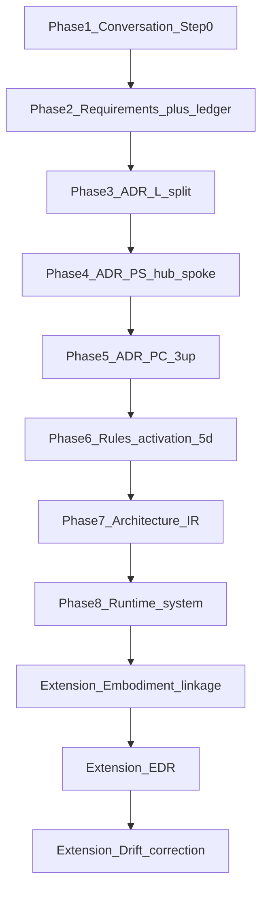
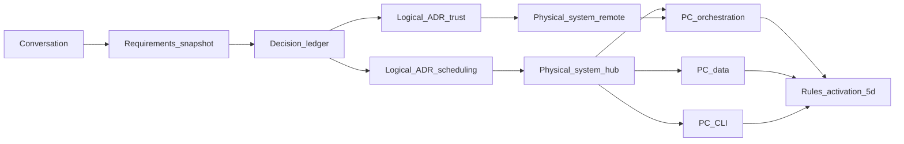

# Diagram — STE pipeline (Instance Scheduler example)

**How to read this:** Top to bottom is the **canonical eight-phase** spine, then the **extension** (embodiment linkage, EDR, drift). This walkthrough uses **split** logical and physical ADRs where the real solution has **natural seams** (scheduling vs trust; hub vs spoke; orchestration vs data vs CLI).

**Customization for this system:** **Hub/spoke** AWS deployment, **Lambda** orchestration, **DynamoDB** state, **EventBridge** scheduling, **cross-account IAM**.

**Refinement ladder (split ADRs):**

## Files (reading order)

- [Step 0 — Phase 1 conversation](../00-ste-conversation.md)
- [Step 1](../01-requirements-snapshot.md) through [Step 5c](../05c-physical-component-cli.md)
- [Step 5d — Rules activation](../05d-rules-activation.md)
- [Step 6 — Derived Architecture IR](../06-derived-architecture-ir.md)
- [Step 7 — Runtime + linkage](../07-code-semantic-linkage.md)
- [Step 8 — EDR](../08-edr-example.md) · [Step 9 — Drift](../09-drift-and-correction.md)

See [Part 11 overview](../../00-overview.md) for the full **phase map** and **artifact lineage** table.
