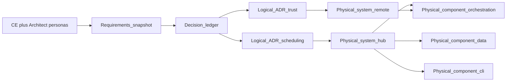

# Diagram — Intent to design (Instance Scheduler example)

**How to read this:** Step 0 is a **single-user** design chat: the **conversation engine** plus **Architect agent** with **signal-activated personas** (e.g. FinOps, Security, **AWS Cloud**, Operations)—in full STE, **ste-rules-library** projections would decide which personas fire and later **project into ADRs**. Later steps **split** logical and physical ADRs where the real solution has **natural seams** (scheduling domain vs trust; hub vs spoke; orchestration vs data vs CLI).

See [Step 0](../00-ste-conversation.md) through [Step 5c](../05c-physical-component-cli.md).
