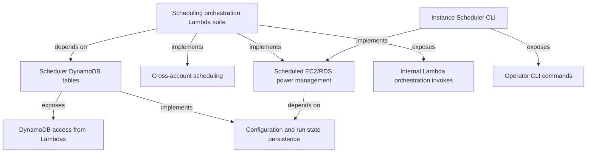

<!--
  Generated projection — do not hand-edit.
  Source: ../../ir/architecture-ir.json
  Regenerated via STE projection adapter (see ../projection-queries.md).
-->

# Capability / component projection (from Architecture IR)

