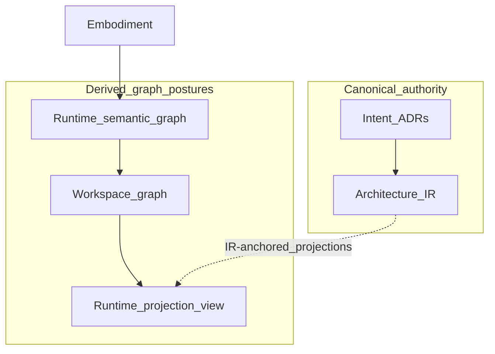

# Semantic Graphs

## The Problem

Architecture work often produces many graph-shaped things: entity registries,
dependency graphs, call graphs, topology diagrams, workspace maps, and
assistant context bundles. They look similar enough that teams start using
"the graph" as if it named one authority. That is where drift enters. A graph
that was built from runtime extraction, stale code, or a partial workspace can
be useful and still be the wrong object to govern from.

The failure mode is not graph tooling itself. The failure mode is losing the
distinction between declared intent, compiled **Architecture IR**, observed
embodiment, and **derived** graph views.

## The Reframe

A semantic graph in STE is useful when it preserves meaning, identity,
provenance, and authority boundaries. It is harmful when it becomes a second
source of truth.

At handbook altitude, semantic graphs are derived navigational and reasoning
surfaces. They help people and tools ask better questions: what depends on this
component, which ADR claims are embodied here, which integration crosses a
repository boundary, which projection is stale. They surface what is connected and observable. **ADRs** close reasoning paths
through negative space—alternatives ruled out and constraints that bound the
design space. A single graph traversal does not substitute for that
intent-level closure. Aggregated across decisions and repository slices,
though, repeated negative patterns can carry gravity: they may surface derived
pressure to revisit **policies**, **invariants**, and **rules**—governance
signals in the same family as staleness and coverage gaps, not replacements
for **ADRs** or **Kernel** assessment. Semantic graphs also do not by
themselves complete a chain back to intent, answer what is missing, or authorize
change. They do not replace ADRs, **Architecture IR**, evidence, **Kernel**
assessment, or governance.

## The Model

### Graph substrate and authority

STE has more than one **graph posture**—artifact class plus provenance, not
diagram shape:

| Graph posture | Role | Authority |
| --- | --- | --- |
| **Architecture IR** | Canonical machine-addressable architecture model for a declared scope | Normative semantics and contracts live in **ste-spec** |
| Runtime semantic graph | Extracted view of embodiment and related artifacts | Factual/derived runtime state, not intent authority |
| Workspace graph | Merged runtime graph across repository slices | Derived workspace navigation surface |
| Runtime projection view | Multi-resolution or compressed view for a task or audience | Derived representation |

The same node label can appear in more than one posture. That does not make the
postures interchangeable. Authority follows the artifact class and provenance,
not the visual shape.

Multi-resolution views may be produced from **Architecture IR** or from runtime
workspace graph material. [Projections](../04-architecture-model/04-09-projections.md)
names both lineages and the shared rule: derived, reproducible, traceable—not a
second authority source.

### Intent models and evidence models

The most important distinction is not whether a representation is graph-shaped.
It is what kind of truth the graph is allowed to carry.

An intent model records authored commitments: decisions, constraints,
invariants, interfaces, and other artifacts governed by review. **Architecture
IR** is the architecture-layer graph posture compiled from that intent. An
evidence model records what **Runtime** observed or derived from embodiment:
source references, extracted relationships, implementation attribution claims,
freshness state, and diagnostics. Evidence models can be highly structured and
useful, but they remain observation-side material.

Source-aware graph entries strengthen traceability between those worlds. They
let a reader follow a runtime node or edge back to the source artifact that
owns the claim. They do not make the runtime graph the owner of that claim.

### Slices and merge

Workspace graph systems often start with per-repository slices. A slice is a
bounded claim about what runtime extraction observed in one repository. A merge
step can combine slices, fold cross-repo edges, and record partial failures.

The merge result is valuable because it makes multi-repository embodiment
navigable. It is still **derived**. If a merged graph says one service calls
another, the responsible reader should be able to follow provenance back to the
source artifact and then to the relevant intent or evidence surface.

**Example:** A merged workspace graph shows **Service A** in repository R1
calling **Service B** in repository R2. The edge is navigational evidence from
runtime extraction—it helps a reviewer ask whether that integration is
intended. Before the edge enters a governance narrative or **MVC**, trace
provenance to the source repositories and artifacts, then to the ADR or
interface record that should govern the relationship. If merge metadata records
partial failure (some repository slices did not validate), that partial state
must stay visible: a useful graph is not automatically a complete one.

Graph traversal is therefore discovery, not judgment. It can find candidate
neighbors, dependencies, source references, and gaps that belong in a context
baseline. It cannot decide by itself that a relationship is intended, compliant,
or safe. Those claims require authored intent, evidence interpretation,
**Kernel** assessment where applicable, and governance.

### Semantic compression

Full-fidelity graphs can be too large for human reasoning. Semantic compression
groups nodes, filters lower-value edges, collapses repeated relationships, or
selects a resolution level. Done well, this is not summarization by mood; it is
a deterministic projection function.

Compression creates obligations:

- Preserve traceability from aggregate nodes to member nodes.
- Preserve enough source-edge information to explain compressed relationships.
- Label the projection level and derivation.
- Avoid presenting a compressed view as complete when it is scoped.

### AI-facing use

AI tools benefit from semantic graphs because graphs provide boundaries,
relationships, and provenance that prompts cannot reliably reconstruct. The
same benefit creates risk. A stale graph gives the model structured confidence
in outdated state.

For AI-facing workflows, semantic graph material should pass through freshness
and preflight checks before it enters **MVC** or other high-stakes context
bundles. If the graph is partial, stale, or heuristic, that state must remain
visible to the consumer.

When graph traversal feeds context assembly, **Runtime** should preserve the
chain from discovered graph material to source references, evidence records,
freshness labels, and negative-space diagnostics. Bounded reasoning is safe
only when the compressed or minimized context still shows what it came from and
what it leaves unresolved.

## The Implications

Treat graph generation as part of the control loop, not documentation polish.
Graph pipelines need owners, freshness rules, validation checks, and clear
labels for partial state. If a graph supports review or AI context assembly,
its derivation should be auditable.

The strongest discipline is to fix the highest-authority layer that is wrong.
If intent is wrong, amend the ADR or specification. If extraction is wrong, fix
runtime logic and regenerate. If a projection is confusing but the graph is
right, fix the projection function. Do not patch a derived graph as if it were
the source of truth.

## Relationship to STE system

Exact wire formats and promotion boundaries for runtime graph surfaces live in
**ste-spec** as contracts mature; handbook rules here are authority and
traceability discipline, not schema reference.

- **Architecture IR:** [IR as a graph](../04-architecture-model/04-07-ir-as-a-graph.md) names the canonical architecture model posture.
- **Projections:** [Projections](../04-architecture-model/04-09-projections.md) explains graph-to-view functions and multi-resolution projection posture.
- **Runtime:** [The Runtime Model](../08-runtime/08-01-the-runtime-model.md), [Runtime Architecture Components and Flow](../08-runtime/08-09-runtime-architecture-components-and-flow.md), and [Governance Signals and Semantic Graph Lifecycle](../08-runtime/08-07-governance-signals-and-semantic-graph-lifecycle.md) explain derived runtime graph state, component flow, freshness, and governance signals.
- **Governance:** [Authority and decision rights](../06-governance/06-03-authority-and-decision-rights.md) states why derived exports are not a second canonical architecture.
- **Kernel:** [Kernel reasoning surface](../07-kernel/07-05-kernel-reasoning-surface.md) explains why graph-derived context must not become informal admission.

## Summary

- Semantic graphs are powerful because they preserve relationships, identity,
  and provenance across artifacts.
- Intent models and evidence models may both be graph-shaped, but they carry
  different authority.
- **ADR** negative space closes design alternatives at the point of decision;
  repeated negative patterns across slices can surface derived pressure on
  policies, invariants, and rules without becoming authority.
- Graph posture matters: **Architecture IR**, runtime graph, workspace graph,
  and runtime projection views are not the same authority.
- Workspace slices and merged graphs are derived runtime state; they help
  navigate embodiment but do not replace canonical intent.
- Graph traversal supports context discovery; bounded reasoning still depends
  on provenance, freshness, source references, and visible negative space.
- Semantic compression is acceptable when deterministic and traceable.
- AI-facing graph context must carry freshness, partial-state, and provenance
  signals into reasoning.
