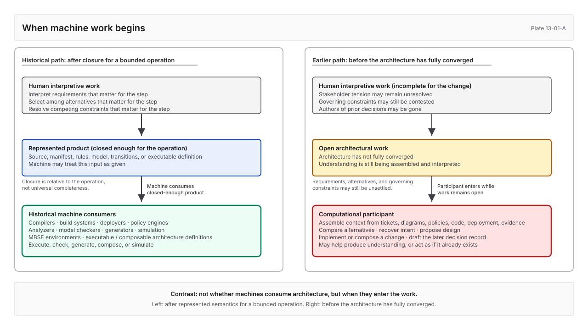
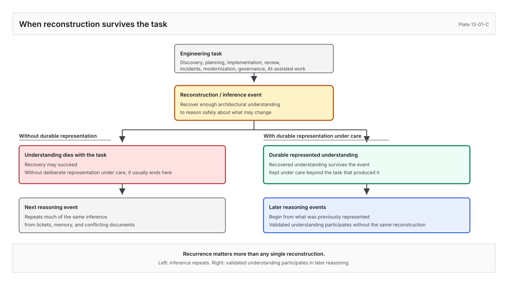
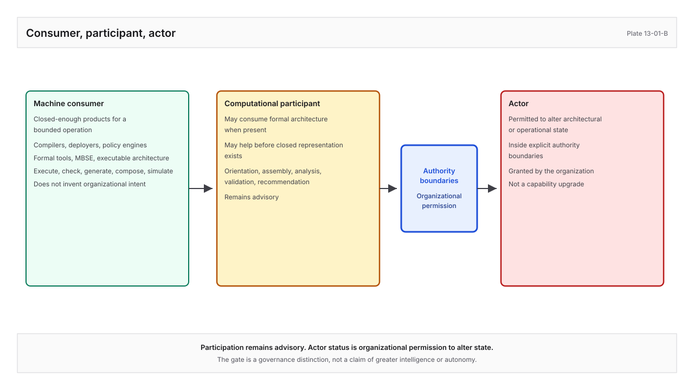

# When Machines Stopped Waiting

*Why Architectural Understanding Became the Engineering Problem*

For most of my career I never asked who architecture was for.

Requirements went to analysts and stakeholders. Diagrams went into reviews so people could argue about boundaries. Decision records were written so someone arriving months later could recover what had been chosen and why. Design documents sequenced a problem for the next engineer who would inherit it.

Questions still filled the room.

Not because the diagrams were poorly drawn. Not because the architects had forgotten the system. Each participant needed a different understanding of the same architecture. Security looked for trust boundaries that the deployment view intentionally ignored. Operations asked questions the design document was never written to answer. Developers traced implementation constraints that executives neither needed nor wanted to see. Someone usually knew the answer. It simply lived somewhere else: another artifact, another meeting, another repository, or another engineer's memory.

In many organizations the record was thinner still. The diagram was never drawn. The decision lived in a meeting and nowhere else. The design document aged into a misleading snapshot that was harder to maintain than to ignore. What remained were breadcrumbs: tickets, outdated decks, tribal memory, and residual references.

Architecture archaeology became ordinary craft.

The organization paid for it in onboarding, design reviews, incident response, modernization, and every effort that began by reconstructing why the current system existed before deciding how it should change. The knowledge had rarely disappeared. It had become distributed across documents, conversations, decisions, implementations, and people.

Architectural practice evolved around people who could complete what the artifacts left unsaid. The arrangement was rarely discussed because it worked remarkably well.

The artifact preserved enough. The reader supplied the rest.

A diagram did not record every decision behind a boundary because the architect presenting it could explain the missing reasoning. A decision record did not formalize every relationship because the team already shared the project. A requirement did not always carry its full authority chain because the people in the room knew where it came from. A component did not declare which decision it embodied because the engineers who built it still remembered.

None of this was negligence. It was a rational adaptation to the people architecture was written for.

Human readers tolerate ambiguity remarkably well. We hear "the gateway," "the ingress layer," and a service name and understand they refer to the same architectural element. We recognize that one diagram presents a deployment view while another explains responsibility. We reconcile implementation that has drifted from design. We separate intended architecture from operational reality. We know which polished document has become historical, which unfinished design note quietly governs the next release, and which conversation settled a question that never found its way into the record. When sources conflict, an experienced engineer can hold both explanations while deciding which deserves trust, and may look at runtime evidence for what the system actually did. That reconciliation often never becomes an architectural operation on a page. It is simply what people do.

Architecture lived partly in its artifacts and partly in the people who could complete them. Design reviews, planning sessions, incident bridges, modernization workshops, onboarding walkthroughs, and informal conversations carried context the durable record did not. Senior engineers became historians, identity resolvers, and interpreters of inconsistency. New engineers learned not only where the documents lived, but which documents to distrust and whom to ask about the gaps.

That arrangement was already lossy. People compensated. For a long time, that was enough.

I used to call this a human compact. Representational compact may be more precise: the artifacts were allowed to remain partial because experienced humans completed them through memory, conversation, institutional history, judgment, and access to other people. Whatever name survives, the practice remains useful for human communication. Computational participation exposes its limits. It does not prove that writing architecture for humans was a mistake.

## Machines were already there

Machines sat in the same organizations the entire time. Compilers took source. Build systems took manifests. Deployers took infrastructure definitions. Policy engines took rules. Analyzers took syntax trees. Model checkers took formal models. Code generators took schemas and templates. Simulation environments took executable descriptions of behavior. In shops that practiced model-based systems engineering (MBSE), tools reasoned over system models that teams had already authored with considerable discipline. Elsewhere, executable architecture, state machines, and composable architecture definitions carried structure into generation and validation.

I treated those systems for a long time as infrastructure for producing software, not as readers of architecture. Looking back, that was incomplete. They were consuming architectural and engineering products. Some of them performed substantial machine reasoning: consistency checking, interface analysis, composition, transformation, simulation, generation. They were not passive pipes, and they were not waiting for modern language models to invent machine participation.

A compiler does not invent the program's purpose. Someone has already decided what the source should express. A deployment system does not select a topology from competing operational constraints that have not yet been encoded. Someone has already written resources, networks, and release shape into a form the deployer can treat as given. A policy engine does not negotiate which obligation should govern a borderline organizational case. Someone has already written the rule it will enforce.

The more ambitious systems fit a related pattern once I stopped looking for a story in which they were merely “dumb.” Formal verification consumes properties that have been stated. State machines consume transitions that have been declared. Executable models consume behavior that has already been represented as behavior. MBSE environments do real work inside a model whose semantics the organization has already committed to representing. They do not invent that model from hallway conversation, ticket threads, and half-remembered review decisions. They assume enough architectural understanding has been brought into explicit form that mechanical reasoning can begin for the operations they support.

Composable and executable architecture definitions go further still. Architecture decision records (ADRs) for physical systems (ADR-PS) and physical components (ADR-PC), for example, can be designed so identities, relationships, and accepted decisions are explicit enough for composition and machine-assisted realization. That is not a counterexample waiting to overturn the essay. It is evidence that architecture can be deliberately authored as substrate rather than recovered as folklore, and that earlier engineering already knew how to move meaning into forms machines could use once the relevant meaning had been written down.

I used to summarize the old world as “machines consume code and configuration; people consume architecture.” That sentence was wrong. Machines have long consumed architectural products. What they typically received were products whose meaning had already been closed enough, for a bounded operation, to execute, check, generate, compose, or simulate.

Call that **semantic closure** if a name helps. I did not need the name in the rooms where the work happened. I needed the experience: by the time those machines ran, someone had already interpreted the requirements that mattered for the step, selected among alternatives that mattered for the step, resolved the competing constraints that mattered for the step, and written something the machine could treat as given.

Closure here is not a claim that architecture becomes universally complete. A compiler may receive enough closure for compilation while the larger rationale remains unfinished. An MBSE environment may receive enough represented semantics for analysis while organizational politics and unsettled stakeholder values remain outside the model. The operation has a boundary. The representation is sufficient relative to that boundary.

Architecture practice developed around a different kind of completion for everything that remained open.

## Then the work started earlier

**Plate 13-01-A.** When machine work begins. Historical machines consume a closed-enough product for a bounded operation; the computational participant enters while architectural work remains open. Explanatory projection only; the essay prose is authoritative if figure and text diverge.

Something shifted in how computational systems entered architectural work, not that machines arrived for the first time, but that they were invited into a different stage of it.

I began seeing computational tools asked to participate much earlier in the engineering process. They interpreted requirements that still contained unresolved stakeholder tension. They compared alternatives before the team had agreed which constraints governed the decision. They reconstructed architectural intent from repositories whose original authors had long since left. They assembled working context from tickets, diagrams, policies, source code, deployment definitions, and operational evidence before recommending a design, implementing a change, or drafting the decision record that would later explain what had been done.

Those requests do not resemble asking a compiler to compile, or asking an MBSE environment to analyze a model the team has already authored. They more closely resemble inviting a new architect into an active design effort before the architecture has fully converged.

A new architect is not expected to simply know why one requirement quietly overrides another, why an implementation intentionally diverges from its original design, which operational constraint exists because of a regulatory obligation, or which architecture decision superseded the one still referenced throughout the codebase. Organizations expect that understanding to be developed through onboarding, design reviews, mentoring, documentation, operational experience, and conversation. It is treated as preparation for participating responsibly in architectural work.

Computational participants rarely receive that preparation. Instead we provide repositories, tickets, diagrams, decision records, policies, source code, and retrieval systems, then expect the missing relationships to emerge during reasoning. When they do not, the outcome is often described as a failure of the model.

Most of the time the results were plausible. Often they were impressively so. That turned out to be part of the problem.

A proposed implementation appeared correct until it quietly violated an assumption held somewhere else in the system. A refactoring simplified one service while breaking a consumer whose dependency had never been represented. A data contract was updated without recognizing mutation rules that had governed it for years. A cost optimization reduced infrastructure spend by violating regulatory retention requirements that existed in policy rather than code. A security control disappeared because its purpose had been discussed in a review but never preserved in the architectural record.

The failures looked different. The pattern was remarkably consistent. The participant had assembled enough understanding to complete the immediate task, but not enough understanding to recognize the broader architectural obligations surrounding the change.

I stopped asking whether the model had reasoned correctly. The more useful question became whether the architectural environment had preserved enough understanding for any new participant, human or computational, to reason within the appropriate boundaries. The failures were rarely caused by an inability to generate an answer. They emerged when architectural understanding had to be reconstructed before meaningful reasoning could begin.

Compilers, deployers, policy engines, model checkers, executable definitions, and MBSE environments still matter in this picture. They remain the clearest evidence that engineering has always contained machine consumers of architectural products. They also mark a boundary of timing, scope, and responsibility. They generally begin after enough understanding has been represented for a defined operation to proceed without inventing organizational intent. The newer participant is being asked to help produce that understanding, or to act as if it already exists when it does not.

I first framed this as architecture acquiring a second consumer. The phrase pointed at something real and still misled. The historical objection arrives immediately: machines have consumed representations for decades. The second consumer is not the first machine. Architecture has acquired a computational participant, one that may consume formal architecture when it exists, and may also help assemble, interpret, evolve, and operationalize architectural understanding before a closed formal representation exists for the work at hand.

## Where reconstruction shows up

An ambiguous diagram is manageable in a review when the architect who drew it is in the room. It is less manageable when an agent uses the diagram to decide which boundary it may alter.

A vague decision reference is tolerable when a human reviewer recognizes the intended ADR. It becomes more consequential when a machine uses the reference to decide which files are in scope.

A stale implementation map is inconvenient during a documentation cleanup. It becomes dangerous when it defines the blast radius of an automated change.

I watched this during ordinary work, not laboratory demos. In architecture reviews, the diagram on the screen is rarely where the conversation stays. Reviewers probe beyond it for assumptions, governing decisions, authority, constraints, trust boundaries, dependencies, implementation realities, operational behavior, regulatory obligations, and historical rationale. The review does not invent that incompleteness. It exposes understanding that already extended past the projection under discussion. The answers are reconstructed collaboratively through conversation, institutional memory, related artifacts, runtime evidence, and the engineers who still carry what the record never held. Onboarding spends months learning which sources are ceremonial and which still bind. Incidents reconstruct intended behavior from runbooks, tribal memory, and the last change ticket. Modernization programs spend half their schedule recovering why the current topology exists before anyone can responsibly replace it. Design sessions negotiate values that never quite land in the same artifact, and implementation diverges until a later review discovers that “what we decided” and “what we built” parted company without a recorded supersession.

Humans absorb that friction as craft. When the same friction meets a computational participant, what is missing from the assembled environment does not reliably enter the reasoning.

Someone must still identify the relevant systems, decisions, constraints, dependencies, implementation surfaces, evidence, and authority boundaries, then assemble them into a setting where the task makes sense. Different people assemble different settings. One engineer includes the security constraint that dominates their view of the system. Another emphasizes deployment topology. A third provides the immediate requirement and omits the earlier decision that limits how it can be satisfied. Each reconstruction may be conscientious. Each may still hand the participant a different architecture.

Better prompts improve a single interaction. Retrieval finds more source material. Larger context windows hold more documents. More capable models reconstruct implicit relationships more often. None of that makes the reconstructed understanding durable. The same recovery returns in discovery, planning, implementation, review, testing, incident response, and the next change. As computational reasoning enters the ordinary path, architectural consumption becomes frequent. An arrangement that deferred reconstruction cost to occasional human readers now spreads that cost across repeated machine reasoning events as well.

Plausible reconstruction is not preserved understanding. Architecture cannot treat either as a substitute when the next action depends on the result being correct, complete, and bounded.

Reconstruction is also not a one-time activity completed at the beginning of a project. Every new engineering task begins by recovering enough architectural understanding to reason safely about what may change. Discovery does it. Planning does it. Implementation does it. Review, testing, incident response, modernization, and governance do it. AI-assisted work does it whenever a participant must assemble context before acting. Each recovery may succeed. Unless that understanding is deliberately represented and kept under care, it usually dies with the task. The next reasoning event then repeats much of the same inference.

That is why recurrence matters more than any single reconstruction. Inference paid only once can look like ordinary craft. Inference performed independently across many tasks, teams, and tools leaves the organization reconstructing what it had already known. Durable representation lets recovered understanding survive beyond the event that produced it. Later discovery, planning, implementation, review, governance, incident response, and computational participation can begin from what was previously represented rather than inventing it again from tickets, memory, and conflicting documents. The engineering benefit is not merely that information was stored. It is that validated understanding can participate in future reasoning without requiring the same reconstruction. As architectural complexity grows, as organizational scope widens, as authority domains diverge, as historical decisions accumulate, and as implementation surfaces proliferate, the share of understanding that can be reused should grow if that representation is governed well. This is not fundamentally an argument about machines. It is an architectural argument about repeated inference versus understanding that outlives the task that recovered it.

**Plate 13-01-C.** When reconstruction survives the task. Successful reconstruction usually ends with the task unless deliberately represented; preserved understanding can participate in later reasoning without the same reconstruction. Explanatory projection only; the essay prose is authoritative if figure and text diverge.

## Why representation becomes the work

Most organizations never decide, formally, what their canonical architectural representation is. Canonical state accumulates. Requirements systems hold some of it. Diagrams hold some. Decision records hold some. Source, infrastructure, tickets, reviews, policies, and operational systems hold more. Experienced engineers hold the rest.

When a question arises, people gather what looks relevant and reconstruct an answer. That works until the sources disagree or the question crosses their boundaries. A diagram shows one topology. Deployment configuration shows another. An accepted decision records intended direction. A later ticket contains an exception. Source reflects the implementation as written. Runtime evidence shows the deployed system behaved differently under a particular condition.

None of these sources is universally authoritative for every claim. The decision may be authoritative for accepted intent. The policy may be authoritative for what is permitted. The repository may be authoritative for the code it contains. Deployment state may be authoritative for what was released. Telemetry may be authoritative for what was observed during a declared interval. Selecting one artifact class and declaring it the universal source of truth does not resolve this. Different sources establish different kinds of claims.

What has to become durable is a representation that preserves what each source is allowed to establish and how those claims relate. That representation does not have to be one file or one centrally authored model. Canonicality is a governance property before it is a storage choice: the governed locus where identity, relationships, authority, provenance, scope, and lifecycle are explicit enough to survive changes in presentation.

The properties matter because of how reconstruction fails, not because architecture needs another taxonomy.

Without stable identity, every traversal begins with entity resolution. “The gateway,” a service name in a repository, and a box on last quarter’s diagram may or may not be the same thing. Reasoning cannot start until interpretation finishes guessing. Relationships need the same treatment. A decision may interpret a requirement, constrain a component, refine an earlier decision, or supersede part of it. “Related to” collapses those consequences. Supersession is not citation. Embodiment is not evidence. Evidence for a requirement is not an incidental test that happens to touch similar code.

Authority has to be represented rather than inferred from polish, repository location, or confidence of tone. A generated summary should not silently inherit the authority of its sources. A computational inference should not become accepted architecture because it is plausible or repeatedly reproduced. A validator should not be mistaken for an author of organizational intent merely because it can reject invalid structure. Lifecycle has to stop being reconstructed from dates, filenames, and narrative tense. A reader, human or machine, should be able to tell whether a decision is proposed or accepted, whether it still governs its original scope, whether part of it has been superseded, and which later state replaced it. Historical decisions often remain relevant after they cease to govern. Leaving several documents in a repository is not the same as preserving that continuity.

Intent, embodiment, evidence, observation, and inference interact. They are not interchangeable. An accepted decision is not proof of implementation. A source annotation is not proof of satisfaction. Telemetry is not proof that the architecture was wise. A synthesis of several sources is not a new source of organizational authority. Flattening those differences produces representations that look complete while concealing what has actually been established.

Much of the detailed doctrine for how such a substrate should behave belongs in the core handbook. The essay’s claim is narrower: once computational participation begins before the work is finished for the machine, architecture can no longer treat those distinctions as optional background knowledge carried only by people.

## Different projections, same substrate

People and computational systems do not benefit from identical presentations of the same architectural state. That is not a clean binary. Humans benefit from explicit identity, provenance, and structure. Machines can benefit from narrative explanation of why a tradeoff was accepted. Emphasis, reliability, and how much ambiguity each form of participation can safely tolerate still diverge.

People reason through narrative, sequence, emphasis, visual abstraction, judgment, and selective omission. A useful decision record guides attention. A useful diagram excludes most of the system so one concern becomes visible. Those omissions are often features of good human communication, because conversational repair and institutional memory remain available.

Computational participation depends more heavily on explicit identity, typed relationships, provenance, lifecycle, declared scope, authority boundaries, and bounded traversal. It needs to know whether an absent relationship means no relationship exists, that it lies outside the current view, or that the underlying representation is incomplete. It needs to distinguish an original claim from a generated summary of it. Leaving those questions to opportunistic reconstruction may be tolerable for a human reader who can ask a colleague. It is a different risk when the next step is a proposed change, a composed architecture fragment, or an automated edit.

Trying to serve both through one universal artifact tends to serve neither well. A document optimized entirely for machine parsing becomes burdensome for people to author and discuss. Architectural reasoning contains ambiguity, unresolved alternatives, historical conditions, and value judgments that do not always fit a rigid schema without damage. A document optimized entirely for human narrative forces every machine, old and new, to reconstruct stable identity, relationships, authority, and lifecycle each time it consumes the architecture. Compilers avoided that burden because we already closed the semantics into source for their operation. The newer participant cannot avoid it if we leave architectural understanding open and ask the machine to close it opportunistically for each task.

The durable representation of architectural state can separate from the projections through which particular consumers engage with it. A decision record can remain a narrative of what was decided and why while referring to stable entities and relationships beneath the presentation. A diagram can remain a selective view while retaining traceability to the elements it depicts. An executive can receive a projection emphasizing capabilities, risk, and unresolved choices. An engineer can receive governing intent, constraints, affected components, and evidence obligations. An auditor can follow obligation to decision to embodiment to evidence. A computational reasoner can receive a bounded representation containing the identities and relationships required for a task.

Calling documents and diagrams projections does not demote them. It releases them from carrying incompatible jobs at once. A human document no longer has to be both an effective explanation and the only computational source from which every architectural relationship must be recovered. It can communicate better to people because identity, provenance, lifecycle, and relationship semantics exist elsewhere in a governed representation. Narrative still belongs. Some meaning cannot be reduced without damage: the conditions under which a tradeoff was accepted, the competing values, the organizational reasoning behind a risk. The represented system can preserve that explanation while distinguishing it from the identity, relationships, scope, and authority that should not drift with wording.

Nor does every system need maximal depth. A temporary prototype does not need the representational rigor of a regulated platform spanning many repositories and authority domains. The investment should track how long the system will live, how often it will change, how much of its architecture still lives only in memory, how much authority computational participants will receive, and what an incorrect reconstruction could cause. Representation proportionate to the consequence of reconstruction failure.

The previous model did not remove the cost. It deferred and multiplied it across onboarding, reviews, incidents, modernization, and every session in which a machine is asked to reason from incomplete architecture. A durable representation amortizes understanding: represent a stable relationship once, govern its evolution, and let it participate in many later reasoning events.

## Humans remain

None of this transfers architectural responsibility to machines.

People still establish intent. They interpret obligations whose meaning cannot be settled by syntax. They negotiate among competing concerns. They decide which risks are tolerable and which exceptions are justified. They grant authority and remain accountable for what follows.

Machines contribute different capacities. They can traverse larger relationship surfaces, compare claims across repositories, assemble task-specific context, generate candidates, identify inconsistencies, test structural contracts, compose executable fragments, and under controlled conditions perform bounded actions. They may surface relationships no individual noticed and preserve continuity across more material than working memory holds.

Capability does not create authority. A system may identify a governing decision, discover a contradiction, generate a candidate architecture, write an implementation, or prepare a persuasive decision record without possessing organizational authority to accept risk, approve the design, reinterpret policy, supersede a decision, or bind stakeholders. Human participation is not an approval click at the end of an automated path. Humans establish intent, negotiate values, interpret obligations, grant authority, accept consequences, and remain accountable.

The architectural problem is not to choose between human and computational participants. It is to stop forcing both through one representation optimized primarily for the compact of “preserve enough; the reader will complete the rest,” a compact that worked while the primary completer was a person, and while machines waited for products already closed enough for their operations.

Engineering has always contained machine consumers of formal products. Compilers, deployment systems, policy engines, formal tools, executable architecture, and MBSE environments proved that decades ago. The newer pressure is how early computational participation begins, and therefore how much of architectural understanding must already be represented before participation is safe.

When understanding itself becomes the engineering problem, architecture can no longer live primarily as a set of human-facing explanations that hope the next reader will reconstruct what the organization already knew.

## One response

System of Thought Engineering (STE) is one attempt to build an environment equal to that obligation. It is not the premise of this essay, and its particular components are not inevitable. The pressure it answers is broader: architectural understanding must become durable, traversable, governed, reusable, composable, and projectable, without allowing the representation itself to manufacture authority.

In that environment, accepted decisions can be encoded with explicit identity and relationships; projections can serve human explanation without becoming the only recoverable source of truth; and executable architecture can be derived from represented substrate rather than reconstructed from prose for every change. ADR-PS and ADR-PC records are one family of artifacts aimed at that kind of composition. Separately, governed execution, where invalid state cannot simply be papered over by retrying an answer, belongs to a related discipline of how reasoning runs once obligations exist. This essay operates one layer earlier: what representation must exist if computational participation is to be governable, reusable, and safe before the work is finished for the machine.

Participation alone does not make a computational system an actor. A participant may help with orientation, context assembly, analysis, candidate generation, validation, or recommendation and still remain advisory. It becomes an actor only when the organization permits it, inside explicit authority boundaries, to perform engineering work that can alter architectural or operational state. That turn is a governance distinction, not a claim that the system has become more intelligent or autonomous.

**Plate 13-01-B.** Consumer, participant, actor. Participation remains advisory; becoming an actor is organizational permission to alter architectural or operational state inside authority boundaries. Explanatory projection only; the essay prose is authoritative if figure and text diverge.

Architecture still has human readers. It has always had machine consumers of closed products. It now has computational participants asked to work earlier. Under controlled conditions those participants become actors.

The canonical representation must become machine-traversable because machines are permanent engineering participants across more of the lifecycle than execution alone. It must remain human-governed because architecture still expresses human intent, judgment, responsibility, and authority.

The aim is not to defend architecture from machines. It is to construct an environment in which human and computational reasoning can meet without requiring either to reconstruct the system from artifacts that were never designed to carry its meaning alone, and without pretending that every machine in our history arrived at the same stage of the work.

## Relationship to the handbook

This essay is a **conceptual essay** in [Part 13: Architectural Essays and Deep Dives](13-00-essays-and-deep-dives-overview.md). It is explanatory. It does not define STE contracts, and it is not research evidence.

Detailed doctrine for the obligation it motivates lives in the core handbook:

- Lossy reconstruction and intent: [The problem of lossy reasoning](../00-problem/00-02-the-problem-of-lossy-reasoning.md), [Architecture as a first-class artifact](../00-problem/00-04-architecture-as-a-first-class-artifact.md), [The STE thesis](../00-problem/00-08-the-ste-thesis.md)
- Decisions and durable intent: [Architecture decision records](../03-artifacts/03-01-architecture-decision-records.md)
- Canonical model and projections: [Architecture Intermediate Representation (IR) overview](../04-architecture-model/04-00-architecture-ir-overview.md), [Projections](../04-architecture-model/04-09-projections.md)
- Authority ceilings: [Authority and decision rights](../06-governance/06-03-authority-and-decision-rights.md)
- Machine participants: [Agents](../10-ai-interface/10-01-agents.md)

Normative semantics remain in **ste-spec**. Research claims and methods remain in [Part 14](../14-research/14-00-research-overview.md).

**Previous:** [Architectural Essays and Deep Dives overview](13-00-essays-and-deep-dives-overview.md)
