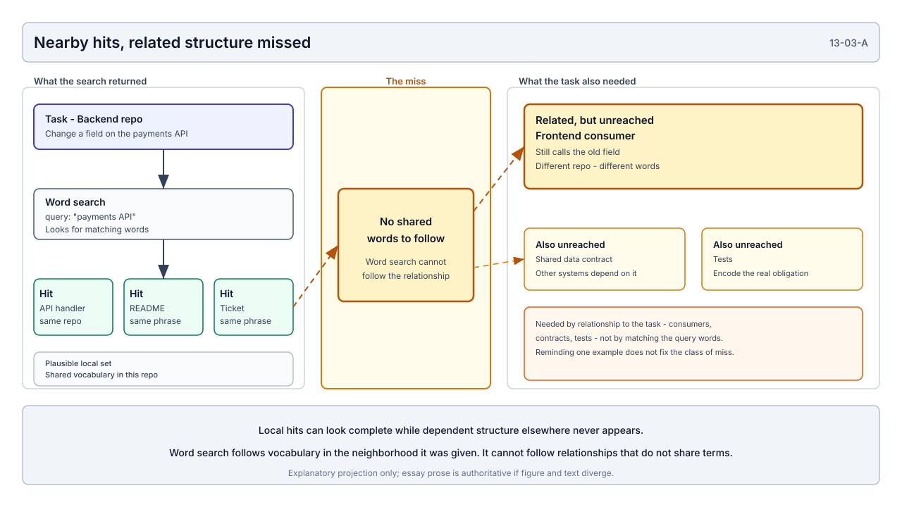
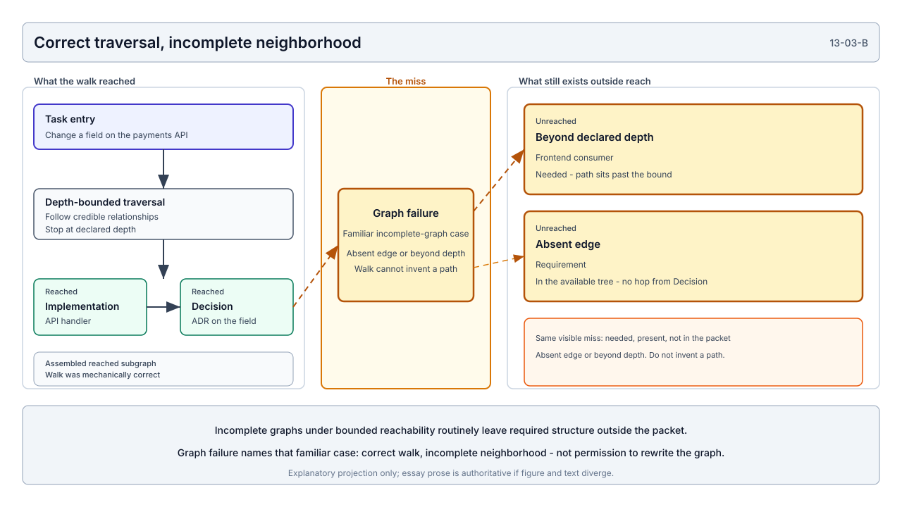
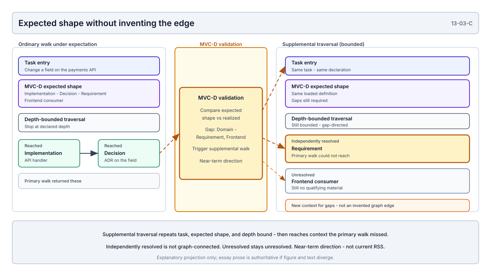

# The Shape of Sufficient Context

*Searching for the structures that make reasoning viable*

Buying a house is not a retrieval problem.

A listing, photographs, asking price, and a few address-linked records can be assembled quickly. None of that, by itself, is enough to decide whether to buy. The decision needs a recognizable structure of understanding: what the property is, what it must support, what it costs and constrains, what depends on financing or commuting, who decides, what evidence of condition exists, what risks or exceptions remain open, and what conclusion can still be revised when better evidence arrives.

Absence is consequential. A missing inspection does not leave the decision unchanged. An unresolved title issue, an unavailable insurance determination, or a disputed easement changes what can responsibly be concluded. Silence is not neutrality. It is a different state of the decision.

People do not merely collect everything that mentions the house. They assemble forms of understanding the task requires. I do not claim a settled model of cognition. The observation is narrower. Recurring tasks appear to require recurring structures of understanding. The facts change from house to house. The shape of what must be known may recur.

Software systems invite the same mistake the house listing invites. You can assemble a lot of nearby material and still lack a structure of understanding. Context is not reasoning. It is what makes reasoning viable. A person who holds the right forms of understanding is more likely to conclude acceptably: to answer what can be answered, keep the qualifications that matter, notice contradiction, and leave unresolved what is still open. I expect computational reasoners to depend on the same condition. A decision without the reason it binds is a thinner instruction than a decision carried with its constraints, alternatives, and authority. That is also why plans that carry both imperative steps and the norms that bind them tend to travel better than step lists alone: they preserve more of the condition reasoning needs. The useful question is not whether enough text can be found. It is whether the realized context preserves enough of the technical world for that kind of reasoning to be possible.

Sufficient context may have a task-relative structural shape.

The research path into that claim runs through Human-Assisted Substrate Completeness Analysis, or HSCA, and Minimal Viable Context definitions, or MVC-Ds. HSCA can lock an accepted substrate-closed answer and a typed envelope of what supported it. That envelope is not proven minimal. Later sections take up how candidate definitions are searched against those locked answers, and how successful shapes might eventually strengthen Runtime State Slicing, or RSS.

## Grep was not enough

I arrived here by watching outcome failures and analyzing them in systems I already knew deeply. Grep would return a plausible set of hits. The task still went wrong. Because I knew the system, I could often tell that a file I believed important had never been surfaced: a governing constraint under different language, a superseding decision, a consumer in another repository, attribution or evidence connected by relationship rather than shared vocabulary.



**Plate 13-03-A.** A local word search can look complete while related structure elsewhere — a consumer, a shared contract, tests — never appears. Explanatory projection only; the essay prose is authoritative if figure and text diverge.

I will not always be able to do that. No one can. Tribal knowledge is not a reconstruction method that survives handoff, scale, or time.

Once the failure mode had a name, it became something we could work with. The machine could only search for what the task or operator already knew how to name. Reconstruction depended on finding what the task was related to, including artifacts the initiating query could not anticipate.

The substrate emerged as a response to that failure.

Its purpose was not to create a larger place to search. It was to externalize technical-system understanding so reconstruction could follow credible structure rather than repeatedly guessing the correct vocabulary: identities, relationships, decisions, constraints, authority, embodiment, evidence, and lifecycle state.

## From substrate to RSS

The substrate is designed to be direction-neutral wherever relationship semantics permit it. A decision may lead to its implementation, and the implementation should be capable of leading back to the decision. Cross-domain relationships are represented where they can be asserted credibly, without forcing every consumer to begin from the same place.

Those edges matter because the path can be transitive. If an implementation embodies a decision, and that decision addresses a requirement, the requirement should be reachable from the implementation through that relationship path, even when they share no vocabulary. Lexical search does not provide that path. It can stumble into related artifacts when intermediate documents happen to share terms. It cannot follow the relationship itself.

Entry still affects the local neighborhood of a bounded traversal. Direction-neutral edges make the correct starting point less decisive. When relationships are dense enough, different entry points should often reach overlapping neighborhoods: less like choosing a different world than entering the same governed structure from another door. Depth bounds still create variance. Missing or stale edges still create graph failure. Convergence is earned and tested, not assumed.

RSS followed because a graph is not useful to a reasoner merely because it exists. A runtime needed a way to enter that graph from a declared task, traverse its relationships, and assemble a bounded working context.

The current form of RSS should be stated precisely. It performs depth-bounded traversal. Nothing more should be attributed to it.

```text
task entry
→ follow credible graph relationships
→ stop at declared depth
→ assemble the reached subgraph
```

A mechanically correct depth-bounded traversal can only return what the graph currently connects within the traversal boundary. A task may require a domain or structural role whose artifact exists elsewhere in the substrate while the relationship is missing, stale, disputed, beyond the depth boundary, or not yet credible enough to encode. The traversal may begin from an entry point whose bounded neighborhood does not reach it.

This is a graph failure: familiar, not an edge-case (that one was painful - I'm not sorry). Real-world graphs are routinely incomplete. A depth-bounded walk cannot reach what sits past the bound or across an absent edge. The needed node may be there. The admitting path may not. Correct algorithm. Wrong neighborhood for the task. Lift the bound and, without a better selection rule, the walk pulls in path-adjacent material the task never needed and poisons the packet. The bound is a trade you choose: miss what the neighborhood cannot yet reach, or flood the condition with what the task did not need.



**Plate 13-03-B.** A correct depth-bounded walk can miss needed structure that exists elsewhere - beyond the declared depth, or across an absent edge in the available tree. Explanatory projection only; the essay prose is authoritative if figure and text diverge.

Pretending the graph is complete would hide the failure. Allowing the runtime to invent the missing relationship would corrupt the substrate. Once the failure can be named, it can be solved without pretending the graph is finished or letting the runtime rewrite it.

Could a system preserve the authority of the graph, use ordinary traversal wherever the graph was sufficient, and still remain resilient when task-relative understanding exceeded the structure currently connected? That is where Minimal Viable Context research begins. MVC-D does not replace the graph. It is a resilient response to graph incompleteness that must not invent edges or silently repair substrate authority.

## Q, the Q context profile, and MVC-D

Without the question, there is no answer. Without the locked answer, the question is not yet an evaluable experimental object for MVC-D search.

That is the same constitution already named in the [MVC representation-ceiling thesis](../14-research/research/mvc/01-thesis/mvc-representation-ceiling-thesis.md): context is not information retrieved in the abstract. It is constituted when a declared task, a structured representation, and a consumer meet. The research names that binding as question, locked `Q`, and Q context profile.

A question can exist before `Q` does. What the experiment needs is an accepted substrate-closed answer locked under a declared snapshot, evidence boundary, and authority ceiling. That locked answer is `Q`: the evaluation target for the case, not a claim of universal truth or fitness authority.

HSCA closure produces more than an answer string. Around the accepted answer sits a Q context profile: the labeled support that made the answer defensible under that boundary. Domains, sources, relationships, authority, deliberate absences, and expected loss if something is removed. The profile explains supportability. It does not establish necessity, and it does not fix what every consumer would need for every related decision.

That is why a profile is not an MVC-D. The profile is one closed case. A candidate MVC-D is a revisable hypothesis about which structural participation should suffice for a task family and consumer. Realization assembles a context condition from that hypothesis. Evaluation asks whether `Q` and its required properties survive under that condition.

```text
Q
  = accepted substrate-closed answer under snapshot, evidence boundary, and authority ceiling

Q context profile
  = that answer's typed support envelope for one question and closure frame

candidate MVC-D
  = mutable hypothesis about which structural participation should suffice

realized MVC
  = context condition assembled from the candidate definition

Q-based evaluation
  = whether the accepted answer and required properties survive under that condition
```

Clustering profiles does not create a definition. Frequency is not necessity. The definition has to be searched.

## Accepted is not minimal

HSCA closure establishes supportability, not minimality.

The closure process may keep a broad envelope in order to make an answer credible. That does not prove every included domain, source slice, relationship, authority signal, or negative-space guard must participate in the final reasoning condition.

Return to the house. The listing, inspection, title packet, and financing file may sit on the same table. Shared object, overlapping evidence, not one shared task. A lender decides credit and lien risk under lending authority. An insurer decides coverage under underwriting rules. A buyer decides whether to purchase under a different set of needs and obligations. Same house. Different tasks, consumers, authority surfaces, and required outputs. Different viable context conditions.

If "context" only meant whatever fits in a shared packet, those three would collapse into one assembly. In STE they do not. Context is constituted by task, substrate, and consumer together. A locked `Q` can be supportable under one closure frame without fixing what every consumer must assemble for every related decision about the same object.

Conceptual ablation makes the gap visible. Remove runtime evidence from a declared-architecture question and nothing may move. Remove authority context and the wording may survive while the ability to tell binding decisions from explanation does not. Keep two nodes and drop their relationship, and the topology that made the answer possible is gone. Drop an unresolved exception and the positive conclusion can look cleaner than it has any right to. Similar wording can still conceal a failed reasoning condition.

We know what answer the available information supports under a declared boundary.

We do not yet know which structure of that information must participate for a given task, consumer, and reasoner condition to recover and appropriately qualify that answer.

That requires experimentation.

## Searching for shape without searching over truth

Once the experimental object is a candidate definition of participation, the permission boundary becomes unavoidable.

The search may vary which parts participate: domains, source slices, relationships, negative-space guards, roles, weights, bounded substitution within a domain, assembly parameters, and candidate lineage.

It may not rewrite the world under test. Source facts, authoritative requirements and decisions, evidence, authority, authoritative relationship status, `Q`, and the interpretation boundary stay fixed.

The experiment may ask whether a different participation structure produces a more viable reasoning condition. It may not improve the score by manufacturing substrate, by treating excluded evidence as if authority had moved, or by rewriting `Q` so a weaker condition looks successful.

Ablation must preserve the same ceiling. Leaving the easement out of one review packet does not erase the easement from the property. Setting the inspection aside does not reduce what the inspection established. Preferring financing questions over condition questions does not change what the bank or the roof actually require. The experiment changes what participates in the reasoning condition. It does not rewrite the house.

```text
authoritative substrate
  = governed facts available to reasoning

candidate MVC-D
  = revisable hypothesis about what should participate

realized MVC
  = concrete context condition assembled for a task and consumer

accepted Q
  = locked evaluation target under declared bounds
```

The search operates over the second object. It realizes the third. It must not mutate the first or the fourth.

Search is not authority. Selection is not correctness. Fitness is not truth. Convergence does not establish that a correct task-family representation has been discovered. Once a system can assemble, vary, and score context, optimization needs a permission model. Otherwise the easiest win is to change what the reasoner was allowed to see until the conclusion looks better.

## The Q-derived experimental search surface

From the accepted Q context profile, closure can derive a catalog of the parts the experiment is allowed to vary:

- **Domains** — kinds of understanding, with roles such as primary, supporting, contrast, authority, or negative space
- **Source slices** — exact, addressable pieces of substrate
- **Relationships** — topology, including which links are authoritative rather than merely inferred
- **Negative-space guards** — deliberate absences and unresolved gaps

Ablation metadata can state what loss is expected if an element is removed. That makes the candidate shape falsifiable rather than merely taxonomic. Permitted operations include leaving a part in or out, changing its weight, locking it in place, and bounded swap within a domain.

The catalog is a search surface, not an MVC-D, not fitness, and not a production RSS contract. A simpler packet-based form already enforced the permission boundary under local-test controls. The newer catalog projected from `Q` is richer; GA integration on that surface is not complete.

## What the search is actually searching

The Q context profile does not reveal the final shape. It reveals a typed envelope from which candidate shapes can be searched. That envelope is addressable structure extracted and bound from substrate, not a prose recreation of the answer's support. The search varies and evaluates that shape. It does not hunt for better wording of the substrate.

Closing HSCA forced a hard architectural cut. Once a structured binding is sufficient, semantic judgment should stop. Identity, resolution, validation, hashing, locking, and materialization belong to deterministic machinery. Rewriting a structured binding into fresh model prose is not better context. It is a different, weaker object. The same cut later becomes a production assembly pattern for RSS.

```text
accepted substrate-closed Q
→ typed supporting context profile
→ catalog of parts the search may vary
→ candidate MVC-D definition (genome)
→ mutation and ablation
→ realized context condition (phenotype)
→ bounded reasoning under that condition
→ evaluation against Q
→ selection and further mutation
```

The genome is the participation hypothesis the search may change. The phenotype is the context condition assembled from it. "Best" under that path is instrument-relative: task, consumer, reasoner, substrate boundary, assembly, and controls. It must not mean closest answer wording. Wording can match while qualification, authority, unresolved state, or source fidelity fail. Those dimensions are targets in the present apparatus, not established research fitness.

A local survival is also not "better context" in the large. A candidate may improve assembly fit for one task and consumer without improving substrate quality, reasoner behavior, or another task family.

## Why a large question population matters

A single closed question cannot tell task-family structure from question-specific structure, snapshot accident, or closure overbreadth. Task category is expected to come primarily from the question side; `Q` supplies the locked evaluation target for that case.

HSCA is therefore intended to grow a large, comparable closed-question population, already planned beyond two hundred questions. The point is enough accepted `Q` records and support profiles for mutation, ablation, cross-question evaluation, held-out checks, and a look at recurring structural families without overfitting one case. Planned size does not establish adequacy, and the current GA does not yet run on the final Q-derived representation as a completed integration.

```text
many accepted Q records
→ many Q-specific support profiles and gene catalogs
→ GA mutation and ablation against Q
→ candidate definitions
→ cross-question and held-out evaluation
→ recurring successful structural families
→ possible task-relative MVC-Ds
```

The definition is discovered experimentally, not proclaimed from frequent profile features. That discovery has not happened yet.

## Near-term RSS enhancement

A credible MVC-D is expected to contribute to RSS enhancement as a near-term direction, not a completed implementation. It would add task-relative structural expectation to today's depth-bounded traversal:

```text
task declaration
→ select applicable MVC-D
→ establish graph entry
→ perform ordinary depth-bounded traversal
→ compare reached structure with expected shape
→ resolve additional expected roles where permitted
→ preserve relationship provenance
→ surface unresolved expectations
→ compile the context condition
```

MVC-D may identify domains or roles that should participate even where the graph lacks a clear linkage from the traversal entry point. That does not authorize RSS to invent the relationship. At least these states must remain distinct:

```text
expected and graph-connected
  Reached through credible substrate structure.

expected and independently resolved
  Candidate material exists, but the task relationship is not
  established through the graph.

expected but unresolved
  The definition expects the role; nothing qualifying can be
  established under the declared boundary.

explicitly excluded or not applicable
  Not required for this task.
```



**Plate 13-03-C.** MVC-D validation triggers a second bounded walk - same task, same expected shape, same depth discipline - that can reach missing context the primary walk could not, without inventing an authoritative edge. Near-term direction; explanatory projection only; the essay prose is authoritative if figure and text diverge.

RSS can remain useful over incomplete structure if incompleteness stays visible rather than being repaired by inference.

## From assembly to execution

Plate C and the near-term RSS path can be misread as a second, smarter search. That understates the destination.

The intended use is stronger. Skills provide the activation boundary, not the assembly procedure. A qualifying skill declares the task and consumer and triggers RSS. RSS then handles definition selection, depth, ordinary traversal, expected-shape validation, bounded supplemental assembly, and compilation of the context condition. Once activated, that path should be mechanical. Semantic work does not begin until the condition has been compiled or its unresolved expectations have been surfaced. The graph is not repaired. The bundle may include independently resolved material, but that material stays marked as not graph-connected. Graph defects still belong on the governed return path.

In that model, the compiled context condition is the mandatory reasoning substrate for consequential calls. Not every chat message must rerun assembly. Every model invocation that designs, analyzes, or mutates under the activated task boundary must receive a condition compiled under the applicable MVC-D. The bundle can be compiled once for a stable boundary, content-addressed and reused while its inputs remain valid, incrementally refreshed when task, substrate, or mutation state changes, and revalidated before consequential execution.

This is why the research object matters outside the apparatus. We already know that understanding has to be preserved, and that sufficient context may have shape. MVC-D is how that shape becomes enforceable without asking a human to orchestrate the packet every time. The machine is not left to improvise from nearby text. It is asked to reason inside a task-relative condition whose absences are still visible.

## Compiler-like assembly

The same mechanical-versus-semantic cut, applied forward, suggests a future assembly pattern for RSS.

Today, many context systems still ask a semantic model to produce the final assembled artifact: interpret the task, find material, reconstruct relationships, rewrite the result, and decide what to omit. That collapses too much authority into one operation.

A stronger architecture would stop semantic work after a structured, addressable proposal. Governed review can adjudicate it. Deterministic machinery can then resolve identities, verify hashes and locators, preserve provenance, materialize approved relationships, enforce authority ceilings, and assemble the bounded context condition.

```text
MVC-D
  supplies the expected task-relative shape

semantic binding
  maps that shape to task-specific substrate addresses

deterministic RSS machinery
  validates and compiles the realized context condition
```

That production architecture is not complete. It is a near-term direction exposed by the apparatus.

## Expected versus observed

An ex ante task definition may describe the domains, source slices, relationships, and negative space believed necessary before answers are collected. An ex post Q context profile describes the accepted answer's actual typed support. Neither is minimal. Their divergence may help diagnose overbreadth, missing structure, assembly failure, reasoner failure, or inadequate evaluation authority. It informs candidate generation. It does not replace GA experimentation.

## Less than the full substrate

Engineering for understanding does not require every preserved element to participate in every task. More context is not inherently better. A larger packet can be less viable than a smaller condition that preserves the relationships, authority, and absences the task requires.

Different tasks may require different shapes: exact commitments for implementation work; intent, alternatives, and authority for architecture work; evidence and unresolved space for control-satisfaction work. Those are hypotheses to test, not findings to assert.

Enough structure must survive in substrate. Experimentation must determine when it is load-bearing. Governance must prevent absence from being confused with irrelevance.

## The governed return path

```text
governed domain assets
→ direction-neutral, cross-domain substrate where credible
→ task entry and depth-bounded RSS traversal
→ candidate MVC-D structural expectations
→ addressable semantic mapping
→ deterministic context compilation
→ bounded reasoning
→ HSCA diagnosis and controlled observation
→ governed revision of the MVC-D
and, separately,
→ governed refinement of the substrate when evidence warrants it
```

Candidate definitions may change. `Q` stays fixed within the experiment. Substrate facts and authority stay outside search. Semantic work may propose mappings; deterministic machinery resolves and assembles. Graph defects, when exposed, enter a separate governed repair path. Experimentation can show that the substrate needs refinement. It cannot authorize that refinement.

The objective is not to make grep smarter. It is to learn whether sufficient context has shape, and to keep that search from rewriting the world it claims to understand.

## What remains open

Closure gives an accepted answer and a defensible envelope of the understanding that supported it. It does not tell us which parts were necessary. Those parts may not be a heap. Sufficient context may have a task-relative structural shape, and that shape is something experimentation can search.

The work now is to search the envelope without rewriting the world the candidate is scored against. The search may change the definition of participation. It may not rewrite the substrate, or the locked answer, to make the candidate win.

The facts still vary. Whether the shape recurs is what remains to be learned.

## Relationship to the handbook

This essay is a **conceptual essay** in [Part 13: Architectural Essays and Deep Dives](13-00-essays-and-deep-dives-overview.md). It is explanatory. It does not define STE contracts, establish research findings, or promote an MVC-D into runtime authority.

It inherits, rather than re-proves, the [MVC representation-ceiling thesis](../14-research/research/mvc/01-thesis/mvc-representation-ceiling-thesis.md) and the prior essays [When Machines Stopped Waiting](13-01-when-machines-stopped-waiting.md) and [The Understanding We Keep Rebuilding](13-02-the-understanding-we-keep-rebuilding.md).

The obligation developed here is to treat sufficient context as a potentially shaped, experimentally searchable object, under a permission architecture that keeps substrate and Q outside the search.

Detailed doctrine and research method live elsewhere:

- Lossy reconstruction and intent: [The problem of lossy reasoning](../00-problem/00-02-the-problem-of-lossy-reasoning.md), [Architecture as a first-class artifact](../00-problem/00-04-architecture-as-a-first-class-artifact.md), [The STE thesis](../00-problem/00-08-the-ste-thesis.md)
- Decisions and durable intent: [Architecture decision records](../03-artifacts/03-01-architecture-decision-records.md)
- Canonical model and graph: [Architecture Intermediate Representation overview](../04-architecture-model/04-00-architecture-ir-overview.md), [IR as a graph](../04-architecture-model/04-07-ir-as-a-graph.md)
- Authority ceilings: [Authority and decision rights](../06-governance/06-03-authority-and-decision-rights.md)
- Context assembly: [Context Assembly and MVC](../08-runtime/08-05-context-assembly-and-mvc.md)
- Public research method: [MVC methodology](../14-research/research/mvc/02-methodology/mvc-methodology.md), [Evolution methodology v2](../14-research/research/mvc/02-methodology/evolution-methodology-v2.md), [Candidate equation variables](../14-research/research/mvc/02-methodology/candidate-equation-variables.md), [MVC experimental apparatus](../14-research/research/mvc/02-methodology/experimental-apparatus.md), [HSCA methodology](../14-research/research/mvc/02-methodology/hsca-methodology.md)

Normative semantics remain in **ste-spec**. Research claims and methods remain in [Part 14](../14-research/14-00-research-overview.md).

**Previous:** [The Understanding We Keep Rebuilding](13-02-the-understanding-we-keep-rebuilding.md)
**Next:** [Privacy Has a Composition Problem](13-04-privacy-has-a-composition-problem.md)
**Up:** [Architectural Essays and Deep Dives overview](13-00-essays-and-deep-dives-overview.md)
