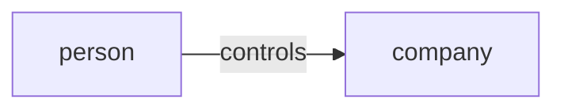
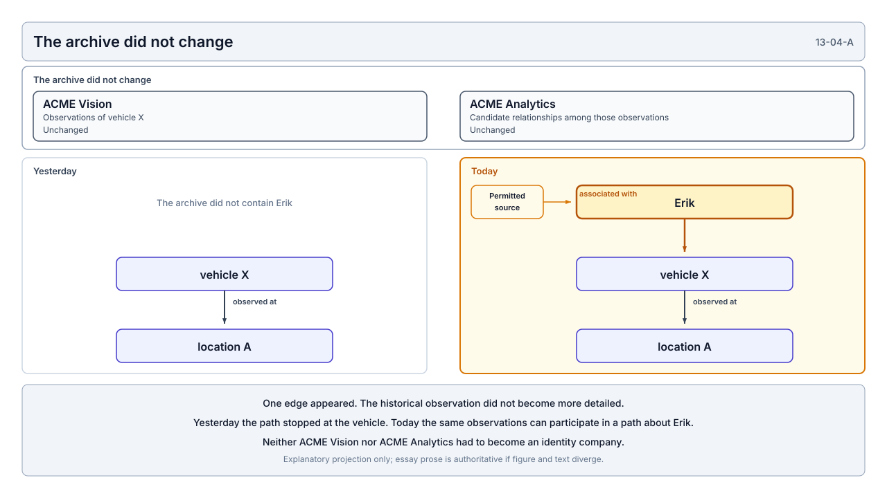
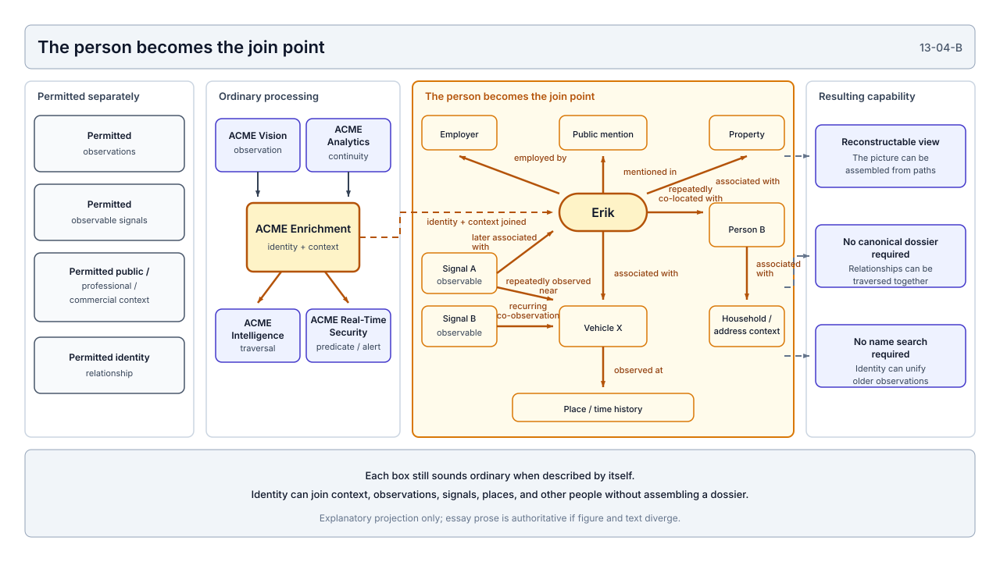
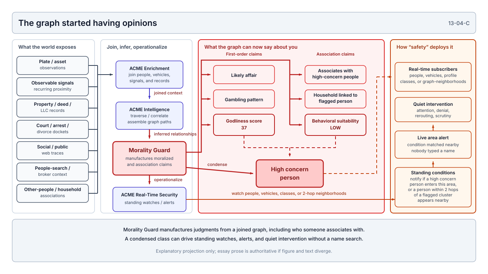
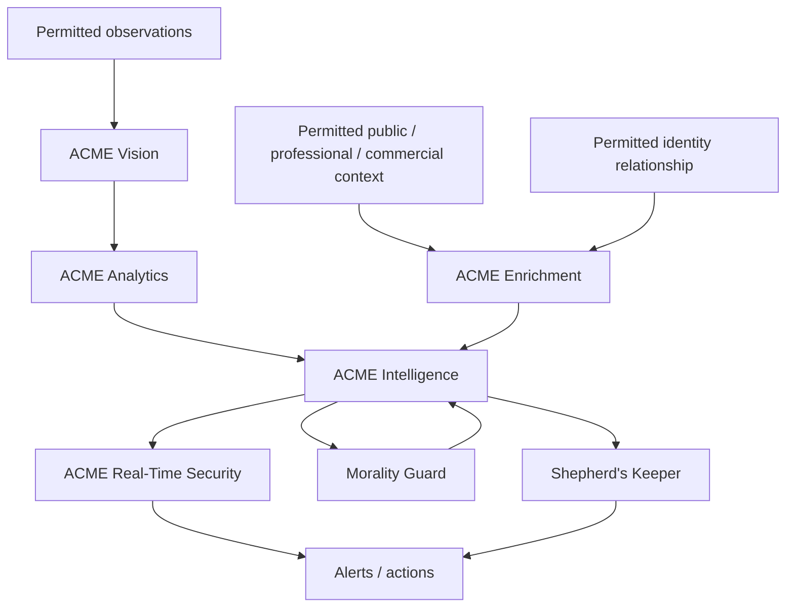
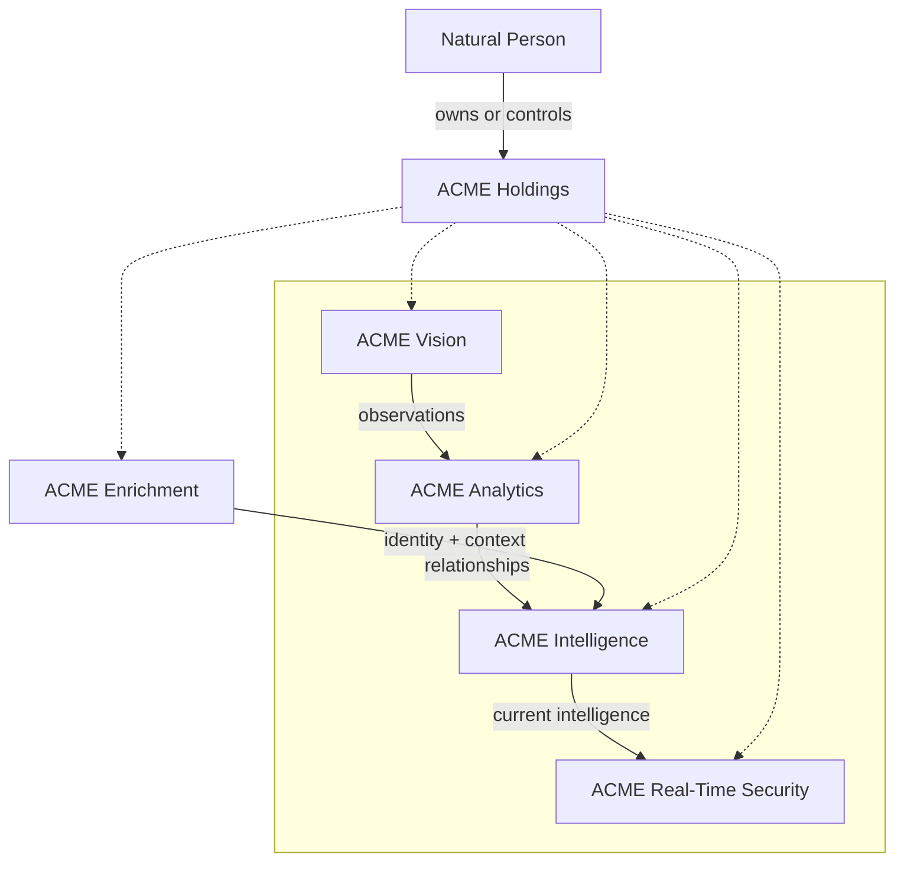

# Privacy Has a Composition Problem

*What Systems Engineering Reveals About Surveillance, Public Data, and Technical Governance*

## When Did Knowing Who Owns a Company Become the Privacy Problem?

Privacy is important to all of us. That is easy to say and considerably harder to turn into protections that survive the systems we actually build. So let me show you the kind of system that can emerge when those protections are inadequate. If the protections are good enough, at some point the system should become impossible to assemble.

I started thinking about this because of something much less exotic.

In August 2026, the Financial Crimes Enforcement Network (FinCEN) finalized its [**Beneficial Ownership Information Reporting Requirement Revision**](https://www.federalregister.gov/documents/2026/08/14/2026-16576/beneficial-ownership-information-reporting-requirement-revision) under the Corporate Transparency Act. The change permanently exempted U.S. companies and U.S. persons from the federal beneficial-ownership reporting regime that had begun only a few years earlier. FinCEN also announced that previously reported information about U.S. persons would be deleted.

If you did not spend your time reading about beneficial-ownership reporting, the important part is simpler than the name suggests. The federal government had created a nonpublic system for resolving a relationship between a legal entity and the natural people who ultimately owned or controlled it. Law enforcement and other specifically authorized users could use that information under restricted conditions. The system existed in large part because corporations and LLCs can otherwise make the natural people behind legal activity difficult and expensive to resolve.

Then we largely removed the domestic relationship.

Why?

Treasury reassessed the value of requiring millions of mostly law-abiding American businesses to report that information against the regulatory burden of doing so and concluded that domestic reporting was not sufficiently useful to justify the cost. The final rule openly acknowledges the counterargument: law-enforcement and transparency advocates warned that domestic shell and front companies can obscure ownership precisely where investigators need to know who is actually behind them. Treasury chose the narrower system anyway.

Here's the thing.

I do not understand that privacy argument.

A legal entity is not a natural person. It is an abstraction we deliberately create because that abstraction is useful. It can stand between a natural person and property, contracts, liabilities, employees, other companies, and enormous amounts of economic activity. If society is going to provide that abstraction, knowing which natural person ultimately owns or controls it seems to me like a fairly modest accountability requirement.

Especially if the answer is not public. Especially if access is restricted. Especially when the reason the system existed in the first place was that reconstructing those relationships without it can be difficult.

So when did **that** become the privacy problem?

I don't mean knowing what someone bought, where they slept last night, who they met for lunch, what vehicle passed them on the highway, or which devices happened to be nearby. I mean the comparatively boring relationship between a natural person and a legal abstraction created by the state.



We decided that relationship carried enough burden and privacy concern that, for domestic companies and U.S. persons, we no longer wanted the federal system collecting it.

Fine.

Then I want to understand the rule.

Here is the claim I will test: a privacy property can fail under composition even when the individual observations, relationships, companies, and disclosures remain locally permitted.

That claim has ancestors. Helen Nissenbaum's **contextual integrity** treats privacy in terms of appropriate information flows and contextual norms, not secrecy alone. **Mosaic theory** in Fourth Amendment law has long asked whether individually permissible observations can acquire a different privacy character once they are aggregated or connected over time. I am not trying to replace those frameworks, and I am not offering a legal brief. I am trying to stress-test them against the kind of system engineers actually assemble: observations, relationships, identity, inference, latency, and standing conditions joined by ordinary boxes and arrows.

Because if that relationship is too much, I have some questions about everything else we appear willing to let technical systems reconstruct.

---

## Start With the Easiest Permission

If you want to understand the rule, the easiest way I know how is to start with something that seems almost too ordinary to be useful.

A person drives a car down a public road.

I can see the car. I can see its color, make, approximate model, maybe the plate depending on where I am standing and what the law allows me to record. A person walking past can remember it. A business camera pointed at a parking lot can remember it. A traffic camera can remember it. A camera mounted to a vehicle may see the same car somewhere else later.

None of that requires me to know who the driver is.

Suppose the camera sees a vehicle and records an observation. Not Erik. Not a person. A vehicle appeared here at this time. Maybe the plate is visible. Maybe it is not. Maybe the system can identify the make, model, color, body style, or some other visible characteristic. All of those things already exist in ordinary computer-vision systems, but I do not actually need very much sophistication yet.

Is that surveillance?

Maybe.

Is it illegal?

That is the question I care about.

If a particular camera placement violates a law, remove it. If the observer is somewhere they are not permitted to be, remove the observation. If a jurisdiction prohibits collecting a particular thing in a particular circumstance, remove that too. Public visibility does not have to mean unlimited permission to retain, analyze, correlate, or use whatever was visible. Those can be separate rules, and if they exist, I want them.

I am not interested in sneaking illegal collection into the architecture and hoping nobody notices. That would make this exercise easier than I want it to be.

So this becomes the first constraint I carry forward: **give me only what we are actually willing to permit.**

Now let the camera remember them.

Does memory change the rule?

Maybe it does. If so, where?

A human can see a vehicle and remember it for an hour. A camera can preserve the observation for a day. A database can remember it for as long as we tell it to. Ten cameras can remember ten observations. Ten thousand cameras can remember considerably more.

At what point did the act change?

I can *feel* the difference. One camera feels like security. Ten cameras might still feel like security. Ten thousand cameras begin to feel like surveillance.

That reaction may be completely justified.

What is the rule underneath it?

Did something legally important happen at camera 10,001? Did the system acquire a property that we have not named yet? Persistence? Coverage? Searchability? Population scale? The ability to reconstruct movement?

Those are different answers, and I care about the difference because a rule tied only to the number of cameras will eventually have to explain why camera 10,000 was acceptable and camera 10,001 was not.

I want the answer that survives the number changing.

Mobility makes this harder.

A fixed camera is familiar. We put them on buildings, parking lots, stores, intersections, and homes. What happens if the camera moves?

A fleet vehicle can carry one. A rideshare driver can carry one. A delivery truck can carry one. A private investigator can carry one while operating within whatever laws govern the assignment. The observer is now moving through the world instead of waiting for the world to pass one fixed point.

Did the observation become different because the camera moved?

Maybe.

Again, tell me why.

Perhaps mobility plus persistence produces a capability the fixed camera did not. Perhaps the law treats a particular actor differently. Perhaps the location of the observation matters. Perhaps automated plate collection has a specific rule that ordinary visual observation does not.

Good.

Apply it.

What I do not want is to decide that mobility itself is the prohibition simply because the resulting network starts making me uncomfortable. If mobility is only changing coverage, then coverage may be the thing I actually need to understand.

Then there is the actor.

Maybe the problem is government surveillance.

That matters enormously in some contexts. Government has power my fictional company does not. It can compel. It can subpoena. It can obtain warrants. It can arrest. Constitutional restrictions can apply to state action in ways that do not apply identically to a private observer.

Fine.

My company gets none of that.

No badge. No subpoena. No warrant authority. No classified database. No privileged government access simply because it would make the system more capable.

That is not an argument that private actors can therefore do whatever they want; they cannot. It is another constraint. Whatever laws actually apply to the private actor still apply.

I want to know what remains after they do.

What can a private actor observe while remaining inside the boundaries that actually govern the observation?

For now, that is enough.

I do not yet have a surveillance system. I have something much less impressive: observations of things that could be seen from places where the observer was permitted to be, produced without special government authority, with every collection method we can actually prohibit removed from the architecture.

That is almost boring.

It should be; boring is good.

If I started with something everyone already agreed was unacceptable, I would learn almost nothing about the rule.

---

## So I Gave the Camera a Company

What I needed first was an observer that could remember, so I gave the camera a company.

Call it **ACME Vision**.

ACME Vision does not know Erik. That seems important. I do not want to start with identity because identity would make the objection too easy. The company sees objects and events. A vehicle appears at a place and time. A plate might be visible where collecting it is permitted. The vehicle has observable characteristics: make, model, color, body style, maybe specific damage or accessories. A camera can produce an image. The equipment producing the observation already knows where *it* is, so the observation can also have a place and timestamp without ACME Vision knowing anything about the location services of the vehicle it observed.

This is more useful than it seems.

ACME Vision doesn't need your GPS.

It needs its GPS.

If one of its collectors is at location A at time T and observes vehicle X there, ACME Vision now knows something about the location of vehicle X without vehicle X ever telling ACME Vision where it is.

Maybe that sounds obvious.

It is.

That's what bothers me about it.

We tend to talk about location information as though somebody has to obtain a person's location from a phone, an application, a vehicle, or some other device belonging to them. Sometimes they do. Sometimes the observer only needs to know where the observer was when something else appeared nearby.

That gives ACME Vision a very modest record: something with these observable characteristics appeared near one of our collectors, here, at this time.

No person yet.

I also gave ACME Vision radios, but I want to be careful here because radios become magical very quickly when people talk about tracking.

Modern devices and vehicles emit radio signals for completely ordinary reasons. Bluetooth Low Energy devices can advertise before a connection is established. Direct tire-pressure monitoring systems transmit information from sensors in the wheels. Modern digital-key ecosystems use combinations of Bluetooth Low Energy, ultra-wideband, and NFC. Some connected-vehicle safety systems can exchange messages containing things such as position, speed, and heading.

That does **not** mean ACME Vision gets a stable identifier for every device that passes.

Bluetooth has privacy mechanisms specifically designed to make persistent passive tracking harder, including private addresses that can change over time. Digital-key systems likewise include privacy protections intended to prevent someone monitoring the wireless communications from simply tracking the user or device. Signal strength is noisy. Different vehicles expose different capabilities. An observation that resembles another observation may have nothing to do with it.

Good.

Keep all of that.

I do not need the radio layer to identify anybody.

In fact, I would prefer that it did not.

ACME Vision can record something much weaker: some observable radio event occurred near this collector, at this place, at this time, while this vehicle was also visible. Maybe the observation contains characteristics useful later. Maybe it does not. Maybe another observation looks similar. ACME Vision does not need to decide whether they belong to the same thing.

That would be analysis.

And we're not there *yet*.

The collector's job is much more boring. Observe what it is permitted to observe, preserve where the collector was, preserve when the observation occurred, preserve whatever characteristics the permitted observation actually contained, and stop.

I also don't need a single receiver to magically turn signal strength into somebody else's coordinate. It cannot. Signal strength can be noisy enough that pretending otherwise would make the argument technically weaker. If some future part of the system has several lawful observations from known positions, maybe those observations will become more informative together. If a particular radio technology actually supports direction finding, perhaps that matters. If it does not, it does not.

For now, I have something simple.

My location.

Your observable presence.

Time.

That is enough to create information about movement without ever asking the observed object to report its own movement.

A moving collector makes that easier to see. Suppose one of ACME Vision's collectors is mounted on a vehicle that was already going somewhere. It observes something at one location, continues on its route, and later records another observation that happens to look somewhat similar.

Did ACME Vision just determine that the same thing moved between those locations?

No.

Not yet.

This matters as well.

ACME Vision has two observations.

Maybe they belong to the same object.

Maybe they don't.

I don't want the collector quietly converting similarity into identity because that would hide the next part of the architecture inside this one. Preserve the observations separately. Preserve whatever uncertainty belongs to each of them.

Let somebody else decide whether there is a relationship.

I kept trying to make ACME Vision less capable for the same reason I kept stripping capabilities out of the larger synthetic. No facial recognition. No audio. No identity lookup. No secret data source. No assumption that the person registered to a vehicle is the person currently driving it. No assumption that a device observed near a vehicle belongs to its owner. No assumption that two similar radio observations belong to the same device.

If one of those shortcuts becomes necessary, I want to know.

So far none of them is.

By the time I am done constraining ACME Vision, it has accumulated a surprisingly large number of extraordinarily boring facts. Something appeared here. Something else appeared there. This camera saw these visible characteristics. This collector observed this radio event. This happened at this time. That happened later.

ACME Vision knows almost nothing about people.

That feels safer.

Perhaps it is.

*But* it has something the rest of the system did not have before.

It has observations.

It has nodes.

What it does not have yet are the relationships between them.

That requires another company.

---

## So I Gave the Observations to ACME Analytics

ACME Vision had observations.

It did not have relationships.

Nothing requires the thing creating those relationships to be a person sitting in front of a screen. A human analyst certainly *could* look at two observations and decide they probably describe the same vehicle, but that is not particularly interesting to me. Software can perform correlation, clustering, similarity analysis, entity resolution, and probabilistic matching at a scale no individual analyst ever could.

So I created another company.

Call it **ACME Analytics**.

ACME Analytics does not need another camera. It does not need another radio. It does not need to collect anything from the physical world at all. ACME Vision already did that part.

ACME Analytics gets the observations.

Now it asks different questions.

Do observation A and observation B probably describe the same vehicle? Did the same unusual combination of visible characteristics appear twice? Does one radio pattern repeatedly co-occur with one vehicle pattern? Did an observable identifier change while enough other characteristics remained similar that continuity is still plausible? Do several observations that mean very little independently begin reinforcing one another when considered together?

Those are not collection questions anymore.

They are relationship questions.

None of them requires certainty.

That becomes useful because certainty would make the synthetic easier to attack than I want it to be. If ACME Analytics claims that two observations *are* the same object and it's wrong, then we have a data-quality problem. If it instead says that the observations are probably related, preserves why it thinks so, and carries the confidence forward, the graph can represent exactly what the system actually knows.

Maybe:

```text
observation A
    → probably same object as
observation B
    confidence: 0.74
```

Or:

```text
radio observation Q
    → repeatedly co-occurs with
vehicle X
```

Or eventually:

```text
vehicle X
    → probably moved from
location A
    → to
location B
```

The word `probably` is doing real work there.

I do not want probability quietly turning into fact just because the relationship has persisted. A 0.74 relationship should still be a 0.74 relationship tomorrow. The source observations should remain traceable. Another observation might strengthen the relationship. Another might weaken it. Two entities we thought were the same may eventually separate again.

That does not make the relationship useless.

It makes it honest.

The bus example is where I first realized how much could happen without anybody collecting what we normally think of as location data from the subject.

Suppose one of ACME Vision's collectors is moving along a route. Near one stop it observes radio Object Q. Several miles later it records something sufficiently similar that ACME Analytics considers it a candidate match. Farther down the route something similar appears again.

Q never broadcast an itinerary.

Nobody accessed Q's GPS.

Nobody asked Q where it was going.

ACME Vision knew where **its own collector** was when each observation occurred. ACME Analytics now has several observations that may belong to the same object.

What can it infer from that?

Maybe not much after two observations. Maybe more after ten. Maybe another characteristic makes continuity stronger. Maybe the apparent match eventually collapses and the system decides there were two objects after all.

Fine.

Let's preserve that.

What interests me is that a route can begin emerging from relationships between observations even though the observed object never supplied a route.

Did the system collect Q's route?

Maybe not in the way we normally use the word `collect`.

Did the system become capable of inferring something about Q's movement?

That seems harder to avoid.

The same reasoning applies to vehicles.

ACME Vision does not need to know who owns vehicle X. ACME Analytics does not either. In fact, keeping identity out of both companies makes the exercise cleaner.

Let them build continuity first.

A vehicle with these characteristics appeared here. Something probably corresponding to the same vehicle appeared there. A radio observation repeatedly co-occurs with it. Several observations begin to form a pattern.

Still no Erik.

The system can accumulate history before it knows whose history it may eventually become.

Then, later, one permitted source establishes another relationship:

```text
Erik
    → associated with
vehicle X
```

Maybe Erik publicly posted the vehicle himself. Maybe a lawful investigator established the association. Maybe a public record contributes it. Maybe several permitted sources together create a sufficiently confident relationship. The source matters, so whatever law governs that source still governs it. If the relationship may not lawfully be used, remove it.

I only need one identity relationship the system is actually permitted to have.

Now look at what happens to ACME Analytics' otherwise pseudonymous history.

```text
Erik
    → associated with
vehicle X

vehicle X
    → probably same object as
observation A

observation A
    → occurred at
location A

observation A
    → occurred at
time T
```

Traverse the edges and the system can now ask a question none of the original observations could answer.

Nothing about those observations changed.

The plate did not become more visible.

The camera did not collect a new pixel.

The radio did not transmit another packet.

ACME Vision did not suddenly learn Erik's name.

ACME Analytics did not need to recollect anything.

One new relationship entered the graph.

The old observations acquired a new path.

That was enough.

---

## The Archive Changed Without Changing

This was the first point where I had to stop and think about what I actually meant when I called information `anonymous` or `pseudonymous`.

ACME Vision had spent months collecting observations about vehicle X. ACME Analytics had taken some of those observations and built candidate relationships between them, preserving uncertainty where uncertainty belonged. The system might know that vehicle X appeared here on Monday, something probably corresponding to vehicle X appeared somewhere else on Wednesday, and another observation several weeks later increased confidence that those events belonged to the same object. What neither company needed to know was Erik.

If somebody had asked whether ACME Vision's archive contained information about Erik, the honest answer at that moment might have been no. ACME Vision did not know Erik. ACME Analytics did not know Erik. Neither company needed his identity to do what I had asked it to do, and I had deliberately kept identity out of both because I wanted to see how far the system could get without it.

Then another permitted source establishes one relationship:

```text
Erik
    → associated with
vehicle X
```

What changed in ACME Vision's archive?

Nothing.

What changed in ACME Analytics' observations or candidate relationships?

Nothing there either. No camera captured another image. No radio produced another observation. Nobody went back through six months of records and added Erik's name to them. The original facts were exactly what they had been the day before.

The system was not.

Yesterday it could traverse:

```text
vehicle X
    → observed at
location A
```

Today it can traverse:

```text
Erik
    → associated with
vehicle X
    → observed at
location A
```

That difference is almost embarrassingly small in the graph. One edge appeared. The historical observation did not become more detailed, but what the system could learn from it changed considerably.

I started calling this **semantic retroactivity** because I did not have a better phrase for what had happened. A relationship established today can change what information collected yesterday is capable of revealing, without changing the historical information itself.



**Plate 13-04-A.** A relationship established today can change what yesterday's observations can reveal without rewriting the archive. Explanatory projection only; the essay prose is authoritative if figure and text diverge.

That made me reconsider how much comfort I had been taking from ACME Vision not knowing who anyone was.

Was vehicle X actually anonymous?

Or was it merely unresolved?

I am not sure those are the same thing.

The identity edge does not have to arrive from anything particularly exotic. Maybe Erik posts a photograph of the vehicle himself. Maybe a journalist publicly reports what vehicle someone drives. Maybe a licensed private investigator, operating within whatever laws apply to the assignment, establishes the association. Maybe a public record contributes another relationship. Maybe several individually weak but permitted sources reinforce one another until ACME Analytics has enough confidence to treat the association as useful while still preserving that it is probabilistic.

Whatever the source, apply its rules. If the relationship cannot lawfully be obtained for this purpose, remove it. If it can be obtained but not used this way, remove the use. I am not interested in saving the architecture by sneaking identity through a source we already agreed was prohibited.

I only need one identity relationship the system is actually permitted to have.

What happens after it arrives is the more interesting part.

Suppose ACME Vision observed vehicle X fifty times before anyone knew who vehicle X was associated with. Yesterday those fifty observations described a vehicle. Today the same fifty observations can participate in paths describing Erik. Nothing had to be recollected, and neither ACME Vision nor ACME Analytics had to suddenly begin operating as an identity company. The new relationship changed what the existing system could reveal.

So when did the privacy state of those observations change?

Was it when ACME Vision collected them? Maybe not; Erik was nowhere in the record. Was it when ACME Analytics connected several observations and began constructing continuity? Maybe. Did it happen when the identity edge arrived? That seems important. What about the moment the graph first became capable of traversing from Erik into six months of history? Does somebody actually have to issue the query before the privacy consequence exists, or does the capability itself matter?

Maybe different laws answer those questions differently. I would expect them to.

What I no longer find satisfying is the idea that the privacy character of the information was permanently established at collection simply because the collector did not know the person's name at the time.

The system does not stop learning when collection stops.

Relationships arrive later. Confidence changes. Previously separate datasets meet. Something pseudonymous inside one company can become attributable when another permitted relationship is connected to it. An observation collected without identity can participate in an identified history without anyone ever collecting the observation again.

That makes `anonymous at collection` sound considerably less reassuring.

Maybe it really was anonymous at that moment.

What I am less sure of is how much that tells me about what it will be tomorrow.

Perhaps identity was not absent.

Perhaps it was deferred.

There is another part of this that I think matters. ACME Vision can continue saying, completely truthfully, that it does not identify the people behind the objects it observes. ACME Analytics can continue saying, also truthfully, that it performs correlation and entity resolution without requiring natural-person identity. Neither statement has to become false when the larger system becomes capable of reconstructing information about Erik.

So where did the identified history come from?

That question is harder than pointing at one bad database.

ACME Vision contributed observations. ACME Analytics contributed relationships. Another permitted source contributed identity. Time had already accumulated in the archive. The identified history appears when those things become traversable together.

No one component had to contain it.

That feels like the first real composition problem in the synthetic.

It also sounded uncomfortably familiar. Mosaic reasoning already asks whether a set of individually lawful observations can reveal more together than any one observation was supposed to reveal alone. Contextual integrity would ask whether the resulting flow still respects the norms of the contexts those observations came from. The synthetic does not answer those questions for me. It makes the composition visible enough that I can no longer treat each box as if it were the whole story.

By this point it was also worth noticing how little I had actually built. ACME Vision observed things it was permitted to observe. ACME Analytics created probabilistic relationships among those observations. Another permitted source eventually contributed an identity edge. Everything else was time, confidence, and the ability to connect one relationship to another.

I still had no badge, no classified database, no hacked phone, no defeated encryption, no trespass, and no intercepted private conversation. Every time the synthetic needed one of those shortcuts, I had removed it and tried again.

It had not stopped me yet.

Instead, one permitted relationship had changed what months of otherwise boring observations meant.

That makes me uncomfortable.

But I am beginning to realize that discomfort is going to be a recurring problem in this exercise. The system will not know when I become uncomfortable, and `this feels invasive now` is not a rule it can enforce.

So I kept building.

---

## I Had Built a Database That Did Not Need to Store the Answer

The previous section left me with a problem I had not expected. The identified history did not need to exist inside ACME Vision, ACME Analytics, or even the source that eventually contributed Erik's identity. It appeared when the relationships became traversable together.

That made me realize something else.

I did not need to create an Erik dossier at all.

I had been carrying that architecture around in my head without really questioning it. If a surveillance system knows where Erik has been, surely somewhere there must be a table called `people`, another called `locations`, and eventually some deeply uncomfortable record connecting the two. Maybe there is a profile page. Maybe there is a timeline. Maybe somebody has deliberately assembled a file about Erik.

But why would I need any of that?

ACME Vision already has observations. ACME Analytics already has relationships. Another permitted source can contribute identity. The historical archive does not have to be rewritten when that identity arrives, and it does not have to be copied into a new database organized around people.

Keep the observations where they are. Keep the relationships. Traverse them when somebody needs an answer.

So I created another company.

Call it **ACME Intelligence**.

ACME Intelligence owns no cameras. It does not drive around looking for vehicles. It does not resolve radio observations. It does not need a secret government feed, a hacked device, or some hidden database containing everyone's movements. In fact, it may not need to collect anything from the physical world at all.

It asks questions of relationships the rest of the system has already established.

Where has the vehicle associated with Erik appeared?

What observations can be reached from the vehicle currently associated with this person?

Which other objects repeatedly appear near that vehicle?

What places show up frequently in the resulting history?

Maybe some of those questions are permitted and some are not. Maybe the purpose matters. Maybe the person asking matters. Maybe one particular relationship cannot be traversed for a particular use.

Good. Apply the rule.

What interested me was that the answer did not have to exist before the question.

There does not need to be a row somewhere saying:

```text
Erik
    → was at
location A
```

The system can produce that result by following a path:

```text
Erik
    → associated with
vehicle X
    → probably same object as
observation A
    → occurred at
location A
    → at
time T
```

The answer appears when the relationships are traversed.

That changed the privacy question again.

A moment ago I had been worried that one new edge could change the meaning of an old archive. Now I had to ask whether the privacy-sensitive information even needed to exist as a stored artifact in the first place.

If ACME Intelligence can reconstruct the answer whenever somebody asks for it, what exactly does it mean to say that nobody maintains a location history about Erik?

Maybe that statement is completely true.

Maybe there is no `Erik` record containing locations. Maybe ACME Vision still cannot identify him. Maybe ACME Analytics still has nothing more than probabilistic object relationships. Maybe ACME Intelligence deletes the result immediately after returning it.

And yet the system can answer the question again tomorrow.

That feels materially different from not knowing the answer.

It also complicated the reassuring separation I had deliberately created between the companies. ACME Vision can truthfully say that it does not build profiles about natural people. ACME Analytics can truthfully say that it does not collect observations from the physical world. The source that established the identity relationship can truthfully say that it provided one permitted fact. ACME Intelligence can truthfully say that it did not create any of the underlying observations.

Every statement can be locally accurate.

The path can still exist.

That is where `storage` and `capability` began separating for me.

I had been thinking about privacy largely in terms of information somebody possessed. What data did they collect? What database is it stored in? How long do they retain it? Who has access to the record?

Those are still important questions.

But what if the sensitive thing is not one record?

What if it is the path?

A privacy-sensitive result does not necessarily have to be persisted before the system possesses the capability to produce it. The nodes can look harmless in isolation. The edges can belong to different companies. The answer can exist only for the few milliseconds required to traverse them.

Does that mean the system never possessed the answer?

I do not think the database cares much about that detail.

So what exactly should the rule govern?

The observation? The identity edge? The relationship between observations? The path connecting them? The query that activates the path? The purpose for which it was asked? The person or system allowed to receive the result? Does confidence matter? Does retention matter if the result can simply be reconstructed again?

I suspect the answer is some combination of those things, and probably a different combination depending on what the system is doing.

What I no longer think is sufficient is asking only what one company has stored about me.

ACME Intelligence may store almost nothing about Erik.

The larger system may still be capable of knowing quite a lot about him on demand.

Once I framed the problem that way, selling raw data began to look almost primitive. Why hand somebody millions of observations and make them reconstruct the meaning themselves?

The more useful product is the answer.

And once the product is an answer, the next question becomes difficult to avoid.

How quickly can I give it to you?

---

## The Query Acquired a Clock

Once ACME Intelligence could produce an answer without storing the answer in advance, the next change seemed almost trivial.

I made it faster.

Not timestamps. ACME Vision already had timestamps. Every observation already knew when it happened. What I added was latency: how much time passes between something happening in the physical world and the rest of the system becoming capable of doing something with what happened.

Suppose ACME Intelligence tells me that the vehicle associated with Erik appeared at a particular shopping center three months ago. Maybe that is invasive. Maybe it is useful. Maybe some part of the path is regulated and has to be removed. Whatever else it is, three months later it is history.

What if the observation was thirty seconds ago?

The underlying fact did not necessarily change. ACME Vision observed the same kind of vehicle. ACME Analytics established the same kind of relationship. The same identity edge connected Erik to vehicle X. ACME Intelligence traversed essentially the same path.

What changed was when the answer became available.

And that changed what the answer could do.

Engineers already treat latency as part of capability even when the data model remains identical. A fraud signal arriving tomorrow is not operationally equivalent to one arriving before the transaction clears. A security detection that takes a week is not the same capability as one that takes a second. An alert delivered after the event it was supposed to affect may still be useful information, but it is not much of an alert.

Why would privacy be different?

Three months ago, the graph can help reconstruct where something probably was.

Thirty seconds ago, the same graph can help somebody decide what to do next.

That seems like a fairly substantial change, even though I did not add another category of personal information.

So I changed the question.

Instead of asking:

```text
where has the vehicle associated with Erik appeared?
```

ACME Intelligence can ask something closer to:

```text
what relevant observations exist near this subscriber now?
```

That phrasing bothered me because it sounded considerably less like surveillance.

It sounded like situational awareness.

We already buy situational awareness all the time. Traffic applications tell us what is happening around us. Weather systems tell us what conditions are approaching. Home-security products tell us when something relevant happens near property we care about. Businesses monitor environments for conditions that might require attention. Safety products are valuable precisely because they shorten the distance between an event and somebody being able to respond to it.

Maybe there is nothing wrong with any of that.

But look at what my version needs in order to provide the same kind of experience.

The graph still has to know which observations are nearby. It has to know how recent they are. It has to know which relationships make an observation relevant to a particular subscriber. It may have to evaluate identity, association, confidence, distance, time, and whatever other conditions define the thing the customer asked to know.

The customer does not necessarily need the archive.

They may never see the graph.

They may not even care how the answer was assembled.

They just want to know what is happening now.

That made me wonder whether I had been treating history as the dangerous capability simply because history makes the privacy problem easy to see. A six-month movement history looks like surveillance. A notification saying that something relevant is nearby can look like a feature.

What if both depend on substantially the same underlying system?

The difference might be latency.

And latency has a strange relationship with privacy because it changes actionability. Knowing that vehicle X appeared somewhere last winter and knowing that something associated with vehicle X is two blocks away right now are not interchangeable facts to the person receiving them, even if both were produced from the same kinds of observations and relationships.

So where did the rule move?

Was the problem ACME Vision making the observation? Was it ACME Analytics linking observations together? Was it the later identity edge? Was it ACME Intelligence traversing the graph? Or did the system become meaningfully different when the same answer arrived quickly enough for somebody to act on it?

Maybe the law already distinguishes some of these cases.

Good. Apply those distinctions.

What I want to know is what property they are protecting, because thirty seconds and three months do not appear anywhere in the semantic relationship:

```text
Erik
    → associated with
vehicle X
    → observed at
location A
```

The graph can look identical.

The capability is not.

That was another uncomfortable realization. I had been thinking of information primarily in terms of what it described. Identity. Location. Association. Time. Now I had to add another question: how quickly can the system turn those things into something actionable?

I kept the low latency because I had not yet found a rule that required me to remove it.

Now ACME Intelligence could turn permitted observations and permitted relationships into something approaching current situational awareness.

And from the customer's side, that changes the product completely.

I do not have to convince someone to buy a database containing another person's history.

I can sell them safety.

The graph can stay underneath.

---

## Then I Removed the Search Box

By this point I had something I could plausibly sell as safety.

ACME Vision produced observations. ACME Analytics produced relationships. ACME Intelligence could traverse those relationships quickly enough to answer questions about what was happening nearby instead of only reconstructing what had happened months ago. The customer did not need the archive, and they did not need to understand the graph underneath it.

So I gave the customer-facing capability another company. Call it **ACME Real-Time Security**.

Then I removed the feature that made the whole thing look most obviously like surveillance.

The search box.

Give somebody a box where they can type a person's name, enter `Erik`, and ask `where is he?`, and almost nobody needs me to explain why that feels invasive. The user deliberately targeted a person. The system deliberately resolved that person. Somebody deliberately asked for information about where another human being was.

What happens if ACME Real-Time Security does not allow that?

No people search. No map where subscribers type names. No list of people moving around a city. Maybe the product team advertises that limitation as a privacy feature, and I might even agree that removing those interfaces is better than providing them.

Then somebody asks what the safety product does have.

Alerts.

Of course it has alerts. The entire point of real-time information is that I should not have to know when to ask for it. I tell the system what conditions matter to me, the system evaluates those conditions as new information arrives, and my phone interrupts me when one becomes true.

Suppose a subscriber wants to know when some legally usable public-safety condition becomes relevant near them. Maybe there is a vehicle associated with a permitted safety bulletin. Maybe an observation satisfies some threshold the service is allowed to evaluate. I can immediately think of reasons not to expose everything the graph knows, so do not expose it. Do not return a person's name if the subscriber does not need it. Do not return exact coordinates if a general area is sufficient. Do not hand the subscriber the underlying observations, identity relationships, or confidence calculations if the product can accomplish its permitted purpose without them.

The subscriber never asked where anyone was.

What did the system have to know before it could send the alert?

Somewhere underneath that deliberately limited notification, ACME Intelligence still had to evaluate observations, recency, geography, relationships, whatever identity or object continuity the condition required, and enough confidence to decide that the subscriber's condition had become true.

The graph could use identity without displaying identity. It could use location without returning coordinates. It could use months of relationships without showing the subscriber any of them.

The subscriber receives the consequence of the intelligence rather than the intelligence itself.

That bothered me because I had been thinking about disclosure as though sensitive information becomes important when another human sees it. Who gets the record? Who sees the name? Who receives the location?

What if nobody does?

What if the machine has enough information to make the decision and the only thing that crosses the boundary is:

```text
alert
```

The search box suddenly looked like the easy version.

With a search box, at least I can see the targeting. Somebody asks about Erik and the system answers about Erik. There is an obvious query, an obvious subject, and an obvious moment when information is requested.

An alert system can be quieter.

ACME Real-Time Security can continuously evaluate conditions as new observations enter the graph. Most evaluations may never produce anything visible. The subscriber has no reason to know how much was evaluated before one condition crossed a threshold.

Maybe that is a privacy improvement. They receive less information.

I think it probably is.

It does not follow that the system underneath knows less.

Nothing has to be stored as Erik's current location. Nothing has to be displayed as Erik. There does not have to be a dossier, a map pin, or even a human-readable record containing the final conclusion. ACME Intelligence can assemble enough context to evaluate the condition, ACME Real-Time Security can send the notification, and the intermediate answer can disappear.

Then another observation arrives and the system can do it again.

Now nobody even has to ask.

The query can become a standing condition.

```text
when:
    permitted condition becomes true
    within relevant geography
    within required time window

then:
    notify subscriber
```

The machinery underneath still has to determine whether the condition is true. The difference is that the user no longer initiates the traversal each time. The system does.

That seems useful for safety. It may be necessary for a good safety product. A warning that requires me to know when to search for the danger is not much of a warning.

So I kept it.

And that changed the privacy question again. If no human sees an identity relationship, but that relationship helps decide whether a notification is emitted, did the information matter? If exact location never appears on a screen, but proximity is evaluated continuously, did location stop being part of the capability? If the intermediate result exists only long enough for a machine to make a decision, what would an auditor need to inspect to understand what actually happened?

The output can be intentionally sparse while the system required to produce it remains extraordinarily rich.

The system does not have to tell you what it knows. It only has to know enough to decide when to act.

At that point I also had to ask what scientific breakthrough I was waiting for.

Observation exists. Entity resolution exists. Graph analysis exists. Geospatial processing exists. Event-driven systems exist. Threshold evaluation exists. Push notifications exist. Machines already consume changing state, evaluate conditions, and emit events when those conditions become true.

None of that is particularly remarkable on its own.

That should sound familiar by now.

ACME Vision provides observations. ACME Analytics creates relationships. Another permitted source contributes identity. ACME Intelligence traverses the graph. ACME Real-Time Security evaluates standing conditions and exposes only the result.

Each company can describe a fairly narrow thing that it does.

The complete capability appears in the path between them.

I had removed the interface that made the surveillance obvious, but I had not obviously removed the capability that made the interface possible.

I had done something stranger.

I had made the human query optional.

Now the system could continuously decide when some condition became true and act without waiting for anybody to ask.

Which left me with a question I had not needed to answer yet.

**Who gets to define the condition?**

---

## Safety Solved the Deployment Problem

Once ACME Real-Time Security could evaluate a standing condition and send an alert without waiting for somebody to search, I had something that looked less like a surveillance product and more like a safety service.

That created a new problem.

Where do the observations come from?

Up to this point I had treated ACME Vision almost like an architectural abstraction. It had cameras, radios, location-aware equipment, and permission to collect whatever observations remained after I applied the rules. That was enough to reason about information flow, but not enough to explain how a system like this acquires meaningful coverage without somebody deliberately blanketing a city in sensors.

A giant dedicated deployment would also make the thought experiment easier to reject. Imagine ACME Vision installing ten thousand cameras on street corners and the argument becomes about permits, public infrastructure, capital expense, or why anybody allowed one company to install ten thousand cameras in the first place.

So I tried not doing that.

Consider Danny.

Danny already drives through the city. He is not trying to build a surveillance network. Maybe he drives late at night. Maybe his job takes him into unfamiliar neighborhoods. Maybe he simply likes the idea that his vehicle can warn him when something nearby deserves his attention.

ACME Real-Time Security has something to sell him.

Situational awareness.

If Danny wants timely alerts, his device already needs to know where he is. If the device can also contribute whatever observations it is lawfully permitted to make while he is moving, ACME Vision gains another moving observation point without deploying another dedicated vehicle.

Danny gets the feature he wanted.

The system gets coverage.

Now add a homeowner. The homeowner already has a camera because packages disappear, cars get broken into, or they simply want to know what is happening around their property. They think they bought home security.

Could that device contribute permitted observations in exchange for better alerts?

Maybe.

Now add a business. It already has cameras covering entrances, parking areas, loading zones, or other parts of its property. It wants to protect employees, customers, inventory, vehicles, and buildings.

Give the business something useful in return and another observation point appears.

None of these participants needs to care about ACME Vision's larger archive. Danny wants to know what is relevant near him. The homeowner wants better security. The business wants situational awareness around its property. The device can perform the local function that caused someone to buy it while also contributing permitted observations to the system underneath.

I had been assuming that surveillance at scale required somebody to want surveillance at scale.

Maybe it does not.

Maybe it only requires enough people to want their own local feature.

That changes the economics. ACME Vision no longer has to purchase every camera, own every vehicle, or finance every observation point. Some of the physical infrastructure already exists because people have independent reasons to own it.

The system can grow by participating in those reasons.

Distributed systems routinely gain reach because endpoints provide value locally while participating in something larger. The endpoint does not have to understand the global topology. It only has to speak the interface.

What happens when the same idea is applied to observations?

Danny's device sees something while he drives. The homeowner's camera sees something from one fixed location. The business contributes another view. ACME Vision does not need every participant to see everything.

It needs overlap.

One observation may mean very little. Another may fill a gap. Repeated observations may improve confidence. ACME Analytics can later decide whether anything should be connected, preserving uncertainty where it belongs.

Coverage improves without anyone installing a sensor specifically to follow Erik.

That matters because the completed capability can become much larger than the intention of any one participant. Danny does not need to know that an observation his device contributed eventually reinforced a relationship inside ACME Analytics. The homeowner does not need to know that something seen near their driveway also appeared near a business several miles away. The business does not need to know that those relationships eventually became useful to ACME Intelligence.

They can all be using the system exactly as advertised.

There does not need to be a secret agreement among them. The local value can be genuine.

Danny really may be safer. The homeowner really may get better security. The business really may receive useful alerts.

And ACME Vision can receive more observations because of it.

The uncomfortable capability appears in the composition.

That also complicated the idea of opting out.

A person can choose not to subscribe to ACME Real-Time Security. They can refuse to install an ACME Vision device. They can decide that the entire product is creepy and want nothing to do with it.

Does that mean ACME Vision stops observing them?

Not necessarily.

Danny can still drive past them. A participating homeowner can still have a camera pointed at the area they lawfully observe. A participating business can still observe its parking lot.

Choosing not to join the network and choosing not to be observable by people who joined the network are not the same choice.

That is not unique to this synthetic. I cannot normally opt out of every other person's ability to see me in public either. What changes as the network grows is what all of those individually ordinary observations can become when they are preserved and connected.

One neighbor seeing my vehicle is one thing.

A thousand participating endpoints creating repeated observations across time and geography may be another.

Again I could feel the difference before I could name the rule. Was the problem geographic density? Persistence? Correlation? The fact that ACME Intelligence could use those relationships quickly enough to make them actionable?

If there is a threshold where permitted local observation becomes an impermissible system capability, I want to know what property crosses it.

Because I do not think `a lot of people installed safety products` is precise enough.

The growth loop was beginning to look inconveniently ordinary.

More participants create more observations. More observations improve the context available to ACME Analytics and ACME Intelligence. Better context can make ACME Real-Time Security more useful. A more useful product gives more people a reason to participate.

Nothing in that loop requires someone to advertise surveillance as the objective.

I had been looking for the organization that would decide to deploy the surveillance network.

I was starting to wonder whether I needed one.

Nobody had to vote for the finished system.

They could vote for their own feature.

And now I had another problem.

I had assumed all of those participants would at least need to want roughly the same thing.

---

## The Network Did Not Need Everyone to Want the Same Thing

I had been assuming that if the network was going to become genuinely pervasive, the people participating in it would at least need to want roughly the same thing.

The previous section had already started breaking that assumption. Danny wanted safety. The homeowner wanted security. The business wanted to protect property and employees. None of them needed to care about the larger observation plane, and none needed to understand what ACME Analytics might eventually infer from the observations they contributed.

So what actually had to be shared?

Not much.

The interfaces had to be compatible. The observations had to be usable. The relationships had to be expressible. ACME Intelligence had to be able to traverse whatever the other parts of the system made available.

The motivations could be completely different.

A private investigator might want better situational awareness during an otherwise lawful assignment. A journalist might care about accountability around a public event. A neighborhood group might care about vehicle theft. A business might care about recurring activity around a loading area. Somebody deeply uncomfortable with government surveillance might participate for almost the opposite reason and want better visibility into the people exercising public power.

Those people do not have to agree with one another. They only need the same underlying capability to be useful for different reasons.

That changes the deployment problem. A centralized actor with a grand surveillance objective has to justify the whole architecture. A distributed system can justify itself locally, one useful capability at a time.

The funding can fragment too. Some capabilities can be paid products. Some can be free because participation itself improves coverage. A neighborhood might fund additional infrastructure. A nonprofit might sponsor one use. Another component might be open source. A business might subsidize equipment because the local feature is valuable enough on its own.

None of that makes something lawful that was otherwise unlawful. If a participant cannot obtain a particular kind of information, remove it. If a later use is prohibited, remove the use. If a contract or privacy rule prevents an observation from crossing a boundary, apply it.

What interested me was how much system remained after doing that.

The network did not need one motive. It could be financed by fragments of motivation.

That seems more plausible to me than the villain I had originally been looking for. Each participant can point to a reason for participating that may be completely legitimate on its own.

The observations still enter the system.

That made purpose harder than I expected.

We use purpose constantly when we talk about privacy. Why was this information collected? What was the authorized use? Is a later use compatible with the original one? Those are necessary questions. But what is the purpose of an observation once it enters a system serving several capabilities for several different reasons?

Maybe ACME Vision received the observation because Danny wanted safety. ACME Analytics later uses it to strengthen a continuity relationship. ACME Intelligence traverses that relationship for a security question. ACME Real-Time Security eventually uses the result to decide whether an alert should exist.

Which purpose owns it?

Maybe the law answers that cleanly in a particular case. Perhaps the purpose at collection controls. Perhaps another use requires separate authority or consent. Perhaps a contract prevents reuse. Fine. I want those rules. Apply them wherever they actually bind the system.

Then I noticed I had quietly assumed there needed to be a data-sharing event in the first place.

Why?

I had given the capabilities different company names because it made the architecture easier to reason about. ACME Vision observes. ACME Analytics resolves relationships. ACME Intelligence traverses them. ACME Real-Time Security turns current state into alerts.

But they are my companies.

What if they are all business units inside one corporation? I can still separate them technically. They can have different systems, teams, interfaces, responsibilities, and controls. The architecture can have real boundaries without information necessarily crossing from one unrelated company to another every time it moves between capabilities.

Fine. Make them separate legal entities.

Maybe ACME Vision LLC, ACME Analytics LLC, ACME Intelligence LLC, and ACME Real-Time Security LLC all sit beneath ACME Holdings. There can be ordinary reasons for doing that: liability separation, financing, acquisitions, different products, different customers, different contracts.

I know they all belong together because I built them.

Does Danny?

Does the homeowner?

Does the regulator looking at one company?

Does the journalist looking at another?

Maybe the ownership is easy to reconstruct from public records. Maybe it is not. Maybe somebody sufficiently motivated works through filings, websites, officers, addresses, lawsuits, contracts, and other relationships until the larger structure becomes visible.

Fine.

That process should sound familiar.

At the beginning of this essay I was asking why we dismantled a federal system intended to give authorized users a fairly direct answer to a comparatively simple relationship:

```text
natural person
    → owns or controls
legal entity
```

I was not ready to come back to beneficial ownership yet, but it was difficult not to notice what I had just done.

I had spent the essay allowing ACME Analytics to reconstruct relationships between observations because relationships make disconnected facts more meaningful. Now somebody trying to understand my companies might have to do essentially the same thing to me.

ACME Vision looks like an observation company. ACME Analytics looks like an analytics company. ACME Intelligence looks like an information service. ACME Real-Time Security looks like a safety product.

They are all mine.

If you do not know that, do you see the same system I see?

The corporate structure could change without changing very much about the technical capability. I could put all four capabilities in one legal entity. I could put each inside its own subsidiary beneath a holding company. I could reorganize them again later. The graph connecting observations to relationships to intelligence to alerts could remain substantially the same while the boxes around it changed.

So where exactly is the privacy boundary?

The legal entity? The corporate group? The controller? The original purpose? The particular information? The capability using it?

Those are not necessarily the same boundaries I drew when I designed the system.

And I cannot assume that drawing another corporate box around ACME Analytics creates a privacy wall. Depending on the structure and the law, that organizational boundary may matter enormously, somewhat, or not in the way I expected.

The legal distinctions still matter. The point is not that corporate boundaries are irrelevant. The point is that the technical capability may survive changes in corporate topology, while the governing obligations may change with the actors involved.

That creates a strange possibility. I can separate the capabilities enough that each box performs something narrow and defensible while keeping the larger system capable of composing their outputs.

I did not design the ownership structure because I needed to hide anything. I do not need that assumption for the problem to exist. These can all be legitimate companies doing real things for real customers.

The result is the same question.

Where is the surveillance system?

Inside ACME Vision? It does not know Erik.

Inside ACME Analytics? It does not collect anything from the physical world.

Inside ACME Intelligence? It may not store the observations or persist the answers it produces.

Inside ACME Real-Time Security? The subscriber might receive nothing more revealing than an alert.

Inside ACME Holdings?

Maybe, but now I am describing the system using an ownership relationship rather than a technical one.

That was an uncomfortable callback to the question that started all of this. The relationship between a natural person and the legal entities they control had seemed almost boring compared with everything else I was assembling.

Now I had found a reason it might matter to understanding the synthetic itself.

I left that alone for the moment.

The graph was becoming very good at knowing that things were related. What it still knew surprisingly little about was Erik beyond the identity relationship I had deliberately allowed it to construct.

That seemed temporary.

Once I had a natural person in the graph, what else was already publicly, professionally, commercially, or otherwise permissibly knowable about him?

I had spent a lot of effort keeping observation and identity apart.

Now that identity had entered the graph, I wanted to know what else would follow it.

---

## The Person Became a Graph Too

Once Erik existed in the graph, I had another problem I had been deliberately avoiding.

Identity is sticky. ACME Vision did not need to know who Erik was. ACME Analytics did not need to know either. ACME Intelligence only needed enough identity to traverse from a natural person into relationships the rest of the system had already established.

But once the edge existed, I could no longer pretend Erik was only a name attached to a vehicle.

What else was already knowable about him?

I do not mean hacked accounts, private messages, restricted databases, or some secret source I was not allowed to use. I mean information already published, disclosed, filed, licensed, sold, reported, or otherwise made available through channels the system was actually permitted to access for the purpose at hand.

A professional profile might associate Erik with an employer. A corporate filing might associate him with a company. A property record might associate him with an address or parcel. A court record might associate him with a case. A public post might associate him with an event, organization, vehicle, trip, or another person. A news article might establish another relationship. A commercial source might contribute something else if the particular data and use were permitted.

None of those sources had to know about ACME Vision.

They only had to attach to the same person.

Until this point, Erik had been almost disappointingly simple in the graph:

```text
Erik
    → associated with
vehicle X
```

What happens when permitted context begins attaching to the other side of that node?

```text
Erik
    → works at
company A

Erik
    → associated with
vehicle X

Erik
    → associated with
property B

Erik
    → mentioned in
record C

Erik
    → publicly attended
event D

Erik
    → associated with
person E
```

I still did not need the graph to decide what any of those relationships meant.

If a source says Erik works at `company A`, do not silently upgrade that into `Erik owns company A`. If a filing merely names him in connection with an entity, preserve that relationship instead of inventing a stronger one because it would be more useful. If a record may refer to someone with the same name, preserve the uncertainty. If several sources make a relationship more likely, preserve that confidence too.

Keep the source. Keep the provenance. Keep the confidence. Keep the relationship as narrow as the evidence allows.

Then connect it.

That was enough.

Individually ordinary facts stopped feeling ordinary once they shared a person in common. A professional profile exists for one reason. A property record exists for another. A corporate filing exists because companies have to disclose certain things. A public post exists because Erik chose to say something in one context. Each source has its own history, purpose, audience, and rules.

The graph does not naturally preserve those reasons simply because the source had them.

It sees relationships.

That does not mean every public or commercially available fact can be used for every purpose. If a law restricts the use, apply it. If a contract prevents reuse, apply it. If a source is available only for a narrow purpose, preserve that boundary. If a category cannot lawfully be inferred or used in a particular context, do not infer or use it.

I still want the same constraint I started with: give me only what we are actually willing to permit.

What interested me was how much remained after doing that.

Suppose the property record knows an address but nothing about Erik's vehicle. The professional profile knows his employer but nothing about where he spends his evenings. ACME Vision has observations but no employment information. ACME Analytics has continuity relationships but no idea what Erik does for a living.

No source contains the whole person.

What happens when the graph can traverse all of them?

That was when enrichment stopped looking like adding columns to a record.

It was adding paths around a person.

I can keep every source technically separate and still allow ACME Intelligence to move through the relationships when a permitted question requires it. Erik does not need one giant profile table. The context can remain distributed across systems, companies, sources, and records and still become available through composition.

So does Erik have a profile?

Maybe not in the way I would normally mean it.

There may be no document called `Erik`. No dossier. No single database containing his employer, property relationships, vehicle history, public mentions, and associations.

But if ACME Intelligence can reconstruct the context whenever it needs it, how much comfort should I take from the fact that nobody bothered to materialize the page?

The absence of a dossier does not necessarily mean the absence of a dossier-shaped capability.

That also gave me another company almost accidentally.

Call it **ACME Enrichment**.

ACME Enrichment owns no cameras. It does not need to resolve vehicle continuity. It does not send safety alerts. It takes an identity that already exists and contributes contextual relationships the larger system is permitted to use.

Employer. Company association. Property association. Published event. Public mention. Professional role. Whatever else survives the rules.

Now the architecture looks a little different:

```text
ACME Vision
    → observations

ACME Analytics
    → continuity and candidate relationships

ACME Enrichment
    → contextual relationships

ACME Intelligence
    → traversal

ACME Real-Time Security
    → standing conditions and alerts
```

Each box still sounds ordinary when I describe it by itself.

I can explain every company without ever describing the finished system.

The richer the graph became, the less important it seemed that no individual company possessed the complete picture. The picture did not need to live anywhere as a finished artifact. It only needed enough connected relationships to be reconstructable when the system needed it.

And Erik was becoming increasingly reconstructable.

Not because I had discovered some secret database about him.

Because relationships that already existed for different reasons had begun to meet.

The person becomes the join point.



**Plate 13-04-B.** The person becomes the join point. Ordinary processing boxes still sound ordinary, but Enrichment joins identity and context that already existed for other reasons. The traversable graph can include observations, ambient signals, assets, places, and other people without a canonical dossier, a name search, or a moral classification. Explanatory projection only; the essay prose is authoritative if figure and text diverge.

Up to this point, though, I had mostly avoided asking the system to interpret those relationships as a claim about Erik himself.

That boundary was becoming difficult to ignore.

If the graph knows enough relationships around a person, how long before somebody asks what those relationships say about the person?

---

## The Graph Started Having Opinions

The previous section left me with a person surrounded by relationships.

ACME Enrichment had not made a judgment about Erik. It had only attached permitted context to an identity that already existed. Employer. Property relationship. Company relationship. Public mention. Event. Vehicle. Other people. ACME Vision and ACME Analytics had added observations and continuity. ACME Intelligence could traverse those paths when a permitted question required it.

Then I asked a different kind of question.

What does all of that say about Erik?

That is a much more ordinary question in modern systems than the wording makes it sound. We build models that estimate risk, propensity, preference, likelihood, anomaly, suitability, trust, fraud, churn, intent, safety, and dozens of other things that do not exist as directly observable facts in the world. The system takes relationships and evidence, applies some model or rule, and produces another relationship that did not exist before.

I had been careful not to let ACME Analytics do this accidentally. If two observations were probably the same vehicle, preserve the probability. If a source only supported an association, do not quietly upgrade it into ownership. I wanted the graph to distinguish what it observed from what it inferred.

That discipline does not prevent inference.

It only makes the inference visible.

So I gave that capability a deliberately ridiculous name.

Call it **Morality Guard**.

Morality Guard does not need another camera, public record, radio observation, or identity edge. It gets the graph I have already assembled and asks whether the available relationships support some new claim about the person in the middle of it.

Maybe:

```text
Erik
    → model estimates
characteristic Y
    confidence: 0.68
```

That edge is different from the ones I had been creating before.

Nobody observed `characteristic Y`.

No public record necessarily said it.

Erik may never have disclosed it.

The system manufactured the relationship.

That is why I wanted the name Morality Guard to be obnoxious. Respectable names make this kind of thing too easy to accept.

What if I ask whether Erik is a good person?

Absurd.

What if I ask whether he has strong moral character?

Still uncomfortable.

What if I rename the same exercise `behavioral risk analysis`?

That sounds like software.

Did the operation become less consequential because I changed the noun?

Maybe the model is prohibited from making a particular classification. Good. Remove it. Maybe a protected characteristic cannot lawfully be inferred or used in a particular decision. Remove it. Maybe a high-stakes use creates obligations that make the entire thing impermissible. Apply them.

I am still looking for the system that remains after the real rules have done their work.

So make Morality Guard less dramatic.

Suppose it infers that someone is probably a visitor rather than a local. Maybe a city wants to offer translation help, a hotel wants to identify likely travelers, or a business wants to anticipate demand from people unfamiliar with the area.

Call the category `probable visitor`.

That sounds respectable.

What did the label fix?

The graph may still be combining travel patterns, property relationships, public statements, device continuity, or other permitted context to infer that a particular person probably does not belong here permanently.

Maybe some inputs cannot be used. Remove them.

If enough permitted context remains to support the inference, the friendlier label has not changed what the system did.

Once the person became a sufficiently rich graph, the system acquired a general capability to ask questions that were not stored anywhere as facts.

Who appears vulnerable?

Who appears unusual?

Who appears trustworthy?

Who appears risky?

Who appears to fit whatever description somebody has decided matters today?

Some of those questions are regulated in particular contexts. Some should be. Some may genuinely improve safety or convenience. Some models will be useful. Some will be spectacularly wrong.

The underlying operation remains similar.

Take permitted context, apply a model or rule, and create a new edge.

That is why I wanted Morality Guard to stay ridiculous.

There is no sensor for godliness. There is no authoritative database containing moral fiber. The system can still manufacture a number.

```text
Erik
    → Morality Guard estimates
godliness: 0.37
```

That number may be meaningless. It may be biased. It may be impossible to validate. It may be prohibited for any use that matters.

Good.

Then kill it.

But I want the rule that kills the capability because of what the capability does, not because I intentionally gave it an offensive product name.

Would the same rule kill the respectable twin?

If I rename `godliness` to `behavioral suitability`, does the prohibition survive?

If I stop showing the score to a person and use it only to decide whether another condition becomes true, does it survive?

If I preserve uncertainty and call it an inference rather than a fact, does it survive?

Those questions made Morality Guard useful precisely because I did not want the product itself to survive.

`That is creepy` will not stop the model.

`That is offensive` will not stop the graph traversal.

The system needs something closer to who may make which inference, from what information, for what purpose, under what authority, for which recipient, with what confidence, for how long, and what may happen because the inference exists.

I did not have that language yet.

What I had was an architecture that could take things the world had actually said about Erik and turn them into things nobody had said about Erik at all.

ACME Vision observed.

ACME Analytics connected.

ACME Enrichment added context.

ACME Intelligence traversed.

ACME Real-Time Security acted when conditions became true.

Morality Guard could now manufacture the condition.



**Plate 13-04-C.** The graph started having opinions. Joined records, signals, and other-people associations can be scored into moralized and social-cluster claims. Renaming godliness to behavioral suitability does not change the operation. The condensed class can drive standing watches, alerts, and quiet intervention without a name search. Explanatory projection only; the essay prose is authoritative if figure and text diverge.

I had spent most of the essay asking what the system could know about ordinary people.

Once I realized it could also decide what it believed about them, another question became unavoidable.

What happens when the people being observed decide they want the same machinery pointed the other way?

---
## The Flock Could See Back

Morality Guard had given the graph the ability to manufacture new claims about people. It could take relationships that were individually descriptive, apply a model or rule, preserve whatever uncertainty belonged to the result, and create another edge that nobody had directly observed.

Then I pointed the same system at someone with power.

A mayor. A police chief. A prosecutor. A regulator. A judge. An elected official. Maybe someone directing an enforcement action or making decisions that materially affect the people around them.

Same ACME Vision.

Same ACME Analytics.

Same ACME Enrichment.

Same ACME Intelligence.

Same real-time machinery.

Different person at the beginning of the path.

The name I gave this capability was **Shepherd's Keeper**.

The name is intentional.

If you are thinking about Flock, you should be.

Not because I am claiming Flock Safety does what Shepherd's Keeper does. Flock describes its license-plate-reader products as vehicle-focused systems that capture things like plate and vehicle characteristics together with location and time, and it says its systems are not designed to identify or track individuals. What interested me was the metaphor underneath the name.

The shepherd watches the flock.

What happens when the flock can see back?

That question changes the emotional character of the system almost immediately.

We have become accustomed to institutions observing people for safety. Cameras protect neighborhoods. Vehicle observations help investigate crimes. Businesses monitor property. Government uses surveillance under authorities society has decided to grant it.

Safety.

Security.

Accountability.

Fine.

Why does the direction of the arrow matter?

Suppose Shepherd's Keeper uses the same permitted observation plane to help ordinary people understand where public power is being exercised. A journalist might want to know that an official associated with a particular agency appears to be at a public event. A protester might care whether officials responsible for an enforcement action have arrived. A civil-liberties organization might want situational awareness around government activity.

They can see us.

Why can't we see them?

That argument is not ridiculous.

There are legitimate reasons for citizens to observe government. People record police interactions because the official record may be incomplete. Journalists follow public officials because where power is exercised can matter. Protesters document government activity. Communities observe institutions precisely because public authority changes the relationship between the observer and the observed.

So give Shepherd's Keeper only what it can actually have.

No secret government database. No protected security information. No trespass. No hacking. No interception. If a particular official, place, source, or use receives special protection, apply it.

Then look at what remains.

ACME Vision can still observe a vehicle in public without knowing who is associated with it. ACME Analytics can still create continuity. ACME Enrichment can later contribute a permitted relationship between that vehicle and a person. ACME Intelligence can still traverse the graph quickly enough for the result to matter.

Maybe:

```text
public official
    → associated with
vehicle X
    → recently observed at
location A
```

I did not invent a new surveillance technology when I pointed the graph at a mayor, judge, police chief, prosecutor, regulator, or elected official.

I changed the person at the beginning of the path.

And somehow the same architecture immediately felt more dangerous.

Why?

Erik had privacy before I put someone with public power into the graph. Nothing about ACME Vision, ACME Analytics, ACME Enrichment, ACME Intelligence, or ACME Real-Time Security acquired a new technical capability because the person on the other end of the relationships now exercised public authority.

What changed was how easily I could imagine the consequence.

Knowing that an ordinary person's associated vehicle appeared near a shopping center thirty seconds ago already seemed invasive. Knowing that a judge, police chief, prosecutor, or elected official appeared there makes intimidation, harassment, physical danger, and interference with public functions easier to picture.

Those are serious concerns.

I want to know what rule they reveal.

Is the problem that the subject is a public official? Current location rather than historical location? Exact location rather than a broad area? Repeated observation rather than one event? The standing alert? The recipient? The purpose? Foreseeable danger? Does it matter whether the observation occurred at city hall, a public meeting, a restaurant, or somewhere associated with the person's private life?

Those are different protections.

Maybe Shepherd's Keeper should be allowed to tell a journalist that a public official attended a public meeting yesterday but prohibited from telling an arbitrary subscriber that the same official appears to be two blocks away right now.

I can understand why that might be a sensible boundary.

What made it sensible?

Delay? Precision? Actionability? Audience? Purpose? Risk?

Whatever the answer is, that is what I need the system to know.

If five minutes of delay changes the permissible capability, encode the delay. If a home deserves different treatment from a public office, preserve the location context. If journalism, public-interest observation, harassment, and preparation for violence have meaningfully different treatment, then purpose and authority have to survive far enough into the system for those differences to constrain what it can do.

What I cannot do is give the graph all of the relationships it needs and expect it to recognize the moment when I become afraid of the result.

The graph has no such moment.

It sees another person associated with another vehicle associated with another observation associated with another place and time.

I am the one who sees a mayor at the beginning of that path and becomes more concerned about what someone might do with the answer.

Shepherd's Keeper also made reciprocity harder than it first appeared. A community that believes surveillance power has become asymmetric might sincerely consider reciprocal visibility a form of accountability.

Would that make me comfortable with Shepherd's Keeper?

Not entirely.

Would simply prohibiting the public from observing the people exercising power make me comfortable either?

Not entirely.

The underlying capability had not changed nearly as much as the moral language surrounding it. When an institution observes a person, we may call the purpose public safety. When a person observes an institution, we may call it accountability. Both descriptions can be sincere.

What should I call the capability when either side can reconstruct the other's movements with enough precision and latency to act on them?

I do not think `public safety` or `accountability` answers that question by itself.

Reciprocity does not either. At some point `they can see us, so we should be able to see them` stops functioning as a boundary and starts functioning as permission for an arms race.

That does not mean reciprocal observation is wrong. It means reciprocity alone is not the rule I am looking for.

Shepherd's Keeper took an architecture I had assembled one locally defensible capability at a time and pointed the finished capability toward the people who might ordinarily authorize, regulate, investigate, or defend systems like it.

If that reversal is enough to make me demand a stronger protection, then I should be able to explain why Erik did not deserve the same precision before the arrow turned around.

By then the synthetic could observe, correlate, enrich, traverse, infer, evaluate standing conditions in real time, distribute its observation plane across ordinary participants, support people with incompatible motives, and turn the resulting capability toward both ordinary people and people exercising public power.

Every part of it still had an explanation that sounded narrower than the system it helped create.

ACME Vision could describe itself as observation. ACME Analytics as correlation. ACME Enrichment as context. ACME Intelligence as answering questions. ACME Real-Time Security as safety. Morality Guard as inference. Shepherd's Keeper as accountability.

I could keep arguing about each description separately.

But by then I was fairly sure the descriptions were hiding the thing I actually needed to evaluate.

I had spent most of the exercise showing the boxes one at a time.

It was time to show what happened between them.

---

## The Architecture Was the Part I Had Hidden

By the time I reached Shepherd's Keeper, I realized I had been slightly unfair to the reader.

I had shown almost everything one capability at a time.

ACME Vision was easy enough to evaluate when all it did was observe. ACME Analytics looked like ordinary correlation and entity resolution. ACME Enrichment added context from sources the system was permitted to use. ACME Intelligence traversed relationships instead of maintaining a dossier. ACME Real-Time Security turned those relationships into current situational awareness and standing alerts. Morality Guard made inference impossible to hide behind respectable language. Shepherd's Keeper changed the direction of observation.

At each step I could ask a relatively narrow question.

Is this observation permitted?

Can these two observations be related?

Can this source establish identity?

Can this information be used for this purpose?

Can the graph answer this query?

Can the system evaluate this condition?

Can it infer this characteristic?

Can the same capability be pointed toward someone with public power?

Those are useful questions.

They were also allowing me to avoid a different one.

What had I built?

Not ACME Vision. Not ACME Analytics. Not ACME Intelligence. None of the companies was the answer by itself, and that became particularly convenient once I started giving the capabilities separate legal entities, purposes, customers, and explanations for why their part of the system existed.

So I stopped looking at them one at a time.

The architecture looked more like this:



That was the first time the synthetic looked the way it had been behaving.

ACME Vision contributed observations. ACME Analytics contributed continuity and candidate relationships. ACME Enrichment contributed identity and context. ACME Intelligence made the paths traversable. ACME Real-Time Security reduced latency enough for those paths to become actionable. Morality Guard created inferred relationships. Shepherd's Keeper demonstrated that the machinery did not require the person being observed to be an ordinary private citizen.

None of those arrows looked particularly dramatic by itself.

That was becoming the problem.

The system did not need one database containing everything about Erik. It did not need one company collecting every category of information. It did not need one subscriber asking `where is Erik?`. It did not even need one participant to understand the finished capability.

It needed the arrows to work.

Observation could become continuity. Continuity could later acquire identity. Identity could connect old observations to a natural person. Permitted context could make that person more legible. The graph could reconstruct answers no source stored directly. Low latency could turn those answers into current situational awareness. Standing conditions could make the human query optional. Inference could manufacture new claims. Alerts could expose only the consequence while keeping much of the sensitive intermediate state inside the machine.

The result was no longer well described by any one component.

If I describe ACME Vision, you can evaluate a camera company.

If I describe ACME Analytics, you can evaluate an analytics company.

If I describe ACME Enrichment, you can evaluate a data-enrichment company.

If I describe ACME Real-Time Security, you can evaluate a safety product.

Each description directs attention toward the box.

What happens when the privacy property exists in the path between them?

That question gets harder once I bring the corporate structure back in.

Maybe all of these capabilities are internal divisions of one company. Maybe they are separate subsidiaries beneath ACME Holdings. Maybe some are independent vendors connected by contracts and APIs. Maybe ownership changes over time while the interfaces remain substantially the same.

The technical capability does not necessarily care.

The graph can continue to function as long as the required relationships remain traversable.

An outsider trying to understand the system has a different problem. Which company should they inspect? Which privacy notice describes the actual capability? Which controller has the complete picture? Which contract reveals the important edge? Which relationships between entities matter?

The legal answers may differ with the structure, and those differences matter. But the system-level capability may remain surprisingly stable while the legal and organizational topology changes around it.

I know ACME Vision, ACME Analytics, ACME Enrichment, ACME Intelligence, and ACME Real-Time Security belong to one larger synthetic because I designed it. Someone looking from outside may need to reconstruct corporate relationships before they even know which boxes should be evaluated together.

That does not mean ownership is secret. It does not mean the companies are shells. It does not mean anybody is doing anything fraudulent.

The difficulty is much more mundane.

**The architecture can be easier to compose than it is to see.**

That was true of the information about Erik too.

No source had to contain the complete person. The person emerged when enough relationships became traversable.

Now the system itself could emerge the same way.

No company had to contain the complete capability. The capability emerged when enough interfaces became traversable.

I had somehow built the same problem twice.

The nodes were not unimportant. ACME Vision still had obligations. ACME Analytics still had obligations. The sources feeding ACME Enrichment still had rules. ACME Intelligence could not simply traverse whatever it wanted because I had drawn an arrow.

But evaluating the nodes independently could not tell me everything I wanted to know anymore.

Suppose ACME Vision passes every privacy review that applies to it. ACME Analytics passes its review. ACME Enrichment uses only sources it is allowed to use. ACME Intelligence respects its controls. ACME Real-Time Security exposes only the minimum information required for an alert.

What have I proven about the finished system?

Maybe quite a lot about its parts.

What have I proven about its ability to reconstruct a person's movement, associations, context, inferred characteristics, and current relevance when those parts are allowed to compose?

That seems like a different question.

I had removed prohibited edges every time I found one.

The remaining system was still unpleasant.

So I had another question.

Was I being unfair by choosing aggressive technologies, exotic data sources, or unrealistic capabilities to make the architecture look worse than something anybody could actually build?

That seemed worth testing.

---

## And I Was Being Conservative

The architecture looked ugly enough that I had to check whether I had cheated.

Maybe the synthetic only seemed disturbing because I had quietly given it capabilities that would never survive contact with the real world. So I started taking things away.

No facial recognition. No continuous audio collection. No hacked phones or stolen credentials. No defeated encryption. No secret government database. No magical radio fingerprint that identifies every device forever. No assumption that Bluetooth privacy protections fail, that a radio observation identifies a natural person, that signal strength gives me an exact coordinate, or that the registered owner of a vehicle is necessarily the person inside it.

Those capabilities would make parts of the system easier to build. They would make the argument worse.

If the synthetic depends on facial recognition, perhaps facial recognition is where the rule belongs. If it depends on intercepted communications, prohibit interception. If it requires protected commercial location data, restrict that access. If a jurisdiction has already decided that a particular source or use is impermissible, I do not get to smuggle it back into the architecture because it would improve my coverage.

The invariant remains the same:

**Give me only what we are actually willing to permit.**

The surprising part was how little disappeared.

ACME Vision could still make permitted observations and know where its own equipment was when they occurred. ACME Analytics could still create probabilistic continuity without pretending uncertainty was fact. Identity could still arrive later from some permitted source. ACME Enrichment could attach permitted context. ACME Intelligence could traverse whatever paths survived. ACME Real-Time Security could evaluate permitted conditions quickly enough for them to become actionable.

None of that requires perfect coverage or certainty.

A system that observes a vehicle some of the time may still know something useful. A relationship with 0.72 confidence may still matter. Several weak observations may reinforce one another. The privacy question does not vanish because the graph includes a decimal point.

That matters because I had deliberately preserved uncertainty throughout the synthetic. I did not want certainty to carry more argumentative weight than the technology deserved.

I could therefore be conservative about sensors and sources while remaining aggressive about composition.

A sparse graph can still contain a revealing path.

I did not need the extraordinary version of the system.

I wanted to know what stops the deliberately constrained one: the version without facial recognition, intercepted conversations, hacked devices, privileged government access, perfect identifiers, or perfect certainty. The version that keeps failing to know everything and somehow keeps learning enough.

What rule stops that one?

By then I suspected the hardest part of the synthetic was not any individual technology.

It was that every component could remain relatively ordinary while the system they composed became something I would not want pointed at me.

---

## Every Component Can Be Compliant and the Protected Property Can Still Fail

That left me with an uncomfortable possibility.

What if every component is compliant?

Not `compliant` in the hand-waving sense where somebody points at a privacy policy and hopes nobody asks another question. I mean compliant with the rules that actually apply. ACME Vision collects only what it may collect. ACME Analytics preserves uncertainty and prohibited relationships never form. ACME Enrichment uses only permitted sources and purposes. ACME Intelligence enforces traversal restrictions. ACME Real-Time Security limits what subscribers receive. If a rule prohibits an inference, source, use, actor, or disclosure, remove it.

I had been doing that throughout the exercise.

And existing privacy law is more composition-aware than a simplistic version of this argument would admit.

So is much of privacy theory. Contextual integrity already treats privacy as a property of flows and contexts rather than mere concealment. Mosaic theory already treats aggregation as potentially transformative. What kept bothering me was how easily a compliant architecture could preserve every local rule while still producing the composed capability I cared about.

Washington's [My Health My Data Act](https://app.leg.wa.gov/RCW/default.aspx?cite=19.373.010) can reach information derived or extrapolated from nonhealth information when it becomes consumer health data, including proxy, derivative, inferred, or emergent data. Colorado requires [data-protection assessments](https://coag.gov/resources/colorado-privacy-act/) for forms of sensitive and high-risk processing and treats precise geolocation as sensitive. Maryland defines [profiling](https://mgaleg.maryland.gov/mgawebsite/Laws/StatuteText?article=gcl&enactments=false&section=14-4801) broadly enough to include automated evaluation or prediction of a person's behavior, location, or movements and separately treats precise geolocation as sensitive data. California likewise treats [precise geolocation](https://cppa.ca.gov/faq.html) as sensitive personal information.

Those are real protections.

Let them kill the edges they actually prohibit.

Then the geography starts bothering me.

The problem is not that states are ignoring privacy. [Nearly every state considered consumer-privacy legislation in 2025](https://www.ncsl.org/technology-and-communication/consumer-privacy-2025-legislation), and by 2026 [roughly twenty states had comprehensive privacy laws in effect](https://www.multistate.us/insider/2026/2/4/all-of-the-comprehensive-privacy-laws-that-take-effect-in-2026).

The problem is that the protections are uneven. Only some jurisdictions clearly follow particular inferences, emergent information, precise location, secondary uses, or other properties toward the resulting capability.

If Washington kills one path, remove it in Washington. If Maryland makes another path sensitive, preserve that rule. If California or Colorado constrains a use, kill the use.

What happens to the same person when the jurisdiction changes?

The person did not become less deserving of privacy. The graph did not become less capable. The observation did not become less revealing.

The legal boundary moved.

And there is no comprehensive federal private-sector privacy law underneath that patchwork expressing the protected property once, nationally. Federal law protects important sectors, actors, activities, and categories, but the baseline remains fragmented. The [Government Accountability Office](https://www.gao.gov/products/gao-26-107681) was still describing the absence of a comprehensive federal privacy law as a source of gaps and inconsistent protection in 2026.

Give all of those laws full credit. Then run the system again.

If enough paths die that the capability disappears, good. The protection worked.

What if enough paths remain?

That is where privacy started looking like an integration problem.

Engineers already know the pattern. Service A can satisfy its contract. Service B can satisfy its contract. Authentication can work. Every message can conform to schema. Every unit test can pass.

None of that proves the composed system produces the property I actually care about.

Maybe ACME Vision can prove every observation passed its controls. ACME Analytics can prove provenance and confidence. ACME Enrichment can prove its sources were permitted. ACME Intelligence can prove its authorization checks passed. ACME Real-Time Security can prove it returned only what its interface allowed.

I want all of that evidence.

Then I want another question beside it:

**After those compliant activities compose, does the system still preserve the property those rules were intended to protect?**

Maybe an applicable law already regulates the resulting capability. Good. Test it.

Then change the architecture without changing the capability. Move analytics across a service boundary. Replace a stored profile with query-time traversal. Replace a query with a standing predicate. Replace exact identity with probabilistic identity. Change the actor. Change the latency. Expose only an alert.

Does the protection survive?

If it does, I am getting closer to a durable rule.

If it disappears because I changed the embodiment while the operational capability survived, then I may have governed the embodiment rather than the property.

The thing that kept surviving many of those changes was the capability.

Maybe that is what the rule needs to follow.

Not `camera`.

Not `database`.

Not `company`.

Not necessarily `personal record`.

Something closer to: what relationship can this system establish, about whom, from what sources, for what purpose, under what authority, at what confidence, how quickly, for whose benefit, and what can happen because that relationship exists?

If privacy is partly an emergent system property, compliance cannot end at the equivalent of unit testing.

Somebody has to run the integration test.

---

## The Rule Has to Survive Someone Trying to Defeat It

Once I framed the problem that way, another assumption became difficult to defend.

Why am I assuming the person implementing the rule is trying to preserve its spirit?

Engineers routinely search for alternate architectures that satisfy a constraint while preserving the capability they need. That is not inherently malicious. It is often the job.

What happens when the constraint is privacy?

Suppose Morality Guard may not persist a `godliness score`.

Do not store it.

If calculating it on demand is also prohibited because the inference itself is the problem, good. That is a stronger rule.

If using the inference only to drive another condition is prohibited too, good.

Now rename it `behavioral suitability`. Split the computation. Preserve uncertainty. Move a component across a corporate boundary.

At some point the answer should still be no.

I want to know where.

If changing a table, service boundary, company boundary, API, label, or execution model makes the requirement disappear while the prohibited capability survives, I have not found a durable requirement. I have found a rule about one embodiment.

That matters even more as machines participate in implementation. A system does not inherit the intuition that caused a human to write a rule. It receives the rule we expressed and whatever constraints it can evaluate.

`Do not store Erik's location history` is not the same requirement as `do not make Erik persistently locatable`.

Maybe storage really is the concern. Maybe reconstructability is. I want us to know which one we mean before implementation discovers the difference for us.

Good faith is valuable in people.

It is not a system control.

So I want the adversarial exercise before deployment. Give an architect the protected property and ask them to preserve the capability while remaining inside the rule. Give the result to privacy and legal specialists. Revise the rule. Change the topology, source, actor, latency, storage model, identity model, and recipient.

If the protection survives, we learned something useful.

But the system does not actually require an adversary.

Danny wants safety. The homeowner wants security. The business wants to protect property. The journalist wants accountability. ACME Analytics wants better entity resolution. ACME Real-Time Security wants useful alerts.

All of them can be sincere.

A collection of good-faith participants can still create the same path through locally reasonable decisions.

Erik can decline to become a customer and remain observable by people who did participate. He can refuse to contribute data and still become the subject of observations contributed by others. A permitted identity edge can arrive later and make previously unresolved history attributable.

Participation in the network and observability by the network are not the same thing.

That is why the malicious architect is useful but not the strongest version of the experiment.

A durable privacy rule should survive both the engineer deliberately searching for another compliant path and the distributed system whose participants never intended to create the prohibited capability at all.

Intent matters. Purpose matters. Courts and policy may care about both.

The system still needs something it can evaluate.

Who may do what, with which information, under what authority, for which purpose, about which subject, through which relationships, for how long, at what confidence, and what may happen because the resulting capability exists?

I kept arriving at some version of those questions no matter which part of the synthetic I attacked.

Maybe law and architecture were trying to describe the same boundary without a sufficiently precise language between them.

---

## Maybe We Need a Language in the Middle

I do not think the answer is that privacy policy needs to become more technical.

Lawyers should not have to write statutes like software engineers. Engineers should not become judges because they know how the system works. Privacy professionals should not have to translate every legal concept into whatever implementation exists this quarter.

Those are different disciplines for a reason.

The problem is preserving meaning between them.

Depending on the jurisdiction, law may already reach collection, retention, use, disclosure, profiling, inference, systematic monitoring, derived information, downstream processing, controllers, processors, or resulting capabilities.

What does the technical system have to preserve so those distinctions still exist after the information begins moving?

Consider the path I built. ACME Vision observes vehicle X without knowing Erik. ACME Analytics establishes continuity. ACME Enrichment contributes identity. ACME Intelligence traverses the relationships. ACME Real-Time Security uses the result internally to decide whether an alert should fire.

Which company collected Erik's location?

Maybe none in the way the sentence implies.

Which retained it?

Maybe none retained the answer.

Which disclosed it?

Maybe the subscriber received only `alert`.

Did the system use location and identity to make a decision?

That seems harder to deny.

The law may have a precise answer in a particular case. The architecture still has to preserve enough meaning for that answer to remain enforceable.

The same problem appears with public information.

`Public` is not one thing. A court record, property record, corporate filing, professional profile, and public photograph exist under different authorities, purposes, contexts, and access conditions. The graph does not automatically preserve those distinctions merely because the sources once had them.

Suppose one route to identity is prohibited. Remove it. If several permitted relationships later make the same association probable, no protected source was necessarily violated.

The resulting capability may still exist.

That tells me source protection and relationship protection are different jobs.

The same is true of identifiers. A VIN identifies a vehicle. Once it participates in paths connecting a natural person, observations, places, companies, and time, the question is no longer whether the VIN itself was secret.

The graph became more informative.

So what exactly am I protecting?

The data? Sometimes.

The relationship? Sometimes.

The path?

The capability created when enough relationships become traversable?

That is why I started imagining something between policy prose and implementation detail. Not a replacement for law. Not a privacy framework. More like an interface that preserves the things each discipline needs to argue about.

Something like:

```text
actor
    → performs action
    → on information / relationship
    → about subject
    → for purpose
    → under authority
    → for recipient
    → for duration
    → using transformation
    → at confidence
    → from source context
    → producing capability
```

It is closer to a common sentence than a schema.

A lawyer can argue about `authority`. Privacy can challenge `purpose`. A public-records expert can challenge `source context`. A data scientist can challenge `confidence`. An architect can challenge `producing capability`. An engineer can tell us whether those distinctions actually survive implementation.

Suppose the human concern is this:

> An ordinary person should not become persistently and operationally locatable through the composition of otherwise permissible information without sufficient authority and purpose.

That is not legislation. It is an attempt to state the property before choosing an embodiment.

Maybe a technical rule says:

> A system must not create, expose, or continuously evaluate a persistently queryable association between an identifiable natural person and physical location unless the governing authority and purpose permit the resulting capability, regardless of whether that relationship came from direct collection, permitted observation, public records, or inference.

I do not know whether that is the right rule.

Good.

Now everyone can attack the same thing.

What does `identifiable` mean when identity is probabilistic? Does `persistently queryable` include an answer reconstructed on demand? Does a machine-only alert count as use even if the underlying state is never exposed? What authority is sufficient? What if several permitted relationships compose into the prohibited capability?

Those are arguments I want.

And if a traversal is denied, an inference blocked, or an alert delayed, I should be able to walk backward through the reasoning: human value, governing meaning, semantic rule, technical control, evidence.

I had spent the essay criticizing a technical system for making important meaning emerge only after disconnected relationships were assembled.

I probably should not design governance the same way.

There was a fairly obvious way to test whether this common sentence was useful.

Give it the system I had just built and try to break it.

---

## Run the Horror Through the Rules

This time I did not need another tour through every component.

The method had become simpler.

Start with the protected property:

> An ordinary person should not become persistently and operationally locatable through the composition of otherwise permissible information without sufficient authority and purpose.

Then mutate the embodiment.

Remove exact coordinates but preserve actionable proximity. Remove the person's name but preserve enough continuity to act on the same person. Stop storing the answer but preserve everything required to reconstruct it. Remove the search box and replace it with a standing condition. Prohibit one identity source and ask whether several weaker permitted relationships recreate the association. Change the actor, company boundary, latency, confidence, and final disclosure.

I had already demonstrated each of those moves. I did not need to prove them again.

The question now was what survived them.

If one mutation destroys the capability, good. That tells me where the boundary belongs.

If the capability survives, the rule needs another iteration.

That is assurance.

I want the local evidence that every source, relationship, actor, purpose, authorization check, retention control, and disclosure rule behaved correctly.

Then I want to attempt the thing the system is supposed not to be capable of doing.

Can I still make an ordinary person operationally findable? Can old observations become attributable after identity arrives? Can sensitive state drive an action without being materially exposed? Can the same operational capability survive a different topology?

If the answer is no, show me which rule killed the path.

If the answer is yes while every local control behaved correctly, that is important too.

The implementation may be correct.

The requirement may not be.

I would much rather discover that while the system is imaginary.

Law, privacy, policy, data science, architecture, engineering, and assurance should be able to attack one another's assumptions before somebody learns the answer empirically.

Revise the rule and run the synthetic again.

Eventually enough paths die that the prohibited capability can no longer be assembled, or we discover that the capability survives the rules we are actually willing to impose.

Both answers are useful.

What is not useful is every component passing, the finished capability surviving, everyone disliking the result, and the system being expected to understand that it should not do what we never actually prohibited.

That is the systems test I had been looking for.

Not only `does this camera comply?`

What remains possible after all of the answers compose?

And that brought me back to the relationship that started the entire exercise.

---

## Then We Deleted the Edge

```text
natural person
    → owns or controls
legal entity
```

I had spent the essay trying to determine when a system should no longer be allowed to create relationships about a natural person. I had removed prohibited sources, weakened sensors, preserved uncertainty, separated capabilities, stopped storing answers, removed the search box, and kept changing the architecture to see whether the protected property survived.

Then I looked again at the relationship we had chosen to stop collecting under the domestic CTA reporting regime.

Beneficial ownership information was not trying to determine where somebody went for lunch or who happened to be nearby. It did not infer whether someone was vulnerable, suspicious, trustworthy, moral, risky, or interesting.

It answered a much more boring question.

Who is actually behind this company?

Under the original Corporate Transparency Act reporting regime, covered companies generally had to report identifying information about the natural people who ultimately owned or substantially controlled them. FinCEN maintained that information in a secure, nonpublic system with access restricted to authorized categories and purposes.

Why build that relationship?

Because legal entities are useful abstractions, and useful abstractions can make the natural people behind activity harder to resolve.

That seems close to the problem I had just created for myself.

ACME Vision can be one legal entity. ACME Analytics another. ACME Enrichment another. ACME Intelligence another. ACME Real-Time Security another. Morality Guard and Shepherd's Keeper could be products, divisions, subsidiaries, vendors, or companies of their own.

None of that has to be suspicious.

I do not need shell companies for the problem.

These can be real businesses with ordinary reasons for being legally separate. The abstraction is useful precisely because ownership, liability, operations, financing, intellectual property, products, and risk can be separated.

It is also why `who ultimately controls this thing?` matters.

I know the ACME ownership graph because I invented it.

Suppose you do not.

Maybe you can reconstruct it from corporate records, common leadership, addresses, contracts, litigation, investigative reporting, or another authority.

ACME Analytics would understand the assignment.

Find incomplete facts. Resolve relationships. Preserve uncertainty. Build enough edges to see that apparently separate objects belong to one larger system.

In March 2025, FinCEN issued an interim rule exempting entities created in the United States and U.S. persons from CTA BOI reporting. In August 2026 it finalized that policy, leaving the narrowed regime focused on certain foreign entities and announcing deletion of previously reported U.S.-person BOI.

Treasury and FinCEN made a policy judgment: the burden imposed on millions of domestic companies was not justified by the usefulness they attributed to collecting those reports under the narrowed approach. The rule was adopted despite objections that domestic entities can also obscure ownership and that removing the reporting layer would make some investigations harder.

I understand the other side. A government database containing identifying information about millions of people deserves serious privacy and information-security controls. Regulatory burden matters. A small business owner can reasonably ask why another federal database needs their identifying documents when they have done nothing wrong.

Those concerns are real.

I am still left with the question that started the essay.

Why this edge?

```text
person
    → owns or controls
company
```

I spent the synthetic trying to kill paths like these:

```text
person
    → associated with vehicle
    → associated with observations
    → associated with places and time
    → enriched by other context
    → subject to inference
    → satisfies condition
    → causes action
```

Some of those paths absolutely die under existing law depending on jurisdiction, actor, source, purpose, and use.

Good.

I did not need every edge.

I needed enough of them.

Now put the corporate abstraction around the synthetic itself.

Which company is the surveillance company?

ACME Vision observes but does not know Erik. ACME Analytics correlates but does not collect. ACME Enrichment adds context but owns no cameras. ACME Intelligence reconstructs answers but may store little of the underlying data. ACME Real-Time Security may return nothing more revealing than an alert.

Maybe I ask who owns all of them.

Now we are back to beneficial ownership.



*The dotted relationships describe ownership. The solid relationships describe technical capability. I know both because I designed the system. Someone outside it may see only the lower boxes and have to reconstruct the relationship at the top.*

That ownership edge is not merely trivia. It can help explain why legal entities that appear narrow when evaluated independently should be evaluated together.

Without it, the architecture does not disappear.

It becomes harder to see.

There is an uncomfortable symmetry there.

ACME reconstructed Erik from observations, continuity, identity, context, and inference that did not need to exist together in one record.

An outsider can face the reverse problem.

Company A has this product. Company B has that dataset. Company C performs analytics. Company D sends alerts.

Who owns them? Who controls them? Which interfaces connect them? Should they be evaluated separately or as one larger information capability?

The observer may have to reconstruct the system the same way the system reconstructed Erik.

Find the nodes.

Infer the edges.

Build the graph.

That is a strange place to decide that the authoritative ownership edge was the privacy problem.

I am not arguing that corporations have no rights or that natural people surrender privacy when they form one. Legal entities have legitimate purposes and capacities. I am asking something narrower.

If society creates an abstraction powerful enough to stand between a natural person and economic activity, what accountability should accompany it?

The CTA had one answer for covered domestic entities: provide the ownership/control relationship to a protected federal system for authorized use.

Then we changed that answer.

Maybe that was the right policy decision.

But after building ACME, I have a harder time treating the lost relationship as independent from everything else technology is making possible.

Erik may be reconstructable from observations he never contributed to a service he never joined, relationships created after collection, public information published for other reasons, probabilistic inference, and machine decisions he never sees.

Meanwhile, an authorized outsider trying to understand who ultimately controls the legal entities providing those capabilities will no longer have this domestic BOI relationship available through the federal mechanism once FinCEN completes its announced deletion process.

That asymmetry deserves more thought than `privacy` gives me by itself.

Perhaps the old reporting regime was too burdensome. Perhaps it collected too much. Perhaps access, retention, or security should have been different.

Those are design questions.

Deleting the relationship is also a design decision.

Throughout this essay, whenever a privacy rule killed an edge, I accepted it and reran the graph.

We should apply the same systems discipline in the other direction.

If we delete an accountability edge, what capability did it support? What relationships become harder to resolve? What system becomes harder to reconstruct? Who has to do that reconstruction now?

Those questions do not prove that the old BOI regime was perfect.

They tell me that deleting an edge has consequences.

That is where I ended up.

Privacy is important enough that I do not think we can govern it only by looking at one record, one company, one sensor, one disclosure, or one legal relationship at a time and assume the desired property survives composition.

The synthetic never needed one terrible database.

It needed ordinary boxes connected by sufficiently permissive arrows.

The accountability problem can work the same way. Organizational boundaries, technical boundaries, corporate ownership, contracts, APIs, and ordinary separation of concerns can make the finished capability difficult to reconstruct even when every company is perfectly real.

We may have made the people behind the boxes harder to see at exactly the moment the arrows between the boxes matter most.

The system lives in the arrows.

Apparently, so does the accountability.

## Relationship to the handbook

This essay is a **conceptual essay** in [Part 13: Architectural Essays and Deep Dives](13-00-essays-and-deep-dives-overview.md). It is explanatory. It does not define STE contracts, and it is not research evidence.

The architectural claim is that a privacy or accountability property can fail under composition even when every participating collection, company, record, and legal relationship remains locally permitted. The synthetic is a reasoning instrument, not a claim about a deployed system.

Detailed doctrine for the obligation it motivates lives in the core handbook:

- Lossy reconstruction and intent: [The problem of lossy reasoning](../00-problem/00-02-the-problem-of-lossy-reasoning.md), [Architecture as a first-class artifact](../00-problem/00-04-architecture-as-a-first-class-artifact.md), [The STE thesis](../00-problem/00-08-the-ste-thesis.md)
- Graphs, edges, and traversable structure: [IR as a graph](../04-architecture-model/04-07-ir-as-a-graph.md)
- Authority ceilings: [Authority and decision rights](../06-governance/06-03-authority-and-decision-rights.md)

Related conceptual argument in this part: [The Shape of Sufficient Context](13-03-the-shape-of-sufficient-context.md) treats missing or invented structure as a reasoning failure. This essay asks the complementary question: what capability appears when permitted edges are allowed to compose.

Related privacy scholarship: contextual integrity (Nissenbaum) and mosaic-theory aggregation analysis in Fourth Amendment law already treat composition as central rather than exceptional. This essay applies that intuition to traversable technical systems and accountability edges, not only to the legal classification of individual records.

Normative semantics remain in **ste-spec**. Research claims and methods remain in [Part 14](../14-research/14-00-research-overview.md).

**Previous:** [The Shape of Sufficient Context](13-03-the-shape-of-sufficient-context.md)
**Up:** [Architectural Essays and Deep Dives overview](13-00-essays-and-deep-dives-overview.md)
