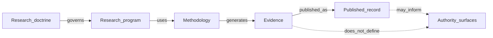

# Research Overview

## The Problem

STE makes claims about decisions, representation, evidence, validation, governance, machine-readable intent, and the conditions under which humans and machines can reason safely about software-intensive systems. Some claims are explanatory. Other claims are empirical: they imply that one representation, protocol, or workflow should behave differently from another under controlled conditions.

If those claims are not governed as research, the handbook can drift into doctrine-by-assertion. A persuasive example may be mistaken for evidence. A result may be mistaken for architecture authority. A failed study may disappear instead of improving the research record.

## The Reframe

Part 14 is the STE research section. It is the human-readable published record of what STE is investigating, why it matters, how research is governed, how evidence is generated, and how research publications are preserved.

The handbook is the human projection of the STE system. It explains why STE exists, how concepts connect, what is being investigated, and how knowledge evolves. It does not replace the repositories that define or operationalize STE:

| Repository | Research relationship |
|------------|-----------------------|
| `ste-spec` | Defines normative contracts, schemas, invariants, and authority surfaces. |
| `ste-runtime` | Operationalizes runtime behavior, context assembly, and research harness behavior where applicable. |
| `adr-architecture-kit` | Authors and validates ADR and Architecture IR substrate used by STE research. |
| `ste-handbook` | Publishes research doctrine, theories, methodologies, findings, reproductions, and open questions in human-readable form. |

## The Model

STE research separates doctrine from research programs:

STE research initially includes five broad study classes:

| Class | Focus |
|-------|-------|
| Representation research | Substrate quality, context assembly, provenance, authority, representation structure. |
| Reasoning research | Reasoning performance, model comparisons, prompt strategy comparisons. |
| Governance research | Admission protocols, adjudication, validation workflows, benchmark governance. |
| Evolution research | Search, MVC-D evolution, optimization strategies, candidate selection. |
| Human/AI collaboration research | HSCA, review workflows, augmentation methods, disagreement classification. |

MVC is the first major STE research program. It does not define the purpose of Part 14.

## The Implications

- Research publications are explanatory and evidentiary, not normative contracts.
- Operationalized experiment code, harnesses, task-bank contents, generated execution records, continuation state, scoring systems, and raw results remain in the relevant repositories or reproducibility packages.
- Research programs must preserve their theories, methodologies, experiment designs, findings, reproductions, and open questions.
- Failed, negative, inconclusive, and superseded findings remain part of the record.

## Relationship to STE system

Research connects to [Evidence](../03-artifacts/03-05-evidence.md), [Traceability](../03-artifacts/03-06-traceability.md), [Conformance](../03-artifacts/03-07-conformance.md), and [Determinism, Provenance, and Audit](../06-governance/06-06-determinism-provenance-and-audit.md). Research may inform future ADRs, contracts, invariants, benchmarks, or Kernel admission work, but promotion to those surfaces is a separate governance process.

## Summary

- Part 14 is the STE research record.
- The handbook publishes research doctrine and research publications.
- Normative authority remains outside research prose.
- MVC is the first major research program, not the reason Part 14 exists.
- Operational artifacts remain in their owning repositories or reproducibility packages.
