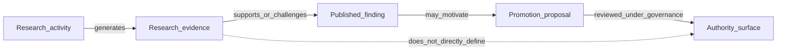

# Research Governance

## The Problem

Research work drifts when questions, protocols, benchmarks, and results are revised informally. Without governance, teams cannot tell whether a later result supersedes an earlier result, whether a failure was discarded, or whether a study changed while the claim stayed the same.

Research artifacts also look precise: scores, fixtures, observations, reports, and diagrams. Precision can be misleading. A reproducible result can still be non-authoritative, and a strong benchmark signal can still fail to define production behavior.

## The Reframe

Research governance is control over knowledge creation. It gives research the same discipline STE expects from architecture work: explicit intent, versioned artifacts, evidence retention, bounded interpretation, and governed promotion.

Research generates evidence. It does not define authority.

## The Model

The boundary is directional:

Research does not define:

- STE semantics.
- Architecture authority.
- Kernel admission.
- Benchmark answer authority.
- Production behavior.

Authority remains with:

- ADRs and accepted decision records.
- Invariants and constraints.
- Published contracts and schemas.
- Benchmark governance and adjudication processes.
- Kernel admission for production admission surfaces.

## The Implications

- Research programs need registered questions, methods, publication boundaries, retention rules, and supersession rules.
- Research outputs must be labeled as evidence, findings, reproductions, or open questions.
- Human memory is not architecture substrate unless captured in an accepted authority artifact.
- AI output is not benchmark answer authority without adjudication.
- A candidate representation is not production MVC-M without schema alignment and Kernel admission.
- Positive findings receive no special authority.

## Relationship to STE system

Research governance mirrors STE governance without replacing it. The research record is evidence governance; architecture governance still belongs to the authority surfaces described in [The Governance Model](../06-governance/06-02-the-governance-model.md), [Authority and Decision Rights](../06-governance/06-03-authority-and-decision-rights.md), [Architecture decision records](../03-artifacts/03-01-architecture-decision-records.md), and [Invariants](../03-artifacts/03-03-invariants.md).

## Summary

- Research evidence can influence authority, but it does not become authority by itself.
- Promotion from evidence to authority is a separate governance process.
- Failed and superseded research must remain discoverable.
- Research governance controls knowledge creation; it does not create normative doctrine directly.

Read next: [Research Lifecycle](14-02-research-lifecycle.md) names the maturity states that research claims pass through before any promotion review.
