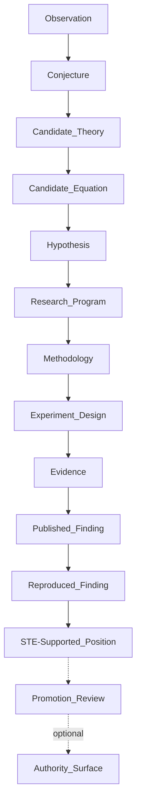
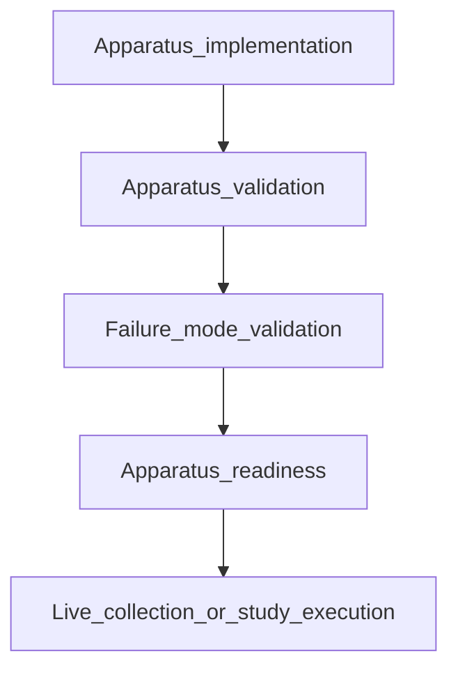

# Research Lifecycle

## The Problem

Readers need to know where a claim sits in the research lifecycle. Early observations, candidate theories, published findings, reproduced findings, and STE-supported positions have different maturity. None of those states is the same thing as normative authority.

If maturity and authority are collapsed, research becomes doctrine too early.

## The Reframe

Research maturity describes how much evidence and review a claim has accumulated. Authority status describes whether the claim has been promoted into ADRs, contracts, invariants, benchmarks, Kernel admission behavior, or another accepted surface.

Those are different dimensions.

## The Model

Research maturity has two axes that must not be collapsed.

### Claim maturity

Claim maturity describes how far a knowledge claim has moved from observation toward a STE-supported research position.

```mermaid
flowchart TD
  Observation --> Conjecture
  Conjecture --> CandidateTheory[Candidate_Theory]
  CandidateTheory --> CandidateEquation[Candidate_Equation]
  CandidateEquation --> Hypothesis
  Hypothesis --> ResearchProgram[Research_Program]
  ResearchProgram --> Methodology
  Methodology --> StudyDesign[Experiment_Design]
  StudyDesign --> Evidence
  Evidence --> PublishedFinding[Published_Finding]
  PublishedFinding --> ReproducedFinding[Reproduced_Finding]
  ReproducedFinding --> STESupported[STE-Supported_Position]
  STESupported -.-> PromotionReview[Promotion_Review]
  PromotionReview -. optional .-> Authority[Authority_Surface]
```

| State | Meaning |
|-------|---------|
| Observation | Something appears to happen in practice. |
| Conjecture | A possible explanation is proposed. |
| Candidate Theory | A structured explanation is stable enough to investigate. |
| Candidate Equation | A formalized variable relationship makes the theory testable. |
| Hypothesis | A bounded claim is derived from the theory or equation. |
| Research Program | The theory has a maintained home, methodology, open questions, and publication record. |
| Methodology | The program defines how the claim will be tested and interpreted. |
| Experiment Design | A specific study design instantiates the methodology. |
| Evidence | A study produces bounded evidence under a declared research configuration. |
| Published Finding | Evidence and interpretation are published in the research record. |
| Reproduced Finding | A finding has been reproduced under an identified configuration. |
| STE-Supported Position | The research record supports a position strongly enough to be cited as STE research guidance. |

### Instrument maturity

Instrument maturity describes whether the **Research Apparatus** is validated and ready. It is independent of claim maturity.

```mermaid
flowchart TD
  Impl[Apparatus_implementation]
  Val[Apparatus_validation]
  Fail[Failure_mode_validation]
  Ready[Apparatus_readiness]
  Live[Live_collection_or_study_execution]

  Impl --> Val
  Val --> Fail
  Fail --> Ready
  Ready --> Live
```

| State | Meaning |
|-------|---------|
| Apparatus implementation | Record shapes, producers, isolation, and validation entry points exist for the instrument. |
| Apparatus validation | Synthetic or local-test artifacts show mechanics behave as declared. |
| Failure-mode validation | Fail-closed exclusion, leakage detection, quarantine, and traceability behave as declared. |
| Apparatus readiness | The validated instrument is controlled so live collection or study execution may begin. |
| Live collection or study execution | Observations are gathered under the ready configuration; they are still not automatically admitted evidence. |

Apparatus validation is necessary but not sufficient for evidence. It shows the research machinery can produce inspectable records; it is not itself evidence about the hypothesis or the scientific construct under study. A claim may be mature on paper while the instrument is unready; an instrument may be ready while claims remain conjectural.

A STE-Supported Position is not normative doctrine. Promotion to ADRs, contracts, invariants, benchmarks, Kernel admission, or other authority surfaces remains a separate governance process.

Multiple findings may exist before any promotion review occurs. They may agree, conflict, or remain inconclusive.

## The Implications

- Research maturity should be named when publishing findings.
- Published findings do not automatically become STE authority.
- Reproduced findings strengthen research maturity, not authority status.
- Conflicting findings can coexist while the research program keeps open questions visible.
- Promotion review should cite the research record instead of replacing it.

## Relationship to STE system

The lifecycle supports [Traceability](../03-artifacts/03-06-traceability.md) for knowledge claims. It prevents research from bypassing [Conformance and Assessment](../05-lifecycle/05-05-conformance-and-assessment.md) or governance when a result suggests a future system change.

## Summary

- Research maturity and authority status are separate.
- STE-Supported Position is a research state, not normative doctrine.
- Multiple findings may accumulate before promotion review.
- Promotion into authority surfaces requires separate governance.

Read next: [Candidate Theories, Hypotheses, and Equations](14-03-candidate-theories-hypotheses-and-equations.md) explains how observations become testable claims.
