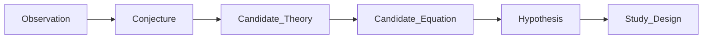

# Candidate Theories, Hypotheses, and Equations

## The Problem

Many engineering claims begin as observations. A tool feels better, a reasoner appears more accurate, or a workflow seems to expose drift earlier. Those observations are useful, but they are not yet research.

If STE jumps directly from observation to benchmark, it can test vague impressions instead of bounded theories.

## The Reframe

STE research formalizes candidate theories before experimental evaluation. Candidate equations are a first-class research mechanism: they state how a theory expects variables to relate, even before the equation is fully measured or validated.

## The Model

The claim formation path is:



| Stage | Meaning |
|-------|---------|
| Observation | Something appears to happen in practice. |
| Conjecture | A possible explanation is proposed. |
| Candidate Theory | A structured explanation names mechanisms, limits, and competing explanations. |
| Candidate Equation | A compact relationship among variables that makes the theory testable. |
| Hypothesis | A bounded claim derived from the equation or theory. |
| Study Design | A protocol that can generate evidence under declared controls. |

Candidate equations are not mathematical proof. They are research scaffolds. They expose what a theory believes is load-bearing.

For MVC, a candidate equation may separate:

```text
Reasoning Quality =
  f(Model Capability, Representation Quality, Context Assembly Quality)
```

This equation does not prove MVC. It prevents a study from treating model capability, representation quality, and assembly quality as one undifferentiated cause.

### Candidate Equation Variables

Candidate equations should name variables before claiming relationships among them. A variable may be observed, derived, inferred, or future-facing:

| Class | Meaning |
|-------|---------|
| Observed variable | Directly represented by the research substrate or evidence package. |
| Derived variable | Computed from observed variables under a declared method. |
| Inferred variable | Needed by the theory but not yet directly represented or measured. |
| Future variable | Reserved for a later research configuration with new measurement authority. |

For representation-science studies, useful variable families include:

- representation substrate,
- substrate affordances,
- admissible assembly configuration space,
- selected assembly configuration,
- prohibited assembly mechanisms,
- configuration identity and fingerprint,
- fixed, varied, and defaulted configuration fields,
- configuration equivalence and drift status,
- entity, relationship, provenance, freshness, invariant, and topology signals,
- source coverage, attribution coverage, negative space, and budget signals,
- local discrimination, instrument health, and context health signals,
- human observation and disagreement classification signals,
- reasoning-quality variables once answer authority exists.

This variable inventory is not an equation by itself. It is the material from which candidate equations are formed.

### Interaction Terms

Candidate equations should not assume independent additive effects unless the research design can justify that assumption. In MVC research, representation effects are expected to be interaction-heavy:

- a persona changes which domains matter,
- a task changes which relationships are required,
- a richer substrate may enable assembly mechanisms unavailable to weaker substrates,
- a valid entity set may still fail if relationships, provenance, or negative space are missing,
- configuration drift can look like a substrate effect unless it is controlled.

For that reason, a candidate equation should explicitly mark interactions that the study intends to test or preserve as open questions.

## The Implications

- Candidate theories should state mechanisms and competing explanations.
- Candidate equations should name the variables a study must separate.
- Hypotheses should derive from the candidate theory or equation.
- Representation science, substrate completeness, context assembly, and reasoning behavior should not be collapsed into one metric.
- Claims that cannot yet be tested should remain conjectures or candidate theories.
- Variable names are research notation, not STE contract fields.
- Candidate equations should state what is measurable now, what is derived, and what is missing.

## Relationship to STE system

Candidate theories and equations protect [Traceability](../03-artifacts/03-06-traceability.md) for research claims. They also keep research from turning [Evidence](../03-artifacts/03-05-evidence.md) into authority without governance.

MVC applies this doctrine in its [candidate equation variables](research/mvc/02-methodology/candidate-equation-variables.md) methodology note.

## Summary

- Observations are not hypotheses.
- Candidate theories explain mechanisms.
- Candidate equations formalize relationships before evaluation.
- Hypotheses and study designs should derive from the theory, not from the desired outcome.
