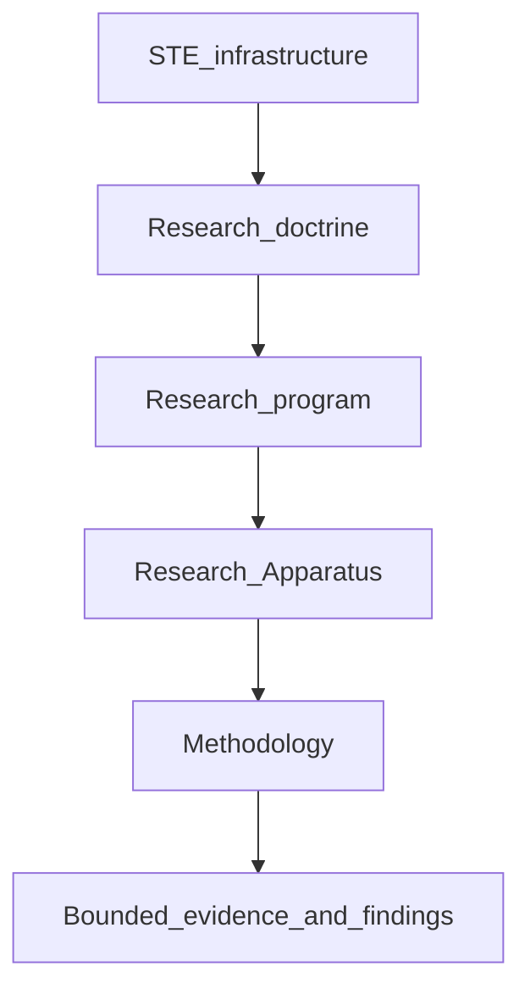

# Research Apparatus

## The Problem

Research programs can confuse a working instrument with a supported claim.

An apparatus can seal observations, reject invalid records, replay hashes, and fail closed on exclusion rules while still saying nothing about whether a hypothesis is true. If those instrument successes are published as evidence of representation quality, reasoning quality, or search quality, the research record collapses apparatus validation into hypothesis validation.

## The Reframe

A **Research Apparatus** is the governed experimental instrument of a research program. It is not STE infrastructure as a whole, not research methodology, and not evidence.

STE infrastructure provides modeled substrate, traceability, provenance, and context-assembly capabilities that make research programs possible. Research doctrine governs how programs separate evidence from authority. A research program is the maintained home for a theory family. The Research Apparatus is the instrument that program uses to collect and preserve observations under controlled conditions. Methodology declares how those observations may become admitted evidence. Findings remain bounded interpretations until a separate governance process considers promotion.

## The Model

### Conceptual stack



### What the apparatus must keep distinct

| Concern | Question the apparatus answers | Question it does not answer |
|---------|--------------------------------|-----------------------------|
| Identity and lineage | Can observations be addressed, sealed, and traced? | Is the answer correct? |
| Isolation and ordering | Were collection streams kept independent under declared rules? | Is the substrate complete? |
| Exclusion | Do synthetic and local-test artifacts stay out of research evidence paths? | May search optimize for fitness? |
| Replay | Can a declared configuration be re-checked under controls? | Is the result true? |
| Readiness | Is the instrument controlled enough to begin live collection or study execution? | Has the hypothesis been supported? |

### Apparatus validation versus apparatus readiness

**Apparatus validation** shows that mechanics behave as declared on synthetic or local-test inputs. It is engineering evidence about the instrument.

**Apparatus readiness** is the controlled state in which live collection or study execution may begin under a known configuration. Readiness is not publication evidence and not research fitness.

**Calibration** checks wiring or sensitivity against known non-authoritative markers. Calibration is not gold lock and not adjudication.

### Operating capability versus evidentiary authority

Operating capability and evidentiary authority are orthogonal. Progress on the instrument does not grant evidence authority.

| Dimension | Members (illustrative) |
|-----------|------------------------|
| Operating capability | Apparatus construction; apparatus validation; calibration; local-test execution; live experimental collection; closure execution; replay and reproducibility support |
| Authority or evidence status | Engineering validation artifact; collected observation; candidate evidence; admitted experimental evidence; bounded substrate-closed `Q`; benchmark authority; research fitness; research conclusion |

A program may advance operating capability while authority statuses above collected observation remain blocked. Collection success is not admission. Bounded substrate-closed `Q` is not `Q_fixture`. Program-local pages such as [MVC experimental apparatus](research/mvc/02-methodology/experimental-apparatus.md) elaborate the distinction without replacing this doctrine.

### Authority pipeline


Admission is a separate governed transition. Collected observations do not become admitted evidence merely because collection succeeded.

For HSCA-backed known outcomes, the narrower path is:

```text
sealed observations (collected records)
  → cooperative review and governed closure
    (bounded semantic adjudication + deterministic validation, assembly, identity, hashing, and promotion controls)
  → substrate-closed Q (bounded; explicit ceilings)
  → separate benchmark adjudication
  → Q_fixture
  → research fitness / benchmark-backed readings
```

Governed closure contracts can exist before any live closure record exists. Substrate-closed `Q` is not `Q_fixture`. Apparatus success never grants benchmark authority.

### Conceptual controls

Research apparatus doctrine keeps these controls visible even when program pages omit implementation detail:

- sealed identity for questions, answers, and packages;
- append-only lineage for corrections and repairs;
- bounded replay as reproducibility checking, not proof;
- research-exclusion so synthetic and local-test artifacts fail closed out of research-evidence paths;
- projections and generated views as derived, read-only, and non-authoritative unless a methodology explicitly admits them.

## The Implications

- Apparatus validation is necessary and never sufficient for research claims.
- Live sealed collection can establish provenance without establishing completeness, correctness, or admission.
- Pilot and calibration results remain narrower than adjudicated benchmark readings.
- Program-local apparatus pages explain one instrument family; they do not replace this doctrine chapter.
- Operational schemas, scripts, gate names, and repository paths stay outside handbook prose.

## Relationship to STE system

Research Apparatus sits between research programs and methodologies in Part 14. It uses STE infrastructure capabilities described across Evidence, Traceability, and Determinism, Provenance, and Audit without moving architecture or Kernel authority into research. MVC’s experimental-apparatus publication is the first program-local elaboration of this chapter, not the definition of Part 14.

## Summary

- Research Apparatus is the program’s experimental instrument, not STE as a whole.
- Operating capability and evidentiary authority remain orthogonal.
- Validation, readiness, calibration, collected observation, admission, and study evidence are different states.
- Observations become authority only through admitted evidence, findings, proposals, and separate governance.
- Substrate-closed `Q` and `Q_fixture` remain distinct; fitness requires benchmark authority.
- Apparatus success never validates the hypothesis under study.

Read next: [Research Methodology](14-05-research-methodology.md) explains how claims are tested once an instrument boundary exists.
