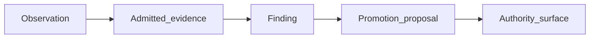

# Interpretation and Promotion

## The Problem

The most common research failure is not a bad result. It is an interpretation that outruns the evidence. A statistically significant result can be real and still narrow. A failed study can challenge an instrument without falsifying the broader theory.

## The Reframe

STE interpretation is conservative by default. Interpretations must stay narrower than the evidence boundary and must name what they do not establish.

Promotion is separate. A finding may motivate a proposal to change ADRs, contracts, invariants, benchmarks, Kernel admission, or production semantics, but that proposal must pass the relevant governance process.

## The Model

### From observation to authority



| Stage | Meaning |
|-------|---------|
| Observation | Recorded under a declared condition; not yet evidence. |
| Admitted evidence | Observation accepted under methodology with provenance and bounds. |
| Finding | Published interpretation within those bounds. |
| Promotion proposal | Optional request to change an authority surface. |
| Authority surface | ADR, contract, invariant, benchmark adjudication, Kernel admission, or equivalent — changed only by its own governance process. |

Interpretation rules still constrain every arrow:

- A statistically significant result does not imply production viability.
- A benchmark improvement does not imply general capability improvement.
- A successful MVC study does not prove STE.
- A failed MVC study does not automatically falsify the representation ceiling theory.
- A positive local result does not establish hosted equivalence.
- A human observation does not become answer authority.
- A candidate packet result does not establish production MVC-M behavior.
- A stronger representation result does not imply that context assembly is free or universally small.

The useful form is:

```text
Within boundary B, under protocol P, evidence E supports/challenges interpretation I.
It does not establish claims X, Y, or Z.
```

## The Implications

- Every research publication should include a "does not establish" statement.
- Positive and negative outcomes should both be interpreted through their protocol boundaries.
- Claims about production behavior require production-relevant evidence and authority review.
- Future work should be driven by evidence gaps, not by pressure to declare victory.
- STE-Supported Positions remain research positions until separately promoted.

## Relationship to STE system

Conservative interpretation protects governance. It ensures research evidence informs future decisions without bypassing [Authority and Decision Rights](../06-governance/06-03-authority-and-decision-rights.md).

## Summary

- Interpretations must remain narrower than evidence.
- Statistical, benchmark, and local signals do not automatically generalize.
- Negative results can expose weak instruments or weak claims.
- Promotion to authority surfaces is a separate governance act.

Read next: [Research Library](14-09-research-library.md) explains where research programs, findings, reproductions, and open questions are preserved.
