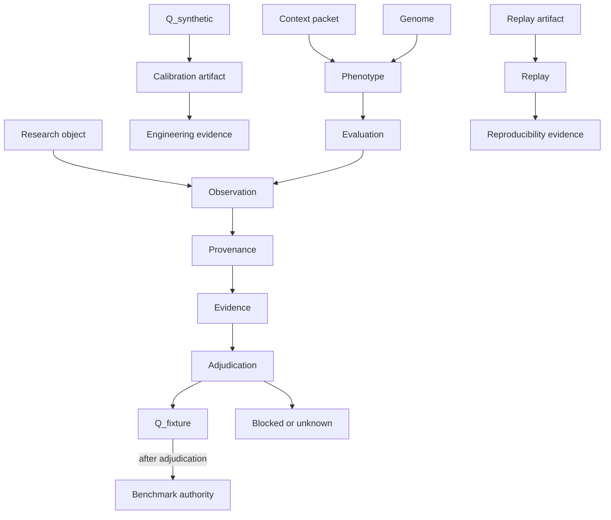
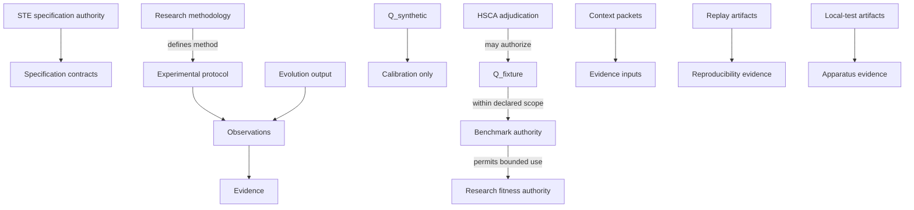

# Evolution Methodology v2

## The Problem

Evolution research can produce persuasive improvements before the research program knows what those improvements mean.

A search procedure can promote a context packet, assembly policy, or representation variant because it scores better under a local instrument. That promotion can then be misread as benchmark authority, MVC validation, Human-Assisted Substrate Completeness Analysis (HSCA) validation, representation-ceiling evidence, substrate-quality evidence, or evidence that one participant class is superior to another. The failure mode is structural: optimization pressure collapses search artifacts, observations, evidence, authority, and claims into one number unless the methodology keeps them separate.

The first public evolution methodology named this risk and described a candidate search scaffold. That scaffold remains useful historical context, but it is not a complete evolution methodology. A fixed population with pre-seeded `F_sim`, top-k promotion, and a fuller evaluation pass can validate harness behavior and support limited observations. It cannot support claims about mutation, crossover, replacement, convergence, search behavior, or research fitness unless those elements are actually part of the declared method.

The MVC/HSCA research program therefore needs an implementation-independent evolution methodology. The methodology must define what search is allowed to explore, what fitness is allowed to measure, what evidence the run produces, what claims remain prohibited, and how uncertainty is preserved.

## The Reframe

Evolution is not authority. It is a controlled way to explore a design space under declared constraints.

In the MVC research program, evolution/search studies candidate context and assembly conditions. A search run may discover candidates that perform better under a declared instrument. That is an observation about the search configuration, the evaluation apparatus, and the candidate space. It is not a proof that MVC is true, that HSCA is valid, that representation quality caused the result, or that a generated packet should become production MVC material.

This methodology is the research-method authority for MVC evolution/search studies. It is not STE specification authority, architecture authority, benchmark authority, or implementation authority. Future implementation plans and future implementations are derived artifacts. They may realize the methodology in different ways, including genetic algorithms, evolutionary strategies, Bayesian optimization, enumerative search, constraint-guided search, or other search procedures, provided they preserve the same authority boundaries, evidence model, provenance obligations, and interpretation limits.

Four layers must remain separate:

| Layer | Status | Role |
|-------|--------|------|
| Normative methodology | Research-method authority for this program | Defines required meanings, boundaries, evidence rules, and claim limits. |
| Conceptual search model | Implementation-independent model | Defines search space, state, candidate representation, population, fitness, operators, and measurement. |
| GA realization | Illustrative first realization | Shows how a genetic algorithm can instantiate the conceptual model without becoming methodology authority. |
| Implementation realization | Descriptive embodiment | Records what a repository or harness currently does. It is evidence about one realization, not a constraint on the methodology. |

In this document, **Normative methodology** means the methodological baseline for studies and reports that claim conformance to this MVC evolution/search method. It does not mean STE specification authority.

Where the current apparatus diverges from this methodology, the divergence is a realization coverage gap, not a reason to weaken the methodology.

### Non-goals

This methodology does not define schemas, validators, command-line behavior, file layouts, repository tasks, or engineering acceptance criteria. Those are future realization choices derived from the method. The current conceptual apparatus boundary is summarized in [MVC experimental apparatus](experimental-apparatus.md).

It does not authorize synthetic fixtures, replay artifacts, evolution outputs, implementation reports, or current apparatus behavior as benchmark authority.

It does not validate MVC, HSCA, RSS, representation ceilings, substrate quality, or human/AI superiority without separately adjudicated evidence and claim analysis.

## The Model

### 1. Research Ontology

#### Normative methodology

The methodology uses the following ontology. These terms define the conformance vocabulary for MVC evolution/search research reports.

| Concept | Definition | Status class |
|---------|------------|--------------|
| Research object | The thing being studied: a candidate context condition, assembly rule, representation condition, search procedure, measurement instrument, or claim boundary. | Observational until studied under a protocol. |
| Observation | A recorded result from a human, AI, search run, apparatus check, replay, or measurement process. | Observational. |
| Evidence | An observation with sufficient provenance, boundary controls, and traceability to support a bounded interpretation. | Evidentiary, not automatically authoritative. |
| Benchmark | A controlled task and scoring/adjudication instrument used to compare candidate conditions. | Instrument. |
| Benchmark authority | Explicit gold, rubric, adjudication, or equivalent authority surface that defines what a task outcome means. | Authoritative only when explicitly created. |
| Fixture | A named artifact used to hold task, context, observation, scoring, or replay material. | Synthetic, observational, or authoritative depending on provenance and adjudication. |
| `Q_synthetic` | A synthetic or local-test known-outcome placeholder used to test apparatus wiring or calibration. | Synthetic and derived; never benchmark authority. |
| `Q_fixture` | A known outcome locked through an explicit adjudication protocol such as completed HSCA or an equivalent authority process. | Adjudicated benchmark authority for its declared boundary. |
| Adjudication | A governed process that converts observations and evidence into an explicit authority artifact or blocks that conversion. | Authority-producing only when the protocol says so. |
| Calibration artifact | An artifact used to check whether apparatus mechanics or scoring wiring behave as expected. | Engineering evidence only. |
| Synthetic artifact | An artifact generated or hand-authored to exercise apparatus behavior. | Synthetic; not research evidence unless a separate protocol explicitly says otherwise. |
| Replay artifact | A record that allows a run, input bundle, or measurement to be checked again under declared controls. | Derived evidence about reproducibility; not proof. |
| Context packet | A candidate evidence input assembled for a task or condition. | Evidence input; not architecture authority, MVC-M materialization, or benchmark authority. |
| Genome | The encoded search representation from which a candidate condition can be generated or selected. | Search state. |
| Phenotype | The realized candidate condition evaluated by the apparatus, usually a rendered packet, assembly configuration, or context condition. | Experimental object. |
| Generation | A bounded search step or cohort transition under a declared population, operator set, and evidence boundary. | Search state boundary. |
| Population | A bounded set of candidate states eligible for evaluation and selection under one generation identity. | Search state. |
| Experiment | A declared run or family of runs with fixed controls, task bank, scoring/adjudication surfaces, model/runtime conditions, and evidence boundaries. | Research configuration. |
| Replay | Re-execution or verification of an artifact under declared controls. | Reproducibility check. |
| Provenance | The traceable record of origin, inputs, controls, transformations, timestamps, versions, and authority status. | Required for evidence. |
| Authority | Permission for an artifact to decide or constrain interpretation within a declared scope. | Explicit, scoped, and never implied by existence. |
| Claim boundary | The limit on what a result may support. | Required for every report. |

The status classes are distinct:

- **Observational:** recorded but not adjudicated.
- **Authoritative:** accepted by an explicit authority process for a declared scope.
- **Derived:** computed from other artifacts and dependent on their authority status.
- **Synthetic:** constructed for apparatus behavior, calibration, or fixtures; not real evidence by default.
- **Adjudicated:** promoted or blocked by a declared adjudication protocol.



The diagram is explanatory. It shows permitted authority movement only where adjudication or a declared protocol creates that movement; arrows do not make artifacts authoritative by themselves.

#### Conceptual search model

The ontology applies before a search strategy is chosen. Any search procedure must declare which objects are genomes, which objects are phenotypes, which observations are measured, which quantities are derived, which artifacts can become evidence, and which artifacts can never become authority.

#### GA realization

In a genetic algorithm realization, a genome may encode packet composition, assembly parameters, selector weights, or representation inclusion rules. The phenotype is the candidate condition evaluated against tasks. A generation is one application of evaluation and operators over a population.

#### Current apparatus state

The current apparatus contains a static population and an evaluation ladder. It has candidate-to-packet mappings and pre-seeded `F_sim`, but it does not yet embody a complete genome, generation transition, mutation, crossover, replacement, diversity, convergence, or termination model.

### 2. Purpose of Evolution Research

#### Normative methodology

Evolution/search is intended to explore how candidate context and assembly conditions perform under controlled evaluation. It is intended to optimize candidate selection within a declared search space and evidence boundary.

It is not intended to prove:

- MVC,
- HSCA,
- Runtime State Slicing (RSS),
- the representation ceiling,
- substrate quality,
- human performance superiority,
- AI performance superiority,
- causal effects of representation without a causal study design.

Evolution/search may support observations about:

| Observation type | May support | May not support |
|------------------|-------------|-----------------|
| Engineering behavior | Whether the apparatus can generate, evaluate, checkpoint, replay, and fail closed. | Research validation. |
| Apparatus behavior | Whether controls and provenance are preserved. | Benchmark authority. |
| Optimization behavior | Whether a search procedure improves a declared fitness signal under a declared configuration. | MVC or HSCA validation. |
| Candidate comparison | Whether candidate conditions differ under one instrument. | General model capability or human/AI superiority. |
| Replay behavior | Whether a run is reproducible under declared controls. | Truth of the result. |

#### Conceptual search model

The search objective is to explore a constrained design space of candidate context conditions. The optimization objective is the declared fitness function, not the broader theory. The methodology treats improvement in the fitness function as an observation that requires interpretation.

#### GA realization

A GA may optimize a population of encoded candidate conditions over generations. Its operators do not change the authority boundary. A candidate that survives, wins, or converges remains a research artifact until separately adjudicated.

#### Current apparatus state

The current apparatus can support apparatus and calibration observations. Its synthetic local-test calibration and static ladder do not produce research fitness, benchmark authority, or hypothesis validation.

### 3. Experimental Object and Conceptual Model

#### Normative methodology

An evolution/search study must declare:

- the search objective,
- the optimization objective,
- the search space,
- the state space,
- the candidate representation,
- the genome,
- the phenotype,
- representation invariants,
- the fitness evaluation unit,
- the evidence boundary,
- population identity,
- generation identity,
- bank identity.

The genome is the encoded object manipulated by search. The phenotype is the realized object evaluated by the apparatus. A context packet may be a phenotype, part of a phenotype, or an input to phenotype rendering. It must not be treated as a genome unless the search procedure actually manipulates packet content as encoded search state.

Representation invariants must state what cannot be changed by search. Examples include preserving task isolation, respecting source authority, maintaining packet identity semantics, excluding prohibited evidence, and keeping candidate identity separate from packet identity.

#### Conceptual search model

The search space is the set of all admissible candidate states. The state space is the set of states that can be reached under the declared initialization and operator rules. These are not always equal. If the operator set cannot reach part of the search space, the report must say so.

The fitness evaluation unit is a tuple:

```text
(candidate phenotype, task or task set, evidence boundary, scoring or adjudication surface, runtime condition)
```

No result is interpretable without all elements of that tuple.

#### GA realization

A GA realization should define a genome that can mutate and recombine without violating representation invariants. If packet composition is the genome, mutation may add, remove, reorder, or weight candidate components. If assembly configuration is the genome, mutation may alter declared parameters. If recombination would produce incoherent packets, crossover should be disallowed or constrained.

#### Current apparatus state

The current population file maps candidate identifiers to packets and hand-seeded screening values. That is a candidate scaffold, not a complete genome model. Treating it as a full evolutionary population would overstate the apparatus.

### 4. Population and Generation Semantics

#### Normative methodology

A population is a bounded set of candidate search states eligible for evaluation and selection under one generation identity. A generation is a controlled transition step with fixed evidence boundaries and declared operators.

Population identity must include:

- population identifier,
- generation identifier,
- bank identifier,
- candidate set,
- genome schema or representation definition,
- initialization source,
- operator set,
- evidence boundary,
- provenance hash or equivalent identity mechanism.

Generation invariants:

- A generation must not mix task banks, scoring surfaces, model/runtime identities, or evidence boundaries without explicit cross-generation study design.
- Generation identity must change when any control that affects interpretation changes.
- Historical generations remain discoverable but are not silently aggregated with current generations.

Population invariants:

- Candidate identity must remain stable within a generation.
- Phenotype identity must be reproducible from genome and declared rendering rules.
- Invalid candidates must be quarantined or excluded with reasons.
- Unknown or unresolved candidate state is an allowed outcome.

Bank invariants:

- A bank boundary names the task, scoring/adjudication, runtime, and apparatus controls under which observations are comparable.
- Results from different banks are not comparable unless a later study explicitly defines the comparison.

#### Conceptual search model

Population state is not just a list of candidates. It is the combination of candidates, identities, control values, evaluation status, provenance, and exclusion status.

#### GA realization

In a GA, generation `g + 1` must be reproducible from generation `g`, the operator parameters, random seed or stochastic provenance, and any external evidence inputs. Elitism, survivor selection, and replacement must preserve enough provenance to explain why a candidate entered the next generation.

#### Current apparatus state

The current apparatus has a bank generation and a static population, but it does not yet preserve full population identity, generation transition identity, or operator provenance for a complete evolution study.

### 5. Fitness Semantics

#### Normative methodology

Fitness is a declared measurement function. It is not benchmark authority and not theory validation.

Every fitness model must distinguish:

| Variable class | Meaning |
|----------------|---------|
| Fitness variables | Quantities used directly in selection or promotion. |
| Measured variables | Quantities directly observed from runs, records, or adjudication. |
| Controlled variables | Quantities held fixed or deliberately varied under the research design. |
| Observed variables | Recorded facts not necessarily used in fitness. |
| Derived variables | Computed from measured or observed variables. |
| Reported variables | Quantities shown in reports, whether or not used by search. |

Composite fitness must declare:

- components,
- normalization,
- weights,
- aggregation rule,
- missing-data behavior,
- deterministic components,
- stochastic components,
- authority prerequisites,
- prohibited sources,
- interpretation boundary.

`Q_synthetic` is allowed only for engineering calibration and synthetic/local-test wiring validation. It must be marked synthetic, local-test, and non-authoritative. It must never become benchmark authority or research fitness authority.

`Q_fixture` requires completed adjudication, such as the target HSCA bidirectional cooperative review described in [HSCA methodology](hsca-methodology.md), or an equivalent declared authority process. Without `Q_fixture` or equivalent benchmark authority, a search may optimize only engineering or pilot signals, not authoritative research fitness.

`F_sim` is a screening or simulation signal. It may reduce cost or select candidates for fuller evaluation. It is not reasoning quality and not research fitness unless a future methodology explicitly gives it an authority-backed role.

`F_full` is a fuller evaluation signal under declared runtime, task, scoring, and evidence controls. It remains evidence, not authority. If it is scored against non-authoritative `Q`, its interpretation is limited to the authority of that `Q`.

Prohibited fitness sources until benchmark authority exists:

- synthetic `Q` used as research truth,
- human memory used as answer authority,
- AI observations used as answer authority,
- generated GA outputs used as their own validation target,
- packet metrics used as quality authority without adjudication,
- replay success used as correctness proof,
- local-test artifacts used as publication evidence.

#### Conceptual search model

Fitness may be single-objective or multi-objective. Multi-objective studies must declare whether they use scalar weighting, Pareto ranking, constraint thresholds, or staged gates. Weights are part of the research configuration and must not be changed mid-generation without a new boundary.

Deterministic components must be reproducible from recorded inputs. Stochastic components must record seeds, sample counts, runtime condition, or equivalent provenance. If stochastic provenance is incomplete, the result remains observational but loses replay strength.

#### GA realization

A GA may use `F_sim` for early screening, `F_full` for finalist evaluation, and future adjudicated components for research fitness. Selection pressure must be tied to the declared fitness authority. If the only available signal is synthetic or local-test, the GA run is an engineering validation run.

#### Current apparatus state

The current apparatus supports synthetic/local-test calibration and static `F_sim` screening. It does not have real `Q_fixture`; therefore it cannot produce authoritative research fitness.

### 6. Evolution Operators and Lifecycle

#### Normative methodology

Evolution/search lifecycle steps must have declared meaning, constraints, and failure behavior:

| Step | Methodological meaning | Required constraints |
|------|------------------------|----------------------|
| Initialization | Creates the initial eligible candidate state. | Source, randomness, constraints, and provenance recorded. |
| Evaluation | Measures candidate phenotypes against declared tasks and controls. | Evaluation boundary fixed and replayable where required. |
| Selection | Chooses candidates for promotion or reproduction. | Selection criterion declared before evaluation. |
| Mutation | Applies bounded changes to candidate state. | Must preserve representation invariants or mark invalid. |
| Crossover | Combines candidate state from more than one parent. | Allowed only when recombination preserves semantic coherence. |
| Elitism | Carries selected candidates forward unchanged. | Must not hide diversity loss or authority promotion. |
| Survivor selection | Determines which candidates remain eligible. | Must preserve exclusion reasons and selection provenance. |
| Replacement | Constructs the next population. | Must preserve generation identity and lineage. |
| Diversity preservation | Prevents collapse to trivial variants where the study requires exploration. | Diversity metric or qualitative rule declared. |
| Convergence criteria | Defines when search appears stable. | Must not be read as theory support by itself. |
| Stopping criteria | Defines planned stopping conditions. | Must be declared before run or explicitly labeled exploratory. |
| Termination conditions | Defines stop-on-error, stop-on-contamination, stop-on-quarantine, or stop-on-resource rules. | Fail-closed behavior required for authority or leakage problems. |

Checkpointing records enough state to resume or audit a run. Reporting preserves observations, derived values, exclusions, unknowns, and claim boundaries. Replay checks reproducibility. Quarantine isolates contaminated or invalid artifacts. Exclusion removes artifacts from analysis without deleting their trace. Promotion moves a candidate to a later research phase only when the promotion criteria are met.

#### Conceptual search model

Operators are constraints over state transitions. A methodology-compliant search strategy may use all, some, or none of the GA-specific operators if it declares equivalent transition semantics. For example, enumerative search may have no mutation or crossover; Bayesian optimization may propose candidates through a surrogate model. The same evidence, authority, and provenance rules still apply.

#### GA realization

Mutation and crossover are appropriate only when the genome has compositional semantics. Crossover over free-form prose packets is usually suspect unless packet sections, source references, and invariants make recombination meaningful. A GA may disallow crossover and still be a valid GA realization if mutation, selection, replacement, and population transition provide the intended search behavior.

#### Current apparatus state

The current ladder has selection by pre-seeded `F_sim` and checkpointing for fuller evaluation. It does not have candidate generation, mutation, crossover, elitism, survivor selection, replacement, diversity preservation, convergence, or termination semantics for a full evolution study.

### 7. Parameter Model

#### Normative methodology

Parameters define the search condition. They are not fixed by this methodology unless a specific study declares them.

| Parameter | Meaning |
|-----------|---------|
| Population size | Number of eligible candidate states in a generation. |
| Generation count | Planned number of population transitions. |
| Mutation rate | Frequency or probability of mutation operations. |
| Crossover rate | Frequency or probability of recombination operations. |
| Elite count | Number of candidates carried forward unchanged. |
| Tournament size | Number of candidates compared in tournament selection, where used. |
| Diversity controls | Metrics or rules that prevent unwanted collapse of the search space. |
| Replay controls | Conditions under which run artifacts must be reproducible. |
| Checkpoint frequency | How often search state is persisted for audit or resume. |

Parameter values must be declared before their results are interpreted. If parameters change during a run, the change must be recorded as an exploratory intervention or a new experiment boundary.

#### Conceptual search model

Some search strategies do not use GA parameters. They must declare equivalent search controls: candidate proposal budget, acquisition rule, enumeration order, constraint solver settings, random restart policy, or other strategy-specific controls.

#### GA realization

A GA realization should report parameter values with generation identity and fitness configuration. It should avoid treating default library values as implicit methodology.

#### Current apparatus state

The current apparatus has top-k and checkpoint settings. Those are ladder controls, not complete evolution parameters.

### 8. Controls, Measurement Model, and Validity Boundaries

#### Normative methodology

Required controls:

| Control | Role |
|---------|------|
| `bank_generation` | Evidence boundary for comparable results. |
| `experiment_fingerprint` | Composite identity for generation, task bank, scoring/adjudication, and model/runtime condition. |
| `task_bank_hash` | Identity of task set. |
| `scoring_hash` or adjudication identity | Identity of scoring or authority process. |
| `model_identifier` | Runtime/model identity for reasoner-dependent results. |
| `candidate_context_hash` | Identity of evaluated candidate context. |
| `packet_hash` | Identity of packet artifact when packet-backed. |
| Apparatus version | Identity of tool or procedure used for collection/evaluation. |
| HSCA readiness | Whether apparatus and adjudication prerequisites are satisfied. |
| Replayability | Whether inputs and run state can be checked again. |
| Fail-closed behavior | Refusal to interpret contaminated, missing-authority, or misclassified artifacts. |
| Provenance | Origin and transformation record for every reported quantity. |
| Traceability | Link from reported result to inputs, controls, and authority status. |

Recommended controls:

- random seed or stochastic provenance,
- operator version,
- population lineage,
- exclusion/quarantine reason taxonomy,
- task family and task type,
- packet metrics marked observational,
- runtime resource condition,
- human blinding state where human observations are involved.

Optional controls:

- diversity indices,
- convergence diagnostics,
- multi-objective frontier records,
- confidence intervals where sample design supports them.

Future-compatible controls:

- adjudication protocol version,
- cross-substrate equivalence mapping,
- representation-specific fairness constraints,
- independent replication identity.

Measurement categories:

| Category | Rule |
|----------|------|
| Measured variables | Must point to raw records or adjudication artifacts. |
| Observed variables | Must preserve collection context and authority status. |
| Derived variables | Must name formula, inputs, and input authority. |
| Controlled variables | Must say fixed, varied, defaulted, or unknown. |
| Reported variables | Must include provenance and interpretation class. |

#### Conceptual search model

A reported value without provenance is not evidence. A derived value cannot have greater authority than its inputs. A comparison across boundaries is invalid unless the study declares a cross-boundary design.

#### GA realization

GA reports should include generation lineage, parentage where applicable, operator parameters, candidate hashes, task bank identity, scoring/adjudication identity, and exclusion/quarantine records.

#### Current apparatus state

The current apparatus already uses several useful controls, including bank generation, experiment fingerprint, hashes, local-test markers, and fail-closed validation. These are consistent with the methodology but do not by themselves create research authority.

### 9. Research Phases

#### Normative methodology

Evolution/search research proceeds through phases. Promotion is explicit and evidence-bound.

| Phase | Purpose | Allowed conclusions | Disallowed conclusions | Required authority | Promotion criteria |
|-------|---------|---------------------|-------------------------|--------------------|--------------------|
| Phase A: `Q_synthetic` calibration | Check scoring and wiring mechanics. | Engineering calibration behaves as expected. | MVC, HSCA, benchmark, or fitness validation. | Synthetic/local-test markers. | Calibration artifacts pass fail-closed checks and remain excluded from research evidence. |
| Phase B: synthetic/local-test wiring validation | Check generation, evaluation, replay, quarantine, and traceability mechanics. | Apparatus can execute declared mechanics. | Research evidence or hypothesis support. | Local-test authority only. | No leakage into research paths; replay and exclusion behavior pass. |
| Phase C: pilot evolution with controlled tasks | Observe search and instrument behavior under controlled but non-authoritative tasks. | Pilot observations about optimization and discrimination. | Benchmark-backed claims or theory validation. | Pilot protocol and task controls. | Candidate separation, task health, provenance, and interpretation boundaries pass. |
| Phase D: evolution with HSCA-adjudicated `Q_fixture` | Run search against benchmark-backed authority. | Benchmark-backed observations within declared boundary; evolution outputs remain observational or derived. | General theory support without replication and analysis. | `Q_fixture` or equivalent benchmark authority. | Completed adjudication, stable controls, replay, and threat analysis. |
| Phase E: future research claims | Interpret accumulated evidence across studies. | Supported hypotheses where evidence warrants. | Causal proof without causal design; production authority. | Published methodology, evidence analysis, replication where needed. | Reproducible evidence, explicit claim ladder, unresolved uncertainty preserved. |

#### Conceptual search model

Each phase may use different search strategies. Phase labels constrain interpretation, not implementation. A technically complete GA run in Phase B remains apparatus validation; a simple search in Phase D may produce stronger evidence if benchmark authority exists.

#### GA realization

The first GA realization should enter Phase A or B unless real `Q_fixture` and full phase controls are available. A GA cannot promote itself into Phase D.

#### Current apparatus state

Current synthetic HSCA and local-test calibration partially realize Phase A and Phase B. They do not realize Phase C, D, or E.

### 10. Claim Ladder and Research Interpretation Model

#### Normative methodology

Reports must locate claims on this ladder:

| Level | Evidence present | Allowed conclusion | Prohibited conclusion | Promotion criterion |
|-------|------------------|--------------------|-----------------------|--------------------|
| Engineering validation | Unit or local apparatus checks. | A mechanism behaves locally. | Research validity. | Complete provenance and fail-closed behavior. |
| Apparatus validation | End-to-end synthetic/local-test run. | Apparatus preserves controls. | Experiment result. | Isolation from research evidence. |
| Synthetic calibration | `Q_synthetic` checks scoring/wiring. | Calibration path works. | Benchmark authority. | Synthetic markers and explicit mode. |
| Replay validation | Replay artifacts match controls. | Run is reproducible under conditions. | Result is true. | Stable inputs and hash verification. |
| Pilot observation | Controlled non-authoritative study. | Candidate or instrument behavior observed. | Hypothesis validation. | Task health and interpretation boundary. |
| Benchmark observation | Benchmark-backed run. | Candidate behavior under benchmark. | General theory support. | Benchmark authority and controls. |
| HSCA-adjudicated observation | Completed HSCA or equivalent. | Known outcome authority within scope. | Universal correctness. | Adjudication record and unresolved gaps. |
| Reproducible research evidence | Repeated or independently replayable evidence. | Stronger bounded evidence. | Causal proof without design. | Replication and threat analysis. |
| Supported hypothesis | Evidence supports a defined hypothesis. | Bounded hypothesis support. | Production or STE spec authority. | Published analysis and claim boundary. |
| Future theory support | Multiple studies align with theory. | Theory is supported under scope. | Final proof. | Cross-study synthesis and remaining uncertainty. |

Legitimate support:

- engineering behavior,
- apparatus behavior,
- optimization behavior under a declared objective.

Not legitimate from evolution results alone:

- MVC validation,
- HSCA validation,
- representation-ceiling validation,
- substrate-quality validation,
- human superiority,
- AI superiority,
- causal proof.

#### Conceptual search model

The same numeric result can occupy different claim levels depending on authority. A score against `Q_synthetic` is calibration evidence. A score against `Q_fixture` may be benchmark evidence. A score without provenance may be an observation but not evidence.

#### GA realization

GA convergence supports at most optimization behavior under the declared fitness. It does not support the truth of the fitness target, benchmark quality, or theoretical causality.

#### Current apparatus state

Current results should be interpreted no higher than engineering validation, apparatus validation, and synthetic calibration.

### 11. Interpretation Boundary

#### Normative methodology

Every reported result must classify each reported claim as:

| Class | Meaning |
|-------|---------|
| Observed | Directly recorded under declared controls. |
| Derived | Computed from observed or adjudicated inputs. |
| Supported | Warranted by evidence and authority within a declared claim boundary. |
| Unsupported | Not warranted by the evidence available. |
| Speculative | Plausible but unresolved; retained as future research or interpretation candidate. |

Reports must preserve these distinctions in summaries, tables, and examples. A result may be observed and derived without being supported. A speculative interpretation is acceptable only when labeled as such.

#### Conceptual search model

The interpretation boundary travels with the result. If a result is copied into a later report, the original boundary and authority status must remain visible unless a later adjudication changes it.

#### GA realization

A GA report should label best candidate, best fitness, convergence, diversity, replay success, and exclusions separately. "Best candidate" is an observed or derived search outcome, not a supported research claim by itself.

#### Current apparatus state

Current reports that aggregate synthetic or local-test outputs must preserve `research_evidence_allowed: false` and equivalent markers in interpretation.

### 12. Authority Graph

#### Normative methodology

Authority owners and permitted uses must be explicit:



The authority graph is explanatory. It preserves the rule that authority is explicit, scoped, and protocol-bound; no arrow represents automatic promotion from fixture existence, replay success, local-test output, or evolution output.

| Artifact | Authority owner | Authority level | Permitted use | Prohibited use | Promotion path | Evidence status |
|----------|-----------------|-----------------|---------------|----------------|----------------|-----------------|
| `Q_synthetic` | Apparatus calibration protocol | Local-test only | Wiring and calibration checks | Benchmark authority, research fitness | None; replace with `Q_fixture` | Synthetic engineering evidence |
| `Q_fixture` | HSCA or equivalent adjudication | Benchmark authority within scope | Research fitness and benchmark scoring | General theory proof | Adjudication record and protocol | Adjudicated evidence |
| HSCA observations | Collection protocol | Observational | Completeness and gap evidence | Answer authority by themselves | Adjudication | Observational evidence |
| Human observations | Collection protocol | Observational | Probe substrate completeness | Human authority | HSCA review | Observational evidence |
| AI observations | Collection protocol | Observational | Probe substrate and reasoning behavior | AI authority | HSCA review | Observational evidence |
| Evolution outputs | Search protocol | Observational or derived | Candidate behavior under search | Benchmark authority | Later study or adjudication | Search evidence |
| Context packets | Research apparatus | Evidence input | Candidate condition | Architecture authority or MVC-M materialization | Separate governance if ever promoted | Evidence input |
| Benchmark tasks | Benchmark protocol | Instrument | Controlled comparison | Self-authorizing gold | Benchmark adjudication | Instrument artifact |
| Replay artifacts | Replay protocol | Reproducibility evidence | Audit and reproduce runs | Proof of correctness | Evidence analysis | Derived evidence |
| Local-test artifacts | Apparatus validation | Local-test only | Engineering validation | Research evidence | None; rerun under research protocol | Synthetic/local evidence |
| Synthetic fixtures | Fixture protocol | Synthetic | Fail-closed and calibration checks | Publication evidence | None unless separately reauthored and adjudicated | Synthetic |
| Adjudicated fixtures | Adjudication protocol | Scoped benchmark authority | Research fitness within boundary | Universal truth | Replication and analysis | Adjudicated evidence |

#### Conceptual search model

Authority cannot be inherited through optimization. Search may select an artifact, but selection does not promote authority. Authority moves only through explicit adjudication or governance.

#### GA realization

GA outputs include selected candidates, populations, lineages, and reports. They remain evolution outputs even when fitness improves.

#### Current apparatus state

The current apparatus correctly marks many synthetic and local-test artifacts. That marking is an implementation realization of the authority boundary, not the source of the boundary.

### 13. Threats to Validity

#### Normative methodology

Threats are first-class research objects. Each report must preserve detection, mitigation, and remaining uncertainty.

| Category | Threat | Description | Possible impact | Detection | Mitigation | Remaining uncertainty |
|----------|--------|-------------|-----------------|-----------|------------|----------------------|
| Construct validity | Synthetic `Q` overfitting | Search learns calibration fixtures. | Apparatus success mistaken for research success. | Synthetic markers in winners or reports. | Exclude synthetic from research runs. | Unknown transfer to real `Q_fixture`. |
| Construct validity | Task overfitting | Search exploits narrow task cues. | Inflated candidate performance. | Holdout tasks and task family analysis. | Separate pilot and benchmark banks. | Future task generality remains open. |
| Construct validity | Packet artificiality | Packets encode unrealistic context. | Search optimizes artifacts, not viable context. | Packet provenance and source review. | Declare packet source and scope. | Ecological validity remains limited. |
| Internal validity | Model confound | Runtime/model changes affect scores. | Candidate effect confused with model effect. | Model identifiers and fingerprints. | Fixed model/runtime per boundary. | Hosted/local equivalence remains separate. |
| Internal validity | Scoring weakness | Mechanical score misses correctness. | Wrong candidate selected. | HSCA, adjudication, error audits. | Use benchmark authority for research fitness. | Some semantic errors remain hard to score. |
| Internal validity | Same-designer bias | Designer shapes tasks and candidates. | Search validates designer expectations. | Independent review and blinded fixtures. | Separate authoring and adjudication. | Bias cannot be eliminated fully. |
| Internal validity | Latent human memory | Human supplies missing substrate. | `Q_fixture` contaminated. | `memory_origin`, `evidence_sources`, HSCA. | Bidirectional HSCA before lock. | Memory origin may be imperfectly reported. |
| Internal validity | Human-assisted leakage | Humans see answers, scores, or gold early. | Circular evidence. | Blinding records and deviation logs. | Quarantine and exclusion. | Undetected exposure possible. |
| Internal validity | Machine-assisted leakage | Machine reads forbidden records. | Replay or answer contamination. | Input manifests and path guards. | Isolation and fail-closed checks. | Hidden cache or environment leakage remains possible. |
| Internal validity | Generation mixing | Results from different boundaries are compared. | Invalid statistics. | Generation and fingerprint checks. | Exclude mismatched records. | Future cross-generation studies need design. |
| Apparatus validity | Replay drift | Replay differs under same nominal inputs. | Reproducibility overstated. | Hash and replay verification. | Freeze inputs and record versions. | Non-deterministic runtimes may remain. |
| Construct validity | Premature interpretation | Pilot or engineering results read as theory. | Unsupported claims. | Claim ladder review. | Interpretation boundary in every report. | Reader inference cannot be fully controlled. |
| External validity | Benchmark contamination | Tasks or answers leak to participants or models. | Inflated performance. | Contamination audits and held-out banks. | New banks and independent fixtures. | Public model training history may be unknowable. |
| Authority validity | Authority leakage | Synthetic or observational artifacts become authority. | Invalid benchmark or fitness. | Authority graph checks. | Fail closed on authority mismatch. | Manual summaries can still overclaim. |
| Fitness validity | Fitness leakage | Fitness source includes target answer or downstream result. | Search optimizes leakage. | Fitness provenance audit. | Separate training, selection, and evaluation surfaces. | Subtle leakage may remain. |
| Fitness validity | Synthetic calibration leakage | Calibration `Q` influences research fitness. | Research run inherits local-test assumptions. | Mode and path validation. | Separate local-test roots and explicit modes. | Human copy/paste leakage remains possible. |
| Statistical validity | Small or dependent samples | Variance and dependence are ignored. | Overconfident conclusions. | Sample design and variance reports. | Report uncertainty and avoid unsupported inference. | Power may remain inadequate. |

#### Conceptual search model

Threat handling is part of the state of the study. A threat not closed by evidence remains an unknown, not a defect to hide.

#### GA realization

GA-specific threats include premature convergence, loss of diversity, operator bias, and selection pressure against negative-space preservation. These must be reported when applicable.

#### Current apparatus state

Current synthetic/local-test controls address apparatus validity and leakage risks, but they do not close construct, external, statistical, or hypothesis-validity threats for MVC research.

### 14. Falsifiability

#### Normative methodology

The methodology must allow evidence to weaken interpretations.

| Objective | Supporting observations | Unsupported inference | Non-goal | Falsification or weakening condition |
|-----------|-------------------------|-----------------------|----------|--------------------------------------|
| Apparatus readiness | Fail-closed checks, replay, quarantine, provenance. | Apparatus validates MVC. | Theory proof. | Artifacts leak, controls drift, replay fails, or provenance is incomplete. |
| Search behavior | Fitness improves under declared controls. | Search found true representation quality. | Causal proof. | Improvement disappears under replay, holdout, or authority-backed tasks. |
| Candidate discrimination | Candidate conditions differ on controlled tasks. | General model capability changed. | Human/AI comparison. | Negative controls fail or packet health is invalid. |
| Research fitness | Candidate scores against `Q_fixture`. | Universal correctness. | Production admission. | HSCA gaps, benchmark authority gaps, or scoring defects remain unresolved. |
| Representation-ceiling support | Repeated benchmark-backed evidence aligns with thesis. | Thesis established conclusively. | Spec authority. | Weaker representations match or outperform under controlled and adjudicated studies. |
| Substrate-quality interpretation | HSCA shows encoded and assembled evidence supports answers. | Substrate is generally superior. | Broad quality rating. | Missing-substrate, present-not-assembled, or memory-only counts remain high. |

#### Conceptual search model

A result is stronger when the methodology names what would have counted against it. A study that cannot be weakened by possible observations is not a research study; it is a demonstration.

#### GA realization

For a GA, falsification can include no improvement beyond random or enumerative baselines, convergence to invalid candidates, loss of diversity, or failure to reproduce top candidates under stable controls.

#### Current apparatus state

Current apparatus wiring can be weakened by validation failure, leakage, replay mismatch, or calibration mode misuse. It cannot be used to weaken or support MVC theory because it does not yet produce that level of evidence.

### 15. Future Extensibility

#### Normative methodology

The methodology requires:

- explicit search objective,
- declared candidate representation,
- preserved authority boundaries,
- provenance for reported quantities,
- separation of observation, evidence, authority, and claim,
- fail-closed handling for leakage and missing authority,
- interpretation boundary,
- phase and claim-ladder placement.

Acceptable implementation choices include:

- GA,
- evolutionary strategy,
- local search,
- enumerative search,
- Bayesian optimization,
- constraint-guided search,
- hybrid human-in-the-loop search,
- no-code manual candidate exploration, if it preserves the same evidence and authority model.

Optional future extensions:

- multi-objective Pareto search,
- independent replication banks,
- cross-substrate equivalence studies,
- causal designs,
- stronger statistical models,
- richer diversity metrics,
- automated HSCA-assisted fixture promotion after authority exists.

Non-required implementation details:

- a specific file layout,
- a specific schema language,
- a specific CLI,
- a specific checkpoint format,
- fixed GA parameter values,
- a particular validator architecture.

#### Conceptual search model

Multiple realizations can satisfy the methodology if they preserve the same invariants. Implementation variation is allowed; authority drift is not.

#### GA realization

GA is a useful first realization because it makes population, generation, operators, selection pressure, and lineage explicit. It should not define the methodology for future search strategies.

#### Current apparatus state

The current apparatus may later implement this methodology, but it is not the design authority for it.

### 16. Known Unknowns

#### Normative methodology

Unknowns are first-class research outputs. The methodology should preserve uncertainty rather than resolve it through assumption.

Known unknowns include:

| Unknown | Type | Why it remains open |
|---------|------|---------------------|
| What genome representation best preserves context semantics? | Future research | Different representations may search different state spaces. |
| When is crossover meaningful for context packets? | Human judgment and empirical evidence | Recombination can break provenance or source coherence. |
| What fitness weighting is defensible? | Benchmark authority and empirical evidence | Weights encode research priorities and must not be arbitrary. |
| What level of HSCA completion is enough for `Q_fixture`? | Adjudication | The authority process must define lock and block conditions. |
| How much pilot evidence justifies Phase D? | Human judgment and empirical evidence | Promotion depends on instrument health and risk tolerance. |
| How should cross-generation evidence be compared? | Future research | Generation boundaries protect validity but may limit synthesis. |
| What diversity metrics matter for MVC packets? | Future research | Diversity in text, source coverage, graph topology, and negative space may diverge. |
| How to distinguish representation quality from model sensitivity? | Empirical evidence | Model confounds remain unless study design isolates them. |
| How to prevent benchmark contamination with public models? | Future benchmark authority | Training data history may be unavailable. |
| What statistical design is adequate for supported hypotheses? | Future research | Sample size and dependence structure are not yet known. |

#### Conceptual search model

An unknown may block promotion, narrow a claim, or become an explicit reported result. It should not be silently converted into a default.

#### GA realization

A GA run may discover unknowns: invalid mutation regions, fragile packet structures, nondiscriminating tasks, or unstable fitness. These are research outputs, not failures to hide.

#### Current apparatus state

The current apparatus has already surfaced a major unknown: it validates wiring but does not yet provide real `Q_fixture` or research fitness authority.

## The Implications

The methodology changes what counts as a successful evolution/search study.

Success is not a high score alone. Success is a traceable search result with known inputs, known controls, known authority status, known unknowns, and bounded interpretation. A negative result, nondiscriminating task bank, blocked `Q_fixture`, invalid mutation operator, or unresolved HSCA gap can be a valid research output if it is recorded with provenance and interpreted conservatively.

The strongest immediate implication is that implementation work must be derived from the methodology, not the other way around. A repository may realize the methodology with particular schemas, scripts, or reports, but those choices do not define the method. If a realization cannot express genome identity, population lineage, authority status, fitness provenance, interpretation class, or unknowns, it has a methodology coverage gap even if it can compute a score.

For the current apparatus, the boundary is clear. Static candidate screening and synthetic calibration can validate local mechanics. They cannot claim full evolution behavior or research fitness. That is not a defect in the apparatus; it is the correct reading of its evidence boundary.

## Relationship to STE system

Evolution methodology sits inside the MVC research program, which remains research rather than STE specification authority. It connects to [MVC methodology](mvc-methodology.md) for the broader research unit and interpretation rules, [MVC candidate equation variables](candidate-equation-variables.md) for shared notation, [Context preflight methodology](context-preflight-methodology.md) for assembled context conditions, [HSCA methodology](hsca-methodology.md) for `Q_fixture` prerequisites and gap interpretation, [Benchmark methodology](benchmark-methodology.md) for task controls and scoring limits, and [MVC reproducibility model](../03-experiment-design/mvc-reproducibility-model.md) for replay and evidence boundaries.

This v2 publication supersedes the scaffold-level method in [Evolution methodology](evolution-methodology.md) for future complete evolution/search studies. The earlier version remains a historical methodology artifact. Its distinction between `F_sim` and `F_full`, candidate search dimensions, and scaffold/full-evolution boundary remains useful, but v2 makes the missing semantics explicit: genome, phenotype, population identity, generation transition, operators, parameters, measurement, interpretation boundary, authority graph, falsifiability, and unknowns.

The methodology uses STE vocabulary because it is a research method for decisions under constraints: search explores a design space; genomes encode candidate decisions; fitness is evidence-linked validation under declared controls; provenance and traceability prevent drift between observed embodiment and interpreted intent; governance decides promotion. It does not define production MVC-D, MVC-S, MVC-M, Kernel admission, Architecture IR contracts, or STE specification semantics.

## Summary

### Authority Boundary Checklist

- [x] No benchmark authority is invented by methodology prose.
- [x] No synthetic artifact becomes authoritative.
- [x] No evolution output becomes benchmark authority.
- [x] No observational evidence becomes adjudicated evidence without an adjudication protocol.
- [x] No engineering validation becomes research validation.
- [x] No replay becomes proof.
- [x] No implementation becomes methodology authority.
- [x] No unsupported research claims are introduced.

### Open Questions / Required Human Decisions

| Question | Requires |
|----------|----------|
| Which genome representation should the first complete realization use? | Human judgment and future research |
| Which search strategy should instantiate the first complete realization? | Human judgment |
| Which tasks are eligible for Phase C pilot evolution? | Human judgment and empirical evidence |
| What adjudication protocol will authorize real `Q_fixture`? | Benchmark authority and adjudication |
| What promotion threshold moves a study from pilot observation to benchmark-backed experimentation? | Human judgment, empirical evidence, and benchmark authority |
| Which fitness components are allowed once `Q_fixture` exists? | Benchmark authority and future research |
| What statistical design is required before supported hypothesis claims? | Future research |
| How should unresolved HSCA gaps be weighted or reported in composite fitness? | Adjudication and empirical evidence |
| How should cross-substrate fairness be defined? | Human judgment and future research |
| What independent replication is required before future theory support? | Empirical evidence and future research |
