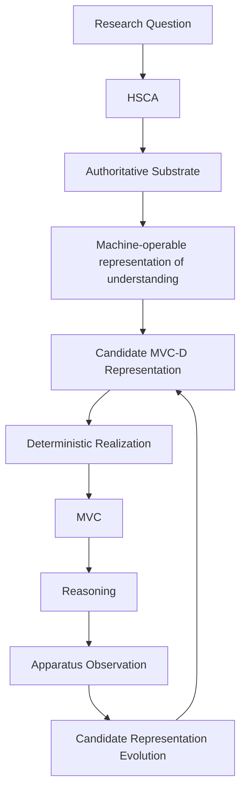
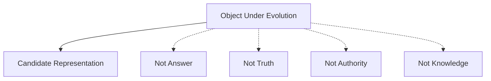

# MVC Experimental Apparatus

## The Problem

Research apparatus maturity can be mistaken for research validation.

An instrument can preserve provenance, replay observations, reject invalid records, and produce deterministic local-test outputs while still saying nothing about whether the underlying hypothesis is true. That distinction matters for MVC research. If synthetic apparatus behavior is read as evidence for MVC-D, Runtime State Slicing, representation quality, or search quality, the research program collapses instrument validation into hypothesis validation.

The failure mode is subtle. A controlled apparatus can make candidate representations explicit and observable. That is progress. It does not mean the candidate representation is good, stable, generalizable, or an actual MVC-D.

## The Reframe

The MVC experimental apparatus is a research instrument.

Its purpose is not to establish the truth of the underlying hypotheses. Its purpose is to construct an experimental instrument capable of investigating them under controlled, reproducible conditions.

Apparatus validation is therefore analogous to laboratory instrumentation validation. It asks whether the instrument can preserve identity, provenance, traceability, determinism, authority boundaries, and fail-closed behavior. It does not ask whether the scientific hypothesis has been supported.

The handbook is explanatory documentation describing the conceptual research apparatus. It is not the normative authority for experimental execution, adjudication, implementation contracts, or research governance.

## The Model

The apparatus connects research questions to observable reasoning conditions without treating the observation as authority.

The loop is conceptual. It does not say that the apparatus has validated any candidate MVC-D representation. It says the apparatus can make candidate representations, realizations, and observations explicit enough to investigate.

### Apparatus boundaries

The apparatus is useful only if its objects keep their authority status visible. The table below is conceptual; operational contracts, schemas, validators, and research governance remain outside handbook prose.

| Layer | Role in the apparatus | Authority status |
|-------|-----------------------|------------------|
| STE substrate | Governed architecture, evidence, linkage, and modeled structure that a study condition may consume. | Authority remains with the owning artifacts, contracts, evidence records, and governance surfaces. |
| HSCA observations | Completeness, memory, assembly, and authority-gap signals for a task condition. | Observational only. They do not become answer authority by themselves. |
| Candidate Q package | A bounded package of observations, claim reviews, substrate validations, gaps, and provenance. | Not `Q_fixture`; it is a candidate evidence package awaiting adjudication or blockage. |
| `Q_fixture` | A known outcome usable by a benchmark or fitness interpretation within its declared boundary. | Requires explicit adjudication, rubric, gold, or equivalent benchmark authority. |
| Candidate MVC-D representation | Experimental representation object describing what structure may be needed for a task family. | Candidate only. It is not evidence that an actual MVC-D has been discovered. |
| Deterministic realization | Controlled transformation from candidate representation into an observed context condition. | Not authority, correctness, or adjudication. |
| `F_sim_v0` | Deterministic local-test lexical apparatus observation. | Not research fitness, not representation quality, and not benchmark authority. |
| Candidate representation evolution | Local-test mechanics for arranging and observing candidate representations. | Not search-quality evidence and not proof that selected representations are better. |

### Conceptual objects

**HSCA** is Human-Assisted Substrate Completeness Analysis. It records and classifies whether required information appears to be present in authoritative substrate, absent from substrate, present but unassembled, supplied by memory, or unresolved. HSCA observations are evidence inputs, not answer authority by themselves.

HSCA is concerned with reasoning requirements rather than merely document completeness. Its purpose is to characterize whether the information required to support a reasoning task appears to exist within authoritative substrate, exists but remains unassembled, depends on external memory, or cannot presently be established. In this sense, HSCA evaluates substrate sufficiency with respect to a reasoning task rather than the completeness of any individual artifact.

**Authoritative substrate** is the body of accepted artifacts, decisions, constraints, evidence, and modeled structure that a study condition is allowed to rely on. In STE, authority remains with the relevant contracts, ADRs, invariants, canonical artifacts, benchmark adjudication, and governance surfaces.

**Machine-operable representation of understanding** is a representation structured enough for a machine process to select, realize, inspect, compare, or traverse task-relevant context under declared rules. It should be viewed as an intermediate representation for understanding rather than a serialization format, storage model, or implementation artifact. This is a conceptual requirement, not a single canonical realization.

**Candidate MVC-D representation** is an experimental encoding of a possible domain-level representation that might support future MVC assembly. Candidate representations exist because the methodology does not assume that the appropriate structural realization for a task family is already known. They provide explicit, inspectable, and experimentally comparable hypotheses about what information should be assembled for reasoning under controlled conditions. A candidate MVC-D representation is not an answer, prompt, generated knowledge, authority, or evidence that an actual MVC-D has been discovered.

**Runtime State Slicing (RSS)** is the future runtime assembly process that may operationalize candidate representations into reasoning context. In this methodology, RSS is not a scoring concept and is not treated as validated by apparatus behavior.

**MVC** is the task-scoped context made available for reasoning. In current research, apparatus-local candidate contexts and realized phenotypes are evidence inputs, not production MVC-M and not Kernel-admitted runtime context.

**Candidate representation** is the object under experimental evolution. It is not the answer, truth, authority, or knowledge itself. This distinction matters because the apparatus is not searching over answers. It is arranging and observing candidate representations of substrate so that future research can evaluate whether stable structural patterns emerge across related tasks.

**Deterministic realization** is the controlled transformation from a candidate representation into the context condition to be observed.

**Apparatus observation** is a recorded local-test or experimental result with provenance and boundaries. It is not research evidence unless the surrounding methodology and adjudication allow that interpretation.

The methodology deliberately separates authoritative substrate from its realized projection. Multiple candidate representations may legitimately exist over the same authoritative substrate, and the purpose of the experimental apparatus is to investigate those representations without treating any individual realization as authoritative merely because it was generated.

### Concept relationship map

The apparatus uses several related terms that must not collapse into one another:

| Concept | Role in the apparatus | Boundary |
|---------|-----------------------|----------|
| **Machine-operable representation of understanding** | Conceptual requirement for a representation that machines can inspect, compare, traverse, or realize under declared rules. | Not a single canonical intermediate representation or storage format. |
| **Candidate representation** | Experimental object arranged and observed by the apparatus. | Not answer, truth, authority, or knowledge. |
| **Candidate MVC-D representation** | Candidate representation that proposes what domain-level structure may support a task family. | Not evidence that an actual MVC-D has been discovered. |
| **Candidate context artifact** | Controlled experimental evidence input used before production MVC pathways are mature enough to study directly. | Not production MVC-S, MVC-M, benchmark authority, or Kernel-admitted context. |
| **Context packet** | Versioned candidate evidence input that may participate in a realized condition. | Not architecture authority or a complete genome unless the search procedure explicitly treats it as encoded search state. |
| **Deterministic realization** | Controlled transformation from candidate representation into observed context condition. | Not authority, correctness, or adjudication. |
| **Genome** | Encoded object manipulated by an evolution or search procedure. | Not inherently a packet collection; packet references are one possible realization. |
| **Phenotype** | Realized condition evaluated or observed by the apparatus. | Not the same object as the genome unless a declared realization makes that identity explicit. |
| **MVC** | Task-scoped context made available for reasoning. | Current apparatus-local contexts are not production MVC-M or Kernel-admitted runtime context. |

It also separates the research method from the interfaces that expose it:

- **Substrate** is authoritative structural knowledge.
- **MVC-D assembly methodology** is the task-specific construction of candidate structural definitions over that substrate.
- **Projection mechanisms** are ways of viewing, selecting, rendering, or materializing portions of a candidate definition.
- **Conversational interfaces and DSLs** are human or AI interaction surfaces over the methodology.
- **Implementations** are concrete tools that realize those surfaces and mechanisms.

The research contribution under investigation is not a projection DSL by itself. It is the methodology for deterministic, task-oriented structural definition assembly over authoritative substrate. Projection DSLs, query engines, renderers, conversational interfaces, and concrete tools are realizations built on top of that method.

### Weak connectivity and progressive enrichment

Weak structural connectivity in a substrate is not automatically a substrate failure.

Several states can look similar before adjudication:

- a relationship may genuinely not exist;
- a relationship may exist but remain unobserved;
- a relationship may exist but remain unrepresented;
- a relationship may exist but remain unadjudicated;
- a relationship may sit outside the current substrate scope;
- the current representation may not yet carry enough evidence to make the relationship explicit.

The methodology must not collapse those states into one label such as "missing information." HSCA observations can make the distinction inspectable, but they do not settle it by themselves. They record what appears present, absent, unassembled, memory-supplied, or unresolved under the declared evidence boundary.

Weak connectivity therefore represents uncertainty about the currently represented state of understanding rather than evidence that the underlying relationship does or does not exist.

This matters for candidate MVC-D representation. A candidate MVC-D representation is not merely a patch for substrate deficiency. It is an explicit structural projection of what information is believed necessary for reasoning over a task family. Where substrate relationships are already explicit and sufficiently rich, Runtime State Slicing may naturally traverse those relationships. Where relationships are weak, incomplete, unknown, out of scope, or not yet represented, the candidate MVC-D representation may explicitly surface the required domains or information until stronger structural evidence exists.

Explicit structural inclusion through a candidate MVC-D representation should not be interpreted by itself as evidence of substrate inadequacy. It may instead reflect the current epistemic state of the substrate and serve as a principled mechanism for progressive enrichment.

That stage is not a methodology failure. It is an expected part of progressive substrate enrichment. As evidence accumulates, relationships may become established, representations may become richer, structural connectivity may increase, explicit projection requirements may simplify, and deterministic traversal may rely more heavily on substrate topology.

The methodology therefore treats explicit projection definitions and substrate enrichment as complementary mechanisms. It does not assume that all required relationships are already known, that all required relationships can always be inferred, that weak connectivity implies substrate failure, or that explicit MVC-D structural inclusion demonstrates substrate inadequacy.

### Apparatus maturity

The apparatus has progressed conceptually from collection fidelity toward deterministic observation of generated candidate representations.

```mermaid
flowchart LR
  Collection[Collection Fidelity]
  Provenance[Provenance And Replay]
  Identity[Deterministic Identity]
  Mutation[Deterministic Mutation Mechanics]
  Representation[Explicit Candidate Representations]
  Realization[Deterministic Realization]
  Observation[Reproducible Apparatus Observation]

  Collection --> Provenance
  Provenance --> Identity
  Identity --> Mutation
  Mutation --> Representation
  Representation --> Realization
  Realization --> Observation
```

Each step increases the capability of the research instrument. None of the steps establishes that the candidate representations are correct, optimal, stable, or generalizable.

### Object under evolution

The apparatus may rearrange candidate representations of substrate. It may not synthesize authority or make unsupported knowledge claims.

## The Implications

### What has been established

Only apparatus capabilities have been established at the current synthetic/local-test boundary:

- the apparatus supports deterministic identity under controlled conditions;
- the apparatus supports deterministic realization under controlled conditions;
- the apparatus supports deterministic mutation mechanics under synthetic/local-test conditions;
- the apparatus can encode explicit candidate representations under controlled conditions;
- the apparatus can preserve provenance and lineage for generated candidate representations;
- the apparatus can preserve authority boundaries while generating local-test artifacts;
- the apparatus can validate fail-closed behavior for prohibited authority and evidence states;
- the apparatus can record reproducible local-test observations.

These are instrument capabilities. They are not research conclusions.

### Current hypotheses under investigation

The apparatus exists to investigate hypotheses such as:

- related reasoning tasks may admit relatively stable structural representations;
- candidate representations may enable bounded substrate traversal;
- Runtime State Slicing may operationalize those representations into reasoning context;
- convergence may emerge across sufficiently rich categorical task collections.

These remain hypotheses. The current apparatus makes them more experimentally tractable, but it does not establish them.

### What has not been established

The current synthetic/local-test apparatus does not establish:

- stable MVC-D existence;
- representation quality;
- representation optimality;
- search quality;
- parent-child improvement;
- convergence;
- generalization;
- Runtime State Slicing effectiveness;
- substrate-quality claims;
- representation-ceiling claims;
- benchmark authority;
- publication evidence;
- research conclusions.

If a statement would require one of those conclusions, it belongs in a future finding only after the required evidence and adjudication exist.

### Why the apparatus matters

The apparatus matters because it turns candidate representations of understanding into explicit, inspectable, reproducible experimental objects that can be investigated under controlled conditions. Candidate representations can be named, realized, mutated, observed, and traced. That makes future falsification and support possible.

The apparatus is intentionally designed so that observations about candidate representations can inform future substrate enrichment without requiring those observations to be interpreted as confirmation of the candidate representation.

The next dependency is broader HSCA collection and eventual `Q` establishment across sufficiently rich task categories. Without richer observed task categories and defensible known outcomes, questions about convergence, category-level representation reuse, bounded substrate traversal, and Runtime State Slicing remain premature.

## Relationship to STE system

This apparatus connects to [Evidence](../../../../03-artifacts/03-05-evidence.md), [Traceability](../../../../03-artifacts/03-06-traceability.md), [Context Assembly and MVC](../../../../08-runtime/08-05-context-assembly-and-mvc.md), [Research Governance](../../../14-01-research-governance.md), [MVC methodology](mvc-methodology.md), [HSCA methodology](hsca-methodology.md), and [Evolution methodology v2](evolution-methodology-v2.md).

Those links explain method and interpretation. They do not move authority into the handbook. Normative authority remains with STE contracts, accepted architecture artifacts, benchmark adjudication surfaces, and governance processes where those surfaces exist.

Operational harness behavior lives in the owning research apparatus outside handbook prose. The handbook records conceptual structure and boundaries; it does not duplicate operational implementation documentation.

## Summary

- The MVC experimental apparatus is a research instrument, not research proof.
- Apparatus validation is not hypothesis validation.
- Candidate representation evolution evolves representations, not answers, truth, authority, or knowledge.
- Current synthetic/local-test capabilities support controlled investigation; they do not establish MVC-D, Runtime State Slicing, representation quality, or search quality.
- Broader HSCA collection and defensible `Q` establishment are required before stronger research claims can be made.

Read next: [HSCA methodology](hsca-methodology.md) explains how substrate completeness and memory confounds are handled before known outcomes are trusted.
