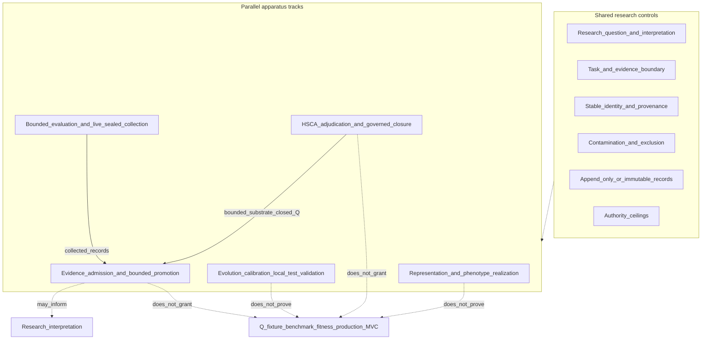
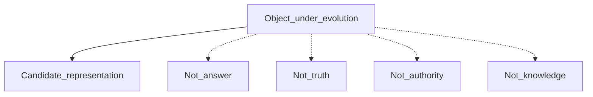

# MVC Experimental Apparatus

## The Problem

Research apparatus maturity can be mistaken for research validation.

An instrument can preserve provenance, replay observations, reject invalid records, and produce deterministic local-test outputs while still saying nothing about whether the underlying hypothesis is true. That distinction matters for MVC research. If synthetic apparatus behavior is read as evidence for MVC-D, Runtime State Slicing, representation quality, or search quality, the research program collapses instrument validation into hypothesis validation.

The failure mode is subtle. A controlled apparatus can make candidate representations explicit and observable. That is progress. It does not mean the candidate representation is good, stable, generalizable, or an actual MVC-D.

A second failure mode is packaging. When representation work, evolution, evaluation, HSCA, and admission appear as separate publications without a shared map, readers may treat the program as a loose collection of evaluations—or, conversely, as one monotonic pipeline that proves MVC when every track succeeds. Neither reading is correct.

## The Reframe

The MVC experimental apparatus is a research instrument. It is the program-local elaboration of Part 14 [Research Apparatus](../../../14-04-research-apparatus.md)—also called the MVC Research Apparatus in harness prose. It does not redefine Part 14 doctrine.

Its purpose is not to establish the truth of the underlying hypotheses. Its purpose is to coordinate shared validity controls and parallel apparatus tracks so that candidate representations, realizations, observations, and closures can be investigated under controlled, reproducible conditions without unsupported authority escalation.

Apparatus validation is therefore analogous to laboratory instrumentation validation. It asks whether the instrument can preserve identity, provenance, traceability, determinism, authority boundaries, and fail-closed behavior. It does not ask whether the scientific hypothesis has been supported.

The handbook is explanatory documentation describing the conceptual research apparatus. It is not the normative authority for experimental execution, adjudication, implementation contracts, or research governance. Implementation contracts, schemas, validators, and repository workflows remain outside the handbook. The private research suite implements currently declared apparatus capabilities and contracts; it does not establish normative STE architecture or imply that every conceptual apparatus capability is complete.

## The Model

### Shared controls and parallel tracks

The apparatus is not one success pipeline from research question to findings. It is a set of **shared research controls** that coordinate **parallel apparatus tracks**. Research interpretation remains a separate downstream activity: it may consume admitted evidence, but apparatus execution does not automatically produce or authorize findings.

**Shared research controls:**

- research question and declared interpretation;
- task and evidence boundary;
- stable identities and provenance;
- contamination and exclusion controls;
- immutable or append-only records;
- authority ceilings.

**Parallel apparatus tracks:**

- candidate representation and deterministic phenotype realization;
- evolution, calibration, and local-test apparatus validation;
- bounded evaluation and live sealed collection;
- HSCA semantic adjudication and governed closure;
- evidence admission and bounded promotion.

Tracks share controls; they do not feed one another as a required proof path. Evolution does not feed HSCA. HSCA does not feed evolution. Completing all tracks does not prove MVC.

```mermaid
flowchart TB
  subgraph SharedControls["Shared research controls"]
    RQ[Research_question_and_interpretation]
    Bound[Task_and_evidence_boundary]
    IdProv[Stable_identity_and_provenance]
    Contam[Contamination_and_exclusion]
    Append[Append_only_or_immutable_records]
    Ceiling[Authority_ceilings]
  end

  subgraph Tracks["Parallel apparatus tracks"]
    direction TB
    Rep[Representation_and_phenotype_realization]
    Evo[Evolution_calibration_local_test_validation]
    EvalCol[Bounded_evaluation_and_live_sealed_collection]
    Hsca[HSCA_adjudication_and_governed_closure]
    Admit[Evidence_admission_and_bounded_promotion]
  end

  Interp[Research_interpretation]
  Denied[Q_fixture_benchmark_fitness_production_MVC]

  SharedControls -.-> Tracks
  EvalCol -->|collected_records| Admit
  Hsca -->|bounded_substrate_closed_Q| Admit
  Admit -.->|may_inform| Interp
  Admit -.->|does_not_grant| Denied
  Hsca -.->|does_not_grant| Denied
  Evo -.->|does_not_prove| Denied
  Rep -.->|does_not_prove| Denied
```

### Validity function

The apparatus exists to control threats such as context contamination, hidden or unstable candidate identity, non-reproducible assembly, evaluator drift, untracked semantic inference, mutable evidence, unsupported authority escalation, and conflation of validator success or local scores with research conclusions.

| Threat | Control family |
|--------|----------------|
| Context contamination | Sealing order, isolation, exposure accounting, fail-closed contamination states |
| Hidden or unstable candidate identity | Stable hashes, declared genome/phenotype identities, evaluation-context identity |
| Non-reproducible assembly | Deterministic phenotype realization within declared replay scope |
| Evaluator drift | Frozen evaluation identity, generation boundaries, configuration fingerprints |
| Untracked semantic inference | Bounded semantic adjudication with durable judgment records; no silent repair |
| Mutable evidence | Append-only or immutable records; explicit supersession relationships |
| Unsupported authority escalation | Explicit ceilings denying `Q_fixture`, fitness, production MVC, and normative STE authority |
| Conflating validator or local scores with conclusions | Operating capability kept orthogonal to evidentiary authority |

### Operating capability versus evidentiary authority

Movement within operating capability does **not** grant movement within authority or evidence status. A ladder that collapses both dimensions is incorrect.

| Operating capability | What it answers |
|----------------------|-----------------|
| Apparatus construction | Are instrument shapes, producers, and validators present? |
| Apparatus validation | Do mechanics behave as declared on synthetic or local-test inputs? |
| Calibration | Does wiring or sensitivity behave against known non-authoritative markers? |
| Local-test execution | Can declared local-test procedures run under controlled exclusion? |
| Live experimental collection | Can sealed observations be collected under declared isolation rules? |
| Closure execution | Can governed closure run for a named question and evidence boundary? |
| Replay and reproducibility support | Can declared configurations be re-checked within supported replay scope? |

| Authority or evidence status | Meaning |
|------------------------------|---------|
| Engineering validation artifact | Instrument evidence only; not hypothesis support |
| Collected observation | Sealed or recorded observation; not yet admitted evidence |
| Candidate evidence | Packaged candidate awaiting governed transitions |
| Admitted experimental evidence | Evidence admitted by a separate governed transition |
| Bounded substrate-closed `Q` | Closure result with explicit scope and ceilings |
| Benchmark authority | Requires separate adjudication (for example `Q_fixture`) |
| Research fitness | Requires benchmark authority under declared method |
| Research conclusion | Requires published findings under methodology and governance |

### Collection, admission, and closure

These states must not collapse:

- **Live sealed observations** are collected records. Collection success establishes provenance and ordering under declared rules; it does not admit evidence.
- **Admission** is a separate governed transition. Collected records do not become admitted experimental evidence merely because collection succeeded.
- **Substrate-closed `Q`** is a bounded closure result with explicit scope and authority ceilings. It is not `Q_fixture`, not benchmark authority, not research fitness, and not a research conclusion.
- **Governed HSCA closure** combines bounded semantic adjudication with deterministic validation, assembly, identity, hashing, and promotion controls. Semantic interpretation ends at a defined boundary; stable transformations and validation then run under deterministic machinery. Closure is not wholly mechanical.

### Apparatus object boundaries

The apparatus is useful only if its objects keep their authority status visible. The table below is conceptual; operational contracts, schemas, validators, and research governance remain outside handbook prose.

| Layer | Role in the apparatus | Authority status |
|-------|-----------------------|------------------|
| STE substrate | Governed architecture, evidence, linkage, and modeled structure that a study condition may consume. | Authority remains with the owning artifacts, contracts, evidence records, and governance surfaces. |
| HSCA observations | Completeness, memory, assembly, and authority-gap signals for a task condition. | Collected or packaged observational records. They do not become answer authority or admitted evidence by themselves. |
| Candidate Q package | A bounded package of observations, claim reviews, substrate validations, gaps, and provenance. | Candidate evidence awaiting governed closure toward substrate-closed `Q`, then separate benchmark adjudication for `Q_fixture`. |
| Substrate-closed `Q` | Bounded closure result for a named question and evidence boundary. | Explicit ceilings; does not grant `Q_fixture`, fitness, or research conclusion. |
| `Q_fixture` | A known outcome usable by a benchmark or fitness interpretation within its declared boundary. | Requires explicit adjudication, rubric, gold, or equivalent benchmark authority. |
| Candidate MVC-D representation | Experimental representation object describing what structure may be needed for a task family. | Candidate only. It is not evidence that an actual MVC-D has been discovered. |
| Deterministic realization | Controlled transformation from candidate representation into an observed context condition. | Not authority, correctness, or adjudication. |
| Local lexical or local-model scores | Deterministic or local-reasoner apparatus observations under declared evaluation identity. | Engineering or local-test signals; not research fitness, representation quality, or benchmark authority. |
| Candidate representation evolution | Local-test and search mechanics for arranging and observing candidate representations. | Not search-quality evidence and not proof that selected representations are better. |

### Conceptual objects

**HSCA** is Human-Assisted Substrate Completeness Analysis. It records and classifies whether required information appears to be present in authoritative substrate, absent from substrate, present but unassembled, supplied by memory, or unresolved. HSCA observations are observational inputs, not answer authority by themselves.

HSCA is concerned with reasoning requirements rather than merely document completeness. Its purpose is to characterize whether the information required to support a reasoning task appears to exist within authoritative substrate, exists but remains unassembled, depends on external memory, or cannot presently be established.

**Authoritative substrate** is the body of accepted artifacts, decisions, constraints, evidence, and modeled structure that a study condition is allowed to rely on. In STE, authority remains with the relevant contracts, ADRs, invariants, canonical artifacts, benchmark adjudication, and governance surfaces.

**Machine-operable representation of understanding** is a representation structured enough for a machine process to select, realize, inspect, compare, or traverse task-relevant context under declared rules. It should be viewed as an intermediate representation for understanding rather than a serialization format, storage model, or implementation artifact. This is a conceptual requirement, not a single canonical realization.

**Candidate MVC-D representation** is an experimental encoding of a possible domain-level representation that might support future MVC assembly. Candidate representations exist because the methodology does not assume that the appropriate structural realization for a task family is already known. A candidate MVC-D representation is not an answer, prompt, generated knowledge, authority, or evidence that an actual MVC-D has been discovered.

**Runtime State Slicing (RSS)** is the future runtime assembly process that may operationalize candidate representations into reasoning context. In this methodology, RSS is not a scoring concept and is not treated as validated by apparatus behavior.

**MVC** is the task-scoped context made available for reasoning. In current research, apparatus-local candidate contexts and realized phenotypes are experimental inputs, not production MVC-M and not Kernel-admitted runtime context.

**Candidate representation** is the object under experimental evolution. It is not the answer, truth, authority, or knowledge itself. The apparatus is not searching over answers. It is arranging and observing candidate representations of substrate so that future research can evaluate whether stable structural patterns emerge across related tasks.

**Deterministic realization** is the controlled transformation from a candidate representation into the context condition to be observed.

**Apparatus observation** is a recorded local-test or experimental result with provenance and boundaries. Local-test, calibration, or apparatus-validation artifacts may establish engineering properties of the instrument within their declared scope, but must not be presented as admitted experimental evidence, hypothesis support, representation-quality evidence, or research fitness.

The methodology deliberately separates authoritative substrate from its realized projection. Multiple candidate representations may legitimately exist over the same authoritative substrate without treating any individual realization as authoritative merely because it was generated.

### Concept relationship map

| Concept | Role in the apparatus | Boundary |
|---------|-----------------------|----------|
| **Machine-operable representation of understanding** | Conceptual requirement for a representation that machines can inspect, compare, traverse, or realize under declared rules. | Not a single canonical intermediate representation or storage format. |
| **Candidate representation** | Experimental object arranged and observed by the apparatus. | Not answer, truth, authority, or knowledge. |
| **Candidate MVC-D representation** | Candidate representation that proposes what domain-level structure may support a task family. | Not evidence that an actual MVC-D has been discovered. |
| **Candidate context artifact** | Controlled experimental input used before production MVC pathways are mature enough to study directly. | Not production MVC-S, MVC-M, benchmark authority, or Kernel-admitted context. |
| **Context packet** | Versioned candidate input that may participate in a realized condition. | Not architecture authority or a complete genome unless the search procedure explicitly treats it as encoded search state. |
| **Deterministic realization** | Controlled transformation from candidate representation into observed context condition. | Not authority, correctness, or adjudication. |
| **Genome** | Encoded object manipulated by an evolution or search procedure. | Not inherently a packet collection; packet references are one possible realization. |
| **Phenotype** | Realized condition evaluated or observed by the apparatus. | Not the same object as the genome unless a declared realization makes that identity explicit. |
| **MVC** | Task-scoped context made available for reasoning. | Current apparatus-local contexts are not production MVC-M or Kernel-admitted runtime context. |

It also separates the research method from the interfaces that expose it:

- **Substrate** is authoritative structural knowledge.
- **MVC-D assembly methodology** is the task-specific construction of candidate structural definitions over that substrate.
- **Projection mechanisms** are ways of viewing, selecting, rendering, or materializing portions of a candidate definition.
- **Conversational interfaces and DSLs** are human or AI interaction surfaces over the methodology.
- **Implementations** are concrete tools that realize those surfaces and mechanisms.

The research contribution under investigation is not a projection DSL by itself. It is the methodology for deterministic, task-oriented structural definition assembly over authoritative substrate.

### Weak connectivity and progressive enrichment

Weak structural connectivity in a substrate is not automatically a substrate failure.

Several states can look similar before adjudication:

- a relationship may genuinely not exist;
- a relationship may exist but remain unobserved;
- a relationship may exist but remain unrepresented;
- a relationship may exist but remain unadjudicated;
- a relationship may sit outside the current substrate scope;
- the current representation may not yet carry enough evidence to make the relationship explicit.

The methodology must not collapse those states into one label such as "missing information." HSCA observations can make the distinction inspectable, but they do not settle it by themselves.

Weak connectivity therefore represents uncertainty about the currently represented state of understanding rather than evidence that the underlying relationship does or does not exist.

A candidate MVC-D representation is not merely a patch for substrate deficiency. It is an explicit structural projection of what information is believed necessary for reasoning over a task family. Explicit structural inclusion through a candidate MVC-D representation should not be interpreted by itself as evidence of substrate inadequacy.

### Object under evolution

```mermaid
flowchart TD
  Evolves[Object_under_evolution]
  Candidate[Candidate_representation]
  NotAnswer[Not_answer]
  NotTruth[Not_truth]
  NotAuthority[Not_authority]
  NotKnowledge[Not_knowledge]

  Evolves --> Candidate
  Evolves -.-> NotAnswer
  Evolves -.-> NotTruth
  Evolves -.-> NotAuthority
  Evolves -.-> NotKnowledge
```

The apparatus may rearrange candidate representations of substrate. It may not synthesize authority or make unsupported knowledge claims. Evolutionary survival does not prove representation quality.

## The Implications

### What has been established

The following are instrument and program-control capabilities at the current public evidence boundary. They are not research conclusions about the MVC thesis.

**Operating capability (engineering / collection / closure):**

- shared identity, provenance, contamination, exclusion, and authority-ceiling controls;
- deterministic candidate representation and phenotype realization under controlled conditions;
- evolution, calibration, and local-test apparatus validation under declared local-test exclusion;
- live sealed HSCA collection capability under declared isolation and ordering rules;
- governed HSCA closure workflows that combine bounded semantic adjudication with deterministic validation, assembly, identity, hashing, and promotion controls;
- bounded substrate-closed `Q` for named questions that have completed the closure protocol at their declared evidence boundaries;
- fail-closed behavior for prohibited authority and evidence states within declared scopes;
- replay and reproducibility support within declared supported scopes (not as proof of correctness).

**Authority or evidence status that remains denied:**

- `Q_fixture` and benchmark adjudication;
- research fitness;
- research conclusions and published findings (findings and reproductions remain unpublished scaffolds);
- production MVC-M, Runtime State Slicing validation, Kernel admission, and normative STE specification authority.

These capabilities make investigation tractable. They do not establish that candidate representations are correct, optimal, stable, or generalizable.

### Current hypotheses under investigation

The apparatus exists to investigate hypotheses such as:

- related reasoning tasks may admit relatively stable structural representations;
- candidate representations may enable bounded substrate traversal;
- Runtime State Slicing may operationalize those representations into reasoning context;
- convergence may emerge across sufficiently rich categorical task collections.

These remain hypotheses. Apparatus success does not establish them.

### What has not been established

The apparatus does not establish:

- stable MVC-D existence;
- representation quality;
- representation optimality;
- search quality;
- parent-child improvement;
- convergence;
- generalization;
- Runtime State Slicing effectiveness;
- substrate-quality claims;
- representation-ceiling claims;
- benchmark authority;
- research fitness;
- published research conclusions.

If a statement would require one of those conclusions, it belongs in a future finding only after the required evidence and adjudication exist.

### Why the apparatus matters

The apparatus matters because it turns candidate representations of understanding into explicit, inspectable, reproducible experimental objects that can be investigated under coordinated validity controls. Candidate representations can be named, realized, mutated, observed, and traced. Collection, admission, and closure remain distinct. That makes future falsification and support possible without treating instrument success as thesis support.

Stronger claims about category-level representation reuse, bounded substrate traversal, and Runtime State Slicing remain premature until richer admitted evidence, broader task coverage, and—where claimed—separate benchmark adjudication exist.

## Relationship to STE system

This apparatus connects to [Evidence](../../../../03-artifacts/03-05-evidence.md), [Traceability](../../../../03-artifacts/03-06-traceability.md), [Context Assembly and MVC](../../../../08-runtime/08-05-context-assembly-and-mvc.md), [Research Governance](../../../14-01-research-governance.md), [Research Apparatus](../../../14-04-research-apparatus.md), [Measurement and Validity](../../../14-07-measurement-and-validity.md), [MVC methodology](mvc-methodology.md), [HSCA methodology](hsca-methodology.md), [Evolution methodology v2](evolution-methodology-v2.md), and [MVC harness architecture](../03-experiment-design/mvc-harness-architecture.md).

Those links explain method and interpretation. They do not move authority into the handbook. Normative authority remains with STE contracts, accepted architecture artifacts, benchmark adjudication surfaces, and governance processes where those surfaces exist.

Operational harness behavior lives in the owning research apparatus outside handbook prose. The handbook records conceptual structure and boundaries; it does not duplicate operational implementation documentation.

## Summary

- The MVC experimental apparatus is a research instrument with shared controls and parallel tracks, not a monotonic proof pipeline and not research proof.
- Operating capability and evidentiary authority are orthogonal; apparatus maturity does not grant evidence authority.
- Collected observations, admitted evidence, and bounded substrate-closed `Q` remain distinct; collection success is not admission.
- Governed HSCA closure combines bounded semantic adjudication with deterministic controls; it does not create `Q_fixture` or research fitness.
- Apparatus validation can succeed while the MVC thesis remains unevaluated or unsupported.

Read next: [HSCA methodology](hsca-methodology.md) explains substrate completeness, memory confounds, and governed closure before known outcomes are trusted.
