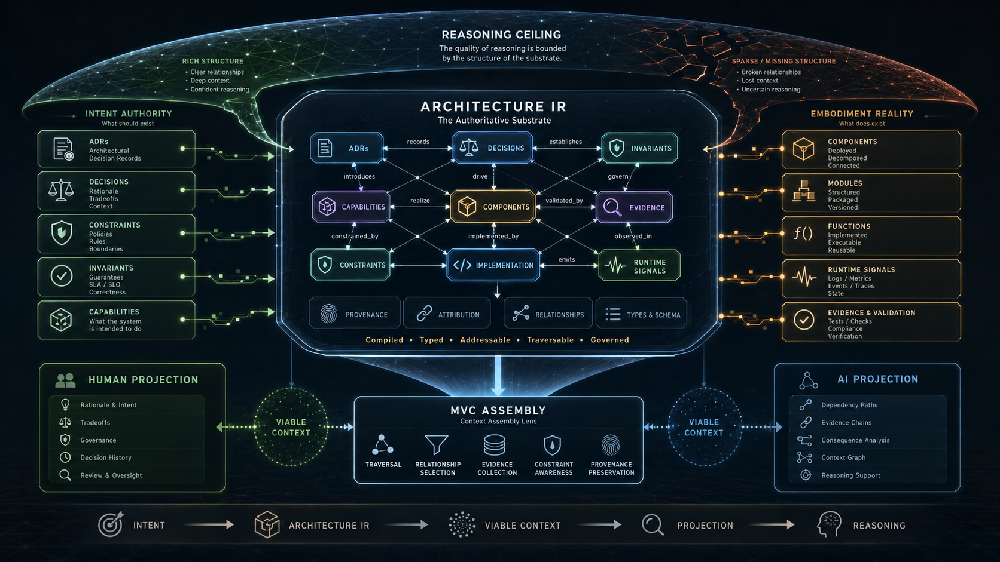

# MVC Research Program



*Conceptual overview for the MVC research program: Architecture IR as research substrate, viable context assembly, human and AI projections, and the reasoning ceiling. The image is explanatory, not empirical evidence. It does not prove MVC, define production MVC-M behavior, or create Kernel admission authority. Image file: `01-thesis/images/ste-reasoning-ceiling-hero.png`. Publication lineage: [MVC thesis publications](01-thesis/README.md).*

## The Problem

MVC research needs a durable home that separates thesis, methodology, experiment design, findings, reproductions, and open questions.

## The Reframe

MVC is the first instantiated STE research program. It investigates whether structured, viable context assembly can preserve more of the reasoning-relevant architectural world than weaker or more inference-dependent representations under controlled conditions.

MVC is not the purpose of Part 14 and does not define Part 14. It is the first program using the research-program structure that future programs can also use.

## The Model

```yaml
program_id: mvc
title: "Minimally Viable Context and the Representation Ceiling"
status: "active"
lead_authors:
  - "Erik Gallmann"
created: "2026-06-09"
last_reviewed: "2026-06-09"
research_state: "active"
related_theories:
  - "representation ceiling"
  - "viable context"
  - "substrate completeness"
related_methodologies:
  - "MVC methodology"
  - "HSCA"
  - "benchmark methodology"
  - "evolution methodology"
```

Program structure:

- [01 - Thesis](01-thesis/README.md)
- [02 - Methodology](02-methodology/README.md)
- [03 - Experiment design](03-experiment-design/README.md)
- [04 - Findings](04-findings/README.md)
- [05 - Reproductions](05-reproductions/README.md)
- [06 - Open questions](06-open-questions.md)

## The Implications

MVC research publications are not normative STE contracts. They do not define production MVC-M behavior, Kernel admission, benchmark authority, or STE semantics. They may inform future promotion proposals through the relevant governance process.

## Relationship to STE system

MVC research connects to the runtime MVC chapter and to the research doctrine in Part 14, but remains research until separately promoted.

## Summary

- MVC is the first instantiated STE research program.
- MVC is not normative doctrine.
- MVC research separates thesis, methodology, design, findings, reproductions, and open questions.

Read next: [MVC Thesis Publications](01-thesis/README.md) starts the MVC research-program sequence.
