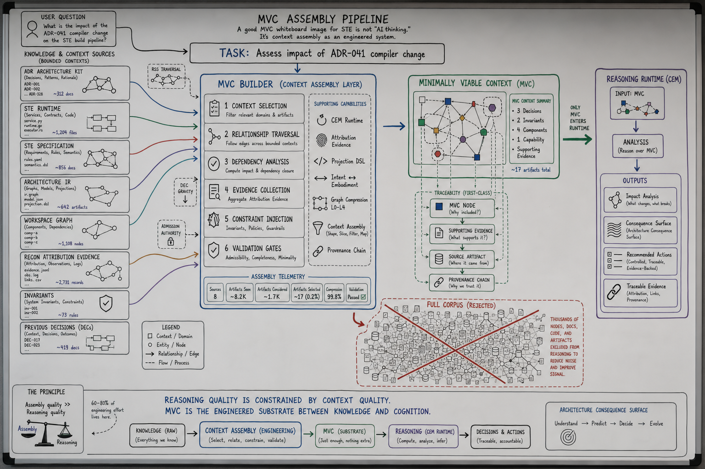

# MVC Research Program



*Conceptual research illustration for the representation ceiling thesis: context assembly as engineered substrate between knowledge and cognition. Source counts and compression figures are pedagogical, not empirical claims. "Minimality" in the diagram means task-scoped sufficiency (viable context), not smallest possible bundle. This is a candidate research model, not production MVC-M or Kernel admission authority. Image file: `thesis/images/mvc-assembly-pipeline.png`. Publication lineage: [MVC thesis publications](thesis/README.md).*

## The Problem

MVC research needs a durable home that separates thesis, methodology, experiment design, findings, reproductions, and open questions.

## The Reframe

MVC is the first major STE research program. It investigates whether structured, viable context assembly can preserve more of the reasoning-relevant architectural world than weaker or more inference-dependent representations under controlled conditions.

MVC is not the purpose of Part 14. It is the reference implementation of the research program structure.

## The Model

```yaml
program_id: mvc
title: "Minimally Viable Context and the Representation Ceiling"
status: "active"
lead_authors:
  - "STE maintainers"
created: "2026-06-09"
last_reviewed: "2026-06-09"
research_state: "active"
related_theories:
  - "representation ceiling"
  - "viable context"
  - "substrate completeness"
related_methodologies:
  - "MVC methodology"
  - "HSCA"
  - "benchmark methodology"
  - "evolution methodology"
```

Program structure:

- [Thesis](thesis/README.md)
- [Methodology](methodology/README.md)
- [Experiment design](experiment-design/README.md)
- [Findings](findings/README.md)
- [Reproductions](reproductions/README.md)
- [Open questions](open-questions.md)

## The Implications

MVC research publications are not normative STE contracts. They do not define production MVC-M behavior, Kernel admission, benchmark authority, or STE semantics. They may inform future promotion proposals through the relevant governance process.

## Relationship to STE system

MVC research connects to the runtime MVC chapter and to the research doctrine in Part 14, but remains research until separately promoted.

## Summary

- MVC is the first STE research program scaffold.
- MVC is not normative doctrine.
- MVC research separates thesis, methodology, design, findings, reproductions, and open questions.
